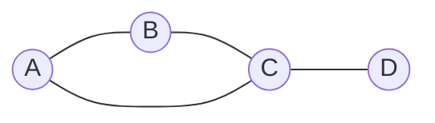

# Matroids and Graph Duality

Matroids abstract the idea of independence. In linear algebra, independence means no vector is a linear combination of the others. In graph theory, independence often means no cycle has been formed. Matroids capture the shared exchange behavior behind these situations, allowing graph arguments about trees, cycles, and cuts to be expressed in a more general language.

Graph duality becomes especially clean through matroids. The cycle structure of a planar graph is dual to the cut structure of its plane dual, and matroid duality turns this into an exact algebraic statement. Wilson's final chapter uses matroids to unify ideas that appeared earlier as separate graph theorems.

## Definitions

A **matroid** $M$ on a finite ground set $E$ can be defined by a family $\mathcal{I}$ of **independent sets** satisfying:

1. $\emptyset\in\mathcal{I}$.
2. If $I\in\mathcal{I}$ and $J\subseteq I$, then $J\in\mathcal{I}$.
3. If $I,J\in\mathcal{I}$ and $\vert I\vert \lt \vert J\vert $, then some $x\in J-I$ has $I\cup\{x\}\in\mathcal{I}$.

A maximal independent set is a **base**. A minimal dependent set is a **circuit**.

For a graph $G$, the **cycle matroid** $M(G)$ has ground set $E(G)$. A set of edges is independent in $M(G)$ exactly when it contains no cycle, that is, when it is a forest. The bases of $M(G)$ are the spanning forests; if $G$ is connected, they are the spanning trees.

The **dual matroid** $M^*$ has bases

$$
\{E-B: B \text{ is a base of } M\}.
$$

In a graph, minimal edge cuts are often called **bonds**. In the cycle matroid of a graph, cocircuits correspond to bonds.

## Key results

**Graphic matroid bases.** If $G$ is connected, the bases of $M(G)$ are exactly the spanning trees of $G$.

Reason: independent sets are forests. A maximal forest in a connected graph must connect all vertices; otherwise an edge between components could be added without creating a cycle.

**Cycle-cut duality in planar graphs.** If $G^*$ is a geometric dual of a connected plane graph $G$, then

$$
M(G^*)\cong M(G)^*.
$$

Cycles in $G$ correspond to cutsets in $G^*$, so the independent and dependent structures dualize.

**Rank of a graphic matroid.** If $A\subseteq E(G)$ and the spanning subgraph $(V(G),A)$ has $c(A)$ connected components, then

$$
r(A)=|V(G)|-c(A).
$$

For connected $G$, the full rank is $\vert V(G)\vert -1$.

**Planarity criterion through matroids.** A graph is planar precisely when its cycle matroid has a dual that is also graphic. This is an abstract form of planar duality.

**Deletion and contraction.** Matroids have deletion and contraction operations that generalize graph deletion and contraction. In a graphic matroid, deleting an edge from the graph corresponds to deleting that element from the matroid. Contracting a non-loop edge in the graph corresponds to matroid contraction. These operations make minor theory possible and explain why forbidden-minor statements occur both in graph theory and matroid theory.

**Why the exchange axiom matters.** The exchange axiom says that if one independent set is smaller than another, it can be enlarged using an element of the larger set. For graphs, this is the familiar fact that if one forest has fewer edges than another forest on the same vertex set, then some edge from the larger forest can be added to the smaller one without creating a cycle. This property is what makes greedy algorithms work for matroids.

**Greedy algorithm theorem for matroids.** If elements of a matroid have weights, the greedy algorithm that repeatedly adds the available element of least weight without destroying independence finds a minimum-weight base. Kruskal's MST algorithm is exactly this theorem applied to the cycle matroid of a graph.

**Uniform and partition matroids.** Not every introductory matroid is graphic. In the uniform matroid $U_{r,n}$, every subset of size at most $r$ is independent. In a partition matroid, the ground set is split into blocks and each block has a quota. These examples show that matroids abstract the exchange behavior of independence beyond graphs and vector spaces.

**Circuits versus cycles.** In a graphic matroid, circuits are exactly graph cycles. In a general matroid, the word circuit means a minimal dependent set, even when there is no graph drawing. This terminology is intentional: many proofs about graph cycles work because they use only the matroid circuit axioms.

**Dual rank.** If $M$ has rank function $r$ on ground set $E$, the dual rank function is

$$
r^*(A)=|A|-r(E)+r(E-A).
$$

This formula explains why complements of bases become bases in the dual.

## Visual

The triangle with a pendant edge has cycle matroid circuits and cut structure that are easy to see.



| Edge set | In graph | In $M(G)$ |
|---|---|---|
| $\{AB,BC\}$ | forest | independent |
| $\{AB,BC,CA\}$ | cycle | circuit |
| $\{CA,CD\}$ | forest | independent |
| $\{AB,BC,CD\}$ | spanning tree | base |
| $\{CD\}$ | bridge cut | cocircuit in connected case |

## Worked example 1: List bases of a cycle matroid

**Problem.** Let $G=C_4$ with vertices $1,2,3,4$ and edges

$$
e_1=12,\quad e_2=23,\quad e_3=34,\quad e_4=41.
$$

List the bases of $M(G)$.

**Method.**

1. The graph is connected and has $4$ vertices.
2. Every base of $M(G)$ is a spanning tree.
3. A spanning tree on $4$ vertices has $3$ edges.
4. In a cycle graph, deleting any one edge leaves a path through all vertices.
5. Therefore each base is obtained by omitting exactly one of the four cycle edges.

The bases are

$$
\{e_2,e_3,e_4\},\quad \{e_1,e_3,e_4\},\quad \{e_1,e_2,e_4\},\quad \{e_1,e_2,e_3\}.
$$

**Check.** Each set has size $3$, is acyclic, and connects all four vertices. No $4$-edge set is independent because the whole cycle is dependent.

## Worked example 2: Compute graphic matroid rank

**Problem.** Let $G$ have vertices $\{1,2,3,4,5\}$ and edge subset

$$
A=\{12,23,45\}.
$$

Find the rank $r(A)$ in the cycle matroid $M(G)$.

**Method.**

1. Build the spanning subgraph with all five vertices and only edges in $A$.
2. The edges $12,23$ connect vertices $\{1,2,3\}$ into one component.
3. The edge $45$ connects vertices $\{4,5\}$ into a second component.
4. Therefore the subgraph $(V,A)$ has

$$
c(A)=2
$$

components.

5. The rank formula gives

$$
r(A)=|V|-c(A)=5-2=3.
$$

6. Since $A$ itself has three edges and contains no cycle, it is independent, so its rank should indeed be $3$.

**Checked answer.** $r(A)=3$.

A second way to see the same answer is to ask for the largest forest contained in $A$. The set $A$ is already a forest with three edges, so its largest independent subset has size $3$. If the subset had contained a triangle, the rank would have been smaller than the number of selected edges.

## Code

The rank of a graphic matroid can be computed by union-find.

```python
class DSU:
    def __init__(self, vertices):
        self.parent = {v: v for v in vertices}

    def find(self, x):
        while self.parent[x] != x:
            self.parent[x] = self.parent[self.parent[x]]
            x = self.parent[x]
        return x

    def union(self, a, b):
        ra, rb = self.find(a), self.find(b)
        if ra != rb:
            self.parent[rb] = ra

def graphic_rank(vertices, edges):
    dsu = DSU(vertices)
    for u, v in edges:
        dsu.union(u, v)
    components = len({dsu.find(v) for v in vertices})
    return len(vertices) - components

V = [1, 2, 3, 4, 5]
A = [(1, 2), (2, 3), (4, 5)]
print(graphic_rank(V, A))
```

The union-find code computes only the graphic rank. A general matroid may not come with vertices or edges, so its rank must be supplied by a different independence oracle or representation. That distinction is important when moving from graph examples to abstract matroid theory.

When translating between graph language and matroid language, keep the ground set visible. In $M(G)$ the elements are edges, so a "set" in the matroid is a set of edges. This prevents confusion with independent vertex sets from colouring theory.

Matroid language is compact, so examples are essential. Whenever a statement mentions independent sets, bases, circuits, or cocircuits, translate it back into the graphic case: forests, spanning trees, cycles, and bonds. If the translated graph statement is familiar, the matroid statement is usually abstracting exactly the property that made the graph proof work.

## Common pitfalls

- Confusing independent sets in a graph with independent vertex sets. In the cycle matroid, the ground set is the edge set.
- Calling every cut a cocircuit. Cocircuits are minimal nonempty cuts in the corresponding matroid sense.
- Assuming every matroid is graphic. Many matroids do not arise from graphs.
- Forgetting that bases of $M(G)$ in a disconnected graph are spanning forests, not spanning trees.
- Treating matroid duality as the same thing as geometric planar duality. They agree for connected plane graphs under the edge correspondence, but matroid duality is broader.
- Ignoring loops and bridges. In $M(G)$, loops are circuits of size $1$, while bridges appear in every base of a connected graph.

## Connections

- [Trees and spanning trees](/math/graph-theory/trees-and-spanning-trees)
- [Duality surfaces and infinite graphs](/math/graph-theory/duality-surfaces-and-infinite-graphs)
- [Matchings Hall and Konig](/math/graph-theory/matchings-hall-and-konig)
- [Algebraic graph theory basics](/math/graph-theory/algebraic-graph-theory-basics)
