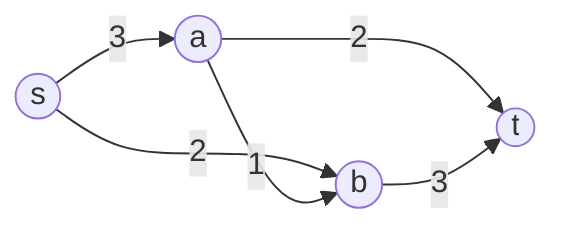

# Menger Theorem and Network Flows

Menger's theorem and max-flow min-cut are two versions of the same principle: the maximum number of independent ways to move through a network equals the minimum size of a bottleneck that blocks all movement. This is one of the clearest places where graph theory turns a routing question into a structural equality.


*Figure: A Ford-Fulkerson flow network visualizes capacities, augmenting paths, and maximum flow. Image: [Wikimedia Commons](https://commons.wikimedia.org/wiki/File:Ford-Fulkerson_example_final.svg), Cburnett, CC BY-SA 3.0.*

Network flows add capacities to directed edges. Instead of asking only whether a path exists, we ask how much material can be sent from a source to a sink while respecting capacity constraints. The algorithmic picture is built from augmenting paths, residual networks, and cuts.

## Definitions

An **$s$-$t$ path** is a path from source $s$ to target $t$. Two paths are **edge-disjoint** if they share no edges, and **internally vertex-disjoint** if they share no vertices except possibly $s$ and $t$.

An **$s$-$t$ edge cut** is a set of edges whose deletion separates $s$ from $t$. An **$s$-$t$ vertex cut** is a set of vertices, excluding $s$ and $t$, whose deletion separates $s$ from $t$.

A **flow network** is a directed graph with source $s$, sink $t$, and capacities $c(u,v)\ge 0$ on arcs. A **flow** $f$ satisfies:

1. Capacity constraints: $0\le f(u,v)\le c(u,v)$.
2. Flow conservation at every vertex except $s,t$: inflow equals outflow.

The **value** of the flow is the net amount leaving $s$.

The **residual capacity** of a forward arc is $c(u,v)-f(u,v)$, and the residual capacity of a backward arc is $f(u,v)$.

## Key results

**Menger's edge theorem.** For distinct vertices $s,t$ in a finite graph, the maximum number of pairwise edge-disjoint $s$-$t$ paths equals the minimum size of an $s$-$t$ edge cut.

**Menger's vertex theorem.** For nonadjacent $s,t$, the maximum number of pairwise internally vertex-disjoint $s$-$t$ paths equals the minimum size of an $s$-$t$ vertex cut.

**Max-flow min-cut theorem.** In a finite flow network, the maximum value of an $s$-$t$ flow equals the minimum capacity of an $s$-$t$ cut.

**Integrality theorem.** If all capacities are integers, then there is a maximum flow whose arc values are all integers.

These theorems explain why unit-capacity flow can prove Menger-type path-packing results.

**Residual networks.** A residual network records what changes are still possible. A forward residual edge means extra flow can be sent along an arc. A backward residual edge means existing flow can be cancelled and rerouted. This is why augmenting-path algorithms can recover from an early poor choice: they are not simply adding more flow, they are adjusting the current flow inside the feasible region.

**Cuts as certificates.** A flow proves a lower bound on the maximum value. A cut proves an upper bound, because every unit of flow from $s$ to $t$ must cross from the source side of the cut to the sink side. When a flow value equals a cut capacity, both are optimal. This dual certificate pattern is one of the most important habits in network optimization.

**Vertex-disjoint paths by splitting vertices.** To model internally vertex-disjoint paths as a flow problem, replace each vertex $v$ other than $s,t$ by two vertices $v_{\text{in}}$ and $v_{\text{out}}$ joined by an arc of capacity $1$. Original incoming edges enter $v_{\text{in}}$, and original outgoing edges leave $v_{\text{out}}$. This forces at most one unit of flow through each internal vertex.

**Edge connectivity and vertex connectivity.** The edge version of Menger's theorem leads to edge connectivity: the minimum number of edges whose removal disconnects the graph. The vertex version leads to vertex connectivity: the minimum number of vertices whose removal disconnects the graph or reduces it to a trivial graph. These parameters measure different kinds of robustness. A network can have high edge connectivity but low vertex connectivity if many routes pass through the same articulation point.

**Ford-Fulkerson termination.** With integer capacities, each augmenting path increases the flow value by at least $1$, so the basic Ford-Fulkerson method terminates. With irrational capacities and careless path choices, termination can fail. Edmonds-Karp avoids this issue by always choosing a shortest augmenting path in the residual network and has a polynomial time bound.

## Visual



| Cut $S$ containing $s$ | Crossing arcs to $V-S$ | Capacity |
|---|---|---:|
| $\{s\}$ | $s\to a,\ s\to b$ | $3+2=5$ |
| $\{s,a\}$ | $s\to b,\ a\to b,\ a\to t$ | $2+1+2=5$ |
| $\{s,b\}$ | $s\to a,\ b\to t$ | $3+3=6$ |
| $\{s,a,b\}$ | $a\to t,\ b\to t$ | $2+3=5$ |

## Worked example 1: Compute a maximum flow

**Problem.** In the network above, find a maximum $s$-$t$ flow.

**Method.**

Capacities are:

$$
c(s,a)=3,\ c(s,b)=2,\ c(a,b)=1,\ c(a,t)=2,\ c(b,t)=3.
$$

Use augmenting paths.

1. Send $2$ units along $s-a-t$. This saturates $a\to t$.

Flow value: $2$.

2. Send $2$ units along $s-b-t$. This saturates $s\to b$.

Flow value: $4$.

3. There is still residual capacity $1$ on $s\to a$, $1$ on $a\to b$, and $1$ on $b\to t$. Send $1$ unit along

$$
s-a-b-t.
$$

Flow value: $5$.

The final nonzero flows are:

$$
f(s,a)=3,\quad f(s,b)=2,\quad f(a,t)=2,\quad f(a,b)=1,\quad f(b,t)=3.
$$

**Cut check.** The cut $S=\{s\}$ has capacity $3+2=5$. Since we found a flow of value $5$ and a cut of capacity $5$, max-flow min-cut proves optimality.

**Checked answer.** The maximum flow value is $5$.

## Worked example 2: Edge-disjoint paths via unit capacities

**Problem.** In an undirected graph with edges

$$
sa,\ sb,\ ac,\ bc,\ at,\ ct,\ bt,
$$

find the maximum number of edge-disjoint $s$-$t$ paths.

**Method.**

1. Exhibit three paths:

$$
s-a-t,
$$

$$
s-b-t,
$$

$$
s-a-c-b-t
$$

This list is not edge-disjoint because $s-a$ is used in the first and third paths.

2. Try again:

$$
P_1=s-a-t,
$$

$$
P_2=s-b-c-t.
$$

Now $P_1$ uses $sa,at$, and $P_2$ uses $sb,bc,ct$. They are edge-disjoint.

3. Can there be a third? The source $s$ has degree $2$, with incident edges $sa$ and $sb$. Every $s$-$t$ path must use one of these two edges when leaving $s$.
4. Therefore any collection of edge-disjoint $s$-$t$ paths has size at most $2$.

**Checked answer.** The maximum number of edge-disjoint $s$-$t$ paths is $2$, equal to the minimum edge cut $\{sa,sb\}$.

This is exactly the unit-capacity form of max-flow min-cut. Give every undirected edge capacity $1$ in both directions, or orient each edge both ways with shared-capacity care in a more formal model. The degree of $s$ supplies a cut of capacity $2$, and the two displayed paths supply a flow of value $2$.

## Code

Edmonds-Karp is the breadth-first-search version of Ford-Fulkerson.

```python
from collections import deque, defaultdict

def max_flow(capacity, source, sink):
    residual = defaultdict(dict)
    for u, nbrs in capacity.items():
        for v, c in nbrs.items():
            residual[u][v] = c
            residual[v].setdefault(u, 0)

    flow_value = 0

    while True:
        parent = {source: None}
        q = deque([source])
        while q and sink not in parent:
            u = q.popleft()
            for v, c in residual[u].items():
                if c > 0 and v not in parent:
                    parent[v] = u
                    q.append(v)
        if sink not in parent:
            break

        bottleneck = float("inf")
        v = sink
        while v != source:
            u = parent[v]
            bottleneck = min(bottleneck, residual[u][v])
            v = u

        v = sink
        while v != source:
            u = parent[v]
            residual[u][v] -= bottleneck
            residual[v][u] += bottleneck
            v = u
        flow_value += bottleneck

    return flow_value

capacity = {"s": {"a": 3, "b": 2}, "a": {"b": 1, "t": 2}, "b": {"t": 3}, "t": {}}
print(max_flow(capacity, "s", "t"))
```

The returned number is only the flow value. A production implementation would also return the final arc flows and the minimum cut obtained from vertices reachable from $s$ in the final residual network. Returning both objects gives the lower-bound and upper-bound certificates side by side.

In worked flow problems, always finish by naming a cut with the same value as the proposed flow. The cut is what proves that no hidden augmenting route can do better. Without it, a large flow is only a candidate solution.

In flow computations, separate feasibility from optimality. Feasibility means capacities and conservation hold. Optimality means no larger flow exists, usually certified by a cut of equal value. Many arithmetic mistakes produce flows that look large but violate conservation at an intermediate vertex. Check conservation before looking for the final cut certificate.

## Common pitfalls

- Confusing edge-disjoint and vertex-disjoint paths.
- Allowing an $s$-$t$ vertex cut to include $s$ or $t$ in the standard form of Menger's theorem.
- Forgetting backward arcs in a residual network. They represent the ability to reroute existing flow.
- Assuming a greedy first augmenting path always gives the final flow. It may need later correction through residual edges.
- Comparing flow value to the wrong cut direction. An $s$-$t$ cut counts arcs from the source side to the sink side.
- Treating capacities as edge weights for shortest paths. Flow capacities limit throughput; they are not distances.

## Connections

- [Matchings Hall and Konig](/math/graph-theory/matchings-hall-and-konig)
- [Algorithms on weighted graphs](/math/graph-theory/algorithms-on-weighted-graphs)
- [Walks paths and connectedness](/math/graph-theory/walks-paths-and-connectedness)
- [Digraphs tournaments and Markov chains](/math/graph-theory/digraphs-tournaments-and-markov-chains)
