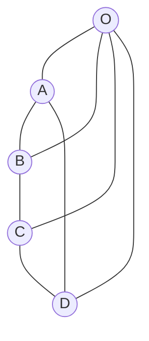

# Planarity and Euler Formula

Planarity asks whether a graph can be drawn in the plane without edge crossings. This is not a question about the first drawing we happen to see; it is a question about whether some crossing-free drawing exists. A graph with a messy drawing may still be planar, while $K_5$ and $K_{3,3}$ remain nonplanar no matter how cleverly they are redrawn.

Euler's formula is the main counting tool for plane graphs. It connects vertices, edges, and faces, and it gives quick proofs that certain dense graphs cannot be planar. Wilson's treatment uses this formula as the bridge from intuitive drawings to structural obstructions such as $K_5$ and $K_{3,3}$.


*Figure: The complete graph $K_5$, one of the classical minimal nonplanar graphs. Image: [Wikimedia Commons](https://commons.wikimedia.org/wiki/File:Complete_graph_K5.svg), David Benbennick, public domain.*


*Figure: The complete bipartite graph $K_{3,3}$, the other classical minimal nonplanar graph. Image: [Wikimedia Commons](https://commons.wikimedia.org/wiki/File:Complete_bipartite_graph_K3%2C3.svg), David Benbennick, public domain.*

## Definitions

A graph is **planar** if it has a drawing in the plane with no edge crossings except at common endpoints. A particular crossing-free drawing is a **plane graph**. The connected regions into which a plane graph divides the plane are its **faces**, including the unbounded outer face.

A **plane embedding** is the combinatorial information of a crossing-free drawing, especially the cyclic order of edges around each vertex and the boundary walks of faces.

A graph $H$ is a **subdivision** of a graph $G$ if it is obtained by replacing edges of $G$ with internally vertex-disjoint paths. Two graphs are **homeomorphic** if they have isomorphic subdivisions.

The complete graph $K_5$ and the complete bipartite graph $K_{3,3}$ are the classical minimal nonplanar graphs in Kuratowski's theorem.

## Key results

**Euler's formula.** If $G$ is a connected plane graph with $n$ vertices, $m$ edges, and $f$ faces, then

$$
n-m+f=2.
$$

Proof sketch: if $G$ is a tree, then $m=n-1$ and $f=1$, so the formula holds. If $G$ has a cycle, delete one edge from a cycle. This keeps the graph connected and reduces both $m$ and $f$ by $1$, preserving $n-m+f$. Repeat until a tree remains.

**Planar edge bound.** If $G$ is a simple planar graph with $n\ge 3$, then

$$
m\le 3n-6.
$$

Reason: every face has boundary length at least $3$, and each edge is counted twice across all face boundaries. Hence $3f\le 2m$. Substitute into Euler's formula.

**Bipartite planar edge bound.** If $G$ is simple, planar, bipartite, and $n\ge 3$, then

$$
m\le 2n-4.
$$

Every face has boundary length at least $4$ because bipartite graphs have no odd cycles.

**Kuratowski's theorem.** A finite graph is planar if and only if it contains no subgraph homeomorphic to $K_5$ or $K_{3,3}$.

**Maximal planar graphs.** A simple planar graph with $n\ge 3$ is **maximal planar** if no further edge can be added without destroying planarity. In a maximal planar graph, every face is triangular, and the edge bound is tight:

$$
m=3n-6.
$$

This is a useful diagnostic. If a simple planar drawing has a face with boundary length at least $4$ and two nonadjacent vertices on that face, an edge can often be added inside the face. Maximality fails unless every possible such chord is already present or would violate simplicity.

**Subdivisions preserve planarity.** Replacing an edge by a path does not change the essential crossing behavior. If a graph is planar, every subdivision is planar. If a subdivision of $K_5$ or $K_{3,3}$ appears inside a graph, the larger graph is nonplanar by Kuratowski's theorem. This is why planarity proofs often search for stretched versions of the two forbidden graphs rather than exact copies.

**Face-bound variants.** The inequality $m\le 3n-6$ is only the first member of a family. If a simple plane graph has girth $g$, meaning its shortest cycle has length $g$, then every face boundary has length at least $g$ when bridges are absent and the graph is connected enough for the usual counting argument. Counting edge-face incidences gives

$$
gf\le 2m.
$$

Together with Euler's formula, this gives

$$
m\le \frac{g}{g-2}(n-2).
$$

For bipartite planar graphs the girth is at least $4$, so this recovers $m\le 2n-4$. For triangle-free planar graphs the same inequality is often the main tool.

**Planarity algorithms.** The theorems above are structural, but practical planarity testing is algorithmic. Modern planarity algorithms can decide planarity in linear time and, when the graph is planar, produce an embedding. For hand calculations, however, Euler bounds, subdivisions of $K_5$ and $K_{3,3}$, and constructive drawings remain the most useful tools.

## Visual

The wheel $W_5$ is planar. Its center connects to all four vertices of an outer cycle, producing four triangular inner faces and one outer face.



| Graph | $n$ | $m$ | Planarity test by edge bound |
|---|---:|---:|---|
| $K_5$ | 5 | 10 | violates $m\le 3n-6=9$ |
| $K_{3,3}$ | 6 | 9 | violates bipartite bound $m\le 2n-4=8$ |
| $W_5$ | 5 | 8 | satisfies $m\le 9$ |
| Cube graph $Q_3$ | 8 | 12 | satisfies $m\le 18$ and is planar |

## Worked example 1: Count faces in a planar drawing

**Problem.** The wheel $W_5$ has an outer cycle on four vertices and one center joined to all outer vertices. Use Euler's formula to find the number of faces.

**Method.**

1. Count vertices: four outer vertices plus one center gives

$$
n=5.
$$

2. Count edges: the outer cycle has $4$ edges, and the center has $4$ spokes, so

$$
m=8.
$$

3. Euler's formula gives

$$
n-m+f=2.
$$

4. Substitute:

$$
5-8+f=2.
$$

5. Solve:

$$
f=2-5+8=5.
$$

**Checked answer.** $W_5$ has $5$ faces in this plane drawing: four bounded triangular faces and one unbounded outer face.

## Worked example 2: Prove $K_{3,3}$ is nonplanar by counting

**Problem.** Show that $K_{3,3}$ is not planar.

**Method.**

1. $K_{3,3}$ has $n=3+3=6$ vertices.
2. It has $m=3\cdot 3=9$ edges.
3. It is bipartite, so it contains no odd cycle.
4. If $K_{3,3}$ were planar, every face boundary would have length at least $4$.
5. Counting face-edge incidences gives

$$
4f\le 2m,
$$

so

$$
f\le \frac{m}{2}.
$$

6. Euler's formula says

$$
f=2-n+m=2-6+9=5.
$$

7. The face bound says

$$
4f\le 2m=18,
$$

so

$$
f\le 4.5.
$$

Since $f$ must be an integer, $f\le 4$, contradicting $f=5$.

**Checked answer.** $K_{3,3}$ is nonplanar.

The contradiction used the stronger bipartite face bound, not just the ordinary planar edge bound. The ordinary bound gives $9\le 12$, which says nothing. Recognizing that $K_{3,3}$ has no triangles is the key step because it raises the minimum face boundary length from $3$ to $4$.

## Code

This code checks the two standard edge-count obstructions. Passing these tests does not prove planarity; failing one proves nonplanarity under the stated hypotheses.

```python
def planar_edge_obstruction(n, m, bipartite=False):
    if n < 3:
        return False
    if bipartite:
        return m > 2 * n - 4
    return m > 3 * n - 6

print(planar_edge_obstruction(5, 10))              # K5
print(planar_edge_obstruction(6, 9, True))         # K3,3
print(planar_edge_obstruction(8, 12))              # cube passes this test

def faces_if_connected_plane(n, m):
    return 2 - n + m

print(faces_if_connected_plane(5, 8))              # W5
```

The code intentionally reports only obstructions from edge counts. A result of `False` means "this particular counting test did not disprove planarity," not "the graph is planar." To prove planarity constructively, give a crossing-free drawing or an embedding. To prove nonplanarity when the count does not suffice, look for a subdivision of $K_5$ or $K_{3,3}$, or use a planarity-testing algorithm.

When doing hand problems, keep the proof type explicit. A planar proof is usually a drawing plus a face count. A nonplanar proof is usually a contradiction from Euler's formula or an identified forbidden subdivision. Mixing the two styles often leads to statements that are visually convincing but not logically complete.

One final check is to compare all available information, not just one inequality. Count vertices and edges, ask whether the graph is bipartite, look for triangles, and inspect whether a known nonplanar graph appears after suppressing degree-$2$ subdivision vertices. Planarity arguments become much more reliable when the counting evidence and the structural obstruction point in the same direction.

State the hypotheses beside each inequality so the reader can see exactly why the bound applies.

For example, write "simple, planar, bipartite" before using $m\le 2n-4$; omitting any one of those words changes the conclusion.

A reliable planarity solution usually contains both a local and a global check. The local check identifies face lengths, bipartiteness, or a forbidden subdivision. The global check applies Euler's formula or an edge bound. If the graph is claimed planar, the drawing should make the face count visible. If it is claimed nonplanar, the contradiction should state exactly which hypothesis fails.

## Common pitfalls

- Treating a drawing with crossings as proof of nonplanarity. You must rule out every possible drawing.
- Forgetting the outer face in Euler's formula.
- Applying $m\le 3n-6$ to graphs with loops or multiple edges without checking hypotheses.
- Using the bipartite bound on a graph that is not bipartite.
- Thinking the edge bound is sufficient. Many nonplanar graphs satisfy $m\le 3n-6$.
- Writing Euler's formula as $n-m+f=1$ for connected plane graphs. The planar connected formula is $2$.

## Connections

- [Definitions and examples](/math/graph-theory/definitions-and-examples)
- [Trees and spanning trees](/math/graph-theory/trees-and-spanning-trees)
- [Duality surfaces and infinite graphs](/math/graph-theory/duality-surfaces-and-infinite-graphs)
- [Vertex and map colouring](/math/graph-theory/vertex-and-map-colouring)
