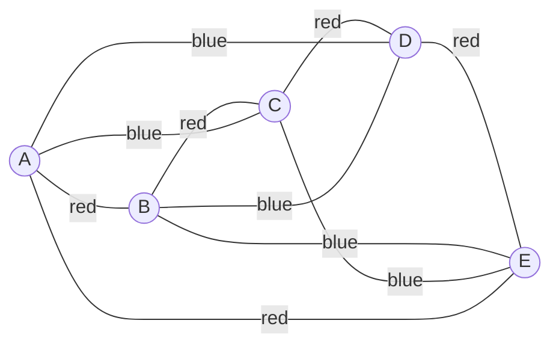

# Ramsey Theory Basics

Ramsey theory says that complete disorder is impossible in a sufficiently large structure. If every edge of a large complete graph is coloured red or blue, then some large one-colour pattern must appear. The simplest famous result is $R(3,3)=6$: every red-blue colouring of the edges of $K_6$ contains a monochromatic triangle.


*Figure: A visual proof of a small Ramsey theorem shows why large enough networks force ordered substructure. Image: [Wikimedia Commons](https://commons.wikimedia.org/wiki/File:Ramsey_theorem_visual_proof.svg), Cmglee, CC BY-SA 4.0.*

This topic sits between graph colouring, extremal graph theory, and combinatorics. Instead of asking how to avoid conflicts with few colours, Ramsey theory asks how large a graph must be before a specified one-colour configuration becomes unavoidable.

## Definitions

For positive integers $s$ and $t$, the **Ramsey number** $R(s,t)$ is the smallest integer $n$ such that every red-blue colouring of the edges of $K_n$ contains either a red $K_s$ or a blue $K_t$.

The diagonal number $R(k,k)$ asks for a monochromatic $K_k$ in any two-colouring of a sufficiently large complete graph.

More generally, multicolour Ramsey numbers and graph Ramsey numbers replace two colours or complete target graphs with broader choices, but the core idea remains the same: sufficiently large complete graphs force structured monochromatic subgraphs.

A **monochromatic triangle** is a set of three vertices whose three connecting edges all have the same colour.

## Key results

**Ramsey recursion.** For $s,t\ge 2$,

$$
R(s,t)\le R(s-1,t)+R(s,t-1).
$$

Proof sketch: choose a vertex $v$ in a large red-blue complete graph. Split the other vertices into red-neighbors of $v$ and blue-neighbors of $v$. If the red-neighbor set has size at least $R(s-1,t)$, it contains either a red $K_{s-1}$, which with $v$ gives a red $K_s$, or a blue $K_t$. The blue-neighbor case is symmetric.

**Base values.**

$$
R(1,t)=1,\quad R(2,t)=t.
$$

A red $K_2$ is just one red edge; avoiding it forces all edges blue.

**Classical theorem.**

$$
R(3,3)=6.
$$

Every red-blue edge-colouring of $K_6$ contains a monochromatic triangle, and there is a colouring of $K_5$ with no monochromatic triangle.

**Complement viewpoint.** A red-blue colouring of the edges of $K_n$ can be viewed as choosing a red graph $G$ on $n$ vertices; the blue graph is then the complement $\overline{G}$. A red triangle is a triangle in $G$, while a blue triangle is an independent set of size $3$ in $G$. Thus $R(3,3)=6$ is equivalent to saying that every graph on $6$ vertices has either a triangle or an independent set of size $3$.

**Ramsey numbers grow quickly.** Even small exact values can be difficult. The recursion proves finiteness but often gives weak upper bounds. Lower bounds usually require explicit colourings with no forbidden monochromatic subgraph, while upper bounds require proving all colourings fail. This two-sided nature is why Ramsey theory has many open numerical problems.

**Pigeonhole principle as the engine.** The proof of $R(3,3)\le 6$ is short because one vertex has five incident edges and two colours. The conclusion "at least three edges have the same colour" is the crucial compression step. Higher Ramsey arguments repeat this idea recursively with larger target structures.

**Graph reformulation of $R(s,t)$.** Saying $n\ge R(s,t)$ is equivalent to saying that every graph on $n$ vertices contains either a clique of size $s$ or an independent set of size $t$. The red graph supplies the clique condition, and the blue complement supplies the independent-set condition. This reformulation is often easier for students who are used to ordinary graph language rather than edge-colouring language.

**Upper versus lower proofs.** Ramsey calculations always have two directions. To prove $R(s,t)\le n$, prove that every colouring of $K_n$ forces the desired structure. To prove $R(s,t)\gt n-1$, exhibit one colouring of $K_{n-1}$ that avoids it. The first task is universal; the second is constructive. Mixing these quantifiers is the most common logical error in Ramsey proofs.

**Why finite does not mean small.** Ramsey's theorem guarantees that $R(s,t)$ exists for every $s,t$, but the numbers grow rapidly. Even when exact values are unknown, bounds can still be meaningful. A lower-bound colouring is a certificate of possibility; an upper-bound argument is a certificate of inevitability.

## Visual

One extremal colouring of $K_5$ uses a red $5$-cycle and blue complementary diagonals. It avoids monochromatic triangles.



| Quantity | Value or bound | Meaning |
|---|---:|---|
| $R(2,t)$ | $t$ | force red edge or blue $K_t$ |
| $R(3,3)$ | $6$ | force a monochromatic triangle |
| $R(3,4)$ | $9$ | force red triangle or blue $K_4$ |
| $R(4,4)$ | $18$ | first harder diagonal case |
| $R(s,t)$ | finite | Ramsey's theorem |

## Worked example 1: Prove the upper bound $R(3,3)\le 6$

**Problem.** Show that every red-blue colouring of $K_6$ contains a monochromatic triangle.

**Method.**

1. Pick any vertex $v$.
2. Vertex $v$ is incident with $5$ edges.
3. By the pigeonhole principle, at least $3$ of those $5$ edges have the same colour. Suppose they are red; the blue case is symmetric.
4. Let the three red-neighbors be $a,b,c$. Thus

$$
va,\ vb,\ vc
$$

are all red.

5. If any one of $ab,bc,ca$ is red, then together with $v$ it forms a red triangle.
6. If none of $ab,bc,ca$ is red, then all three are blue.
7. In that case $a,b,c$ form a blue triangle.

Either way, a monochromatic triangle appears.

**Checked answer.** Every two-colouring of $K_6$ has a monochromatic triangle, so $R(3,3)\le 6$.

## Worked example 2: Show that $R(3,3)\gt 5$

**Problem.** Construct a red-blue colouring of $K_5$ with no monochromatic triangle.

**Method.**

1. Label the vertices $1,2,3,4,5$ around a cycle.
2. Colour the cycle edges red:

$$
12,\ 23,\ 34,\ 45,\ 51.
$$

3. Colour the remaining five edges blue:

$$
13,\ 14,\ 24,\ 25,\ 35.
$$

4. Check red triangles. The red graph is a $5$-cycle, and a cycle of length $5$ contains no triangle.
5. Check blue triangles. The blue edges are exactly the complementary $5$-cycle:

$$
13,\ 35,\ 52,\ 24,\ 41.
$$

This is also a $5$-cycle, so it contains no triangle.

**Checked answer.** There is a colouring of $K_5$ with no monochromatic triangle, so $R(3,3)\gt 5$. Combined with the previous example, $R(3,3)=6$.

The construction is tight. Adding a sixth vertex to this colouring cannot avoid a monochromatic triangle, no matter how the five new incident edges are coloured. That is exactly what the upper-bound proof establishes from the viewpoint of the new vertex.

## Code

The code below checks whether a red-blue colouring contains a monochromatic triangle.

```python
from itertools import combinations

def has_mono_triangle(vertices, colour):
    for a, b, c in combinations(vertices, 3):
        edges = [tuple(sorted(e)) for e in [(a, b), (a, c), (b, c)]]
        colours = {colour[e] for e in edges}
        if len(colours) == 1:
            return True, (a, b, c), colours.pop()
    return False, None, None

V = [1, 2, 3, 4, 5]
red = {(1, 2), (2, 3), (3, 4), (4, 5), (1, 5)}
colouring = {}
for e in combinations(V, 2):
    edge = tuple(sorted(e))
    colouring[edge] = "red" if edge in red else "blue"

print(has_mono_triangle(V, colouring))
```

The same brute-force idea can test small proposed lower-bound colourings. It should not be mistaken for a proof of an upper bound unless it checks every colouring, and the number of colourings of $K_n$ is $2^{\binom n2}$. Exhaustive search grows too quickly to replace mathematical arguments except at very small values.

When writing Ramsey proofs, mark the forced object clearly. In the $K_6$ proof, the forced object is not necessarily connected to the first chosen vertex; if the three same-colour neighbors do not create a red triangle with it, they create a blue triangle among themselves.

For lower-bound colourings, draw both colour classes. It is easy to check the red graph and forget that the blue graph, as the complement, may contain the forbidden structure. The $K_5$ construction works because both colour classes are $5$-cycles.

A valid Ramsey lower-bound example must avoid the forbidden pattern in every colour simultaneously.

Ramsey arguments often become clearer when written in both colour language and graph-complement language. A red clique is a clique in the red graph; a blue clique is an independent set in the red graph. Moving between these views can make the same proof look like a colouring argument, a clique argument, or an independence argument.

## Common pitfalls

- Confusing vertex colouring with Ramsey edge colouring. In $R(s,t)$ the edges of a complete graph are coloured.
- Proving only that a particular colouring has a monochromatic triangle. Ramsey upper bounds require every colouring.
- Forgetting the lower-bound construction. To prove $R(3,3)=6$, one must show both $K_6$ forces a triangle and $K_5$ does not.
- Assuming the recursion always gives exact values. It usually gives upper bounds.
- Treating "monochromatic" as meaning "all vertices same colour." The colour is on edges here.
- Ignoring symmetry. Many Ramsey arguments become simpler after swapping red and blue.

## Connections

- [Vertex and map colouring](/math/graph-theory/vertex-and-map-colouring)
- [Edge colouring and chromatic polynomials](/math/graph-theory/edge-colouring-and-chromatic-polynomials)
- [Random graphs basics](/math/graph-theory/random-graphs-basics)
- [Definitions and examples](/math/graph-theory/definitions-and-examples)
