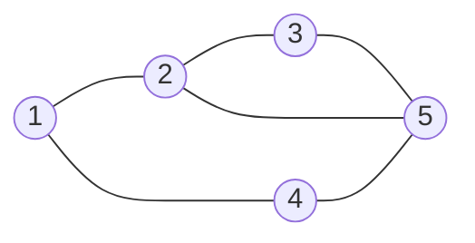

# Random Graphs Basics

Random graphs study what a graph typically looks like when edges are chosen by chance. Instead of analyzing one fixed graph, we analyze a probability distribution over many graphs. This shift makes it possible to prove existence results, estimate thresholds for properties, and model large networks whose exact structure is not known in advance.


*Figure: Paul Erdos at a student seminar reflects the collaborative culture behind modern combinatorics and random graph theory. Image: [Wikimedia Commons](https://commons.wikimedia.org/wiki/File:Erdos_budapest_fall_1992.jpg), Kmhkmh, CC BY 3.0.*

The basic model is the Erdos-Renyi graph $G(n,p)$: start with $n$ labelled vertices and include each possible edge independently with probability $p$. As $p$ increases from $0$ to $1$, the graph evolves from isolated vertices to a dense graph, and properties such as containing a triangle, being connected, or having a giant component appear around predictable thresholds.

## Definitions

The random graph **$G(n,p)$** has vertex set $[n]=\{1,\dots,n\}$. Each of the $\binom n2$ possible edges is included independently with probability $p$.

The related model **$G(n,m)$** chooses uniformly from all labelled graphs with exactly $m$ edges.

For a graph property $\mathcal{P}$, a function $p(n)$ is a **threshold** if the probability that $G(n,p)$ has $\mathcal{P}$ changes from near $0$ to near $1$ around that scale.

A graph property is **monotone increasing** if adding edges cannot destroy it. Connectivity, containing a triangle, and having a perfect matching are increasing properties.

The **expected value** of a random variable $X$ is denoted $\mathbb{E}[X]$. Indicator variables are the main counting tool: if $X=\sum_i I_i$, then

$$
\mathbb{E}[X]=\sum_i \mathbb{E}[I_i].
$$

## Key results

**Expected number of edges.** In $G(n,p)$,

$$
\mathbb{E}[|E|]=p\binom n2.
$$

Each possible edge contributes $1$ with probability $p$.

**Expected degree.** For any fixed vertex $v$,

$$
\mathbb{E}[\deg(v)]=(n-1)p.
$$

The degree has binomial distribution $\mathrm{Bin}(n-1,p)$.

**Expected triangles.** The expected number of triangles is

$$
\binom n3 p^3.
$$

Each triple of vertices forms a triangle exactly when its three edges are present.

**Connectivity threshold.** The threshold for connectivity in $G(n,p)$ is around

$$
p=\frac{\log n}{n}.
$$

Below this scale isolated vertices are likely; above it the graph is likely connected.

**Giant component threshold.** Around $p=1/n$, a component of linear size emerges.

**Linearity of expectation does not require independence.** Independence is needed for many probability calculations, but not for expected counts formed by indicators. To count expected triangles, define one indicator for each vertex triple. Even though triangle events overlap and are not independent, the expected total is still the sum of the individual probabilities.

**First moment method.** If $X$ counts bad objects and $\mathbb{E}[X]\to 0$, then the probability that any bad object exists tends to $0$. This follows from Markov's inequality:

$$
\Pr(X\ge 1)\le \mathbb{E}[X].
$$

This method is often used to show that a sparse random graph likely has no copy of a fixed subgraph.

**Probabilistic method.** If a random graph has positive probability of satisfying a property, then at least one graph with that property exists. This is a nonconstructive existence proof. Ramsey lower bounds, high-girth high-chromatic graphs, and extremal examples are often approached this way.

**Almost surely.** A property holds **asymptotically almost surely** if its probability tends to $1$ as $n\to\infty$. Random graph thresholds are asymptotic statements, so finite examples may deviate from the threshold behavior.

**Variance and concentration.** Expected value gives a center of mass, but it does not by itself say that most samples are close to that value. To prove concentration, one often studies variance or uses inequalities such as Chernoff bounds. For example, the number of edges in $G(n,p)$ is binomial with parameters $\binom n2$ and $p$, so it is sharply concentrated around $p\binom n2$ when that expectation is large.

**Subgraph thresholds.** For a fixed graph $H$, the expected number of labelled copies of $H$ in $G(n,p)$ is roughly

$$
n^{|V(H)|}p^{|E(H)|}
$$

up to constants depending on automorphisms. This heuristic predicts the scale at which copies of $H$ begin to appear. For triangles, setting $n^3p^3$ near $1$ gives $p\approx 1/n$.

**Random graphs as examples.** Random graphs often show that a proposed deterministic statement is false. If a random graph has a property with positive probability, then some concrete graph has that property, even if the proof does not display it. This is the probabilistic method in its most basic form.

## Visual



This is one possible outcome of $G(5,p)$. The model is not this graph; it is the probability distribution that could have produced it.

| Scale of $p$ | Typical behavior in $G(n,p)$ |
|---|---|
| $p\ll 1/n$ | mostly small tree components |
| $p\approx 1/n$ | giant component begins to appear |
| $p\approx (\log n)/n$ | isolated vertices disappear; connectivity emerges |
| constant $p$ | dense graph with many small subgraphs |
| $p=1$ | complete graph $K_n$ |

## Worked example 1: Expected edges and triangles

**Problem.** In $G(20,0.1)$, compute the expected number of edges and expected number of triangles.

**Method.**

There are

$$
\binom{20}{2}=\frac{20\cdot 19}{2}=190
$$

possible edges. Each appears with probability $0.1$, so

$$
\mathbb{E}[|E|]=190\cdot 0.1=19.
$$

For triangles, there are

$$
\binom{20}{3}=\frac{20\cdot 19\cdot 18}{6}=1140
$$

vertex triples. A fixed triple forms a triangle if all three internal edges appear, which has probability

$$
(0.1)^3=0.001.
$$

Therefore

$$
\mathbb{E}[\text{triangles}]=1140\cdot 0.001=1.14.
$$

**Checked answer.** The expected number of edges is $19$, and the expected number of triangles is $1.14$.

The expectation $1.14$ does not mean the graph must contain a triangle. It means that over many independent samples, the average triangle count approaches $1.14$. Some samples have no triangles, some have one, and occasionally a sample has several overlapping triangles.

## Worked example 2: Probability a vertex is isolated

**Problem.** In $G(n,p)$, find the probability that vertex $1$ is isolated. Then evaluate it for $n=50$ and $p=0.05$.

**Method.**

1. Vertex $1$ has $n-1$ possible incident edges.
2. A particular incident edge is absent with probability $1-p$.
3. The choices are independent.
4. Therefore

$$
\Pr(\deg(1)=0)=(1-p)^{n-1}.
$$

For $n=50$ and $p=0.05$,

$$
\Pr(\deg(1)=0)=0.95^{49}.
$$

Compute approximately:

$$
0.95^{49}\approx 0.081.
$$

So vertex $1$ has about an $8.1\%$ chance of being isolated.

**Check.** The expected degree is $(49)(0.05)=2.45$, so isolation is possible but not dominant. The probability $0.081$ is plausible.

## Code

```python
import random
from collections import deque

def random_graph(n, p, seed=None):
    rng = random.Random(seed)
    adj = {i: set() for i in range(n)}
    for i in range(n):
        for j in range(i + 1, n):
            if rng.random() < p:
                adj[i].add(j)
                adj[j].add(i)
    return adj

def component_sizes(adj):
    unseen = set(adj)
    sizes = []
    while unseen:
        start = unseen.pop()
        q = deque([start])
        size = 1
        while q:
            u = q.popleft()
            for v in adj[u]:
                if v in unseen:
                    unseen.remove(v)
                    q.append(v)
                    size += 1
        sizes.append(size)
    return sorted(sizes, reverse=True)

G = random_graph(20, 0.1, seed=7)
print(sum(len(nbrs) for nbrs in G.values()) // 2)
print(component_sizes(G))
```

Changing the seed changes the sampled graph but not the model. For experiments, it is better to run many samples and average statistics such as edge count, largest component size, number of isolated vertices, or triangle count. One sample can illustrate a definition; many samples reveal the distribution.

A useful simulation habit is to compare empirical averages with the formulas above. For example, repeated samples of $G(20,0.1)$ should have average edge count close to $19$. If they do not, the most likely error is checking each unordered pair twice or using the wrong probability.

When using random graphs for proofs, state whether the claim is exact, high probability, or positive probability. These are different levels of conclusion. Positive probability proves existence; high probability describes typical behavior as $n$ grows.

That wording keeps asymptotic intuition separate from finite numerical claims.

It also makes simulations easier to interpret responsibly.

Random graph calculations should specify the random variable before computing its expectation or probability. "The expected number of triangles" means a sum of indicators over vertex triples; "the probability of a triangle" means at least one triangle exists. These are related but not the same, and confusing them is a common source of incorrect threshold reasoning.

## Common pitfalls

- Treating $G(n,p)$ as one graph rather than a probability distribution over graphs.
- Forgetting independence when computing probabilities. Edge events are independent in $G(n,p)$, but many graph properties are not independent.
- Confusing $G(n,p)$ with $G(n,m)$. One fixes edge probability; the other fixes the exact edge count.
- Assuming expected value means typical value in every regime. Concentration needs separate proof.
- Using the connectivity threshold as an exact finite-$n$ cutoff. It is an asymptotic statement.
- Ignoring isolated vertices when reasoning about connectivity near $(\log n)/n$.

## Connections

- [Definitions and examples](/math/graph-theory/definitions-and-examples)
- [Walks paths and connectedness](/math/graph-theory/walks-paths-and-connectedness)
- [Ramsey theory basics](/math/graph-theory/ramsey-theory-basics)
- [Algebraic graph theory basics](/math/graph-theory/algebraic-graph-theory-basics)
