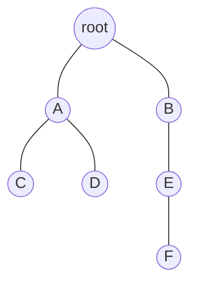

# Trees and Spanning Trees

Trees are the connected graphs with no wasted edges. They carry information from one vertex to another along unique routes, which makes them central to search algorithms, hierarchical data, electrical networks, phylogenies, and proofs by induction. In Wilson's development, trees appear after paths and cycles because they are exactly the graphs in which cycles have been eliminated without losing connectedness.

Spanning trees connect tree theory back to arbitrary connected graphs. A connected graph may have many cycles, but deleting cycle edges carefully leaves a minimal connected backbone. That backbone is often the object an algorithm actually needs.

## Definitions

A **tree** is a connected graph with no cycles. A **forest** is a graph with no cycles; each component of a forest is a tree. A **leaf** is a vertex of degree $1$.

A **spanning tree** of a connected graph $G$ is a subgraph $T$ such that $V(T)=V(G)$ and $T$ is a tree. A **rooted tree** is a tree with one distinguished vertex called the root. Once rooted, every non-root vertex has a parent, and vertices farther from the root are children, descendants, or leaves depending on their position.

A **branch** or **pendant subtree** is a connected piece attached to the rest of the tree through a single vertex or edge. In algorithmic settings, rooted trees encode search order, recursion, heaps, expression syntax, and decision processes.

## Key results

For a finite graph $T$ with $n$ vertices, the following are equivalent:

1. $T$ is a tree.
2. $T$ is connected and has $n-1$ edges.
3. $T$ is acyclic and has $n-1$ edges.
4. Any two vertices of $T$ are joined by a unique path.
5. $T$ is minimally connected: deleting any edge disconnects it.
6. $T$ is maximally acyclic: adding any missing edge creates exactly one cycle.

Proof sketch: if a connected graph has a cycle, deleting one edge of that cycle keeps it connected. Repeating this until no cycles remain gives a connected acyclic graph with at most the original number of edges. Acyclic connected graphs satisfy $m=n-1$ by induction on $n$, deleting a leaf at each step.

**Leaf lemma.** Every tree with at least two vertices has at least two leaves.

Proof sketch: take a longest path in the tree. If either endpoint had degree greater than $1$, the path could be extended, contradicting maximality.

**Spanning tree existence.** Every connected graph has a spanning tree.

Repeatedly delete an edge from a cycle. Connectivity is preserved, and the process stops with a connected acyclic spanning subgraph.

**Induction on trees.** Many tree proofs use the leaf lemma. Remove a leaf $v$ and its incident edge. The remaining graph is still a tree on $n-1$ vertices. Prove the desired statement for the smaller tree, then add $v$ back and check what changes. This explains why formulas involving trees often have clean $n-1$ terms: each induction step removes exactly one vertex and one edge.

**Center of a tree.** Repeatedly delete all current leaves from a finite tree. The process ends with either one vertex or one edge. This remaining object is the center of the tree. It is useful for understanding tree symmetry and for choosing good roots. A path with an odd number of vertices has one central vertex; a path with an even number of vertices has one central edge.

**Spanning trees as backbones.** In a connected graph with cycles, a spanning tree is not just a smaller graph. It preserves reachability while discarding redundancy. Different algorithms produce different spanning trees depending on their priority: DFS trees reveal depth and backtracking structure, BFS trees preserve shortest unweighted distances from a root, and minimum spanning trees minimize weighted construction cost.

**Counting components in forests.** If a forest has $n$ vertices, $m$ edges, and $c$ connected components, then

$$
m=n-c.
$$

Equivalently,

$$
c=n-m.
$$

This generalizes the tree formula $m=n-1$, which is the special case $c=1$. The proof is componentwise: if the components have $n_1,\dots,n_c$ vertices, then they have $(n_1-1)+\cdots+(n_c-1)=n-c$ edges in total.

**Fundamental cycles and cuts.** If $T$ is a spanning tree of $G$, adding one edge $e\in E(G)-E(T)$ creates a unique cycle, called the fundamental cycle of $e$ with respect to $T$. Conversely, deleting one tree edge from $T$ splits the vertices into two parts; the original graph edges crossing that split form a fundamental cut. These two ideas are central in matroids, network design, and proofs about spanning trees.

**Tree metrics.** Distances in a tree behave especially well because the path between two vertices is unique. This uniqueness lets us define lowest common ancestors in rooted trees, compute distances by depths, and reason about medians of three vertices. Many algorithms on trees are faster than their general-graph versions precisely because no alternative cycle route has to be considered.

## Visual



| View | Meaning | Typical use |
|---|---|---|
| Unrooted tree | Only adjacency matters | chemical trees, spanning trees |
| Rooted tree | One vertex is the root | search, parsing, recursion |
| Ordered rooted tree | Children have left-to-right order | syntax trees, heaps |
| Spanning tree | Includes all vertices of a graph | network backbone |

## Worked example 1: Verify that a graph is a tree

**Problem.** Let $G$ have vertices $\{a,b,c,d,e,f,g\}$ and edges

$$
ab,\ ac,\ bd,\ be,\ cf,\ fg.
$$

Show that $G$ is a tree.

**Method 1: connected and edge count.**

1. The graph has $n=7$ vertices.
2. The graph has $m=6$ edges.
3. Since $m=n-1$, it remains to check connectedness.
4. From $a$ we reach $b$ and $c$.
5. From $b$ we reach $d$ and $e$.
6. From $c$ we reach $f$, and from $f$ we reach $g$.

Every vertex is reachable from $a$, so the graph is connected. A connected graph with $n-1$ edges is a tree.

**Method 2: unique paths.**

There is one visible route from the central vertex $a$ to each branch. For example, the path from $d$ to $g$ is

$$
d-b-a-c-f-g.
$$

Any alternate route would create a cycle, but none of the listed edges joins branches sideways.

**Checked answer.** $G$ is a tree.

## Worked example 2: Extract a spanning tree

**Problem.** Let $G$ have vertices $\{1,2,3,4,5,6\}$ and edges

$$
12,\ 23,\ 31,\ 34,\ 45,\ 56,\ 64,\ 25.
$$

Find a spanning tree and justify it.

**Method.**

1. The graph has $6$ vertices, so a spanning tree must have $5$ edges.
2. Start with all edges.
3. The edges $12,23,31$ form the cycle $1-2-3-1$. Delete $31$.
4. The edges $45,56,64$ form the cycle $4-5-6-4$. Delete $64$.
5. The remaining edges are

$$
12,\ 23,\ 34,\ 45,\ 56,\ 25.
$$

This still has $6$ edges, one too many for a tree. Check for a cycle:

$$
2-3-4-5-2
$$

uses $23,34,45,25$. Delete $25$.

The selected spanning tree is

$$
\{12,23,34,45,56\}.
$$

It is the path

$$
1-2-3-4-5-6.
$$

**Checked answer.** It has all $6$ vertices, exactly $5$ edges, and is connected; therefore it is a spanning tree.

This example also shows why the deletion method is flexible. We could have deleted $12$ instead of $31$ from the first cycle and still found a spanning tree later. The final tree is not unique; what matters is that every cycle deletion preserves connectedness until no cycles remain.

## Code

A depth-first search naturally returns a spanning tree of the component containing the start vertex.

```python
def dfs_spanning_tree(adj, start):
    seen = {start}
    tree_edges = []
    stack = [start]
    while stack:
        u = stack.pop()
        for v in sorted(adj[u], reverse=True):
            if v not in seen:
                seen.add(v)
                tree_edges.append((u, v))
                stack.append(v)
    return seen, tree_edges

adj = {
    1: {2, 3},
    2: {1, 3, 5},
    3: {1, 2, 4},
    4: {3, 5, 6},
    5: {2, 4, 6},
    6: {4, 5},
}

seen, tree = dfs_spanning_tree(adj, 1)
print(seen)
print(tree)
print(len(tree) == len(adj) - 1)
```

The DFS tree depends on the neighbor order. If the sorted order changes, the selected tree edges may change while still forming a valid spanning tree. A BFS version would produce a spanning tree whose root-to-vertex paths are shortest in the original unweighted graph; DFS makes no such shortest-path promise.

A useful way to check any tree argument is to ask which of the equivalent characterizations is doing the work. If the proof uses connectedness and $n-1$ edges, say so. If it uses acyclicity and $n-1$ edges, say so. If it uses unique paths, say so. Tree theory is clean because these conditions coincide, but a proof should still name the condition it actually uses.

## Common pitfalls

- Saying "acyclic" when "tree" is intended. A disconnected acyclic graph is a forest, not a tree.
- Forgetting that a spanning tree must include every vertex of the original graph.
- Assuming a graph with $n-1$ edges is automatically a tree. It also must be connected, or equivalently acyclic.
- Counting isolated vertices incorrectly in forests. Each isolated vertex is a tree component by itself.
- Thinking a spanning tree is unique. Most connected graphs with cycles have several spanning trees.
- Confusing rooted-tree parent-child relationships with properties of the unrooted tree. The root is extra structure.

## Connections

- [Walks, paths, and connectedness](/math/graph-theory/walks-paths-and-connectedness)
- [Algorithms on weighted graphs](/math/graph-theory/algorithms-on-weighted-graphs)
- [Counting trees and Pruefer sequences](/math/graph-theory/counting-trees-and-prufer-sequences)
- [Matroids and graph duality](/math/graph-theory/matroids-and-graph-duality)
