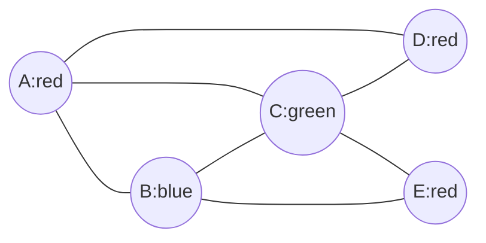

# Vertex and Map Colouring

Vertex colouring asks how few labels, or colours, are needed so that adjacent vertices receive different colours. This turns adjacency into a scheduling or separation rule: conflicting exams need different time slots, adjacent regions on a map need different colours, and incompatible tasks need different resources.

Map colouring is graph colouring in disguise. A plane map can be converted to a dual graph whose vertices are regions and whose edges record shared borders. Colouring the map is then equivalent to vertex-colouring that dual graph. This connection explains why planar graph theory and colouring theory are historically intertwined.


*Figure: Four-colour map example. Image: [Wikimedia Commons](https://commons.wikimedia.org/wiki/File:Fourcolorsmap.svg), Germo, public domain.*

## Definitions

A **proper vertex colouring** of a graph $G$ is a function

$$
c:V(G)\to \{1,2,\dots,k\}
$$

such that $c(u)\ne c(v)$ whenever $uv\in E(G)$. If such a colouring exists, $G$ is **$k$-colourable**. The **chromatic number** $\chi(G)$ is the least $k$ for which $G$ is $k$-colourable.

A graph is **bipartite** if its vertex set can be split into two independent sets. Equivalently, it is $2$-colourable, except for the edgeless case where $\chi(G)=1$.

A **clique** is a set of pairwise adjacent vertices. The clique number $\omega(G)$ gives a lower bound:

$$
\omega(G)\le \chi(G).
$$

A **plane map** can be coloured by building its region-adjacency graph. Two regions are adjacent only when they share a boundary segment, not merely a point.

## Key results

**Bipartite characterization.** A graph is bipartite if and only if it has no odd cycle.

Proof sketch: if a graph is bipartite, every cycle alternates between the two parts, so every cycle has even length. Conversely, if a connected graph has no odd cycle, choose a root and colour vertices by parity of distance from the root. An edge joining vertices of the same parity would create an odd cycle.

**Greedy colouring bound.** Every graph satisfies

$$
\chi(G)\le \Delta(G)+1,
$$

where $\Delta(G)$ is the maximum degree. Colour vertices one at a time; at most $\Delta$ colours are forbidden by already coloured neighbors.

**Brooks' theorem.** If $G$ is connected and is neither a complete graph nor an odd cycle, then

$$
\chi(G)\le \Delta(G).
$$

**Four-colour theorem.** Every planar graph is $4$-colourable. Equivalently, every plane map can be coloured with at most four colours.

The four-colour theorem is deep; introductory work usually uses it as a landmark result rather than proving it.

**Critical graphs.** A graph is **$k$-critical** if $\chi(G)=k$ but deleting any vertex lowers the chromatic number. Critical graphs are useful for minimal-counterexample arguments. For instance, every odd cycle is $3$-critical. Complete graphs $K_k$ are $k$-critical. If a theorem about colourability fails, one often chooses a smallest counterexample and then studies the constraints forced by criticality.

**Greedy order matters.** The greedy bound $\Delta+1$ is universal, but the number of colours used by a greedy algorithm may be far from optimal under a bad ordering. Bipartite graphs can be forced to use many colours greedily if their vertices are ordered poorly, even though their chromatic number is $2$. Good heuristics order high-degree vertices first or repeatedly choose a vertex with many already-coloured neighbors.

**Lower bounds.** Clique number is not the only lower bound. If a graph has $n$ vertices and independence number $\alpha(G)$, then each colour class is an independent set of size at most $\alpha(G)$, so

$$
\chi(G)\ge \left\lceil \frac{n}{\alpha(G)}\right\rceil.
$$

This bound is useful when large cliques are absent but colour classes are still forced to be small.

**Colour classes.** A proper $k$-colouring partitions the vertex set into $k$ independent sets, one for each colour. Conversely, any partition of $V(G)$ into $k$ independent sets is a proper $k$-colouring. This reformulation is often the simplest way to prove both lower and upper bounds: lower bounds show that too few independent sets cannot cover all vertices, while upper bounds explicitly build such a partition.

**Planar special cases.** The four-colour theorem is the famous general result, but many planar graphs need fewer colours. Every outerplanar graph is $3$-colourable. Every bipartite planar graph is $2$-colourable. Every planar graph is $5$-colourable by a classical short argument using Euler's formula and induction. These weaker results are often more useful in exercises because their proofs are accessible.

**Dual map graph.** In map colouring, the graph being coloured is usually the dual adjacency graph of regions. A bridge or dangling feature in the boundary may create loops or repeated adjacencies if modeled carelessly, so map-colouring problems usually assume well-behaved regions and count adjacency only along nontrivial boundary arcs.

## Visual



| Graph family | Chromatic number | Reason |
|---|---:|---|
| Null graph $N_n$ | $1$ | no adjacencies |
| Path $P_n$ with $n\ge 2$ | $2$ | bipartite and has an edge |
| Even cycle $C_{2r}$ | $2$ | bipartite |
| Odd cycle $C_{2r+1}$ | $3$ | not bipartite but greedily 3-colourable |
| Complete graph $K_n$ | $n$ | all vertices pairwise adjacent |
| Wheel $W_n$ | $3$ or $4$ | depends on parity of rim cycle |

## Worked example 1: Colour an odd cycle

**Problem.** Find $\chi(C_5)$.

**Method.**

1. $C_5$ has vertices $v_1,v_2,v_3,v_4,v_5$ and edges around the cycle.
2. It is an odd cycle, so it cannot be $2$-coloured. To see this directly, start with $v_1$ red.
3. Then $v_2$ must be blue.
4. Then $v_3$ must be red.
5. Then $v_4$ must be blue.
6. Then $v_5$ must be red because it is adjacent to $v_4$.
7. But $v_5$ is also adjacent to $v_1$, which is red. This is a conflict.

So $\chi(C_5)\ge 3$.

Now give a $3$-colouring:

$$
c(v_1)=1,\ c(v_2)=2,\ c(v_3)=1,\ c(v_4)=2,\ c(v_5)=3.
$$

Check all edges:

$$
12:1\ne2,\quad 23:2\ne1,\quad 34:1\ne2,\quad 45:2\ne3,\quad 51:3\ne1.
$$

**Checked answer.** $\chi(C_5)=3$.

## Worked example 2: Colour a wheel graph

**Problem.** Let $W_6$ be the wheel made from a $5$-cycle rim plus one central hub adjacent to every rim vertex. Find $\chi(W_6)$.

**Method.**

1. The rim is $C_5$, so it already needs $3$ colours.
2. The hub is adjacent to every rim vertex.
3. In any proper colouring of the rim $C_5$, all three colours must appear, because $\chi(C_5)=3$.
4. Therefore the hub cannot use any of those three colours.
5. Hence

$$
\chi(W_6)\ge 4.
$$

Now construct a $4$-colouring. Colour the rim as in the previous example:

$$
1,2,1,2,3.
$$

Colour the hub with colour $4$. The hub differs from every rim vertex, and the rim was already properly coloured.

**Checked answer.** $\chi(W_6)=4$.

If the rim had even length instead, the answer would change. A wheel whose rim is an even cycle needs only two colours on the rim and a third colour for the hub. Thus wheels show a common colouring pattern: adding one universal vertex increases the chromatic number by one because it is adjacent to every existing colour class.

## Code

This backtracking routine computes the chromatic number of a small graph exactly.

```python
def can_colour(adj, k):
    vertices = sorted(adj, key=lambda v: -len(adj[v]))
    colour = {}

    def search(i):
        if i == len(vertices):
            return True
        v = vertices[i]
        forbidden = {colour[u] for u in adj[v] if u in colour}
        for c in range(k):
            if c not in forbidden:
                colour[v] = c
                if search(i + 1):
                    return True
                del colour[v]
        return False

    return search(0)

def chromatic_number(adj):
    for k in range(1, len(adj) + 1):
        if can_colour(adj, k):
            return k

C5 = {i: {((i - 2) % 5) + 1, (i % 5) + 1} for i in range(1, 6)}
print(chromatic_number(C5))
```

The exact backtracking routine is deliberately exponential. It is appropriate for checking small examples and for illustrating the definition of $\chi(G)$. Large colouring instances are computationally hard in general, so practical solvers combine branching, propagation, greedy bounds, and problem-specific structure.

For hand colouring, alternate between lower and upper bounds. A clique, odd cycle, or independence-number argument proves that at least some number of colours is necessary. An explicit colouring proves that that many colours are sufficient. Equality requires both sides.

Colouring proofs are strongest when they give matching lower and upper bounds. A lower bound says why fewer colours cannot work. An upper bound gives an actual colouring or a theorem that guarantees one. If the two bounds meet, the chromatic number is known exactly. If they do not, the result is only an interval, even if the drawing looks persuasive.

## Common pitfalls

- Thinking colours have numerical meaning. Colour labels are interchangeable.
- Confusing a greedy colouring with an optimal colouring. Greedy performance depends heavily on vertex order.
- Forgetting that a graph with one edge needs at least two colours.
- Counting map regions that meet only at a point as adjacent. Map colouring uses shared boundary segments.
- Assuming every planar graph needs four colours. The theorem says four suffice, not that four are always necessary.
- Ignoring loops. A graph with a loop has no proper vertex colouring under the usual definition.

## Connections

- [Planarity and Euler formula](/math/graph-theory/planarity-and-euler-formula)
- [Edge colouring and chromatic polynomials](/math/graph-theory/edge-colouring-and-chromatic-polynomials)
- [Ramsey theory basics](/math/graph-theory/ramsey-theory-basics)
- [Random graphs basics](/math/graph-theory/random-graphs-basics)
