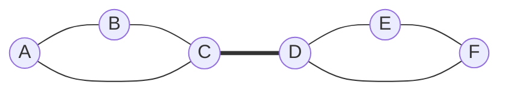

# Walks Paths and Connectedness

Walks and paths describe movement through a graph. They turn a static incidence object into a navigable structure: can we get from one vertex to another, how many edges are needed, and what breaks if a vertex or edge is removed? These questions are the language behind routing, social separation, network reliability, puzzle solving, and many graph algorithms.

Connectedness is the first global property most students meet. It is also the first place where local information can mislead: a graph may have many high-degree vertices and still be disconnected, while a sparse graph may be connected because its few edges are arranged efficiently. The central habit is to track actual routes, not just degree counts.


*Figure: The bridges of Konigsberg as a motivating graph-traversal problem. Image: [Wikimedia Commons](https://commons.wikimedia.org/wiki/File:Konigsberg_Bridge.png), Merian-Erben, public domain.*

## Definitions

A **walk** from $v_0$ to $v_k$ is an alternating sequence

$$
v_0,e_1,v_1,e_2,\dots,e_k,v_k
$$

where each edge $e_i$ joins $v_{i-1}$ to $v_i$. In a simple graph we often abbreviate this as $v_0v_1\dots v_k$. The **length** of the walk is $k$, the number of edges used, counted with repetition.

A **trail** is a walk with no repeated edge. A **path** is a walk with no repeated vertex. A **closed walk** begins and ends at the same vertex. A **cycle** is a closed walk of positive length with no repeated vertices except the initial/final vertex. In a simple graph, a cycle has length at least $3$.

Vertices $u$ and $v$ are **connected** if there is a path from $u$ to $v$. A graph is **connected** if every pair of vertices is connected. A **component** is a maximal connected subgraph. The **distance** $d(u,v)$ is the length of a shortest path from $u$ to $v$, and the **diameter** is the maximum distance between two vertices in a connected graph.

A **bridge** is an edge whose deletion increases the number of components. A **cut vertex** is a vertex whose deletion, together with its incident edges, increases the number of components. These are first measures of network vulnerability.

## Key results

**Walk-to-path reduction.** If there is a walk from $u$ to $v$, then there is a path from $u$ to $v$.

Proof sketch: if a walk repeats a vertex, delete the closed portion between two occurrences of that vertex. The shorter sequence is still a walk from $u$ to $v$. Repeating this process removes all repeated vertices.

**Connectedness is an equivalence relation.** On the vertex set of a graph, the relation "is connected to" is reflexive, symmetric, and transitive. Its equivalence classes are exactly the components of the graph.

**Bridge characterization.** An edge $e$ is a bridge if and only if $e$ lies on no cycle.

Proof sketch: if $e=uv$ lies on a cycle, then deleting $e$ still leaves the rest of the cycle as a path from $u$ to $v$, so no component is split. Conversely, if deleting $e=uv$ does not disconnect its endpoints, there is a $u$-$v$ path avoiding $e$; adding $e$ creates a cycle containing $e$.

**Minimum connected edge count.** A connected graph on $n$ vertices has at least $n-1$ edges. Equality holds exactly for trees.

This is why paths and trees are the sparsest connected graphs: every extra edge beyond $n-1$ creates at least one cycle somewhere.

**Component counting after deletion.** If a graph has $c$ components and we delete an edge, the number of components either stays $c$ or becomes $c+1$. It increases exactly when the deleted edge is a bridge inside its original component. Deleting a vertex can increase the component count by more than one, because all incident edges disappear at once.

This distinction matters in reliability questions. An edge bridge is a single failed connection that separates the network. A cut vertex is a failed station, router, or intersection that may remove many incident connections. A graph can have no bridges and still have cut vertices; two cycles sharing one common vertex are the standard example. Conversely, every bridge has endpoints whose removal may be important, but an endpoint of a bridge is not automatically a cut vertex when it is a leaf.

**Blocks and local robustness.** A maximal connected subgraph with no cut vertex is called a block. Introductory problems often avoid the full block-cut tree language, but the idea is useful: triangles and cycles provide local redundancy, while bridges stitch blocks together in a fragile way. When reading a drawing, first identify cyclic regions, then identify the bridge-like edges between them. This gives a fast mental map of the component structure after deletions.

## Visual

The edge $CD$ is a bridge because it is the only route from the left triangle to the right triangle. Removing $C$ or $D$ is also destructive, while removing a vertex inside either triangle leaves that local part connected.



| Object | Example in diagram | What happens when removed |
|---|---|---|
| Bridge | $CD$ | Graph splits into two components |
| Non-bridge edge | $AB$ | Left side remains connected through $A-C-B$ |
| Cut vertex | $C$ or $D$ | The bridge connection disappears |
| Non-cut vertex | $A,B,E,F$ | The graph stays connected |

## Worked example 1: Shortest paths and diameter

**Problem.** In the graph with edges

$$
AB,\ AC,\ BC,\ CD,\ DE,\ DF,\ EF,
$$

find $d(A,F)$ and the diameter.

**Method.**

1. Start from $A$ and list vertices by breadth-first layers.
2. Layer $0$: $A$.
3. Layer $1$: vertices adjacent to $A$, namely $B,C$.
4. Layer $2$: vertices adjacent to layer $1$ that have not appeared. From $C$ we reach $D$.
5. Layer $3$: from $D$ we reach $E,F$.

Therefore the first time $F$ appears is layer $3$, so

$$
d(A,F)=3.
$$

One shortest path is

$$
A-C-D-F.
$$

To find the diameter, compute the largest shortest-path distance. The left triangle has internal distances $1$, and the right triangle has internal distances $1$. Distances crossing the bridge-like connection through $C-D$ are largest when we start at $A$ or $B$ and end at $E$ or $F$. For example,

$$
d(A,E)=3,\quad d(B,F)=3.
$$

No distance can exceed $3$ because every vertex reaches $C$ within one step on the left, crosses $CD$ in one step, and reaches any right vertex within one more step.

**Checked answer.** $d(A,F)=3$, and the diameter is $3$.

## Worked example 2: Identify bridges and components after deletion

**Problem.** Let $G$ have vertices $\{1,2,3,4,5,6,7\}$ and edges

$$
12,\ 23,\ 31,\ 34,\ 45,\ 56,\ 64,\ 67.
$$

Find all bridges and describe the components after deleting vertex $4$.

**Method.**

1. The edges $12,23,31$ form a triangle. None of them is a bridge.
2. The edges $45,56,64$ form another triangle. None of them is a bridge.
3. Edge $34$ joins the two cyclic blocks. It lies on no cycle, so it is a bridge.
4. Edge $67$ is attached to the rest of the graph at vertex $6$ only. It lies on no cycle, so it is a bridge.

Thus the bridges are

$$
34,\quad 67.
$$

Now delete vertex $4$ and all incident edges $34,45,64$. The remaining edges are

$$
12,\ 23,\ 31,\ 56,\ 67.
$$

The components are:

1. The triangle on $\{1,2,3\}$.
2. The path on $\{5,6,7\}$ with edges $56,67$.

**Checked answer.** The graph originally has two bridges, $34$ and $67$. After deleting vertex $4$, it has two components: $\{1,2,3\}$ and $\{5,6,7\}$.

As a consistency check, notice that deleting the bridge $34$ alone would leave the triangle $\{1,2,3\}$ separated from the rest, while deleting $67$ alone would isolate vertex $7$. Deleting vertex $4$ removes more structure: it deletes three incident edges at once, so it separates the left triangle from the path $5-6-7$ even though the edge $67$ remains.

## Code

Breadth-first search gives components and shortest paths in unweighted graphs.

```python
from collections import deque

def bfs_distances(adj, start):
    dist = {start: 0}
    q = deque([start])
    while q:
        u = q.popleft()
        for v in adj[u]:
            if v not in dist:
                dist[v] = dist[u] + 1
                q.append(v)
    return dist

def components(adj):
    unseen = set(adj)
    parts = []
    while unseen:
        start = next(iter(unseen))
        reached = set(bfs_distances(adj, start))
        parts.append(reached)
        unseen -= reached
    return parts

adj = {
    "A": {"B", "C"},
    "B": {"A", "C"},
    "C": {"A", "B", "D"},
    "D": {"C", "E", "F"},
    "E": {"D", "F"},
    "F": {"D", "E"},
}

print(bfs_distances(adj, "A")["F"])
print(components(adj))
```

When solving connectedness problems by hand, mark layers or components directly on the drawing. A breadth-first layering gives distances from a start vertex; a component marking shows which vertices remain reachable after a deletion. This habit separates route-finding from guessing and makes it much easier to justify why a bridge or cut vertex really is unavoidable.

## Common pitfalls

- Calling every repeated-edge route a path. A path cannot repeat vertices.
- Thinking a shortest walk might repeat a vertex. Repetition can be removed, so shortest walks are paths.
- Assuming a high minimum degree guarantees connectedness. Two disjoint cycles each have minimum degree $2$ but form a disconnected graph.
- Confusing bridges with cut vertices. Bridges are edges; cut vertices are vertices.
- Forgetting to delete all incident edges when removing a vertex.
- Treating distance as defined between vertices in different components. In finite graph theory it is usually undefined or infinite unless the graph is connected.

## Connections

- [Definitions and examples](/math/graph-theory/definitions-and-examples)
- [Trees and spanning trees](/math/graph-theory/trees-and-spanning-trees)
- [Eulerian and Hamiltonian graphs](/math/graph-theory/eulerian-and-hamiltonian-graphs)
- [Menger theorem and network flows](/math/graph-theory/menger-theorem-and-network-flows)
