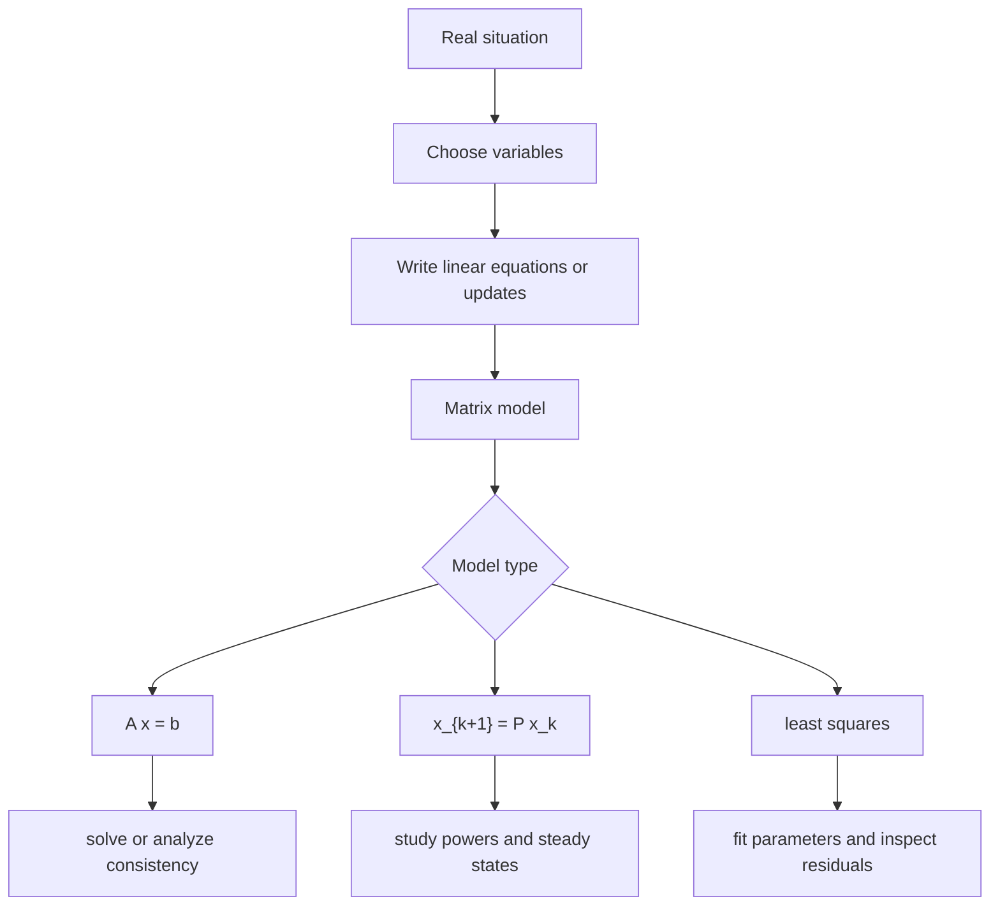

# Applications and Modeling

Linear algebra is a modeling language. A model becomes linear when unknown quantities combine by addition and scalar multiplication: flows through networks, currents in circuits, chemical reaction coefficients, input-output economics, Markov transitions, polynomial interpolation, curve fitting, and data compression.

The common pattern is to translate a real constraint into an equation, collect unknowns in a vector, and let a matrix encode how those unknowns contribute. Once the model is written as $A\mathbf{x}=\mathbf{b}$, $\mathbf{x}_{k+1}=A\mathbf{x}_k$, or an optimization problem such as least squares, the theory of the previous pages becomes usable.

## Definitions

A linear model has unknown vector $\mathbf{x}$ and equations of the form

$$
A\mathbf{x}=\mathbf{b}.
$$

An input-output model divides an economy into sectors. If $C$ is the consumption matrix, then $c_{ij}$ is the amount of sector $i$ output needed to produce one unit of sector $j$ output. If $\mathbf{x}$ is total production and $\mathbf{d}$ is external demand, the accounting equation is

$$
\mathbf{x}=C\mathbf{x}+\mathbf{d},
$$

or

$$
(I-C)\mathbf{x}=\mathbf{d}.
$$

A Markov chain uses a stochastic matrix, whose columns or rows represent transition probabilities depending on convention. A state vector records proportions or probabilities, and repeated multiplication predicts future states.

Polynomial interpolation seeks a polynomial passing exactly through given data points. Least-squares modeling seeks a simpler function that approximates data when exact interpolation is not appropriate.

A network-flow model assigns variables to edges and writes conservation equations at nodes: flow in equals flow out, adjusted for supply or demand.

## Key results

Linear systems model conservation laws. At each node of a flow network, "flow in equals flow out" produces a linear equation. In circuit analysis, Kirchhoff laws produce linear equations for currents or voltage drops.

Leontief solvability: if $I-C$ is invertible, then the production vector satisfying demand is

$$
\mathbf{x}=(I-C)^{-1}\mathbf{d}.
$$

The model is economically meaningful only when the entries of $\mathbf{x}$ are nonnegative and the technical assumptions behind $C$ are reasonable. Linear algebra supplies the solution mechanism; modeling judgment checks whether the solution makes sense.

For a Markov chain with a column-stochastic transition matrix $P$, state updates often take the form

$$
\mathbf{x}_{k+1}=P\mathbf{x}_k.
$$

A steady state satisfies

$$
P\mathbf{x}=\mathbf{x},
$$

so it is an eigenvector for eigenvalue $1$, usually normalized so its entries sum to $1$.

For interpolation with a polynomial

$$
p(x)=a_0+a_1x+\cdots+a_nx^n,
$$

passing through $n+1$ points gives a square linear system in the coefficients. For noisy or overdetermined data, least squares replaces exact fitting by minimizing total squared residual.

## Visual



| Application | Matrix object | Typical question |
|---|---|---|
| Network flow | incidence-style system | which flows satisfy conservation? |
| Leontief economics | $I-C$ | what production meets demand? |
| Markov chains | stochastic matrix $P$ | what happens after many steps? |
| Curve fitting | design matrix $A$ | which parameters best fit data? |
| Data compression | singular values | which low-rank approximation preserves structure? |

## Worked example 1: Leontief input-output model

Problem: an economy has two sectors with consumption matrix

$$
C=
\begin{bmatrix}
0.2&0.1\\
0.3&0.2
\end{bmatrix},
$$

where columns represent production sectors. External demand is

$$
\mathbf{d}=
\begin{bmatrix}
100\\80
\end{bmatrix}.
$$

Find total production $\mathbf{x}$ satisfying $\mathbf{x}=C\mathbf{x}+\mathbf{d}$.

Step 1: form $I-C$.

$$
I-C=
\begin{bmatrix}
1&0\\
0&1
\end{bmatrix}
-
\begin{bmatrix}
0.2&0.1\\
0.3&0.2
\end{bmatrix}
=
\begin{bmatrix}
0.8&-0.1\\
-0.3&0.8
\end{bmatrix}.
$$

Step 2: solve

$$
\begin{bmatrix}
0.8&-0.1\\
-0.3&0.8
\end{bmatrix}
\begin{bmatrix}
x_1\\x_2
\end{bmatrix}
=
\begin{bmatrix}
100\\80
\end{bmatrix}.
$$

Step 3: eliminate decimals by multiplying equations by $10$:

$$
8x_1-x_2=1000,
\qquad
-3x_1+8x_2=800.
$$

From the first equation,

$$
x_2=8x_1-1000.
$$

Substitute into the second:

$$
-3x_1+8(8x_1-1000)=800.
$$

Thus

$$
61x_1-8000=800
\quad\Longrightarrow\quad
61x_1=8800
\quad\Longrightarrow\quad
x_1=\frac{8800}{61}.
$$

Then

$$
x_2=8\cdot\frac{8800}{61}-1000
=
\frac{70400-61000}{61}
=
\frac{9400}{61}.
$$

Checked answer:

$$
\mathbf{x}=
\begin{bmatrix}
8800/61\\
9400/61
\end{bmatrix}
\approx
\begin{bmatrix}
144.26\\154.10
\end{bmatrix}.
$$

Both production levels are positive, so the result is at least numerically plausible.

## Worked example 2: Markov steady state

Problem: a population moves between two states with column-stochastic transition matrix

$$
P=
\begin{bmatrix}
0.7&0.2\\
0.3&0.8
\end{bmatrix}.
$$

Find the steady-state distribution.

Step 1: solve $P\mathbf{x}=\mathbf{x}$, or $(P-I)\mathbf{x}=\mathbf{0}$.

$$
P-I=
\begin{bmatrix}
-0.3&0.2\\
0.3&-0.2
\end{bmatrix}.
$$

The equation is

$$
-0.3x_1+0.2x_2=0.
$$

Step 2: clear decimals:

$$
-3x_1+2x_2=0
\quad\Longrightarrow\quad
2x_2=3x_1
\quad\Longrightarrow\quad
x_2=\frac32x_1.
$$

Step 3: choose a positive vector satisfying this ratio. Let $x_1=2$, so $x_2=3$. Normalize entries to sum to $1$:

$$
\mathbf{x}=
\frac{1}{5}
\begin{bmatrix}
2\\3
\end{bmatrix}
=
\begin{bmatrix}
2/5\\3/5
\end{bmatrix}.
$$

Step 4: check.

$$
P
\begin{bmatrix}
2/5\\3/5
\end{bmatrix}
=
\begin{bmatrix}
0.7(2/5)+0.2(3/5)\\
0.3(2/5)+0.8(3/5)
\end{bmatrix}
=
\begin{bmatrix}
2/5\\3/5
\end{bmatrix}.
$$

Checked answer: the steady state is $\begin{bmatrix}2/5&3/5\end{bmatrix}^T$.

## Code

```python
import numpy as np

C = np.array([[0.2, 0.1],
              [0.3, 0.2]], dtype=float)
d = np.array([100, 80], dtype=float)

x = np.linalg.solve(np.eye(2) - C, d)
print(x)

P = np.array([[0.7, 0.2],
              [0.3, 0.8]], dtype=float)
state = np.array([1.0, 0.0])
for _ in range(30):
    state = P @ state
print(state)
```

The first computation solves a static input-output model. The second repeatedly applies a transition matrix to show convergence toward the steady distribution.

## Common pitfalls

- Building a model before defining variables clearly. A matrix equation is only meaningful when each entry has an interpretation.
- Mixing row-stochastic and column-stochastic Markov conventions.
- Assuming a mathematically valid solution is automatically meaningful in context.
- Forgetting units. A linear equation can be dimensionally wrong even if the algebra works.
- Using exact interpolation for noisy data where least squares is more appropriate.
- Treating model outputs as predictions without checking assumptions, sensitivity, and residuals.

A practical modeling workflow begins before any matrix is written. Name the unknowns, record their units, and decide what each equation represents. After solving, interpret each component of the solution in the original units. This prevents a common failure mode: producing a correct vector for the wrong question.

Linearity is a modeling assumption. It says effects add and scale. If doubling an input does not double its contribution, or if two inputs interact multiplicatively, then a linear model may be an approximation rather than an exact description. Many useful models are linearizations of nonlinear systems near an operating point. The algebra is linear, but the validity of the approximation depends on context.

Sensitivity should be checked whenever data are uncertain. If a small change in demand, transition probabilities, or measurements causes a large change in the output, then the model may be ill-conditioned or near a structural threshold. Linear algebra tools such as condition numbers, eigenvalues, and singular values help diagnose this behavior.

Residuals are part of the model report. For exact conservation systems, a nonzero residual may indicate inconsistent data or an incorrect equation. For least-squares systems, residuals are expected, but their pattern matters. A random-looking residual pattern supports the model more than a systematic pattern does. Thus solving the matrix problem is only one stage of applied linear algebra.

Model validation should include extreme or simple cases. If external demand is zero in a Leontief model, does the predicted production make sense? If a Markov transition matrix is the identity, does the state remain fixed? If every data point lies exactly on a line, does the least-squares fit recover that line with zero residual? These checks catch transposed matrices, wrong stochastic conventions, and misplaced variables.

Many applications also require constraints beyond linear equations. Production cannot be negative, probabilities must sum to one, and physical quantities may have upper bounds. Introductory linear algebra often focuses on solving the equality model first. In practice, the equality solution may need to be combined with inequalities, optimization, or domain-specific feasibility checks.

A matrix model is valuable because it exposes structure. Invertibility asks whether demands determine productions uniquely. Eigenvectors ask which states persist under repeated transitions. Rank asks how many independent constraints or outputs are present. Singular values ask which directions are stable or fragile. The application changes, but the linear algebra questions repeat.

Good models are usually iterative. After solving once, inspect the solution, residuals, and sensitivity. If the output violates known constraints or reacts wildly to small data changes, revise the assumptions or collect better data. Linear algebra gives precise tools for this revision: rank reveals redundancy, least squares handles inconsistency, eigenvalues describe repeated updates, and SVD diagnoses fragile directions.

Documentation is part of modeling. A reader should be able to tell what each variable means, why each equation is linear, what convention is used for rows and columns, and what the answer represents. Without that context, a matrix computation may be correct but unusable.

A model should therefore end with interpretation, not only a vector or matrix printed from software.

The final answer should say what decision, prediction, or constraint the numbers represent.

## Connections

- [Systems of Linear Equations](/math/linear-algebra/systems-of-linear-equations)
- [Eigenvalues and Eigenvectors](/math/linear-algebra/eigenvalues-and-eigenvectors)
- [Least Squares](/math/linear-algebra/least-squares)
- [Singular Value Decomposition](/math/linear-algebra/singular-value-decomposition)
