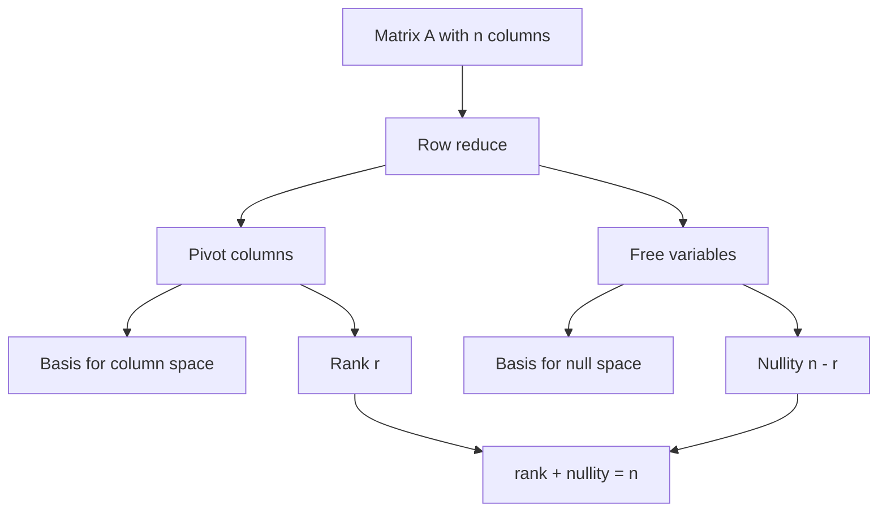

# Bases, Dimension, and Rank

A basis is a coordinate system for a vector space. It is small enough to avoid redundancy and large enough to reach every vector. Rank and nullity measure how a matrix distributes dimensions between outputs it can produce and inputs it sends to zero.


*Figure: Carl Friedrich Gauss is central to number theory, linear algebra, statistics, and numerical methods. Image: [Wikimedia Commons](https://commons.wikimedia.org/wiki/File:Carl_Friedrich_Gauss.jpg), Gottlieb Biermann after Christian Albrecht Jensen, public domain.*

These ideas connect computation with structure. Row reduction finds pivots, pivots identify independent columns, independent columns form bases for column spaces, and free variables describe null spaces. Dimension turns these observations into exact counts rather than vague descriptions.

## Definitions

A basis for a vector space $V$ is a set of vectors that spans $V$ and is linearly independent. If $B=\{\mathbf{v}_1,\ldots,\mathbf{v}_n\}$ is a basis and

$$
\mathbf{x}=c_1\mathbf{v}_1+\cdots+c_n\mathbf{v}_n,
$$

then the coordinate vector of $\mathbf{x}$ relative to $B$ is

$$
[\mathbf{x}]_B=
\begin{bmatrix}
c_1\\
\vdots\\
c_n
\end{bmatrix}.
$$

The dimension of a finite-dimensional vector space is the number of vectors in any basis.

For a matrix $A$, the column space is the span of its columns, the row space is the span of its rows, and the null space is

$$
\operatorname{null}(A)=\{\mathbf{x}:A\mathbf{x}=\mathbf{0}\}.
$$

The rank of $A$ is the dimension of its column space. The nullity of $A$ is the dimension of its null space. Pivot columns are the columns of the original matrix corresponding to leading columns in an echelon form.

## Key results

All bases of a finite-dimensional vector space have the same number of vectors. This makes dimension well-defined. The proof idea is the exchange principle: an independent set cannot contain more vectors than a spanning set, because each independent vector consumes one necessary direction.

For an $m\times n$ matrix $A$,

$$
\operatorname{rank}(A)+\operatorname{nullity}(A)=n.
$$

This is the rank-nullity theorem for matrices. Row reduction proves it: each of the $n$ variables is either a pivot variable or a free variable. Pivot variables count rank; free variables count nullity.

The pivot columns of the original matrix form a basis for the column space. The nonzero rows of an echelon form form a basis for the row space. Row operations preserve row space only up to row-equivalent span, but they do not preserve the original column vectors, so column-space bases must be selected from the original columns.

If $A$ is an $m\times n$ matrix, then

$$
\operatorname{rank}(A)\leq \min(m,n).
$$

The rank is also the dimension of the row space. This equality of row rank and column rank is one of the fundamental structural results of matrix theory.

## Visual



| Object | How to find it | Dimension |
|---|---|---|
| Column space | pivot columns of original $A$ | rank |
| Row space | nonzero rows of echelon form | rank |
| Null space | solve $A\mathbf{x}=\mathbf{0}$ | nullity |
| Basis for $V$ | independent spanning set | $\dim(V)$ |

## Worked example 1: Find bases and rank

Problem: find bases for the column space, row space, and null space of

$$
A=
\begin{bmatrix}
1&2&1&3\\
2&4&0&4\\
1&2&3&5
\end{bmatrix}.
$$

Step 1: row reduce. Subtract $2R_1$ from $R_2$ and $R_1$ from $R_3$:

$$
\begin{bmatrix}
1&2&1&3\\
0&0&-2&-2\\
0&0&2&2
\end{bmatrix}.
$$

Step 2: add $R_2$ to $R_3$ and scale $R_2$ by $-1/2$:

$$
\begin{bmatrix}
1&2&1&3\\
0&0&1&1\\
0&0&0&0
\end{bmatrix}.
$$

Step 3: eliminate above the second pivot:

$$
\begin{bmatrix}
1&2&0&2\\
0&0&1&1\\
0&0&0&0
\end{bmatrix}.
$$

Pivot columns are columns $1$ and $3$. Therefore a basis for the column space is

$$
\left\{
\begin{bmatrix}1\\2\\1\end{bmatrix},
\begin{bmatrix}1\\0\\3\end{bmatrix}
\right\}.
$$

A basis for the row space is given by the nonzero rows:

$$
\{[1\ 2\ 0\ 2],\ [0\ 0\ 1\ 1]\}.
$$

The rank is $2$.

## Worked example 2: Find a null-space basis and verify rank-nullity

Continue with the same matrix. The reduced equations are

$$
x_1+2x_2+2x_4=0,
\qquad
x_3+x_4=0.
$$

Step 1: identify free variables. Columns $2$ and $4$ are non-pivot columns, so set

$$
x_2=s,\qquad x_4=t.
$$

Step 2: solve for pivot variables.

$$
x_1=-2s-2t,
\qquad
x_3=-t.
$$

Step 3: write the general null vector.

$$
\mathbf{x}=
\begin{bmatrix}
-2s-2t\\
s\\
-t\\
t
\end{bmatrix}
=
s\begin{bmatrix}
-2\\1\\0\\0
\end{bmatrix}
+t\begin{bmatrix}
-2\\0\\-1\\1
\end{bmatrix}.
$$

Thus a basis for the null space is

$$
\left\{
\begin{bmatrix}-2\\1\\0\\0\end{bmatrix},
\begin{bmatrix}-2\\0\\-1\\1\end{bmatrix}
\right\}.
$$

Step 4: verify rank-nullity. The matrix has $n=4$ columns, rank $2$, and nullity $2$, so

$$
\operatorname{rank}(A)+\operatorname{nullity}(A)=2+2=4=n.
$$

Checked answer: the dimension count is consistent.

## Code

```python
import sympy as sp

A = sp.Matrix([[1, 2, 1, 3],
               [2, 4, 0, 4],
               [1, 2, 3, 5]])

print(A.rref())
print("rank:", A.rank())
print("columnspace:", A.columnspace())
print("rowspace:", A.rowspace())
print("nullspace:", A.nullspace())
```

SymPy returns exact rational row reduction and exact bases. This is useful for studying rank and nullity because floating-point row reduction can obscure exact dependence.

## Common pitfalls

- Taking pivot columns from the row-reduced matrix as a column-space basis. Use the pivot column positions, but take the columns from the original matrix.
- Confusing rank with the number of rows. Rank counts independent directions, not raw matrix size.
- Forgetting that nullity counts free variables in $A\mathbf{x}=\mathbf{0}$.
- Calling a spanning set a basis before checking independence.
- Assuming the coordinate vector $[\mathbf{x}]_B$ is the same as $\mathbf{x}$. It is the list of coefficients relative to a chosen basis.
- Losing parameters when writing a null-space basis.

A useful basis test has two directions. If a list has exactly $\dim(V)$ vectors, then it is enough to prove either spanning or independence; the other property follows. If the number of vectors is not known to match the dimension, both properties must be checked. In $\mathbb{R}^3$, for example, three independent vectors automatically form a basis, and three spanning vectors are automatically independent. Two vectors cannot span $\mathbb{R}^3$, and four vectors cannot be independent in $\mathbb{R}^3$.

Rank should be read as the number of independent output directions a matrix can produce. Nullity is the number of independent input directions that are lost. Rank-nullity says every input degree of freedom either affects the output or disappears into the null space. This interpretation is often more memorable than the formula alone.

When finding a column-space basis, remember that row operations alter the columns. The reduced matrix is excellent for identifying pivot positions, but the actual basis vectors should be selected from the original matrix. In contrast, row operations replace rows by linear combinations of rows, so the nonzero rows of an echelon form can be used as a row-space basis.

Coordinates relative to a basis are not universal. The same vector can have different coordinate columns in different bases. If $B$ is not the standard basis, the coordinate vector $[\mathbf{x}]_B$ tells how to build $\mathbf{x}$ from the basis vectors in $B$. This is the foundation for change-of-basis matrices and diagonalization.

When a matrix is used as a linear transformation, rank is the dimension of the range. This gives a geometric interpretation to column space: it is the set of all outputs the transformation can produce. Nullity is the dimension of the kernel: it counts independent directions in the input that are sent to zero. The rank-nullity theorem says the domain dimension splits into visible output directions and lost directions.

Basis selection is not unique. A vector space has many possible bases, and a subspace often has many possible basis lists. What is invariant is the number of vectors in any basis. This is why dimension is meaningful even though the basis itself can be chosen for convenience. In computation, one basis may be sparse, another orthogonal, and another adapted to eigenvectors.

A final check on basis answers is reconstruction. If you claim a list spans a space, choose a typical vector in that space and show how it is expressed as a linear combination. If you claim independence, set a general linear combination equal to zero and show every coefficient must vanish. These two tests are the definition, and they remain reliable even when the space consists of polynomials, matrices, or functions.

In applications, rank often measures effective complexity. A data matrix with low rank has columns or rows that are strongly redundant. A transformation with low rank compresses many inputs into a smaller output set. A system whose coefficient matrix has deficient rank may have either no solution or infinitely many solutions, depending on the augmented vector.

Dimension arguments are also useful for impossibility claims. Four vectors in $\mathbb{R}^3$ cannot be independent. Two vectors cannot span $\mathbb{R}^3$. A linear map from $\mathbb{R}^5$ to $\mathbb{R}^3$ cannot be one-to-one. These conclusions follow from dimension before any detailed arithmetic is done.

When stuck, count dimensions first. Dimension counts do not solve every problem, but they often tell you what kind of answer is possible.

Then use row reduction or a spanning argument to find the actual vectors that realize that count.

## Connections

- [Gaussian Elimination](/math/linear-algebra/gaussian-elimination)
- [General Vector Spaces](/math/linear-algebra/vector-spaces)
- [Matrix Inverses and Elementary Matrices](/math/linear-algebra/matrix-inverses-and-elementary-matrices)
- [Linear Transformations](/math/linear-algebra/linear-transformations)
