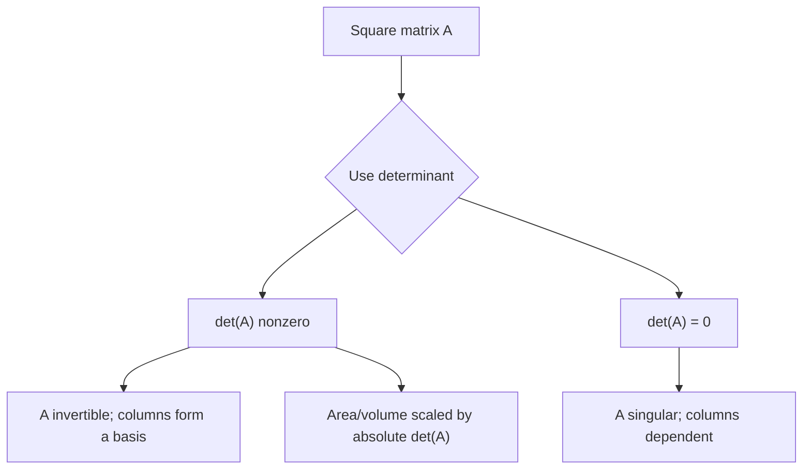

# Determinants

The determinant compresses important information about a square matrix into one scalar. It detects invertibility, gives signed area or volume scaling, changes predictably under row operations, and produces formulas such as Cramer's rule. Determinants are not the preferred way to solve large systems, but they are conceptually central.

A useful way to read $\det(A)$ is as a signed scaling factor. In $\mathbb{R}^2$, the absolute value of the determinant is the area-scaling factor of the linear transformation $\mathbf{x}\mapsto A\mathbf{x}$. In $\mathbb{R}^3$, it is the volume-scaling factor. The sign records whether orientation is preserved or reversed.

## Definitions

For a $2\times2$ matrix,

$$
\det
\begin{bmatrix}
a&b\\
c&d
\end{bmatrix}
=ad-bc.
$$

For an $n\times n$ matrix $A$, the minor $M_{ij}$ is the determinant of the matrix obtained by deleting row $i$ and column $j$. The cofactor is

$$
C_{ij}=(-1)^{i+j}M_{ij}.
$$

Cofactor expansion along row $i$ is

$$
\det(A)=a_{i1}C_{i1}+a_{i2}C_{i2}+\cdots+a_{in}C_{in}.
$$

Expansion along a column is analogous. In practice, cofactor expansion is best used when a row or column has many zeros.

For a triangular matrix, the determinant is the product of diagonal entries:

$$
\det(A)=a_{11}a_{22}\cdots a_{nn}.
$$

This is one reason row reduction is useful for determinant computation.

## Key results

Row operation rules:

| Row operation | Effect on determinant |
|---|---|
| Swap two rows | multiplies determinant by $-1$ |
| Multiply one row by $c$ | multiplies determinant by $c$ |
| Add a multiple of one row to another | determinant unchanged |

These rules let us compute determinants efficiently by reducing to triangular form while tracking changes.

A square matrix $A$ is invertible if and only if

$$
\det(A)\neq0.
$$

If $\det(A)=0$, the linear transformation collapses dimension in some direction: a nonzero vector is sent into dependence with the other transformed basis directions. Algebraically, the columns are linearly dependent and there is no inverse.

The determinant is multiplicative:

$$
\det(AB)=\det(A)\det(B).
$$

It also respects transpose:

$$
\det(A^T)=\det(A).
$$

For an invertible matrix,

$$
\det(A^{-1})=\frac{1}{\det(A)}.
$$

Cramer's rule states that if $A$ is invertible, the solution of $A\mathbf{x}=\mathbf{b}$ has

$$
x_i=\frac{\det(A_i(\mathbf{b}))}{\det(A)},
$$

where $A_i(\mathbf{b})$ is obtained from $A$ by replacing column $i$ with $\mathbf{b}$. This is theoretically useful, though row reduction is usually better computationally.

The geometric interpretation helps organize many determinant rules. In two dimensions, the columns of

$$
A=
\begin{bmatrix}
a&b\\
c&d
\end{bmatrix}
$$

form a parallelogram. Its signed area is $ad-bc$. If the columns are parallel, the parallelogram collapses to zero area, and the determinant is zero. In three dimensions, the columns form a parallelepiped whose signed volume is the determinant. In higher dimensions the same idea continues as signed hypervolume.

This interpretation explains why row replacement leaves the determinant unchanged. Adding a multiple of one edge direction to another shears the parallelogram or parallelepiped without changing its area or volume. Swapping two rows or two columns reverses orientation, so the sign changes. Scaling one row or one column scales the corresponding measurement by the same factor.

Determinants are multilinear in rows and columns. For columns, this means that if one column is a sum, the determinant splits into a sum of determinants, and if one column is scaled, the determinant scales by the same amount. But this does not mean $\det(A+B)=\det(A)+\det(B)$; multilinearity applies one row or column at a time while all the others are fixed.

The determinant also appears in eigenvalue theory. The characteristic equation

$$
\det(A-\lambda I)=0
$$

asks for the values of $\lambda$ that make $A-\lambda I$ singular. Equivalently, it asks when there is a nonzero vector satisfying $A\mathbf{x}=\lambda\mathbf{x}$. Thus the determinant is the gate between invertibility and eigenvectors.

In computation, determinant values can be misleading when matrices are large or ill-conditioned. A determinant may be extremely small or large because it multiplies many scale factors together. For solving systems, rank decisions, or conditioning, factorizations and singular values usually provide more reliable information. Determinants remain invaluable for theory, orientation, exact symbolic work, and low-dimensional calculations.

## Visual

ASCII cofactor expansion along the first row of a $3\times3$ matrix:

```text
| a  b  c |
| d  e  f | = a | e  f | - b | d  f | + c | d  e |
| g  h  i |     | h  i |     | g  i |     | g  h |

sign pattern:
+  -  +
-  +  -
+  -  +
```



## Worked example 1: Compute by cofactor expansion

Problem: compute

$$
\det
\begin{bmatrix}
2&0&1\\
3&-1&4\\
1&2&5
\end{bmatrix}.
$$

Step 1: expand along the first row because it contains a zero.

$$
\det(A)=2C_{11}+0C_{12}+1C_{13}.
$$

Step 2: compute $C_{11}$.

$$
C_{11}=(-1)^{2}
\det
\begin{bmatrix}
-1&4\\
2&5
\end{bmatrix}
=(-1)(5)-4(2)=-5-8=-13.
$$

Step 3: compute $C_{13}$.

$$
C_{13}=(-1)^{4}
\det
\begin{bmatrix}
3&-1\\
1&2
\end{bmatrix}
=3(2)-(-1)(1)=6+1=7.
$$

Step 4: combine.

$$
\det(A)=2(-13)+1(7)=-26+7=-19.
$$

Checked answer: $\det(A)=-19$, so $A$ is invertible.

## Worked example 2: Compute by row reduction

Problem: compute the determinant of

$$
B=
\begin{bmatrix}
1&2&1\\
2&5&3\\
1&0&4
\end{bmatrix}.
$$

Step 1: use row replacement operations, which do not change the determinant.

$$
R_2\leftarrow R_2-2R_1,
\qquad
R_3\leftarrow R_3-R_1.
$$

This gives

$$
\begin{bmatrix}
1&2&1\\
0&1&1\\
0&-2&3
\end{bmatrix}.
$$

Step 2: eliminate below the second pivot with $R_3\leftarrow R_3+2R_2$.

$$
\begin{bmatrix}
1&2&1\\
0&1&1\\
0&0&5
\end{bmatrix}.
$$

Step 3: multiply diagonal entries because the matrix is triangular.

$$
\det(B)=1\cdot1\cdot5=5.
$$

Step 4: check row-operation effects. We used only row replacements, so no sign changes or scaling corrections are needed. The checked answer is $\det(B)=5$.

## Code

```python
import numpy as np

A = np.array([[2, 0, 1],
              [3, -1, 4],
              [1, 2, 5]], dtype=float)
B = np.array([[1, 2, 1],
              [2, 5, 3],
              [1, 0, 4]], dtype=float)

print(round(np.linalg.det(A)))
print(round(np.linalg.det(B)))
print(np.linalg.det(A) != 0)
```

Floating-point determinant calculations can contain small roundoff error, so the example rounds values that are mathematically integers. For exact symbolic determinant work, use rational arithmetic or a computer algebra system.

## Common pitfalls

- Using the $2\times2$ formula on a larger matrix by multiplying only diagonal products.
- Forgetting the alternating cofactor signs.
- Forgetting to track determinant changes caused by row swaps or row scaling.
- Believing row replacement changes the determinant. It does not.
- Treating $\det(A+B)$ as $\det(A)+\det(B)$. Determinants are not additive.
- Using determinants as the main method for solving large systems. Gaussian elimination and factorizations are usually better.

A good determinant computation starts by choosing the method that uses the matrix structure. If a row or column has many zeros, cofactor expansion may be efficient. If the matrix is large and dense, row reduction with determinant bookkeeping is usually better. If the matrix is triangular or block triangular, use the diagonal products immediately. The goal is not to use the definition mechanically; it is to preserve the determinant while simplifying the shape.

Always track row-operation effects in a visible way. One row swap changes the sign. Scaling a row by $c$ scales the determinant by $c$. Row replacement leaves the determinant unchanged. A common safe workflow is to keep a running multiplier outside the matrix, then compute the determinant of the final triangular matrix and apply the multiplier at the end.

The determinant is a yes-or-no invertibility test only through whether it is zero. The size of the determinant by itself can be hard to interpret because it depends on dimension and scaling. A matrix can have a large determinant and still be poorly conditioned, or a small determinant simply because many moderate scale factors were multiplied together. For numerical sensitivity, singular values are more informative.

When using determinants in geometry, remember the sign. The absolute value gives area or volume scaling, but the sign records orientation. A negative determinant in $\mathbb{R}^2$ means the transformation reverses orientation, like a reflection combined with scaling. A positive determinant preserves orientation.

Cofactor expansion is recursive, so its cost grows very quickly. Expanding a $5\times5$ determinant by cofactors requires many $4\times4$ determinants, each of which requires several $3\times3$ determinants. Row reduction is far more efficient for larger matrices because it systematically creates zeros and reaches a triangular determinant.

Column operations obey rules parallel to row operations. Swapping two columns changes the sign, scaling one column scales the determinant, and adding a multiple of one column to another leaves the determinant unchanged. This symmetry is useful because the determinant of $A$ equals the determinant of $A^T$, so row and column viewpoints are interchangeable.

Determinants also detect orientation in change of variables. In multivariable calculus, the absolute value of a Jacobian determinant gives the local area or volume scaling under a coordinate transformation. That use is the continuous analogue of the linear transformation interpretation developed here.

As a final check, a matrix with two equal rows or two equal columns has determinant zero because swapping those rows or columns changes the sign but leaves the matrix unchanged.

## Connections

- [Matrix Inverses and Elementary Matrices](/math/linear-algebra/matrix-inverses-and-elementary-matrices)
- [Gaussian Elimination](/math/linear-algebra/gaussian-elimination)
- [Eigenvalues and Eigenvectors](/math/linear-algebra/eigenvalues-and-eigenvectors)
- [Quadratic Forms and Spectral Theorems](/math/linear-algebra/quadratic-forms-and-spectral-theorems)
