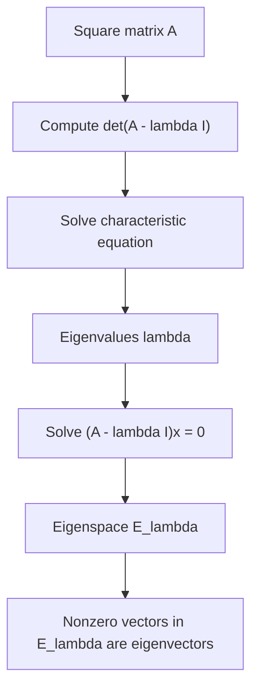

# Eigenvalues and Eigenvectors

Eigenvectors reveal directions that a matrix does not turn. Along those directions, the matrix only stretches, compresses, or reverses orientation. Eigenvalues measure that scalar action. This idea explains long-term dynamics, diagonalization, powers of matrices, differential equations, Markov chains, and spectral geometry.

The definition is simple, but its consequences are broad. Instead of asking how a matrix acts on every vector at once, eigenanalysis looks for special directions where the action is one-dimensional. If enough such directions exist, the matrix can be understood by studying independent scalar multiplications.

## Definitions

Let $A$ be an $n\times n$ matrix. A nonzero vector $\mathbf{x}$ is an eigenvector of $A$ if

$$
A\mathbf{x}=\lambda\mathbf{x}
$$

for some scalar $\lambda$. The scalar $\lambda$ is the corresponding eigenvalue.

Equivalently,

$$
(A-\lambda I)\mathbf{x}=\mathbf{0}.
$$

Thus $\lambda$ is an eigenvalue exactly when $A-\lambda I$ is singular:

$$
\det(A-\lambda I)=0.
$$

The polynomial

$$
p_A(\lambda)=\det(\lambda I-A)
$$

or equivalently $\det(A-\lambda I)$ up to sign, is the characteristic polynomial. The eigenspace for $\lambda$ is

$$
E_\lambda=\operatorname{null}(A-\lambda I).
$$

Because eigenvectors are required to be nonzero, the zero vector is not itself an eigenvector. However, the eigenspace includes the zero vector because it is a subspace.

## Key results

The eigenvalues of $A$ are the roots of the characteristic polynomial. For an $n\times n$ matrix, the characteristic polynomial has degree $n$, though it may have repeated roots or complex roots.

If $A$ is triangular, its eigenvalues are the diagonal entries. This follows because $A-\lambda I$ is triangular, and its determinant is the product of diagonal entries:

$$
\det(A-\lambda I)=
(a_{11}-\lambda)(a_{22}-\lambda)\cdots(a_{nn}-\lambda).
$$

Eigenvectors corresponding to distinct eigenvalues are linearly independent. A proof sketch for two eigenvectors is direct. Suppose $A\mathbf{v}_1=\lambda_1\mathbf{v}_1$ and $A\mathbf{v}_2=\lambda_2\mathbf{v}_2$, with $\lambda_1\neq\lambda_2$. If $c_1\mathbf{v}_1+c_2\mathbf{v}_2=\mathbf{0}$, apply $A$ and compare with multiplying the original equation by $\lambda_2$:

$$
c_1\lambda_1\mathbf{v}_1+c_2\lambda_2\mathbf{v}_2=\mathbf{0},
$$

and

$$
c_1\lambda_2\mathbf{v}_1+c_2\lambda_2\mathbf{v}_2=\mathbf{0}.
$$

Subtracting gives $c_1(\lambda_1-\lambda_2)\mathbf{v}_1=\mathbf{0}$, so $c_1=0$, and then $c_2=0$. The general case is similar.

The determinant and trace encode eigenvalue information. For a $2\times2$ matrix, the characteristic polynomial can be written

$$
\lambda^2-\operatorname{tr}(A)\lambda+\det(A),
$$

so the sum of eigenvalues is the trace and the product is the determinant, counting algebraic multiplicity.

The eigenspace $E_\lambda$ is a subspace because it is the null space of $A-\lambda I$. This matters when solving by hand: after finding an eigenvalue, one should row-reduce $A-\lambda I$ and describe the full solution space, not just one vector. Any nonzero vector in that subspace is an eigenvector, and any scalar multiple represents the same eigendirection.

Eigenvalues can be zero. A zero eigenvalue means there is a nonzero vector $\mathbf{x}$ such that $A\mathbf{x}=\mathbf{0}$. Therefore $A$ has a nontrivial null space and is singular. Conversely, if $A$ is singular, then $\det(A)=0$, so $\lambda=0$ is a root of $\det(A-\lambda I)$ up to sign. This gives a useful bridge between invertibility and spectral information.

Complex eigenvalues also have real consequences. A real $2\times2$ rotation matrix by an angle that is not $0$ or $\pi$ has no real eigenvectors because no real direction is left on its own line. Over the complex numbers it has complex eigenvalues. In applications, complex eigenvalues often indicate rotation or oscillation, while their magnitudes indicate growth or decay.

For repeated eigenvalues, the characteristic polynomial alone does not tell the whole story. If $\lambda$ has algebraic multiplicity $3$, its eigenspace might have dimension $1$, $2$, or $3$. The dimension of the eigenspace determines how many independent eigenvectors are available for diagonalization. Thus the workflow is always: find eigenvalues, then find eigenspaces, then count independent eigenvectors.

In dynamical systems, the absolute values of eigenvalues control long-term behavior when the matrix is diagonalizable or nearly so. Eigenvalues with $\vert \lambda\vert \lt 1$ correspond to decaying modes. Eigenvalues with $\vert \lambda\vert \gt 1$ correspond to growing modes. Eigenvalues with negative sign introduce alternating direction. This modal interpretation is one of the main reasons eigenvectors are more than a calculation exercise.

## Visual



| Object | How it is found | Meaning |
|---|---|---|
| Eigenvalue $\lambda$ | root of $\det(A-\lambda I)=0$ | scalar stretch factor |
| Eigenvector $\mathbf{x}$ | nonzero solution of $(A-\lambda I)\mathbf{x}=0$ | direction preserved by $A$ |
| Eigenspace $E_\lambda$ | null space of $A-\lambda I$ | all vectors stretched by $\lambda$ plus zero |
| Algebraic multiplicity | multiplicity as polynomial root | characteristic-polynomial count |
| Geometric multiplicity | $\dim(E_\lambda)$ | number of independent eigenvectors for $\lambda$ |

## Worked example 1: Find eigenvalues and eigenvectors of a 2 by 2 matrix

Problem: find the eigenvalues and eigenspaces of

$$
A=
\begin{bmatrix}
4&1\\
2&3
\end{bmatrix}.
$$

Step 1: compute the characteristic equation.

$$
A-\lambda I=
\begin{bmatrix}
4-\lambda&1\\
2&3-\lambda
\end{bmatrix}.
$$

Thus

$$
\det(A-\lambda I)
=(4-\lambda)(3-\lambda)-2
=12-7\lambda+\lambda^2-2
=\lambda^2-7\lambda+10.
$$

Step 2: factor.

$$
\lambda^2-7\lambda+10=(\lambda-5)(\lambda-2).
$$

So the eigenvalues are $\lambda=5$ and $\lambda=2$.

Step 3: find $E_5$. Solve $(A-5I)\mathbf{x}=\mathbf{0}$:

$$
\begin{bmatrix}
-1&1\\
2&-2
\end{bmatrix}
\begin{bmatrix}x\\y\end{bmatrix}
=
\begin{bmatrix}0\\0\end{bmatrix}.
$$

The equation is $-x+y=0$, so $y=x$. Therefore

$$
E_5=\operatorname{span}\left\{
\begin{bmatrix}1\\1\end{bmatrix}
\right\}.
$$

Step 4: find $E_2$. Solve $(A-2I)\mathbf{x}=\mathbf{0}$:

$$
\begin{bmatrix}
2&1\\
2&1
\end{bmatrix}
\begin{bmatrix}x\\y\end{bmatrix}
=
\begin{bmatrix}0\\0\end{bmatrix}.
$$

The equation is $2x+y=0$, so $y=-2x$. Therefore

$$
E_2=\operatorname{span}\left\{
\begin{bmatrix}1\\-2\end{bmatrix}
\right\}.
$$

Checked answer: $A\begin{bmatrix}1\\1\end{bmatrix}=\begin{bmatrix}5\\5\end{bmatrix}$ and $A\begin{bmatrix}1\\-2\end{bmatrix}=\begin{bmatrix}2\\-4\end{bmatrix}$.

## Worked example 2: Interpret eigenvectors in a repeated process

Problem: suppose a process updates states by

$$
\mathbf{x}_{k+1}=A\mathbf{x}_k,
\qquad
A=
\begin{bmatrix}
0.8&0.3\\
0.2&0.7
\end{bmatrix}.
$$

Find a steady direction, meaning an eigenvector for $\lambda=1$.

Step 1: solve $(A-I)\mathbf{x}=\mathbf{0}$.

$$
A-I=
\begin{bmatrix}
-0.2&0.3\\
0.2&-0.3
\end{bmatrix}.
$$

The equation is

$$
-0.2x+0.3y=0.
$$

Step 2: clear decimals:

$$
-2x+3y=0
\quad\Longrightarrow\quad
3y=2x
\quad\Longrightarrow\quad
y=\frac23x.
$$

Step 3: choose $x=3$, giving $y=2$. A steady eigenvector is

$$
\mathbf{v}=
\begin{bmatrix}
3\\2
\end{bmatrix}.
$$

Step 4: normalize to a probability vector if desired:

$$
\frac{1}{3+2}
\begin{bmatrix}
3\\2
\end{bmatrix}
=
\begin{bmatrix}
3/5\\2/5
\end{bmatrix}.
$$

Checked answer:

$$
A\begin{bmatrix}3\\2\end{bmatrix}
=
\begin{bmatrix}
0.8(3)+0.3(2)\\
0.2(3)+0.7(2)
\end{bmatrix}
=
\begin{bmatrix}
3\\2
\end{bmatrix}.
$$

The direction is unchanged by the update.

## Code

```python
import numpy as np

A = np.array([[4, 1],
              [2, 3]], dtype=float)

values, vectors = np.linalg.eig(A)
print(values)
print(vectors)

for i, lam in enumerate(values):
    v = vectors[:, i]
    print(np.allclose(A @ v, lam * v))
```

Numerical eigenvectors are usually scaled differently from hand-computed eigenvectors. Any nonzero scalar multiple of an eigenvector is still an eigenvector for the same eigenvalue.

## Common pitfalls

- Allowing the zero vector as an eigenvector. It is in every eigenspace but is not called an eigenvector.
- Solving $\det(A-\lambda I)=0$ and stopping before finding eigenspaces.
- Confusing algebraic multiplicity with geometric multiplicity.
- Assuming every real matrix has real eigenvalues. Some real matrices have complex eigenvalues.
- Forgetting that eigenvectors are directions: scalar multiples represent the same eigendirection.
- Using $\det(\lambda-A)$ instead of $\det(\lambda I-A)$. The identity matrix is required.

A reliable eigenvalue workflow is sequential. First compute the characteristic polynomial carefully. Second solve for candidate eigenvalues. Third, for each eigenvalue, row-reduce $A-\lambda I$ and describe the null space. Fourth, check at least one eigenvector by multiplying $A\mathbf{v}$ and comparing it with $\lambda\mathbf{v}$. Skipping the final check is risky because sign errors in characteristic polynomials are common.

When a problem asks for "the eigenvectors" for an eigenvalue, it usually expects the eigenspace, not just one vector. Since every nonzero scalar multiple is also an eigenvector, listing a single vector without saying "span" hides the full answer. A clean response is

$$
E_\lambda=\operatorname{span}\{\mathbf{v}_1,\ldots,\mathbf{v}_k\}.
$$

Then the eigenvectors are the nonzero vectors in that span.

Repeated eigenvalues require extra care. A repeated root of the characteristic polynomial may produce one independent eigenvector or several. The only way to know is to solve the null-space problem. This distinction controls diagonalization, powers of matrices, and qualitative dynamics.

In applied settings, eigenvectors often represent modes. A mode is a pattern that keeps its shape while its size changes. In a population model, a steady distribution is an eigenvector for eigenvalue $1$. In a vibration model, eigenvectors describe natural shapes of motion. In a data covariance matrix, eigenvectors identify principal directions of variation. The same algebraic equation supports all of these interpretations.

Eigenvalue checks can use determinant and trace for small matrices. For a $2\times2$ matrix, if you find eigenvalues $\lambda_1$ and $\lambda_2$, then their sum should equal the trace and their product should equal the determinant. These checks do not replace the computation, but they are excellent at catching arithmetic errors.

For triangular matrices, do not expand the characteristic determinant unnecessarily. The eigenvalues are already on the diagonal because $A-\lambda I$ remains triangular. This includes diagonal matrices as the simplest case. The eigenspaces still require solving $(A-\lambda I)\mathbf{x}=\mathbf{0}$; only the eigenvalue step is immediate.

If a matrix is symmetric, its eigenvectors have extra structure: eigenvectors from distinct eigenspaces are orthogonal, and an orthonormal eigenbasis exists. That stronger result belongs to the spectral theorem, but it is useful to remember because symmetric eigenvalue problems are common and especially well behaved.

## Connections

- [Determinants](/math/linear-algebra/determinants)
- [Diagonalization and Similarity](/math/linear-algebra/diagonalization-and-similarity)
- [Quadratic Forms and Spectral Theorems](/math/linear-algebra/quadratic-forms-and-spectral-theorems)
- [Applications and Modeling](/math/linear-algebra/applications-and-modeling)
