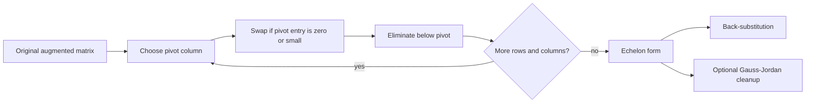

# Gaussian Elimination

Gaussian elimination is the disciplined version of substitution. Instead of solving equations one by one in an ad hoc way, it uses elementary row operations to expose pivots, free variables, contradictions, and back-substitution. The same procedure underlies rank, inverse computation, determinant evaluation, LU factorization, and many numerical solvers.


*Figure: Gaussian elimination uses row operations to expose pivots, rank, and solvability. Image: [Wikimedia Commons](https://commons.wikimedia.org/wiki/File:File_Gaussian_elimination.svg), Akira tanzivana, CC BY-SA 4.0.*

The method matters because it separates the conceptual question from the bookkeeping. Conceptually, we want an equivalent system whose solution set is easier to read. Operationally, we choose pivot positions, clear entries below those pivots, and then solve from the bottom upward. That simple pattern becomes one of the most reusable algorithms in mathematics and scientific computing.

## Definitions

A leading entry of a nonzero row is its first nonzero entry from the left. A matrix is in row echelon form if:

1. all zero rows are below all nonzero rows;
2. each leading entry is to the right of the leading entry in the row above it;
3. all entries below a leading entry are zero.

A matrix is in reduced row echelon form if, additionally, each leading entry is $1$ and is the only nonzero entry in its column.

Pivot columns contain leading entries. Variables corresponding to pivot columns are leading variables; the remaining variables are free variables. Gaussian elimination means reducing to row echelon form and then solving by back-substitution. Gauss-Jordan elimination continues to reduced row echelon form.

For an augmented matrix $[A\mid \mathbf{b}]$, the three elementary row operations are row swaps, nonzero row scaling, and row replacement. Each is reversible, so the new system is equivalent to the original.

The rank of a matrix is the number of pivot columns in its echelon form. For a coefficient matrix $A$ with $n$ columns, the number of free variables in a consistent system is

$$
n-\operatorname{rank}(A).
$$

## Key results

Every matrix is row equivalent to a unique reduced row echelon form. Row echelon forms are not unique because different legal row operations can produce different intermediate triangular forms, but the final reduced form is unique.

The free-variable count for a homogeneous system is

$$
\text{number of free variables}=n-r,
$$

where $n$ is the number of unknowns and $r$ is the number of pivot columns. For homogeneous systems, this is also $n-\operatorname{rank}(A)$.

The solvability criterion is visible in an augmented matrix: a system is inconsistent exactly when row reduction produces a row of the form

$$
\left[
\begin{array}{cccc|c}
0&0&\cdots&0&c
\end{array}
\right],
\qquad c\neq 0.
$$

That row represents the impossible equation $0=c$. Conversely, if no such row occurs, the echelon equations can be solved by assigning arbitrary values to free variables and back-substituting for pivot variables.

Gaussian elimination also explains why triangular systems are easy. If

$$
U\mathbf{x}=\mathbf{c}
$$

has $U$ upper triangular with nonzero diagonal entries, the last equation determines $x_n$, the previous equation determines $x_{n-1}$, and so on. Elimination tries to convert a general system into this triangular form.

## Visual



ASCII view of the target shape:

```text
Before elimination          After forward elimination

*  *  *  * | *              p  *  *  * | *
*  *  *  * | *              0  p  *  * | *
*  *  *  * | *              0  0  p  * | *
*  *  *  * | *              0  0  0  p | *

p = pivot, entries below pivots have been cleared
```

## Worked example 1: Solve by forward elimination

Problem: solve

$$
\begin{aligned}
x+2y-z&=3,\\
2x+5y+z&=12,\\
-x-y+2z&=-1.
\end{aligned}
$$

Step 1: start with the augmented matrix.

$$
\left[
\begin{array}{rrr|r}
1&2&-1&3\\
2&5&1&12\\
-1&-1&2&-1
\end{array}
\right]
$$

Step 2: eliminate below the first pivot using $R_2\leftarrow R_2-2R_1$ and $R_3\leftarrow R_3+R_1$.

$$
\left[
\begin{array}{rrr|r}
1&2&-1&3\\
0&1&3&6\\
0&1&1&2
\end{array}
\right]
$$

Step 3: eliminate below the second pivot using $R_3\leftarrow R_3-R_2$.

$$
\left[
\begin{array}{rrr|r}
1&2&-1&3\\
0&1&3&6\\
0&0&-2&-4
\end{array}
\right]
$$

Step 4: back-substitute. The last row gives $-2z=-4$, so $z=2$. The second row gives

$$
y+3z=6
\quad\Longrightarrow\quad
y+6=6
\quad\Longrightarrow\quad
y=0.
$$

The first row gives

$$
x+2y-z=3
\quad\Longrightarrow\quad
x-2=3
\quad\Longrightarrow\quad
x=5.
$$

Checked answer: $(x,y,z)=(5,0,2)$. Substitution gives $5+0-2=3$, $10+0+2=12$, and $-5+0+4=-1$.

## Worked example 2: Free variable and parametric form

Problem: solve the system represented by

$$
\left[
\begin{array}{rrr|r}
1&0&2&5\\
0&1&-3&-1\\
0&0&0&0
\end{array}
\right].
$$

Step 1: read the equations:

$$
\begin{aligned}
x+2z&=5,\\
y-3z&=-1.
\end{aligned}
$$

Step 2: identify the pivot columns. Columns $1$ and $2$ are pivot columns, so $x$ and $y$ are leading variables. Column $3$ is free, so set $z=t$.

Step 3: solve the pivot equations:

$$
x=5-2t,
\qquad
y=-1+3t,
\qquad
z=t.
$$

Vector form:

$$
\begin{bmatrix}x\\y\\z\end{bmatrix}
=
\begin{bmatrix}5\\-1\\0\end{bmatrix}
+t\begin{bmatrix}-2\\3\\1\end{bmatrix}.
$$

Step 4: check. Substitute into the first equation:

$$
(5-2t)+2t=5.
$$

Substitute into the second:

$$
(-1+3t)-3t=-1.
$$

Both identities hold for every real $t$, so the solution set is a line.

## Code

```python
import numpy as np

def rref(M, tol=1e-12):
    A = M.astype(float).copy()
    rows, cols = A.shape
    pivot_row = 0
    for col in range(cols):
        pivot = pivot_row + np.argmax(np.abs(A[pivot_row:, col]))
        if abs(A[pivot, col]) < tol:
            continue
        A[[pivot_row, pivot]] = A[[pivot, pivot_row]]
        A[pivot_row] = A[pivot_row] / A[pivot_row, col]
        for r in range(rows):
            if r != pivot_row:
                A[r] -= A[r, col] * A[pivot_row]
        pivot_row += 1
        if pivot_row == rows:
            break
    A[np.abs(A) < tol] = 0
    return A

aug = np.array([[1, 2, -1, 3],
                [2, 5, 1, 12],
                [-1, -1, 2, -1]], dtype=float)
print(rref(aug))
```

This toy implementation is useful for study because it exposes the pivot loop. Production numerical linear algebra usually avoids full reduced row echelon form when factorizations such as LU or QR give better stability and speed.

## Common pitfalls

- Normalizing pivots too early and creating fractions that obscure the arithmetic. Forward elimination can often use integer row replacements until back-substitution.
- Forgetting to apply a row operation to the augmented column.
- Assuming echelon form must be unique. Only reduced row echelon form is unique.
- Calling every nonzero entry a pivot. A pivot is a leading entry in a row after the chosen elimination process.
- Treating a free variable as zero unless the problem specifically asks for one particular solution.
- Ignoring row swaps when the current pivot candidate is zero or numerically tiny.

One useful habit is to write the row operation next to the row it changes. This makes the arithmetic auditable. For example, writing $R_3\leftarrow R_3-2R_1$ records both the source row and the target row. If an error appears later, you can recompute that single operation instead of restarting the whole problem. In long reductions, this bookkeeping is often more important than speed.

Another diagnostic is pivot counting. Before solving, count the pivot columns. If a system has three variables but only two pivots and no inconsistency row, the answer must contain one parameter. If your final answer has no parameter, something has been lost. If a homogeneous system in five variables has rank three, its solution set must have two parameters. Rank-nullity gives an immediate consistency check on the shape of the answer.

Gaussian elimination is exact algebra, but numerical elimination requires additional care. In hand work, choosing the first nonzero pivot is fine. In floating-point computation, a very small pivot can magnify roundoff error. This is why numerical algorithms use pivoting strategies, usually swapping a row with a larger entry into the pivot position. The symbolic method and the numerical method share the same structure, but numerical stability affects implementation.

Finally, remember that row reduction changes the rows, not the underlying solution set. It does not preserve the original columns, lengths, angles, or determinant without tracking row-operation effects. This distinction becomes important when using echelon forms to find bases: row-space bases can come from the echelon rows, but column-space bases must use pivot columns from the original matrix.

The choice between echelon form and reduced echelon form depends on the goal. For solving a single system, ordinary echelon form plus back-substitution is usually enough. For reading the full parametric solution directly, reduced echelon form is convenient because each pivot column has zeros above and below its pivot. For computing inverses, Gauss-Jordan reduction to the identity is natural. For numerical solving, full reduction is often unnecessary work.

Elimination also reveals hidden dependence among equations. A zero row in the coefficient part means one equation was a consequence of others, unless the augmented entry creates a contradiction. This is why row reduction can simplify a system without changing its solution set: it separates independent constraints from redundant or inconsistent ones.

In matrix factorization language, each elimination step records a multiplier. Storing those multipliers instead of discarding them leads to LU decomposition. Thus Gaussian elimination is both a classroom solving method and the conceptual source of important computational algorithms.

## Connections

- [Systems of Linear Equations](/math/linear-algebra/systems-of-linear-equations)
- [Matrix Inverses and Elementary Matrices](/math/linear-algebra/matrix-inverses-and-elementary-matrices)
- [Determinants](/math/linear-algebra/determinants)
- [Numerical Linear Algebra](/math/linear-algebra/numerical-linear-algebra)
