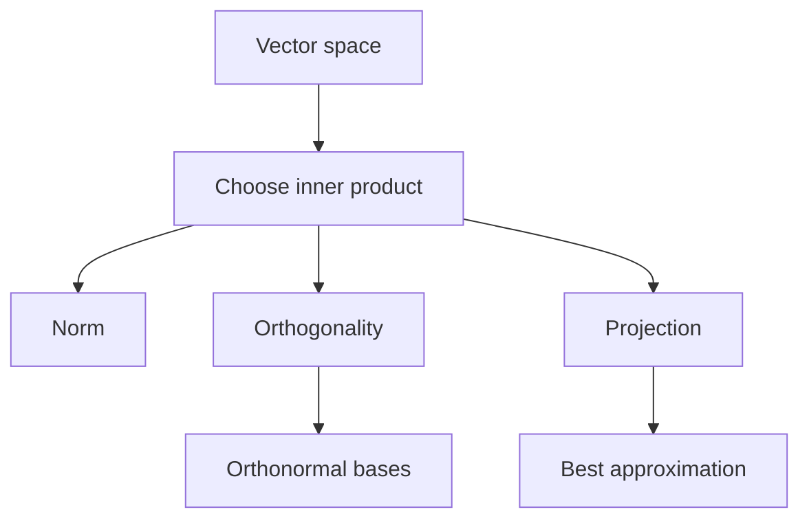

# Inner Product Spaces

An inner product space is a vector space with a generalized dot product. Once an inner product is specified, abstract vectors can have length, angle, distance, projection, and orthogonality. This lets the geometry of $\mathbb{R}^n$ apply to polynomials, functions, matrices, and other vector spaces.

The important shift is that geometry is not tied to columns of numbers. A polynomial can be orthogonal to another polynomial, a function can have a norm, and a matrix can have a length. The inner product is the extra structure that tells us how to measure these objects.

## Definitions

An inner product on a real vector space $V$ assigns a scalar $\langle \mathbf{u},\mathbf{v}\rangle$ to each pair of vectors and satisfies:

1. $\langle \mathbf{u},\mathbf{v}\rangle=\langle \mathbf{v},\mathbf{u}\rangle$.
2. $\langle \mathbf{u}+\mathbf{v},\mathbf{w}\rangle=\langle \mathbf{u},\mathbf{w}\rangle+\langle \mathbf{v},\mathbf{w}\rangle$.
3. $\langle c\mathbf{u},\mathbf{v}\rangle=c\langle \mathbf{u},\mathbf{v}\rangle$.
4. $\langle \mathbf{u},\mathbf{u}\rangle\geq 0$, with equality only for $\mathbf{u}=\mathbf{0}$.

The norm induced by an inner product is

$$
\|\mathbf{v}\|=\sqrt{\langle \mathbf{v},\mathbf{v}\rangle}.
$$

Two vectors are orthogonal if $\langle \mathbf{u},\mathbf{v}\rangle=0$. A set is orthonormal if every vector has norm $1$ and distinct vectors are orthogonal.

For continuous functions on $[a,b]$, a common inner product is

$$
\langle f,g\rangle=\int_a^b f(x)g(x)\,dx.
$$

For matrices of the same size, the Frobenius inner product is

$$
\langle A,B\rangle=\operatorname{tr}(B^TA)=\sum_{i,j}a_{ij}b_{ij}.
$$

## Key results

The Cauchy-Schwarz inequality holds in every real inner product space:

$$
|\langle \mathbf{u},\mathbf{v}\rangle|
\leq
\|\mathbf{u}\|\|\mathbf{v}\|.
$$

This inequality implies the triangle inequality:

$$
\|\mathbf{u}+\mathbf{v}\|\leq \|\mathbf{u}\|+\|\mathbf{v}\|.
$$

It also permits the definition of angle between nonzero vectors by

$$
\cos\theta=
\frac{\langle \mathbf{u},\mathbf{v}\rangle}
{\|\mathbf{u}\|\|\mathbf{v}\|}.
$$

The projection of $\mathbf{v}$ onto a nonzero vector $\mathbf{u}$ is

$$
\operatorname{proj}_{\mathbf{u}}(\mathbf{v})
=
\frac{\langle \mathbf{v},\mathbf{u}\rangle}
{\langle \mathbf{u},\mathbf{u}\rangle}\mathbf{u}.
$$

If $\{\mathbf{q}_1,\ldots,\mathbf{q}_k\}$ is an orthonormal set, then the projection of $\mathbf{v}$ onto its span is

$$
\operatorname{proj}_W(\mathbf{v})
=
\langle \mathbf{v},\mathbf{q}_1\rangle\mathbf{q}_1+\cdots+
\langle \mathbf{v},\mathbf{q}_k\rangle\mathbf{q}_k.
$$

The best approximation theorem says that this projection is the unique vector in $W$ closest to $\mathbf{v}$, and the error $\mathbf{v}-\operatorname{proj}_W(\mathbf{v})$ is orthogonal to $W$.

The same vector space can carry different inner products, and changing the inner product changes the geometry. On $C[a,b]$, for example, the ordinary integral inner product treats all parts of the interval equally. A weighted inner product

$$
\langle f,g\rangle=\int_a^b f(x)g(x)w(x)\,dx
$$

with $w(x)\gt 0$ emphasizes regions where the weight is large. Orthogonality, projection, and best approximation are then measured with respect to that weighted notion of size. This is not merely a technical detail: many families of orthogonal polynomials arise from different choices of interval and weight.

In any inner product space, the polarization idea says that the inner product is encoded by the norm. For real inner product spaces,

$$
\langle \mathbf{u},\mathbf{v}\rangle
=
\frac14\left(\|\mathbf{u}+\mathbf{v}\|^2-\|\mathbf{u}-\mathbf{v}\|^2\right).
$$

So once the inner product is chosen, lengths determine angles; and once lengths and angles are known, projection and approximation follow. This is why inner products are the correct abstraction for Euclidean geometry.

Orthogonal sets behave especially well. If $\mathbf{v}_1,\ldots,\mathbf{v}_k$ are nonzero and mutually orthogonal, then they are linearly independent. Suppose

$$
c_1\mathbf{v}_1+\cdots+c_k\mathbf{v}_k=\mathbf{0}.
$$

Taking the inner product with $\mathbf{v}_j$ gives

$$
c_j\langle \mathbf{v}_j,\mathbf{v}_j\rangle=0.
$$

Because $\mathbf{v}_j\neq\mathbf{0}$, the factor $\langle \mathbf{v}_j,\mathbf{v}_j\rangle$ is positive, so $c_j=0$. This argument works for every $j$.

For an orthonormal basis, coordinates are inner products. If $B=\{\mathbf{q}_1,\ldots,\mathbf{q}_n\}$ is an orthonormal basis, then every vector has the expansion

$$
\mathbf{v}=\langle \mathbf{v},\mathbf{q}_1\rangle\mathbf{q}_1+\cdots+\langle \mathbf{v},\mathbf{q}_n\rangle\mathbf{q}_n.
$$

This is the abstract version of resolving a vector into perpendicular coordinate axes. Fourier series use the same principle in infinite-dimensional function spaces: coefficients are inner products with orthogonal basis functions.

## Visual

| Space | Vectors look like | Example inner product | Norm |
|---|---|---|---|
| $\mathbb{R}^n$ | columns | $\mathbf{u}^T\mathbf{v}$ | Euclidean length |
| $P_n$ | polynomials | $\int_a^b p(x)q(x)\,dx$ | root mean-square style length |
| $C[a,b]$ | functions | $\int_a^b f(x)g(x)\,dx$ | function energy |
| $M_{m,n}$ | matrices | $\operatorname{tr}(B^TA)$ | Frobenius norm |



## Worked example 1: Orthogonal polynomials on an interval

Problem: in $P_2$ with

$$
\langle f,g\rangle=\int_{-1}^{1}f(x)g(x)\,dx,
$$

show that $1$ and $x$ are orthogonal, and compute $\|x\|$.

Step 1: compute the inner product.

$$
\langle 1,x\rangle
=
\int_{-1}^{1}1\cdot x\,dx
=
\left[\frac{x^2}{2}\right]_{-1}^{1}
=
\frac12-\frac12=0.
$$

Thus $1$ and $x$ are orthogonal.

Step 2: compute the norm of $x$.

$$
\|x\|=\sqrt{\langle x,x\rangle}
=
\sqrt{\int_{-1}^{1}x^2\,dx}.
$$

Step 3: evaluate the integral.

$$
\int_{-1}^{1}x^2\,dx
=
\left[\frac{x^3}{3}\right]_{-1}^{1}
=
\frac13-\left(-\frac13\right)
=\frac23.
$$

Therefore

$$
\|x\|=\sqrt{\frac23}.
$$

Checked answer: $\langle 1,x\rangle=0$ and $\|x\|=\sqrt{2/3}$.

## Worked example 2: Project a polynomial onto a subspace

Problem: project $f(x)=x^2$ onto the subspace $W=\operatorname{span}\{1\}$ in $P_2$ using the inner product

$$
\langle f,g\rangle=\int_{-1}^{1}f(x)g(x)\,dx.
$$

Step 1: use the projection formula onto the nonzero vector $1$:

$$
\operatorname{proj}_W(f)
=
\frac{\langle x^2,1\rangle}{\langle 1,1\rangle}\cdot 1.
$$

Step 2: compute the numerator.

$$
\langle x^2,1\rangle
=
\int_{-1}^{1}x^2\,dx
=
\frac23.
$$

Step 3: compute the denominator.

$$
\langle 1,1\rangle
=
\int_{-1}^{1}1\,dx
=2.
$$

Step 4: combine.

$$
\operatorname{proj}_W(x^2)
=
\frac{2/3}{2}\cdot1
=
\frac13.
$$

Step 5: check orthogonality of the error.

$$
\langle x^2-\frac13,1\rangle
=
\int_{-1}^{1}\left(x^2-\frac13\right)\,dx
=
\frac23-\frac23=0.
$$

Checked answer: the best constant approximation to $x^2$ on $[-1,1]$ in this inner product is $1/3$.

## Code

```python
import sympy as sp

x = sp.symbols("x")

def inner(f, g):
    return sp.integrate(f * g, (x, -1, 1))

f = x**2
basis_vector = 1
projection = inner(f, basis_vector) / inner(basis_vector, basis_vector) * basis_vector
error = f - projection

print(sp.simplify(projection))
print(sp.simplify(inner(error, basis_vector)))
print(sp.sqrt(inner(x, x)))
```

The function `inner` encodes the chosen geometry. Changing the interval or adding a weight function changes lengths, angles, and projections.

## Common pitfalls

- Assuming there is only one possible inner product on a vector space.
- Forgetting positive definiteness: $\langle \mathbf{v},\mathbf{v}\rangle$ must be positive for every nonzero vector.
- Treating orthogonality of functions as pointwise perpendicularity. It means the integral of the product is zero.
- Using projection formulas without the denominator $\langle \mathbf{u},\mathbf{u}\rangle$.
- Calling an orthogonal set orthonormal before normalizing each vector to length $1$.
- Assuming a formula from $\mathbb{R}^n$ applies to functions without replacing dot products by the chosen inner product.

A good way to test whether a proposed formula is an inner product is to check the axioms with generic vectors, not only examples. Symmetry and linearity are usually straightforward. Positive definiteness is often the subtle part: one must prove that $\langle \mathbf{v},\mathbf{v}\rangle=0$ forces $\mathbf{v}=\mathbf{0}$. For function spaces, this may require knowing whether functions are continuous or whether equality is understood pointwise or almost everywhere.

Projection in an inner product space should always be followed by an orthogonality check. If $\mathbf{p}$ is claimed to be the projection of $\mathbf{v}$ onto a subspace $W$, then $\mathbf{v}-\mathbf{p}$ should be orthogonal to every vector in $W$. When $W$ has a basis, it is enough to test the basis vectors. This is the abstract version of checking residuals in least squares.

The choice of inner product can change what "best" means. The constant function that best approximates $x^2$ on $[-1,1]$ under the ordinary integral inner product is its average value over that interval. With a weighted inner product, the best constant would emphasize some parts of the interval more than others. Thus approximation results are always relative to the chosen geometry.

In complex vector spaces, the inner product axioms are adjusted with conjugation: symmetry becomes conjugate symmetry, and linearity is usually placed in one argument with conjugate linearity in the other. This page uses real inner products, but the complex convention is essential in Fourier analysis, quantum mechanics, and many numerical algorithms.

Finite-dimensional inner product spaces are especially close to $\mathbb{R}^n$ once an orthonormal basis is chosen. The coordinates of a vector in that basis behave exactly like ordinary Euclidean coordinates, and the inner product becomes a dot product of coordinate vectors. This is why orthonormal bases are so valuable: they convert abstract geometry into familiar arithmetic.

For function spaces, orthogonality often expresses cancellation rather than pointwise separation. The functions $1$ and $x$ on $[-1,1]$ are orthogonal because the positive area on one side cancels the negative area on the other side in the integral of their product. They are not perpendicular at each point. This integral viewpoint is essential for Fourier series and polynomial approximation.

Norms induced by inner products obey the parallelogram law:

$$
\|\mathbf{u}+\mathbf{v}\|^2+\|\mathbf{u}-\mathbf{v}\|^2
=
2\|\mathbf{u}\|^2+2\|\mathbf{v}\|^2.
$$

Not every norm comes from an inner product. This identity is one way to recognize the special geometry inner products provide.

Inner product spaces are the natural setting for approximation because "closest" requires a notion of distance. Without an inner product or at least a norm, the phrase "best approximation" is incomplete. Once an inner product is chosen, projection gives a precise and computable answer.

This is also why orthogonality is more than a visual idea. In polynomial and function spaces, perpendicularity means zero inner product, often an integral cancellation. The same projection theorem that works for arrows then supports Fourier coefficients, least-squares fits, and orthogonal polynomial expansions.

## Connections

- [Orthogonality in Rn](/math/linear-algebra/orthogonality-in-rn)
- [Orthogonality, Gram-Schmidt, and QR](/math/linear-algebra/orthogonality-qr-gram-schmidt)
- [Least Squares](/math/linear-algebra/least-squares)
- [General Vector Spaces](/math/linear-algebra/vector-spaces)
