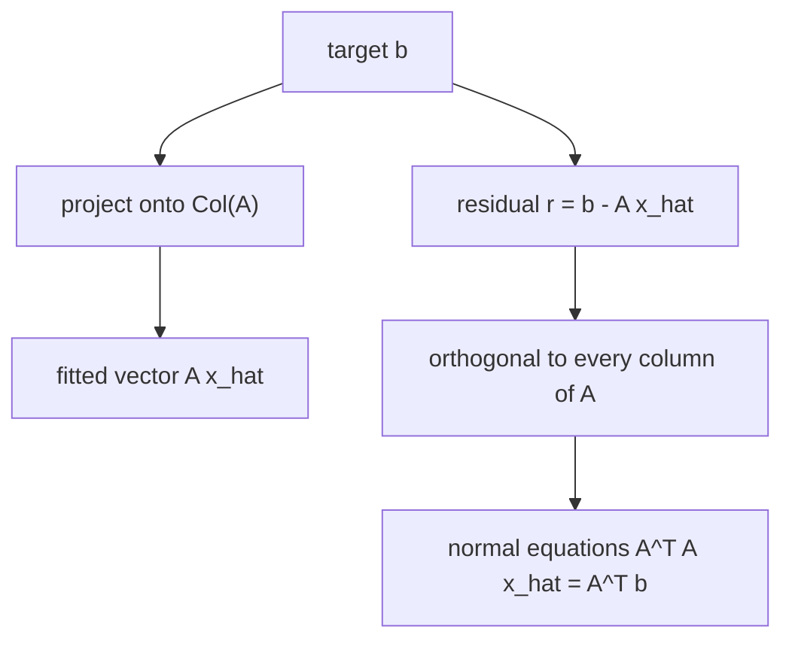

# Least Squares

Least squares solves inconsistent systems by changing the goal. If $A\mathbf{x}=\mathbf{b}$ has no exact solution, choose $\hat{\mathbf{x}}$ so that $A\hat{\mathbf{x}}$ is as close as possible to $\mathbf{b}$. Geometrically, this means projecting $\mathbf{b}$ onto the column space of $A$.

This is one of the most important applied ideas in linear algebra. Data rarely fit a model perfectly. Least squares gives a principled way to choose the model parameters whose predictions have the smallest Euclidean error. It is the algebraic foundation of linear regression, curve fitting, signal approximation, and many inverse problems.

## Definitions

For an $m\times n$ matrix $A$ and vector $\mathbf{b}\in\mathbb{R}^m$, a least-squares solution is a vector $\hat{\mathbf{x}}$ minimizing

$$
\|A\mathbf{x}-\mathbf{b}\|.
$$

The residual is

$$
\mathbf{r}=\mathbf{b}-A\hat{\mathbf{x}}.
$$

The normal equations are

$$
A^TA\hat{\mathbf{x}}=A^T\mathbf{b}.
$$

If the columns of $A$ are linearly independent, then $A^TA$ is invertible and the least-squares solution is unique:

$$
\hat{\mathbf{x}}=(A^TA)^{-1}A^T\mathbf{b}.
$$

The fitted vector is $\hat{\mathbf{b}}=A\hat{\mathbf{x}}$, which lies in the column space of $A$. The residual is the part of $\mathbf{b}$ that the model cannot explain.

## Key results

Projection theorem: if $W$ is a finite-dimensional subspace of an inner product space and $\mathbf{b}$ is any vector, then there is a unique vector $\mathbf{p}\in W$ closest to $\mathbf{b}$. The error $\mathbf{b}-\mathbf{p}$ is orthogonal to $W$.

Least-squares theorem: $\hat{\mathbf{x}}$ minimizes $\|A\mathbf{x}-\mathbf{b}\|$ if and only if the residual is orthogonal to every column of $A$. In matrix form:

$$
A^T(\mathbf{b}-A\hat{\mathbf{x}})=\mathbf{0}.
$$

Rearranging gives the normal equations:

$$
A^TA\hat{\mathbf{x}}=A^T\mathbf{b}.
$$

If the columns of $A$ are independent, $A^TA$ is invertible. To see why, suppose $A^TA\mathbf{x}=\mathbf{0}$. Then

$$
\mathbf{x}^TA^TA\mathbf{x}=\|A\mathbf{x}\|^2=0,
$$

so $A\mathbf{x}=\mathbf{0}$. Independent columns imply $\mathbf{x}=\mathbf{0}$, so $A^TA$ has a trivial null space and is invertible.

Least squares can also be solved by QR. If $A=QR$ with independent columns, then the normal equations reduce to

$$
R\hat{\mathbf{x}}=Q^T\mathbf{b},
$$

which avoids squaring the condition number as the normal equations do.

The phrase "least squares" comes from minimizing the square of the residual norm:

$$
\|A\mathbf{x}-\mathbf{b}\|^2.
$$

Minimizing the norm or its square gives the same $\hat{\mathbf{x}}$, but the squared expression is easier to differentiate. Expanding gives

$$
(A\mathbf{x}-\mathbf{b})^T(A\mathbf{x}-\mathbf{b})
=
\mathbf{x}^TA^TA\mathbf{x}-2\mathbf{x}^TA^T\mathbf{b}+\mathbf{b}^T\mathbf{b}.
$$

Taking the gradient with respect to $\mathbf{x}$ gives

$$
2A^TA\mathbf{x}-2A^T\mathbf{b},
$$

and setting this equal to zero gives the normal equations. This calculus derivation and the projection derivation reach the same condition: the error must be perpendicular to the model space.

In data fitting, the columns of $A$ are often called features or basis functions evaluated at the data points. For a line $y=c+mx$, the first column is all ones because the intercept contributes $c$ to every predicted value, and the second column stores the input values because the slope contributes $mx_i$. For a quadratic model $y=a+bx+cx^2$, the design matrix has columns $1$, $x$, and $x^2$.

Residual analysis is part of the method. A small residual norm means the fitted values are close to the observed values in aggregate, but it does not prove the model is appropriate. If residuals show a pattern, such as all positive values at small $x$ and all negative values at large $x$, then the model may be structurally wrong even if the least-squares calculation was correct.

Rank deficiency changes the solution story. If the columns of $A$ are dependent, there may be infinitely many parameter vectors that give the same fitted vector. The fitted vector in the column space is still unique, but the coefficient vector may not be. The SVD and pseudoinverse are the standard tools for choosing the minimum-norm least-squares solution in that case.

## Visual



| Method | Equation solved | Strength | Caution |
|---|---|---|---|
| Normal equations | $A^TA\hat{x}=A^Tb$ | simple derivation | can amplify conditioning issues |
| QR | $R\hat{x}=Q^Tb$ | stable and efficient | requires factorization |
| SVD | uses singular values | best for rank-deficient problems | more expensive |

## Worked example 1: Solve a least-squares system

Problem: find the least-squares solution of

$$
\begin{bmatrix}
1&1\\
1&2\\
1&3
\end{bmatrix}
\begin{bmatrix}
c\\m
\end{bmatrix}
\approx
\begin{bmatrix}
1\\2\\2
\end{bmatrix}.
$$

This fits a line $y=c+mx$ to the points $(1,1)$, $(2,2)$, and $(3,2)$.

Step 1: compute $A^TA$.

$$
A^TA=
\begin{bmatrix}
1&1&1\\
1&2&3
\end{bmatrix}
\begin{bmatrix}
1&1\\
1&2\\
1&3
\end{bmatrix}
=
\begin{bmatrix}
3&6\\
6&14
\end{bmatrix}.
$$

Step 2: compute $A^T\mathbf{b}$.

$$
A^T\mathbf{b}
=
\begin{bmatrix}
1&1&1\\
1&2&3
\end{bmatrix}
\begin{bmatrix}
1\\2\\2
\end{bmatrix}
=
\begin{bmatrix}
5\\11
\end{bmatrix}.
$$

Step 3: solve

$$
\begin{bmatrix}
3&6\\
6&14
\end{bmatrix}
\begin{bmatrix}
c\\m
\end{bmatrix}
=
\begin{bmatrix}
5\\11
\end{bmatrix}.
$$

The equations are

$$
3c+6m=5,
\qquad
6c+14m=11.
$$

Double the first equation:

$$
6c+12m=10.
$$

Subtract from the second:

$$
2m=1
\quad\Longrightarrow\quad
m=\frac12.
$$

Then

$$
3c+3=5
\quad\Longrightarrow\quad
c=\frac23.
$$

Checked answer: the least-squares line is

$$
y=\frac23+\frac12x.
$$

## Worked example 2: Check residual orthogonality

Use the fitted line from the previous example.

Step 1: compute the fitted vector.

$$
A\hat{\mathbf{x}}
=
\begin{bmatrix}
1&1\\
1&2\\
1&3
\end{bmatrix}
\begin{bmatrix}
2/3\\1/2
\end{bmatrix}
=
\begin{bmatrix}
7/6\\
5/3\\
13/6
\end{bmatrix}.
$$

Step 2: compute the residual.

$$
\mathbf{r}
=
\mathbf{b}-A\hat{\mathbf{x}}
=
\begin{bmatrix}
1\\2\\2
\end{bmatrix}
-
\begin{bmatrix}
7/6\\5/3\\13/6
\end{bmatrix}
=
\begin{bmatrix}
-1/6\\1/3\\-1/6
\end{bmatrix}.
$$

Step 3: dot the residual with each column of $A$. The first column is $\begin{bmatrix}1&1&1\end{bmatrix}^T$:

$$
-\frac16+\frac13-\frac16=0.
$$

The second column is $\begin{bmatrix}1&2&3\end{bmatrix}^T$:

$$
-\frac16+2\left(\frac13\right)+3\left(-\frac16\right)
=
-\frac16+\frac46-\frac36=0.
$$

Checked answer: the residual is orthogonal to the column space, confirming the least-squares condition.

## Code

```python
import numpy as np

x_data = np.array([1, 2, 3], dtype=float)
y_data = np.array([1, 2, 2], dtype=float)

A = np.column_stack([np.ones_like(x_data), x_data])
coef, residuals, rank, s = np.linalg.lstsq(A, y_data, rcond=None)

print(coef)          # intercept, slope
print(A @ coef)      # fitted values
print(y_data - A @ coef)
print(A.T @ (y_data - A @ coef))
```

The last line checks the normal-equation condition $A^T\mathbf{r}=0$. In practical regression, one should also inspect residual patterns, not only minimize their squared length.

## Common pitfalls

- Trying to solve an inconsistent system exactly instead of minimizing the residual.
- Forgetting that the residual is $\mathbf{b}-A\hat{\mathbf{x}}$, not $A\hat{\mathbf{x}}-\mathbf{b}$; the norm is the same, but orthogonality formulas should be used consistently.
- Assuming $A^TA$ is always invertible. It requires independent columns.
- Forming normal equations blindly for ill-conditioned data.
- Confusing the fitted vector $A\hat{\mathbf{x}}$ with the parameter vector $\hat{\mathbf{x}}$.
- Reading least squares as minimizing absolute errors. It minimizes the sum of squared errors, equivalently the Euclidean norm.

A dependable least-squares solution should pass three checks. First, the dimensions must match: $A\hat{\mathbf{x}}$ must live in the same space as $\mathbf{b}$. Second, the residual should be orthogonal to the columns of $A$, so $A^T(\mathbf{b}-A\hat{\mathbf{x}})$ should be zero in exact arithmetic. Third, the fitted vector should lie in the column space of $A$ because it is a linear combination of the columns.

Normal equations are attractive because they produce a square system, but they can be numerically fragile. The matrix $A^TA$ can be much more ill-conditioned than $A$. This is why serious numerical least squares often uses QR or SVD. The normal equations are still valuable for theory and for small exact problems, but they should not be treated as the only method.

Interpretation matters as much as computation. A least-squares line gives the best line within the chosen model class, not proof that the relationship is linear. Residual plots, units, outliers, and domain knowledge should be checked. Linear algebra can identify the best parameters for a model; it cannot decide by itself whether the model is scientifically appropriate.

If a design matrix has dependent columns, some parameters are not separately identifiable. For instance, if one feature column is twice another, many coefficient pairs can produce the same fitted values. In that case the prediction may be unique while the coefficients are not. The pseudoinverse resolves this by selecting the minimum-norm solution, but the modeling issue remains.

Least-squares problems can be weighted. If some measurements are more reliable than others, one may minimize

$$
\|W(A\mathbf{x}-\mathbf{b})\|^2
$$

where $W$ is a diagonal matrix of weights. Larger weights penalize errors more strongly. This changes the geometry: the best approximation is no longer measured by the ordinary Euclidean length of the residual, but by a weighted length chosen to match the data assumptions.

The normal-equation matrix $A^TA$ is symmetric and positive semidefinite. It is positive definite exactly when the columns of $A$ are independent. This connects least squares to quadratic forms: minimizing $\|A\mathbf{x}-\mathbf{b}\|^2$ means minimizing a quadratic function of the parameters. The minimum is unique precisely when that quadratic curves upward in every parameter direction.

In regression language, adding a column to $A$ expands the model space. The residual norm cannot increase when the model space gets larger, because the old fitted vector is still available. But a smaller training residual does not automatically mean a better model; extra columns can fit noise. That modeling issue sits beyond the linear algebra calculation but depends on understanding column spaces.

## Connections

- [Orthogonality in Rn](/math/linear-algebra/orthogonality-in-rn)
- [Orthogonality, Gram-Schmidt, and QR](/math/linear-algebra/orthogonality-qr-gram-schmidt)
- [Singular Value Decomposition](/math/linear-algebra/singular-value-decomposition)
- [Applications and Modeling](/math/linear-algebra/applications-and-modeling)
