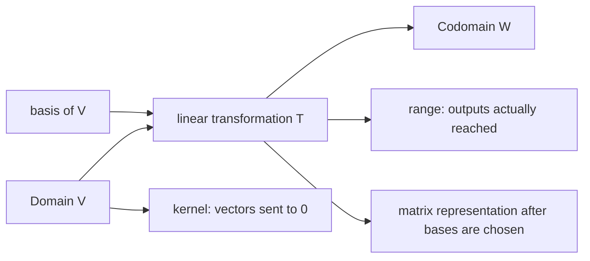

# Linear Transformations

Linear transformations are the function version of matrices. They preserve addition and scalar multiplication, so they preserve linear structure: lines through the origin, spans, subspaces, dependence relations, and coordinates. Matrices are concrete representations of linear transformations after bases are chosen.


*Figure: Matrix multiplication can be read geometrically as a transformation of vectors. Image: [Wikimedia Commons](https://commons.wikimedia.org/wiki/File:Matrix_multiplication.svg), Jakob.scholbach and Pbroks13, CC BY-SA 3.0.*

This page ties together two viewpoints. A matrix can be read as an array of numbers, but it is often better read as an action on vectors. Conversely, an abstract linear function becomes computable once bases are chosen, because its behavior on a basis determines its behavior everywhere.

## Definitions

A function $T:V\to W$ between vector spaces is linear if

$$
T(\mathbf{u}+\mathbf{v})=T(\mathbf{u})+T(\mathbf{v})
$$

and

$$
T(c\mathbf{u})=cT(\mathbf{u})
$$

for all vectors and scalars. Equivalently,

$$
T(c_1\mathbf{v}_1+\cdots+c_k\mathbf{v}_k)
=
c_1T(\mathbf{v}_1)+\cdots+c_kT(\mathbf{v}_k).
$$

The kernel and range are

$$
\ker(T)=\{\mathbf{v}:T(\mathbf{v})=\mathbf{0}\},
\qquad
\operatorname{range}(T)=\{T(\mathbf{v}):\mathbf{v}\in V\}.
$$

A transformation is one-to-one if distinct inputs give distinct outputs. It is onto if its range is the whole codomain.

If $T:\mathbb{R}^n\to\mathbb{R}^m$ is linear, then there is an $m\times n$ standard matrix $A$ such that

$$
T(\mathbf{x})=A\mathbf{x}.
$$

The columns of $A$ are the images of the standard basis vectors:

$$
A=
\begin{bmatrix}
T(\mathbf{e}_1)&T(\mathbf{e}_2)&\cdots&T(\mathbf{e}_n)
\end{bmatrix}.
$$

## Key results

A linear transformation is determined by its values on a basis. If $B=\{\mathbf{v}_1,\ldots,\mathbf{v}_n\}$ is a basis for $V$ and the values $T(\mathbf{v}_i)$ are known, then for any

$$
\mathbf{x}=c_1\mathbf{v}_1+\cdots+c_n\mathbf{v}_n,
$$

linearity forces

$$
T(\mathbf{x})=c_1T(\mathbf{v}_1)+\cdots+c_nT(\mathbf{v}_n).
$$

The kernel of a linear transformation is a subspace of the domain, and the range is a subspace of the codomain. The proof is a closure check. For the kernel, if $T(\mathbf{u})=\mathbf{0}$ and $T(\mathbf{v})=\mathbf{0}$, then

$$
T(\mathbf{u}+\mathbf{v})=\mathbf{0},
\qquad
T(c\mathbf{u})=\mathbf{0}.
$$

For finite-dimensional spaces, the rank-nullity theorem says

$$
\dim(\ker T)+\dim(\operatorname{range} T)=\dim(V).
$$

For a matrix transformation $T(\mathbf{x})=A\mathbf{x}$, this is the same as

$$
\operatorname{nullity}(A)+\operatorname{rank}(A)=n.
$$

A linear transformation is one-to-one exactly when its kernel contains only the zero vector. It is onto exactly when its range equals the codomain. For $T:\mathbb{R}^n\to\mathbb{R}^m$, onto means the columns of the standard matrix span $\mathbb{R}^m$.

Composition of linear transformations corresponds to matrix multiplication. If $S(\mathbf{x})=B\mathbf{x}$ and $T(\mathbf{y})=A\mathbf{y}$, then

$$
(T\circ S)(\mathbf{x})=A(B\mathbf{x})=(AB)\mathbf{x}.
$$

Linearity can be checked with one combined condition:

$$
T(c\mathbf{u}+d\mathbf{v})=cT(\mathbf{u})+dT(\mathbf{v})
$$

for all vectors $\mathbf{u},\mathbf{v}$ and scalars $c,d$. This single condition includes both additivity and scalar compatibility. It is often the fastest way to disprove linearity: find one input combination for which the equality fails.

The zero vector test is necessary but not sufficient. Every linear transformation must satisfy $T(\mathbf{0})=\mathbf{0}$ because

$$
T(\mathbf{0})=T(0\mathbf{v})=0T(\mathbf{v})=\mathbf{0}.
$$

So a function such as $T(x)=x+1$ is immediately not linear. However, passing the zero test does not prove linearity; a nonlinear function such as $T(x)=x^2$ also sends $0$ to $0$ but fails additivity.

Matrix representations depend on bases. The standard matrix is used when the standard bases are understood in both domain and codomain. If different bases are chosen, the same transformation may have a different representing matrix. This is not a contradiction. It is the same geometric or algebraic action described in different coordinate languages. Similar matrices arise when the domain and codomain are the same space and the basis is changed.

The kernel measures information lost by the transformation. If two inputs differ by a kernel vector, then they have the same output:

$$
T(\mathbf{u}+\mathbf{k})=T(\mathbf{u})+T(\mathbf{k})=T(\mathbf{u}).
$$

Thus a nontrivial kernel prevents one-to-one behavior. The range measures which outputs are possible. If the range is smaller than the codomain, then some requested outputs cannot be reached no matter what input is chosen.

Geometrically, common linear transformations include rotations, reflections, projections, shears, and scalings. Projections have nontrivial kernels because they collapse directions perpendicular to the target subspace. Rotations in $\mathbb{R}^2$ are one-to-one and onto because they preserve all information and can be reversed by rotating back.

## Visual



| Question | Matrix test for $T(\mathbf{x})=A\mathbf{x}$ | Transformation meaning |
|---|---|---|
| Is $T$ one-to-one? | pivot in every column | no nonzero vector maps to zero |
| Is $T$ onto $\mathbb{R}^m$? | pivot in every row | every output vector is reached |
| What is $\ker(T)$? | solve $A\mathbf{x}=\mathbf{0}$ | inputs lost by the map |
| What is $\operatorname{range}(T)$? | column space of $A$ | possible outputs |

## Worked example 1: Build a standard matrix

Problem: find the standard matrix for the linear transformation $T:\mathbb{R}^2\to\mathbb{R}^2$ that rotates vectors counterclockwise by $90^\circ$.

Step 1: apply $T$ to the standard basis vectors.

$$
\mathbf{e}_1=
\begin{bmatrix}1\\0\end{bmatrix}
\quad\Longrightarrow\quad
T(\mathbf{e}_1)=
\begin{bmatrix}0\\1\end{bmatrix}.
$$

The vector $\mathbf{e}_1$ points along the positive $x$-axis; after a $90^\circ$ counterclockwise rotation it points along the positive $y$-axis.

Step 2: apply $T$ to $\mathbf{e}_2$.

$$
\mathbf{e}_2=
\begin{bmatrix}0\\1\end{bmatrix}
\quad\Longrightarrow\quad
T(\mathbf{e}_2)=
\begin{bmatrix}-1\\0\end{bmatrix}.
$$

Step 3: place these images as columns:

$$
A=
\begin{bmatrix}
0&-1\\
1&0
\end{bmatrix}.
$$

Step 4: check on a general vector.

$$
A\begin{bmatrix}x\\y\end{bmatrix}
=
\begin{bmatrix}
-y\\x
\end{bmatrix},
$$

which is exactly the $90^\circ$ counterclockwise rotation rule. Checked answer: $T(\mathbf{x})=A\mathbf{x}$ with the matrix above.

## Worked example 2: Kernel, range, one-to-one, and onto

Problem: let $T:\mathbb{R}^3\to\mathbb{R}^2$ be defined by

$$
T(x,y,z)=
\begin{bmatrix}
x+2y-z\\
2x+4y-2z
\end{bmatrix}.
$$

Find the kernel and range, and decide whether $T$ is one-to-one or onto.

Step 1: write the standard matrix:

$$
A=
\begin{bmatrix}
1&2&-1\\
2&4&-2
\end{bmatrix}.
$$

Step 2: solve $A\mathbf{x}=\mathbf{0}$:

$$
x+2y-z=0,
\qquad
2x+4y-2z=0.
$$

The second equation is twice the first. Let $y=s$ and $z=t$. Then

$$
x=-2s+t.
$$

Thus

$$
\ker(T)=
\left\{
s\begin{bmatrix}-2\\1\\0\end{bmatrix}
+t\begin{bmatrix}1\\0\\1\end{bmatrix}
:s,t\in\mathbb{R}
\right\}.
$$

Step 3: find the range. The columns are

$$
\begin{bmatrix}1\\2\end{bmatrix},
\begin{bmatrix}2\\4\end{bmatrix},
\begin{bmatrix}-1\\-2\end{bmatrix}.
$$

All are scalar multiples of $\begin{bmatrix}1\\2\end{bmatrix}$, so

$$
\operatorname{range}(T)=
\operatorname{span}\left\{
\begin{bmatrix}1\\2\end{bmatrix}
\right\}.
$$

Step 4: decide one-to-one and onto. The kernel contains nonzero vectors, so $T$ is not one-to-one. The range is a line in $\mathbb{R}^2$, not all of $\mathbb{R}^2$, so $T$ is not onto.

Checked answer: $\dim(\ker T)=2$, $\dim(\operatorname{range}T)=1$, and $2+1=3=\dim(\mathbb{R}^3)$.

## Code

```python
import sympy as sp

A = sp.Matrix([[1, 2, -1],
               [2, 4, -2]])

print("rref:", A.rref())
print("rank:", A.rank())
print("nullspace:", A.nullspace())
print("columnspace:", A.columnspace())
```

The matrix computation gives the kernel and range of the transformation because the transformation is $T(\mathbf{x})=A\mathbf{x}$ in standard coordinates.

## Common pitfalls

- Testing linearity by checking only one example. Linearity must hold for all vectors and scalars.
- Forgetting that translations such as $T(\mathbf{x})=A\mathbf{x}+\mathbf{b}$ with $\mathbf{b}\neq\mathbf{0}$ are not linear.
- Confusing codomain with range. The codomain is declared; the range is what the transformation actually reaches.
- Assuming one-to-one and onto are the same for maps between spaces of different dimensions.
- Putting basis images as rows instead of columns when building the standard matrix.
- Losing the order of composition: $T\circ S$ corresponds to $AB$ when $S$ uses $B$ and $T$ uses $A$.

A fast way to disprove linearity is to test the zero vector and one simple sum. If $T(\mathbf{0})\neq\mathbf{0}$, the function is not linear. If the zero test passes, try checking whether $T(\mathbf{u}+\mathbf{v})=T(\mathbf{u})+T(\mathbf{v})$ for convenient vectors. One counterexample is enough to disprove linearity, while a proof requires the general variables.

For transformations represented by matrices, pivot positions tell the mapping story. A pivot in every column means no free variables in $A\mathbf{x}=\mathbf{0}$, so the kernel is trivial and the map is one-to-one. A pivot in every row means the columns span the codomain, so the map is onto. These are not separate facts from row reduction; they are row reduction interpreted as function behavior.

When bases change, matrices change but the transformation does not. This distinction is central in advanced linear algebra. The derivative operator on polynomials, for example, is a linear transformation independent of any matrix. Once a polynomial basis is chosen, it receives a matrix representation. A different polynomial basis gives a different matrix for the same operator.

Composition is where order errors are most visible. If $S:U\to V$ and $T:V\to W$, then $T\circ S$ means apply $S$ first and $T$ second. In matrices, if $S$ is represented by $B$ and $T$ by $A$, then the composition is represented by $AB$. The order is forced by the vector being multiplied on the right.

Some familiar functions are affine rather than linear. A map of the form

$$
T(\mathbf{x})=A\mathbf{x}+\mathbf{b}
$$

with $\mathbf{b}\neq\mathbf{0}$ preserves lines and parallelism, but it does not preserve the origin and is not linear. Affine maps are important in geometry and computer graphics, but linear algebra treats their linear part and translation part separately.

The matrix of a projection illustrates kernel and range clearly. Projection onto a plane has range equal to that plane and kernel equal to the perpendicular direction that gets collapsed. Reflection across a line has trivial kernel and is invertible. Shear transformations are also invertible when they slide one coordinate direction by another without collapsing dimension.

Rank-nullity gives a quick dimension test for possible behavior. A linear map from a higher-dimensional space to a lower-dimensional space cannot be one-to-one, because nullity must be positive. A linear map from a lower-dimensional space to a higher-dimensional space cannot be onto, because its range dimension is at most the domain dimension.

## Connections

- [Matrices and Matrix Algebra](/math/linear-algebra/matrices-and-matrix-algebra)
- [Bases, Dimension, and Rank](/math/linear-algebra/bases-dimension-and-rank)
- [General Vector Spaces](/math/linear-algebra/vector-spaces)
- [Matrix Inverses and Elementary Matrices](/math/linear-algebra/matrix-inverses-and-elementary-matrices)
