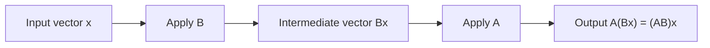

# Matrices and Matrix Algebra

Matrices organize linear information. A matrix can be a table of data, a coefficient array for a system, or the rule for a linear transformation. Matrix algebra is designed so that these interpretations agree: matrix-vector multiplication applies a linear rule, and matrix-matrix multiplication composes such rules.

The main surprise is that matrix arithmetic resembles ordinary arithmetic only partly. Addition behaves as expected, but multiplication is order-sensitive and dimension-sensitive. This is not a defect. It records the fact that applying one linear process after another depends on which process happens first and whether the output size of the first matches the input size of the second.

## Definitions

An $m\times n$ matrix $A=[a_{ij}]$ has $m$ rows and $n$ columns. Two matrices are equal if they have the same size and the same corresponding entries.

Matrix addition and scalar multiplication are entrywise:

$$
(A+B)_{ij}=a_{ij}+b_{ij},
\qquad
(cA)_{ij}=ca_{ij}.
$$

If $A$ is $m\times n$ and $B$ is $n\times p$, then $AB$ is $m\times p$ with entries

$$
(AB)_{ij}=a_{i1}b_{1j}+a_{i2}b_{2j}+\cdots+a_{in}b_{nj}.
$$

Equivalently, the $j$th column of $AB$ is $A$ times the $j$th column of $B$. This column viewpoint is often the cleanest way to remember multiplication:

$$
AB=A
\begin{bmatrix}
\mathbf{b}_1&\mathbf{b}_2&\cdots&\mathbf{b}_p
\end{bmatrix}
=
\begin{bmatrix}
A\mathbf{b}_1&A\mathbf{b}_2&\cdots&A\mathbf{b}_p
\end{bmatrix}.
$$

The transpose $A^T$ is formed by interchanging rows and columns. A square matrix has a main diagonal. Important square matrices include the identity matrix $I$, diagonal matrices, triangular matrices, and symmetric matrices satisfying $A^T=A$.

## Key results

Matrix addition is commutative and associative. Matrix multiplication is associative and distributes over addition:

$$
A(BC)=(AB)C,
\qquad
A(B+C)=AB+AC.
$$

However, multiplication is usually not commutative: $AB$ and $BA$ may differ or one product may not even be defined. This is one of the most important habits to build early. When matrices represent functions, $AB$ means "first apply $B$, then apply $A$," so reversing the order usually changes the result.

Transpose rules are:

$$
(A+B)^T=A^T+B^T,
\qquad
(cA)^T=cA^T,
\qquad
(AB)^T=B^TA^T.
$$

The reversed order in $(AB)^T$ is forced by dimensions and by entries. The $ij$ entry of $(AB)^T$ is the $ji$ entry of $AB$, which is row $j$ of $A$ dotted with column $i$ of $B$. That same scalar is the $ij$ entry of $B^TA^T$.

For compatible matrices, multiplication by the identity leaves a matrix unchanged:

$$
IA=A,\qquad AI=A.
$$

Zero matrices absorb under multiplication when dimensions allow:

$$
A0=0,\qquad 0A=0.
$$

But the cancellation law can fail. From $AB=AC$, one cannot conclude $B=C$ unless $A$ has an appropriate inverse.

Matrix multiplication can be understood in several equivalent ways, and each viewpoint is useful in a different setting. The entry formula is best for direct arithmetic. The column viewpoint says that the columns of $AB$ are the images of the columns of $B$ under $A$. The row viewpoint says that the rows of $AB$ are linear combinations of the rows of $B$, weighted by rows of $A$. The transformation viewpoint says that $AB$ represents composition.

Block matrices extend the same ideas. If the sizes match, a matrix can be partitioned into submatrices and multiplied by blocks. For example,

$$
\begin{bmatrix}
A&B\\
C&D
\end{bmatrix}
\begin{bmatrix}
\mathbf{x}\\
\mathbf{y}
\end{bmatrix}
=
\begin{bmatrix}
A\mathbf{x}+B\mathbf{y}\\
C\mathbf{x}+D\mathbf{y}
\end{bmatrix}.
$$

This notation is common in systems, least squares, numerical linear algebra, and theoretical proofs because it keeps related groups of variables together.

Special matrix classes carry extra structure. Diagonal matrices scale coordinate axes independently. Triangular matrices are easy to solve by substitution. Symmetric matrices satisfy $A^T=A$ and have real eigenvalues with orthogonal eigenvectors. Orthogonal matrices satisfy $Q^TQ=I$ and preserve dot products. Recognizing these classes often tells you which theorem or algorithm is appropriate before doing any arithmetic.

The trace of a square matrix is the sum of its diagonal entries:

$$
\operatorname{tr}(A)=a_{11}+a_{22}+\cdots+a_{nn}.
$$

It satisfies $\operatorname{tr}(A+B)=\operatorname{tr}(A)+\operatorname{tr}(B)$ and $\operatorname{tr}(AB)=\operatorname{tr}(BA)$ when both products are defined as square matrices. Trace later connects to eigenvalues, quadratic forms, and matrix inner products.

Dimension discipline is a major part of matrix algebra. Before performing any calculation, identify the shape of each matrix and the shape of the result. This habit prevents many errors and also clarifies meaning: an $m\times n$ matrix maps coordinate vectors in $\mathbb{R}^n$ to coordinate vectors in $\mathbb{R}^m$.

## Visual

| Operation | Condition | Result size | Key warning |
|---|---:|---:|---|
| $A+B$ | same size | same as $A$ and $B$ | entrywise only |
| $cA$ | scalar $c$ | same as $A$ | scales every entry |
| $AB$ | columns of $A$ = rows of $B$ | rows of $A$ by columns of $B$ | order matters |
| $A^T$ | any matrix | columns of $A$ by rows of $A$ | reverses products |
| $A\mathbf{x}$ | $\mathbf{x}$ has one entry per column of $A$ | one entry per row of $A$ | linear combination of columns |



## Worked example 1: Compute a product and interpret columns

Problem: let

$$
A=
\begin{bmatrix}
1&2&0\\
-1&3&4
\end{bmatrix},
\qquad
B=
\begin{bmatrix}
2&1\\
0&-3\\
5&2
\end{bmatrix}.
$$

Compute $AB$.

Step 1: check dimensions. $A$ is $2\times 3$ and $B$ is $3\times 2$, so $AB$ is defined and has size $2\times 2$.

Step 2: compute entries by row-column dot products.

$$
\begin{aligned}
(AB)_{11}&=1\cdot2+2\cdot0+0\cdot5=2,\\
(AB)_{12}&=1\cdot1+2(-3)+0\cdot2=-5,\\
(AB)_{21}&=(-1)2+3\cdot0+4\cdot5=18,\\
(AB)_{22}&=(-1)1+3(-3)+4\cdot2=-2.
\end{aligned}
$$

Thus

$$
AB=
\begin{bmatrix}
2&-5\\
18&-2
\end{bmatrix}.
$$

Step 3: check with the column viewpoint. The first column of $B$ is $\begin{bmatrix}2&0&5\end{bmatrix}^T$, and

$$
A\begin{bmatrix}2\\0\\5\end{bmatrix}
=
\begin{bmatrix}2\\18\end{bmatrix},
$$

which matches the first column of $AB$.

## Worked example 2: Show multiplication is not commutative

Problem: compare $AB$ and $BA$ for

$$
A=
\begin{bmatrix}
1&2\\
0&1
\end{bmatrix},
\qquad
B=
\begin{bmatrix}
3&0\\
4&5
\end{bmatrix}.
$$

Step 1: compute $AB$.

$$
AB=
\begin{bmatrix}
1\cdot3+2\cdot4 & 1\cdot0+2\cdot5\\
0\cdot3+1\cdot4 & 0\cdot0+1\cdot5
\end{bmatrix}
=
\begin{bmatrix}
11&10\\
4&5
\end{bmatrix}.
$$

Step 2: compute $BA$.

$$
BA=
\begin{bmatrix}
3\cdot1+0\cdot0 & 3\cdot2+0\cdot1\\
4\cdot1+5\cdot0 & 4\cdot2+5\cdot1
\end{bmatrix}
=
\begin{bmatrix}
3&6\\
4&13
\end{bmatrix}.
$$

Step 3: compare. Since

$$
\begin{bmatrix}
11&10\\
4&5
\end{bmatrix}
\neq
\begin{bmatrix}
3&6\\
4&13
\end{bmatrix},
$$

the products are not equal. Checked answer: both products exist, but $AB\neq BA$.

## Code

```python
import numpy as np

A = np.array([[1, 2, 0],
              [-1, 3, 4]])
B = np.array([[2, 1],
              [0, -3],
              [5, 2]])

print(A @ B)
print((A @ B).T)
print(B.T @ A.T)
print(np.allclose((A @ B).T, B.T @ A.T))
```

The `@` operator performs matrix multiplication in NumPy. The final line checks the transpose product rule $(AB)^T=B^TA^T$.

## Common pitfalls

- Multiplying corresponding entries and calling the result $AB$. Entrywise multiplication is a different operation.
- Forgetting the dimension check before multiplying.
- Reversing product order when translating composition. If $T_A(\mathbf{x})=A\mathbf{x}$ and $T_B(\mathbf{x})=B\mathbf{x}$, then $T_A\circ T_B$ corresponds to $AB$.
- Assuming $AB=BA$ because ordinary numbers commute.
- Distributing transpose without reversing order.
- Treating the identity matrix as one fixed size. The size of $I$ depends on context.

A practical way to avoid multiplication mistakes is to annotate shapes before multiplying. If $A$ is $2\times3$ and $B$ is $3\times4$, then $AB$ is $2\times4$ because the inner dimensions match and disappear, while the outer dimensions remain. If the inner dimensions do not match, the product is not defined. This simple check should happen before any entry arithmetic begins.

When a product represents composition, read it from right to left as an action on vectors. The expression $AB\mathbf{x}$ means first compute $B\mathbf{x}$, then apply $A$. This convention explains both the order of matrix multiplication and the transpose rule. It also prevents a common modeling error: writing transformations in the order they are described verbally rather than in the order they act on the vector.

Special matrices should trigger special expectations. A diagonal matrix scales coordinates independently. A triangular matrix leads naturally to substitution. A symmetric matrix is connected to quadratic forms and orthogonal eigenvectors. An orthogonal matrix preserves dot products and lengths. Identifying these structures early can reduce computation and suggest the correct theorem.

For block matrices, always check that each block operation is dimensionally valid. Blocks behave like entries only when the block sizes match the intended algebra. Used correctly, block notation makes large systems easier to read. Used carelessly, it hides dimension errors that would have been obvious in entry notation.

Matrix powers are defined only for square matrices. If $A^2$ appears, then $A$ must be square because the output of the first application must be a valid input for the second. Powers describe repeated application of the same linear transformation, which is why they occur in Markov chains, recurrence relations, and dynamical systems.

The identity and zero matrices play different algebraic roles. The identity matrix leaves vectors and compatible matrices unchanged, so it behaves like the number $1$ under multiplication. The zero matrix sends every vector to zero, so it destroys information. Unlike ordinary arithmetic, it is possible for nonzero matrices $A$ and $B$ to have $AB=0$ if the range of $B$ lies in the null space of $A$.

Transpose connects row and column viewpoints. The columns of $A$ become the rows of $A^T$, and symmetric matrices are exactly those where these viewpoints match across the diagonal. This simple operation becomes important in dot products, normal equations, orthogonal matrices, and quadratic forms.

## Connections

- [Systems of Linear Equations](/math/linear-algebra/systems-of-linear-equations)
- [Matrix Inverses and Elementary Matrices](/math/linear-algebra/matrix-inverses-and-elementary-matrices)
- [Linear Transformations](/math/linear-algebra/linear-transformations)
- [Numerical Linear Algebra](/math/linear-algebra/numerical-linear-algebra)
