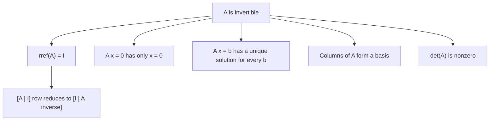

# Matrix Inverses and Elementary Matrices

An inverse matrix undoes a linear process. Elementary matrices make this idea concrete: every row operation is the same as multiplying by a simple invertible matrix. This connects row reduction, solving systems, and algebraic invertibility into one framework.

The main point is not merely that some square matrices have formulas for inverses. The deeper point is that invertibility is an equivalence of many ideas: no information is lost, the system $A\mathbf{x}=\mathbf{b}$ has exactly one solution for every $\mathbf{b}$, the columns form a basis, the determinant is nonzero, and row reduction reaches the identity. Elementary matrices are the bridge between the algorithm and these structural statements.

## Definitions

A square matrix $A$ is invertible if there is a matrix $A^{-1}$ such that

$$
AA^{-1}=I
\qquad\text{and}\qquad
A^{-1}A=I.
$$

If no such matrix exists, $A$ is singular.

An elementary matrix is obtained by performing one elementary row operation on an identity matrix. Left multiplication by an elementary matrix performs the same row operation on any compatible matrix. For example, if $E$ is created by swapping rows $1$ and $2$ of $I$, then $EA$ swaps rows $1$ and $2$ of $A$.

For a square matrix $A$, the augmented matrix

$$
\left[
\begin{array}{c|c}
A&I
\end{array}
\right]
$$

can be row-reduced to compute $A^{-1}$. If the left side becomes $I$, the right side becomes $A^{-1}$. If the left side cannot become $I$, then $A$ is not invertible.

The inverse of a $2\times2$ matrix has the special formula

$$
\begin{bmatrix}
a&b\\
c&d
\end{bmatrix}^{-1}
=
\frac{1}{ad-bc}
\begin{bmatrix}
d&-b\\
-c&a
\end{bmatrix},
$$

provided $ad-bc\neq0$.

## Key results

The inverse of an invertible matrix is unique. If $B$ and $C$ both satisfy the inverse equations for $A$, then

$$
B=BI=B(AC)=(BA)C=IC=C.
$$

Products of invertible matrices are invertible, and the inverse reverses order:

$$
(AB)^{-1}=B^{-1}A^{-1}.
$$

The order reversal is the same phenomenon as function composition: to undo "first $B$, then $A$," one must undo $A$ first and $B$ second.

Elementary matrices are invertible. Their inverses are also elementary matrices: swap the same rows again, multiply by the reciprocal scalar, or add the opposite multiple of one row to another. If row operations reduce $A$ to $I$, then

$$
E_k\cdots E_2E_1A=I.
$$

Thus

$$
E_k\cdots E_2E_1=A^{-1}.
$$

This explains why applying the same operations to $I$ produces $A^{-1}$.

For a square matrix $A$, the following are equivalent:

1. $A$ is invertible.
2. The reduced row echelon form of $A$ is $I$.
3. $A\mathbf{x}=\mathbf{0}$ has only the trivial solution.
4. $A\mathbf{x}=\mathbf{b}$ has a unique solution for every $\mathbf{b}$.
5. The columns of $A$ form a basis of $\mathbb{R}^n$.

These equivalences are often called the invertible matrix theorem in an introductory course.

## Visual



| Row operation | Elementary matrix action | Inverse operation |
|---|---|---|
| Swap $R_i$ and $R_j$ | swap rows of $I$ | swap the same rows |
| Scale $R_i$ by $c\neq0$ | scale row $i$ of $I$ | scale by $1/c$ |
| Replace $R_i$ by $R_i+cR_j$ | add $c$ times row $j$ to row $i$ | add $-c$ times row $j$ to row $i$ |

## Worked example 1: Compute an inverse by row reduction

Problem: compute the inverse of

$$
A=
\begin{bmatrix}
1&2\\
3&7
\end{bmatrix}.
$$

Step 1: augment with the identity.

$$
\left[
\begin{array}{rr|rr}
1&2&1&0\\
3&7&0&1
\end{array}
\right]
$$

Step 2: eliminate below the first pivot with $R_2\leftarrow R_2-3R_1$.

$$
\left[
\begin{array}{rr|rr}
1&2&1&0\\
0&1&-3&1
\end{array}
\right]
$$

Step 3: eliminate above the second pivot with $R_1\leftarrow R_1-2R_2$.

$$
\left[
\begin{array}{rr|rr}
1&0&7&-2\\
0&1&-3&1
\end{array}
\right]
$$

Thus

$$
A^{-1}=
\begin{bmatrix}
7&-2\\
-3&1
\end{bmatrix}.
$$

Step 4: check by multiplication.

$$
\begin{bmatrix}
1&2\\
3&7
\end{bmatrix}
\begin{bmatrix}
7&-2\\
-3&1
\end{bmatrix}
=
\begin{bmatrix}
1&0\\
0&1
\end{bmatrix}.
$$

The checked answer is correct.

## Worked example 2: Use an inverse to solve a system

Problem: solve

$$
\begin{aligned}
x+2y&=5,\\
3x+7y&=17.
\end{aligned}
$$

Step 1: write the system as $A\mathbf{x}=\mathbf{b}$:

$$
\begin{bmatrix}
1&2\\
3&7
\end{bmatrix}
\begin{bmatrix}
x\\y
\end{bmatrix}
=
\begin{bmatrix}
5\\17
\end{bmatrix}.
$$

Step 2: use the inverse from the previous example.

$$
\begin{bmatrix}
x\\y
\end{bmatrix}
=
A^{-1}\mathbf{b}
=
\begin{bmatrix}
7&-2\\
-3&1
\end{bmatrix}
\begin{bmatrix}
5\\17
\end{bmatrix}.
$$

Step 3: multiply.

$$
\begin{aligned}
x&=7(5)-2(17)=35-34=1,\\
y&=-3(5)+17=-15+17=2.
\end{aligned}
$$

Checked answer: $(x,y)=(1,2)$. Substitution gives $1+4=5$ and $3+14=17$.

## Code

```python
import numpy as np

A = np.array([[1, 2],
              [3, 7]], dtype=float)
b = np.array([5, 17], dtype=float)

A_inv = np.linalg.inv(A)
x = A_inv @ b

print(A_inv)
print(x)
print(A @ A_inv)
print(np.allclose(A @ x, b))
```

In numerical work, directly forming an inverse is usually less stable and less efficient than solving $A\mathbf{x}=\mathbf{b}$ with a factorization. The inverse is still conceptually important, especially for proving structural facts.

## Common pitfalls

- Writing $A^{-1}=1/A$. Matrix inversion is not entrywise division.
- Reversing the inverse product rule incorrectly. The correct identity is $(AB)^{-1}=B^{-1}A^{-1}$.
- Assuming every square matrix has an inverse. A square matrix can be singular.
- Row-reducing only $A$ and forgetting to apply the same operations to the identity side of $[A\mid I]$.
- Using the $2\times2$ inverse formula for larger matrices.
- Concluding that a matrix is invertible just because all entries are nonzero. Pivot structure, not entrywise nonzero status, controls invertibility.

When computing an inverse by row reduction, every row operation should be interpreted as left multiplication by an elementary matrix. This perspective explains why the method works: the sequence of operations that turns $A$ into $I$ is exactly the sequence whose product is $A^{-1}$. The right side of $[A\mid I]$ records that product as it is built.

The inverse is best understood as a structural guarantee, not always as a computational tool. If $A$ is invertible, then $A\mathbf{x}=\mathbf{b}$ has the unique solution $\mathbf{x}=A^{-1}\mathbf{b}$. That formula proves uniqueness and dependence on $\mathbf{b}$. In numerical computation, however, solving the system directly with a factorization is usually better than forming $A^{-1}$ explicitly.

A quick singularity check is to look for dependence among columns or rows. If one column is a scalar multiple or linear combination of others, then the matrix cannot be invertible. Row reduction turns this observation into pivots: a missing pivot means one direction in the domain is collapsed, so the process cannot be reversed.

For products, imagine undoing actions. If a vector is first transformed by $B$ and then by $A$, the combined action is $AB$. To reverse it, undo $A$ first and then $B$, so the inverse is $B^{-1}A^{-1}$. This mental model is often safer than memorizing the formula alone.

It is also worth distinguishing left inverses and right inverses in rectangular settings. A square matrix inverse satisfies both $AA^{-1}=I$ and $A^{-1}A=I$. For a non-square matrix, one may have a matrix that reverses the action on one side but not the other. This connects directly to one-to-one and onto behavior: full column rank supports left-inverse behavior, while full row rank supports right-inverse behavior. The square invertible case is the special situation where both happen at once.

Elementary matrices give a compact way to reason about algorithms. If elimination reduces $A$ to an upper triangular matrix $U$, then a product of elementary matrices has transformed $A$ into $U$. Rearranging that statement is the beginning of LU factorization. Thus inverse theory is not isolated from numerical methods; it is the algebraic background behind practical solvers.

When checking an inverse candidate $B$, multiply on both sides if the problem is theoretical:

$$
AB=I
\qquad\text{and}\qquad
BA=I.
$$

For square matrices over ordinary finite-dimensional spaces, one side actually implies the other, but checking both sides is a good habit in introductory work because it reveals order mistakes. If $AB$ and $BA$ are not even both defined, then the proposed inverse cannot be a two-sided inverse.

The inverse also clarifies equations with transformed variables. If $\mathbf{y}=A\mathbf{x}$ and $A$ is invertible, then no information has been lost: $\mathbf{x}=A^{-1}\mathbf{y}$. If $A$ is singular, two different inputs may produce the same output, or some outputs may be unreachable. Thus invertibility is both an algebraic property and an information-preservation property.

In proofs, it is often better to use the defining inverse equations than to compute the inverse. For example, to show that an equation has at most one solution, suppose $A\mathbf{x}=A\mathbf{y}$ and multiply by $A^{-1}$ to get $\mathbf{x}=\mathbf{y}$. This kind of argument is the real reason inverse notation is powerful.

Before using an inverse in a solution, ask what it proves: existence, uniqueness, reversibility, or a concrete formula. Those are related but distinct purposes, and separating them keeps both computations and proofs cleaner.

When the purpose is only to solve one system, a direct solve is usually the better computational expression of the same idea.

## Connections

- [Gaussian Elimination](/math/linear-algebra/gaussian-elimination)
- [Determinants](/math/linear-algebra/determinants)
- [Bases, Dimension, and Rank](/math/linear-algebra/bases-dimension-and-rank)
- [Linear Transformations](/math/linear-algebra/linear-transformations)
