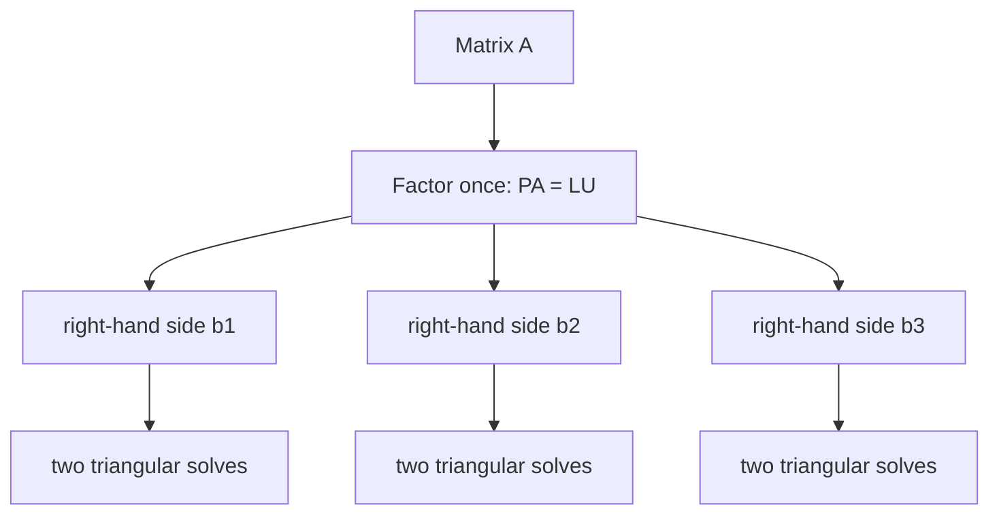

# Numerical Linear Algebra

Exact row reduction explains the theory, but computers work with finite precision. Numerical linear algebra studies algorithms that are efficient, stable, and reusable. Anton's numerical chapter highlights LU decomposition, the power method, operation counts, roundoff behavior, and the practical preference for factorizations over symbolic formulas.


*Figure: Gaussian elimination uses row operations to expose pivots, rank, and solvability. Image: [Wikimedia Commons](https://commons.wikimedia.org/wiki/File:File_Gaussian_elimination.svg), Akira tanzivana, CC BY-SA 4.0.*

The central shift is from "Can this be solved?" to "Can this be solved accurately, quickly, and repeatedly on real hardware?" A formula may be mathematically correct and still be a poor computational method. Numerical linear algebra asks how errors propagate and how algorithms behave as problem sizes grow.

## Definitions

An LU decomposition factors a square matrix as

$$
A=LU,
$$

where $L$ is lower triangular and $U$ is upper triangular. With row interchanges, one commonly writes

$$
PA=LU,
$$

where $P$ is a permutation matrix.

Forward substitution solves $L\mathbf{y}=\mathbf{b}$ when $L$ is lower triangular. Back substitution solves $U\mathbf{x}=\mathbf{y}$ when $U$ is upper triangular.

A dominant eigenvalue of $A$ is an eigenvalue whose absolute value is strictly larger than the absolute values of all other eigenvalues. The power method repeatedly multiplies by $A$ and rescales to approximate a dominant eigenvector.

The condition number of an invertible matrix in a norm is

$$
\kappa(A)=\|A\|\,\|A^{-1}\|.
$$

A large condition number means the problem is sensitive: small changes in input can cause large changes in the solution.

## Key results

If a square matrix can be reduced to row echelon form without row interchanges, then it has an LU decomposition. The multipliers used during Gaussian elimination become the subdiagonal entries of $L$, while the final echelon matrix gives $U$.

Once $A=LU$ is known, solving

$$
A\mathbf{x}=\mathbf{b}
$$

becomes two triangular solves:

$$
L\mathbf{y}=\mathbf{b},
\qquad
U\mathbf{x}=\mathbf{y}.
$$

This is especially useful when solving many systems with the same coefficient matrix and different right-hand sides. The expensive factorization is done once.

Partial pivoting improves numerical stability by swapping rows to use a larger pivot. In practice, one often computes

$$
PA=LU,
$$

then solves

$$
L\mathbf{y}=P\mathbf{b},
\qquad
U\mathbf{x}=\mathbf{y}.
$$

The power method works when $A$ has a dominant eigenvalue and the initial vector has a nonzero component in the dominant eigendirection. If

$$
\mathbf{x}_0=c_1\mathbf{v}_1+\cdots+c_n\mathbf{v}_n
$$

in an eigenbasis with $\vert \lambda_1\vert \gt \vert \lambda_2\vert \geq\cdots$, then

$$
A^k\mathbf{x}_0
=
c_1\lambda_1^k\mathbf{v}_1+\cdots+c_n\lambda_n^k\mathbf{v}_n.
$$

After scaling, the dominant term tends to control the direction.

Roundoff error is unavoidable in floating-point arithmetic. Most decimal numbers cannot be represented exactly in binary floating point, and each arithmetic operation may introduce a tiny error. A stable algorithm keeps those small errors from being magnified unnecessarily. An unstable algorithm can produce a poor answer even when the mathematical problem is well-conditioned.

Conditioning belongs to the problem, while stability belongs to the algorithm. A linear system with a very large condition number is inherently sensitive: even a perfect algorithm cannot remove the effect of small perturbations in the input. But for a reasonably conditioned problem, a poor algorithm can still create unnecessary error. Numerical linear algebra studies both sides.

Pivoting illustrates the distinction. In exact arithmetic, any nonzero pivot is legal. In floating-point arithmetic, dividing by a tiny pivot can create huge intermediate numbers and amplify roundoff. Partial pivoting chooses the largest available pivot in the current column to reduce this risk. This does not change the exact solution of the permuted system, but it greatly improves practical behavior.

Operation counts explain why factorization is preferred over repeated elimination. Factoring an $n\times n$ dense matrix costs on the order of $n^3$ arithmetic operations, while each triangular solve costs on the order of $n^2$. If the same matrix must be solved against many right-hand sides, the factorization cost is amortized.

Residuals and errors should not be confused. The residual is

$$
\mathbf{r}=\mathbf{b}-A\hat{\mathbf{x}},
$$

which can be computed from the proposed solution. The forward error is $\hat{\mathbf{x}}-\mathbf{x}$, which requires knowing the exact solution. A small residual is reassuring, but for an ill-conditioned matrix it may still correspond to a large forward error. This is why condition estimates are reported by serious numerical software.

## Visual



| Algorithm | Main use | Typical cost | Stability note |
|---|---|---:|---|
| Gaussian elimination | solve dense systems | about $O(n^3)$ | pivoting matters |
| LU factorization | repeated solves | factor once, solve cheaply | use partial pivoting |
| QR factorization | least squares | about $O(mn^2)$ for tall matrices | more stable than normal equations |
| Power method | dominant eigenpair | matrix-vector products | needs spectral gap |
| SVD | rank, conditioning, robust least squares | higher than QR | most reliable for rank issues |

## Worked example 1: Solve using LU

Problem: solve $A\mathbf{x}=\mathbf{b}$ using the factorization

$$
A=
\begin{bmatrix}
2&1\\
4&3
\end{bmatrix}
=
\begin{bmatrix}
1&0\\
2&1
\end{bmatrix}
\begin{bmatrix}
2&1\\
0&1
\end{bmatrix}
=LU,
\qquad
\mathbf{b}=
\begin{bmatrix}
5\\13
\end{bmatrix}.
$$

Step 1: solve $L\mathbf{y}=\mathbf{b}$:

$$
\begin{bmatrix}
1&0\\
2&1
\end{bmatrix}
\begin{bmatrix}
y_1\\y_2
\end{bmatrix}
=
\begin{bmatrix}
5\\13
\end{bmatrix}.
$$

The first equation gives $y_1=5$. The second gives

$$
2y_1+y_2=13
\quad\Longrightarrow\quad
10+y_2=13
\quad\Longrightarrow\quad
y_2=3.
$$

Step 2: solve $U\mathbf{x}=\mathbf{y}$:

$$
\begin{bmatrix}
2&1\\
0&1
\end{bmatrix}
\begin{bmatrix}
x_1\\x_2
\end{bmatrix}
=
\begin{bmatrix}
5\\3
\end{bmatrix}.
$$

The second equation gives $x_2=3$. The first gives

$$
2x_1+x_2=5
\quad\Longrightarrow\quad
2x_1+3=5
\quad\Longrightarrow\quad
x_1=1.
$$

Checked answer: $\mathbf{x}=\begin{bmatrix}1&3\end{bmatrix}^T$, and $A\mathbf{x}=\begin{bmatrix}5&13\end{bmatrix}^T$.

## Worked example 2: Two steps of the power method

Problem: approximate the dominant eigenvector of

$$
A=
\begin{bmatrix}
2&1\\
1&2
\end{bmatrix}
$$

starting from

$$
\mathbf{x}_0=
\begin{bmatrix}
1\\0
\end{bmatrix}.
$$

Step 1: multiply:

$$
\mathbf{y}_1=A\mathbf{x}_0=
\begin{bmatrix}
2\\1
\end{bmatrix}.
$$

Scale by the largest absolute component, which is $2$:

$$
\mathbf{x}_1=
\begin{bmatrix}
1\\1/2
\end{bmatrix}.
$$

Step 2: multiply again:

$$
\mathbf{y}_2=A\mathbf{x}_1=
\begin{bmatrix}
2(1)+1/2\\
1+2(1/2)
\end{bmatrix}
=
\begin{bmatrix}
5/2\\2
\end{bmatrix}.
$$

Scale by $5/2$:

$$
\mathbf{x}_2=
\begin{bmatrix}
1\\4/5
\end{bmatrix}.
$$

Step 3: interpret. The dominant eigenvector is in the direction $\begin{bmatrix}1&1\end{bmatrix}^T$, and the iterates are moving toward that direction. Checked answer: the second iterate ratio is already $0.8$.

## Code

```python
import numpy as np
from scipy.linalg import lu_factor, lu_solve

A = np.array([[2, 1],
              [4, 3]], dtype=float)
b = np.array([5, 13], dtype=float)

lu, piv = lu_factor(A)
x = lu_solve((lu, piv), b)
print(x)

B = np.array([[2, 1],
              [1, 2]], dtype=float)
v = np.array([1, 0], dtype=float)
for _ in range(8):
    v = B @ v
    v = v / np.linalg.norm(v)
print(v)
```

The LU calls use pivoting internally. For the power method, normalization prevents overflow and makes the direction easy to compare between iterations.

## Common pitfalls

- Forming $A^{-1}$ explicitly when a solve or factorization is more appropriate.
- Ignoring pivoting in floating-point Gaussian elimination.
- Confusing algorithmic cost with formula length. A compact formula can be computationally expensive.
- Assuming small residual always means small forward error; ill-conditioned matrices can make this false.
- Applying the power method without a dominant eigenvalue or with an initial vector orthogonal to the dominant eigenspace.
- Comparing floating-point numbers for exact equality instead of using tolerances.

A useful numerical mindset is to ask three questions for every algorithm: How many operations does it require? How much memory does it use? How does it behave under rounding? A method that is excellent for a small exact classroom example may be inappropriate for a million-variable sparse system. Numerical linear algebra is largely the study of matching algorithms to matrix structure and accuracy requirements.

Factorizations are reusable information. LU stores the elimination work needed for square solves. QR stores an orthonormal basis for a column space and triangular coordinates. SVD stores the most complete information about rank and scaling. Choosing a factorization is a modeling and computational decision: what question will be asked repeatedly, and what errors are acceptable?

Scaling can be as important as algorithm choice. If one row or column of a matrix is measured in units that make its entries millions of times larger than another, pivoting and conditioning can be affected. Rescaling variables or equations can improve numerical behavior without changing the underlying model. This is common in optimization and scientific computing.

For iterative methods such as the power method, stopping criteria matter. One may stop when successive normalized vectors change little, when the residual $\|A\mathbf{v}-\lambda\mathbf{v}\|$ is small, or when a maximum iteration count is reached. The right criterion depends on whether the goal is an eigenvalue, an eigenvector direction, or a qualitative estimate.

Sparse matrices change the algorithmic picture. A matrix with mostly zero entries should not be treated like a dense table if the zeros can be exploited. Sparse direct solvers and iterative methods store and operate only on the meaningful entries. This is essential in graph problems, finite-difference models, optimization, and large-scale data applications.

Backward error is another useful idea. An algorithm has small backward error if the computed answer is the exact solution to a nearby problem. For many stable algorithms, this is the right guarantee: floating-point arithmetic slightly perturbs the input, but the algorithm solves that nearby problem accurately. Conditioning then determines whether the nearby exact solution is close to the original exact solution.

In practice, reliable numerical work combines mathematical checks with software checks. Inspect residuals, estimate condition numbers, use tolerances, and prefer library routines that expose factorization choices. The theory explains what can go wrong; mature numerical libraries encode decades of algorithmic safeguards.

## Connections

- [Gaussian Elimination](/math/linear-algebra/gaussian-elimination)
- [Orthogonality, Gram-Schmidt, and QR](/math/linear-algebra/orthogonality-qr-gram-schmidt)
- [Least Squares](/math/linear-algebra/least-squares)
- [Singular Value Decomposition](/math/linear-algebra/singular-value-decomposition)
