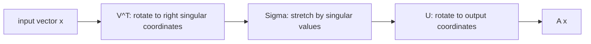

# Singular Value Decomposition

The singular value decomposition, or SVD, is a universal matrix factorization. Unlike diagonalization, it applies to every real matrix, square or rectangular. It separates a linear map into orthogonal input directions, nonnegative stretch factors, and orthogonal output directions. This makes it central for rank, least squares, conditioning, compression, and data analysis.

The geometric picture is especially useful: a matrix first rotates or reflects the input space, then stretches along coordinate axes by singular values, then rotates or reflects into the output space. Small singular values mark directions that are nearly lost; zero singular values mark directions that are completely collapsed.


*Figure: Geometric decomposition of a matrix into rotations and scaling. Image: [Wikimedia Commons](https://commons.wikimedia.org/wiki/File:Singular-Value-Decomposition.svg), Georg-Johann, CC BY-SA 3.0.*

## Definitions

For an $m\times n$ matrix $A$, a singular value decomposition is

$$
A=U\Sigma V^T,
$$

where $U$ is an $m\times m$ orthogonal matrix, $V$ is an $n\times n$ orthogonal matrix, and $\Sigma$ is an $m\times n$ diagonal-shaped matrix with nonnegative entries

$$
\sigma_1\geq\sigma_2\geq\cdots\geq 0.
$$

The numbers $\sigma_i$ are the singular values of $A$. They are the square roots of the eigenvalues of $A^TA$:

$$
A^TA\mathbf{v}_i=\sigma_i^2\mathbf{v}_i.
$$

If $A$ has rank $r$, its reduced SVD is

$$
A=U_r\Sigma_rV_r^T,
$$

using only the positive singular values.

The singular value expansion is

$$
A=\sigma_1\mathbf{u}_1\mathbf{v}_1^T+\cdots+\sigma_r\mathbf{u}_r\mathbf{v}_r^T.
$$

Each term is a rank-one matrix.

## Key results

Every real matrix has an SVD. This is stronger than diagonalization, which requires a square matrix and enough eigenvectors. The SVD exists because $A^TA$ is symmetric and positive semidefinite, so it has an orthonormal eigenbasis.

The rank of $A$ equals the number of positive singular values. The null space of $A$ is spanned by the right singular vectors corresponding to zero singular values.

The matrix norm induced by the Euclidean vector norm is the largest singular value:

$$
\|A\|_2=\sigma_1.
$$

For an invertible square matrix, the $2$-norm condition number is

$$
\kappa_2(A)=\frac{\sigma_1}{\sigma_n}.
$$

Small singular values signal directions where the map nearly collapses, making inverse problems sensitive.

The best rank-$k$ approximation theorem says that if

$$
A_k=\sigma_1\mathbf{u}_1\mathbf{v}_1^T+\cdots+\sigma_k\mathbf{u}_k\mathbf{v}_k^T,
$$

then $A_k$ is the closest rank-$k$ matrix to $A$ in both spectral norm and Frobenius norm. This is the mathematical basis of low-rank compression.

The Moore-Penrose pseudoinverse can be written from the SVD:

$$
A^+=V\Sigma^+U^T,
$$

where $\Sigma^+$ reciprocates the positive singular values and transposes the diagonal-shaped matrix. It gives least-squares solutions, including minimum-norm solutions for rank-deficient systems.

The SVD is closely related to four fundamental subspaces. The right singular vectors associated with positive singular values form an orthonormal basis for the row space of $A$. The right singular vectors associated with zero singular values form an orthonormal basis for the null space. The left singular vectors associated with positive singular values form an orthonormal basis for the column space. The remaining left singular vectors span the left null space.

This structure makes the SVD a complete coordinate description of what $A$ does. If

$$
A\mathbf{v}_i=\sigma_i\mathbf{u}_i,
$$

then each right singular direction $\mathbf{v}_i$ is sent to the corresponding left singular direction $\mathbf{u}_i$ and scaled by $\sigma_i$. If $\sigma_i=0$, that input direction is collapsed to zero. No other standard factorization gives such a direct geometric account for every rectangular matrix.

The SVD also explains why solving linear systems can be sensitive. Suppose $A$ is invertible with small singular value $\sigma_n$. Inverting $A$ divides by singular values, so components of the data in directions corresponding to small singular values are amplified by $1/\sigma_n$. If measurement noise has any component in those directions, the computed solution can change dramatically. Regularization methods often work by damping or discarding the effect of tiny singular values.

For data matrices, singular values measure how much variation is captured by each rank-one term. Keeping the largest few singular values gives a low-dimensional summary. In image compression, for example, a grayscale image can be treated as a matrix. A rank-$k$ SVD approximation stores only $k$ singular values and $k$ pairs of singular vectors, often preserving broad visual structure while discarding fine detail.

Although the SVD is powerful, it is not always the cheapest tool. QR is usually preferred for ordinary full-rank least squares, and LU is usually preferred for square solves. The SVD is the tool to reach for when rank, conditioning, compression, or near-dependence is central.

## Visual



ASCII block form:

```text
A        =        U        Sigma        V^T

m x n           m x m       m x n       n x n
                         [s1  0  0]
                         [0  s2  0]
                         [0   0  0]
```

| Factorization | Applies to | Core diagonal values | Orthogonal factors? |
|---|---|---|---|
| Eigendecomposition | some square matrices | eigenvalues | not always |
| Orthogonal diagonalization | real symmetric matrices | eigenvalues | yes |
| SVD | every real matrix | singular values | yes |

## Worked example 1: Compute an SVD by hand for a diagonal matrix

Problem: find an SVD of

$$
A=
\begin{bmatrix}
3&0\\
0&2\\
0&0
\end{bmatrix}.
$$

Step 1: compute $A^TA$.

$$
A^TA=
\begin{bmatrix}
3&0&0\\
0&2&0
\end{bmatrix}
\begin{bmatrix}
3&0\\
0&2\\
0&0
\end{bmatrix}
=
\begin{bmatrix}
9&0\\
0&4
\end{bmatrix}.
$$

Step 2: eigenvalues of $A^TA$ are $9$ and $4$, so the singular values are

$$
\sigma_1=3,
\qquad
\sigma_2=2.
$$

Step 3: the right singular vectors can be the standard basis:

$$
\mathbf{v}_1=\begin{bmatrix}1\\0\end{bmatrix},
\qquad
\mathbf{v}_2=\begin{bmatrix}0\\1\end{bmatrix}.
$$

Step 4: compute left singular vectors by $\mathbf{u}_i=A\mathbf{v}_i/\sigma_i$.

$$
\mathbf{u}_1=
\frac{1}{3}
\begin{bmatrix}
3\\0\\0
\end{bmatrix}
=
\begin{bmatrix}
1\\0\\0
\end{bmatrix},
\qquad
\mathbf{u}_2=
\frac{1}{2}
\begin{bmatrix}
0\\2\\0
\end{bmatrix}
=
\begin{bmatrix}
0\\1\\0
\end{bmatrix}.
$$

Complete $U$ with $\mathbf{u}_3=\begin{bmatrix}0&0&1\end{bmatrix}^T$. Then $U=I_3$, $V=I_2$, and $\Sigma=A$. Checked answer: $A=U\Sigma V^T$.

## Worked example 2: Low-rank approximation from singular values

Problem: suppose

$$
A=\sigma_1\mathbf{u}_1\mathbf{v}_1^T+\sigma_2\mathbf{u}_2\mathbf{v}_2^T
$$

with $\sigma_1=10$ and $\sigma_2=1$, where all singular vectors are unit and mutually orthogonal in their respective spaces. Find the best rank-one approximation and its error in spectral norm.

Step 1: keep only the largest singular term:

$$
A_1=10\mathbf{u}_1\mathbf{v}_1^T.
$$

Step 2: subtract:

$$
A-A_1=1\mathbf{u}_2\mathbf{v}_2^T.
$$

Step 3: the spectral norm of a rank-one singular term $\sigma\mathbf{u}\mathbf{v}^T$ with unit vectors is $\sigma$. Therefore

$$
\|A-A_1\|_2=1.
$$

Checked answer: the best rank-one approximation is $10\mathbf{u}_1\mathbf{v}_1^T$, and the spectral-norm error is the next singular value, $1$.

## Code

```python
import numpy as np

A = np.array([[3, 0],
              [0, 2],
              [0, 0]], dtype=float)

U, s, Vt = np.linalg.svd(A, full_matrices=True)
Sigma = np.zeros_like(A, dtype=float)
Sigma[:len(s), :len(s)] = np.diag(s)

print(s)
print(np.allclose(A, U @ Sigma @ Vt))

A1 = s[0] * np.outer(U[:, 0], Vt[0, :])
print(A1)
print(np.linalg.norm(A - A1, 2))
```

The final norm equals the second singular value for this example, illustrating the best rank-one approximation error.

## Common pitfalls

- Confusing singular values with eigenvalues. Singular values are always nonnegative and exist for rectangular matrices.
- Forgetting that $U$ and $V$ may have different sizes.
- Assuming $A^TA$ and $AA^T$ have the same dimensions. They share the same positive eigenvalues, but their sizes differ.
- Dropping small singular values without considering the scale and purpose of the problem.
- Treating the SVD as unique. Singular vectors can change sign, and repeated singular values allow rotations within singular subspaces.
- Using full SVD when reduced SVD is enough for a rank or least-squares computation.

A good SVD interpretation starts with the equations $A\mathbf{v}_i=\sigma_i\mathbf{u}_i$. They say exactly what happens to each orthonormal input direction. If $\sigma_i$ is large, that direction is stretched strongly. If $\sigma_i$ is small, that direction is nearly collapsed. If $\sigma_i=0$, that direction lies in the null space. This direction-by-direction description is often clearer than the full matrix product.

When using the SVD for rank decisions, numerical tolerance matters. In exact algebra, a singular value is either zero or positive. In floating-point computation, a value such as $10^{-14}$ may be effectively zero relative to the scale of the matrix. Numerical rank is therefore a judgment based on tolerance, units, noise, and the purpose of the computation.

Low-rank approximation should be interpreted through the discarded singular values. Keeping $k$ terms preserves the strongest $k$ modes of the matrix. The spectral-norm error is the next singular value, while the Frobenius-norm error depends on the square root of the sum of squares of all discarded singular values. This gives a quantitative way to decide how many terms are enough.

For least squares, the SVD is especially valuable when columns are nearly dependent. Tiny singular values indicate directions in parameter space that change the prediction very little. Dividing by those values in an inverse problem amplifies noise. Truncated SVD and other regularization methods reduce this amplification by limiting the influence of unstable directions.

The relationship between $A^TA$ and the SVD should be read carefully. If $A=U\Sigma V^T$, then

$$
A^TA=V\Sigma^T\Sigma V^T.
$$

Thus the right singular vectors are eigenvectors of $A^TA$, and the eigenvalues are squared singular values. Similarly,

$$
AA^T=U\Sigma\Sigma^TU^T,
$$

so the left singular vectors are eigenvectors of $AA^T$. The positive eigenvalues match, but the matrices have different sizes when $A$ is rectangular.

Sign ambiguity is normal. If $\mathbf{u}_i$ and $\mathbf{v}_i$ are both multiplied by $-1$, the rank-one product $\mathbf{u}_i\mathbf{v}_i^T$ is unchanged. For repeated singular values, even more freedom exists: singular vectors can rotate within the repeated singular subspace. Therefore software output may differ from hand output while representing the same SVD.

## Connections

- [Eigenvalues and Eigenvectors](/math/linear-algebra/eigenvalues-and-eigenvectors)
- [Quadratic Forms and Spectral Theorems](/math/linear-algebra/quadratic-forms-and-spectral-theorems)
- [Least Squares](/math/linear-algebra/least-squares)
- [Numerical Linear Algebra](/math/linear-algebra/numerical-linear-algebra)
