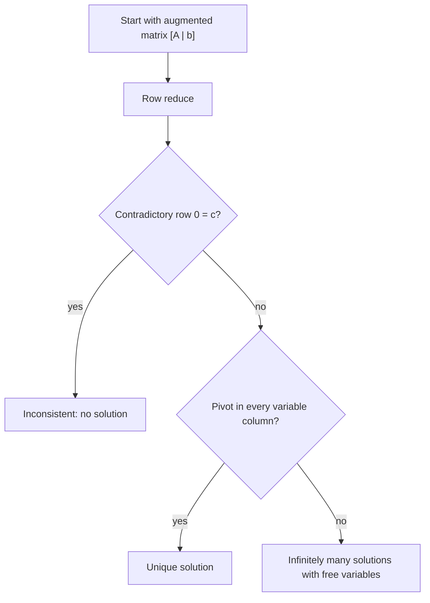

# Systems of Linear Equations

A linear system is the first place where linear algebra becomes visible: several flat constraints must be satisfied at once. In two variables the constraints are lines; in three variables they are planes; in $n$ variables they are hyperplanes. The algebraic question "which tuples solve all equations?" is the geometric question "where do these hyperplanes meet?"

Systems also introduce the central habit of the subject: replace a question about many equations by an equivalent question about a matrix. Once the coefficients are stored in an augmented matrix, row operations reveal whether the constraints intersect in no point, one point, or an entire affine family of points. The same language later becomes rank, column space, null space, inverse matrices, least squares, and numerical factorization.

## Definitions

A linear equation in unknowns $x_1,\ldots,x_n$ has the form

$$
a_1x_1+a_2x_2+\cdots+a_nx_n=b,
$$

where the coefficients $a_i$ and constant $b$ are scalars. A finite list of such equations is a linear system. A solution is an ordered tuple $(s_1,\ldots,s_n)$ that makes every equation true.

A system is consistent if it has at least one solution and inconsistent if it has none. A homogeneous system has all constants equal to zero:

$$
A\mathbf{x}=\mathbf{0}.
$$

It is always consistent because $\mathbf{x}=\mathbf{0}$ is a solution. That solution is called the trivial solution; any other solution is nontrivial.

The augmented matrix of a system stores the coefficients and constants:

$$
\left[
\begin{array}{ccc|c}
a_{11} & \cdots & a_{1n} & b_1 \\
\vdots & & \vdots & \vdots \\
a_{m1} & \cdots & a_{mn} & b_m
\end{array}
\right].
$$

The coefficient matrix is $A=[a_{ij}]$, the unknown vector is $\mathbf{x}$, and the constant vector is $\mathbf{b}$. The compact matrix equation is

$$
A\mathbf{x}=\mathbf{b}.
$$

Elementary row operations are:

1. interchange two rows;
2. multiply a row by a nonzero scalar;
3. add a multiple of one row to another row.

Two systems are equivalent if they have exactly the same solution set. Row operations create equivalent systems, which is why they are legitimate algebraic moves rather than merely cosmetic changes.

## Key results

Every linear system has exactly one of three solution types: no solution, one solution, or infinitely many solutions. The reason is structural. Row operations preserve the solution set and reduce a system to a simpler equivalent system. In echelon form, either a contradictory row appears, every variable is pinned down by a pivot, or at least one free variable remains. A free variable can vary through infinitely many values.

For homogeneous systems, more unknowns than equations guarantees infinitely many solutions. If the coefficient matrix has $m$ rows and $n$ columns with $m\lt n$, then after row reduction there can be at most $m$ pivot variables, so at least one variable is free. Since the system is homogeneous, there is no inconsistent row, and the free variable produces nontrivial solutions.

The row-operation equivalence proof is short but important. Interchanging equations only changes their order. Multiplying by a nonzero scalar gives an equation with the same truth set. Replacing one equation by itself plus a multiple of another is reversible by subtracting the same multiple. Therefore each elementary operation preserves exactly the same set of solutions.

In matrix language, a system $A\mathbf{x}=\mathbf{b}$ is consistent exactly when $\mathbf{b}$ lies in the column space of $A$. This is because $A\mathbf{x}$ is a linear combination of the columns of $A$, using the entries of $\mathbf{x}$ as weights. Thus solving a system is the same as asking whether the target vector can be built from the coefficient columns.

The number of solutions can be read from pivots. If a consistent system has a pivot in every variable column, the solution is unique. If it is consistent and has at least one non-pivot variable column, the solution set has parameters and is infinite.

## Visual



| Reduced-form signal | Algebraic meaning | Geometric meaning |
|---|---|---|
| Row $[0\ 0\ \cdots\ 0\mid c]$, $c\neq 0$ | impossible equation | constraints do not meet |
| Pivot in every variable column | one value for each unknown | one intersection point |
| At least one free variable | parameterized family | line, plane, or higher-dimensional flat |
| Homogeneous and free variable exists | nontrivial null-space vector | solution subspace has positive dimension |

## Worked example 1: Unique solution from row reduction

Problem: solve

$$
\begin{aligned}
x+y+z&=4,\\
2x+y-z&=1,\\
-x+2y+3z&=9.
\end{aligned}
$$

Step 1: write the augmented matrix.

$$
\left[
\begin{array}{rrr|r}
1&1&1&4\\
2&1&-1&1\\
-1&2&3&9
\end{array}
\right]
$$

Step 2: eliminate the entries below the first pivot by using $R_2\leftarrow R_2-2R_1$ and $R_3\leftarrow R_3+R_1$.

$$
\left[
\begin{array}{rrr|r}
1&1&1&4\\
0&-1&-3&-7\\
0&3&4&13
\end{array}
\right]
$$

Step 3: eliminate the entry below the second pivot with $R_3\leftarrow R_3+3R_2$.

$$
\left[
\begin{array}{rrr|r}
1&1&1&4\\
0&-1&-3&-7\\
0&0&-5&-8
\end{array}
\right]
$$

Step 4: back-substitute. The last row gives $-5z=-8$, so $z=8/5$. The second row gives

$$
-y-3z=-7
\quad\Longrightarrow\quad
y=7-3z=7-\frac{24}{5}=\frac{11}{5}.
$$

The first row gives

$$
x+y+z=4
\quad\Longrightarrow\quad
x=4-\frac{11}{5}-\frac{8}{5}=\frac{1}{5}.
$$

Checked answer:

$$
(x,y,z)=\left(\frac15,\frac{11}{5},\frac85\right).
$$

Substituting into the second equation gives $2/5+11/5-8/5=5/5=1$, and the other equations check similarly.

## Worked example 2: Infinitely many solutions

Problem: describe all solutions of the system whose reduced equation form is

$$
\begin{aligned}
x-2y+z&=3,\\
2x-4y+2z&=6.
\end{aligned}
$$

Step 1: notice that the second equation is twice the first. It adds no new constraint. Row reduction would produce

$$
\left[
\begin{array}{rrr|r}
1&-2&1&3\\
0&0&0&0
\end{array}
\right].
$$

Step 2: identify pivot and free variables. The pivot is in the $x$ column. The variables $y$ and $z$ are free.

Step 3: assign parameters

$$
y=s,\qquad z=t.
$$

Step 4: solve the pivot equation:

$$
x-2s+t=3
\quad\Longrightarrow\quad
x=3+2s-t.
$$

Therefore

$$
\begin{aligned}
x&=3+2s-t,\\
y&=s,\\
z&=t,
\end{aligned}
\qquad s,t\in\mathbb{R}.
$$

Vector form makes the geometry visible:

$$
\begin{bmatrix}x\\y\\z\end{bmatrix}
=
\begin{bmatrix}3\\0\\0\end{bmatrix}
+s\begin{bmatrix}2\\1\\0\end{bmatrix}
+t\begin{bmatrix}-1\\0\\1\end{bmatrix}.
$$

Checked answer: substituting into the original equation gives

$$
(3+2s-t)-2s+t=3,
$$

so every parameter choice satisfies the system. The solution set is a plane in $\mathbb{R}^3$.

## Code

```python
import numpy as np

A = np.array([[1, 1, 1],
              [2, 1, -1],
              [-1, 2, 3]], dtype=float)
b = np.array([4, 1, 9], dtype=float)

x = np.linalg.solve(A, b)
print(x)
print(A @ x)
print(np.allclose(A @ x, b))

rank_A = np.linalg.matrix_rank(A)
rank_aug = np.linalg.matrix_rank(np.column_stack([A, b]))
print(rank_A, rank_aug)
```

`np.linalg.solve` is appropriate only when the coefficient matrix is square and nonsingular. The rank comparison is the numerical version of the consistency test: $A\mathbf{x}=\mathbf{b}$ is consistent when the rank of $A$ equals the rank of the augmented matrix.

## Common pitfalls

- Treating row operations as operations on individual entries instead of whole rows. A row operation must transform every entry in the row, including the augmented constant.
- Dividing by a pivot before checking that it is nonzero. If the pivot candidate is zero, swap rows or move to another column.
- Forgetting that a homogeneous system is never inconsistent. It always contains the zero solution.
- Confusing "infinitely many" with "all variables are free." A system can have some pivot variables and still have infinitely many solutions.
- Reading a row of zeros in the coefficient part as automatically inconsistent. It is inconsistent only when the augmented entry is nonzero.

A reliable checking routine has three parts. First, verify that every row operation was legal and applied to the full augmented row. Second, classify the reduced system before solving: look for an inconsistent row, then count pivots and free variables. Third, substitute the final answer back into the original equations, not merely into the reduced equations. Substitution catches arithmetic mistakes that may have been introduced during elimination.

When a system has parameters, keep the pivot variables and free variables conceptually separate. Free variables are chosen independently; pivot variables respond to those choices. A common source of wrong answers is assigning a parameter to a pivot variable too early. The echelon form tells you which variables are free. After that, each pivot equation should be solved for its leading variable in terms of the parameters.

It is also helpful to translate between algebra and geometry. In two variables, a unique solution means two nonparallel lines meet at one point. No solution means parallel distinct lines. Infinitely many solutions means the equations describe the same line. In three variables, planes can meet at one point, along a line, in a plane, or not all together. The row-reduction classification is the algebraic version of these geometric possibilities.

For applied models, consistency should not be taken for granted. A conservation model may become inconsistent if the input data violate conservation. A measurement model may be inconsistent because of noise. In those situations, the right next topic is often least squares rather than forcing exact equality.

## Connections

- [Gaussian Elimination](/math/linear-algebra/gaussian-elimination)
- [Matrices and Matrix Algebra](/math/linear-algebra/matrices-and-matrix-algebra)
- [Bases, Dimension, and Rank](/math/linear-algebra/bases-dimension-and-rank)
- [Applications and Modeling](/math/linear-algebra/applications-and-modeling)
