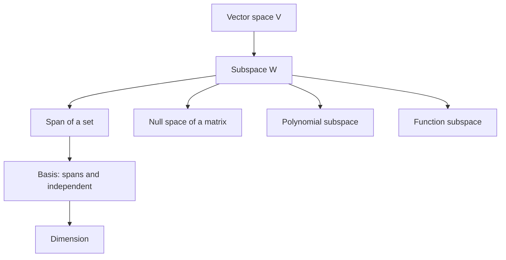

# General Vector Spaces

The abstraction from $\mathbb{R}^n$ to vector spaces is not a change of subject. It is a way to recognize the same algebraic behavior in polynomials, functions, matrices, sequences, and solution sets. Once the vector space axioms hold, ideas such as span, independence, basis, dimension, and linear transformation work in the same way.

This abstraction is useful because many objects that do not look like arrows still add and scale like arrows. Polynomials can be added and multiplied by constants. Continuous functions can be added and scaled. Matrices of the same size can be added and scaled. Linear algebra keeps the operations and lets the objects vary.

## Definitions

A real vector space is a set $V$ with vector addition and scalar multiplication satisfying the standard closure, associativity, commutativity, identity, inverse, and distributive axioms. The elements of $V$ are called vectors even when they are functions or matrices.

A subspace $W$ of $V$ is a nonempty subset that is itself a vector space under the operations inherited from $V$. It is enough to check:

1. $\mathbf{0}\in W$.
2. If $\mathbf{u},\mathbf{v}\in W$, then $\mathbf{u}+\mathbf{v}\in W$.
3. If $c\in\mathbb{R}$ and $\mathbf{u}\in W$, then $c\mathbf{u}\in W$.

The span of $S=\{\mathbf{v}_1,\ldots,\mathbf{v}_k\}$ is

$$
\operatorname{span}(S)=
\{c_1\mathbf{v}_1+\cdots+c_k\mathbf{v}_k:c_i\in\mathbb{R}\}.
$$

A set is linearly independent if the equation

$$
c_1\mathbf{v}_1+\cdots+c_k\mathbf{v}_k=\mathbf{0}
$$

forces every $c_i=0$. If there is a nontrivial solution, the set is linearly dependent.

A basis is a linearly independent spanning set. In a finite-dimensional vector space, the dimension is the number of vectors in any basis.

Important examples include $\mathbb{R}^n$, the polynomial space $P_n$ of polynomials of degree at most $n$, the matrix space $M_{m,n}$, and spaces of functions such as $C[a,b]$.

## Key results

The span of any nonempty set of vectors is a subspace. Closure follows because a sum of linear combinations is another linear combination, and a scalar multiple of a linear combination is another linear combination.

The solution set of a homogeneous linear system $A\mathbf{x}=\mathbf{0}$ is a subspace of $\mathbb{R}^n$. If $A\mathbf{u}=\mathbf{0}$ and $A\mathbf{v}=\mathbf{0}$, then

$$
A(\mathbf{u}+\mathbf{v})=A\mathbf{u}+A\mathbf{v}=\mathbf{0},
$$

and

$$
A(c\mathbf{u})=cA\mathbf{u}=\mathbf{0}.
$$

In contrast, the solution set of a nonhomogeneous system $A\mathbf{x}=\mathbf{b}$ is usually not a subspace because it generally does not contain $\mathbf{0}$.

Every finite spanning set can be reduced to a basis by removing redundant vectors. Every finite independent set can be extended to a basis by adding vectors until it spans. These facts are the structural reason dimension is well-defined.

A subset described by a linear condition is often a subspace when the condition is homogeneous. For example, the set of polynomials $p$ with $p(0)=0$ is a subspace because $(p+q)(0)=0$ and $(cp)(0)=0$. The set of polynomials with $p(0)=1$ is not a subspace because it does not contain the zero polynomial and is not closed under scalar multiplication.

## Visual



| Candidate set | Is it a vector space or subspace? | Reason |
|---|---|---|
| $\mathbb{R}^n$ | yes | standard addition and scalar multiplication |
| $P_n$ | yes | degree remains at most $n$ after addition and scaling |
| Solutions of $A\mathbf{x}=\mathbf{0}$ | yes | homogeneous equations are closed |
| Solutions of $A\mathbf{x}=\mathbf{b}$ with $\mathbf{b}\neq\mathbf{0}$ | usually no | zero vector usually absent |
| Polynomials with $p(0)=1$ | no | not closed under scalar multiplication |

## Worked example 1: Test a subset of polynomials

Problem: let

$$
W=\{p(x)\in P_3:p(1)=0\}.
$$

Show that $W$ is a subspace of $P_3$.

Step 1: check the zero vector. The zero polynomial satisfies

$$
0(1)=0,
$$

so $0\in W$.

Step 2: check closure under addition. Suppose $p,q\in W$. Then $p(1)=0$ and $q(1)=0$. Therefore

$$
(p+q)(1)=p(1)+q(1)=0+0=0.
$$

So $p+q\in W$.

Step 3: check closure under scalar multiplication. If $c\in\mathbb{R}$ and $p\in W$, then

$$
(cp)(1)=c\,p(1)=c\cdot0=0.
$$

So $cp\in W$.

Checked answer: $W$ is a subspace of $P_3$.

We can also describe it. Since $p(1)=0$, the factor theorem gives

$$
p(x)=(x-1)(ax^2+bx+c).
$$

Thus $W$ is spanned by

$$
x-1,\qquad x(x-1),\qquad x^2(x-1).
$$

## Worked example 2: Show a set is not a subspace

Problem: decide whether

$$
S=\left\{
\begin{bmatrix}x\\y\end{bmatrix}\in\mathbb{R}^2:x+y=1
\right\}
$$

is a subspace of $\mathbb{R}^2$.

Step 1: test the zero vector.

$$
\begin{bmatrix}0\\0\end{bmatrix}
$$

has $x+y=0$, not $1$. Therefore $\mathbf{0}\notin S$.

Step 2: since every subspace must contain the zero vector, $S$ is not a subspace.

Step 3: confirm by scalar multiplication. The vector

$$
\mathbf{u}=
\begin{bmatrix}1\\0\end{bmatrix}
$$

belongs to $S$ because $1+0=1$. But

$$
2\mathbf{u}=
\begin{bmatrix}2\\0\end{bmatrix}
$$

does not belong to $S$ because $2+0\neq1$.

Checked answer: $S$ is not a subspace. Geometrically, it is a line that does not pass through the origin.

## Code

```python
import sympy as sp

x = sp.symbols("x")
basis = [x - 1, x * (x - 1), x**2 * (x - 1)]

for p in basis:
    print(sp.expand(p), "p(1) =", sp.expand(p).subs(x, 1))

candidate = 2*x**3 - 3*x**2 + x
print(sp.factor(candidate))
print(candidate.subs(x, 1))
```

The snippet uses symbolic polynomials to check the condition $p(1)=0$ and to factor a candidate polynomial. It illustrates that vector-space ideas apply to algebraic objects beyond columns of numbers.

## Common pitfalls

- Checking only that a subset is nonempty. A subspace must also be closed under addition and scalar multiplication.
- Forgetting that the zero vector depends on the space: zero polynomial, zero matrix, zero function, or zero column vector.
- Treating any line in $\mathbb{R}^2$ as a subspace. Only lines through the origin are subspaces.
- Assuming a set described by an equation is a subspace. The equation must interact correctly with addition and scaling, and nonhomogeneous constants usually break closure.
- Confusing span with independence. A set can span and still be dependent if it contains redundancy.
- Believing vectors must be arrows. In a vector space, "vector" means an object that obeys the vector operations.

When testing a subspace, the zero-vector check is the fastest first filter. If the zero vector is missing, the set is not a subspace. If the zero vector is present, closure still has to be checked. Many students stop too early after finding zero, but zero is necessary rather than sufficient. Closure under linear combinations is the compact test:

$$
\mathbf{u},\mathbf{v}\in W
\quad\Longrightarrow\quad
c\mathbf{u}+d\mathbf{v}\in W
$$

for all scalars $c,d$.

Homogeneous conditions tend to define subspaces because scaling preserves zero. Conditions such as $p(1)=0$, $A\mathbf{x}=\mathbf{0}$, or $f''+f=0$ are compatible with addition and scalar multiplication when the underlying operation is linear. Nonhomogeneous conditions such as $p(1)=1$ or $A\mathbf{x}=\mathbf{b}$ with $\mathbf{b}\neq\mathbf{0}$ usually define shifted sets, not subspaces.

The abstraction also clarifies why proofs can be reused. Once a theorem is proved from the vector space axioms, it applies to polynomials, matrices, functions, and coordinate vectors without separate proofs. This is the payoff for learning the axioms: they identify the exact assumptions needed for linear arguments to work.

For finite-dimensional spaces, basis and dimension prevent ambiguity. A polynomial in $P_3$ can be represented by its coefficient vector relative to $\{1,x,x^2,x^3\}$, but it is still a polynomial. Coordinates are representations of vectors, not the vectors themselves. This distinction becomes important when changing bases or choosing inner products.

Examples and nonexamples are equally important. The set of all polynomials is a vector space, and the set $P_n$ is a finite-dimensional subspace. The set of polynomials of exactly degree $n$ is not a subspace because adding two degree-$n$ polynomials can cancel leading terms and produce lower degree, and the zero polynomial does not have degree $n$. This kind of closure failure is common.

Subspaces can be combined. The intersection of two subspaces is always a subspace because any vector satisfying both sets of closure-compatible conditions remains inside both after addition and scaling. The union of two subspaces is usually not a subspace unless one subspace contains the other. This distinction is a useful test of whether a proposed construction respects linear structure.

The language of vector spaces prepares for linear maps. Kernels, ranges, eigenspaces, and solution sets of homogeneous systems are all subspaces. Once you recognize a set as a subspace, the next natural questions are: what spans it, what basis is convenient, and what is its dimension?

A vector space is not defined by what its elements look like; it is defined by what operations are allowed and what laws they satisfy. This is why the same theorem can apply to arrows, polynomials, matrices, and functions. The abstraction removes irrelevant surface features and keeps the additive and scalable structure.

When learning a new vector space, identify its zero vector, its addition rule, and its scalar multiplication rule first. Then ask which familiar linear algebra concepts make sense there: span, independence, basis, dimension, linear maps, and inner products if one is supplied.

Those checks keep the abstraction tied to concrete operations.

## Connections

- [Vectors in Rn](/math/linear-algebra/vectors)
- [Bases, Dimension, and Rank](/math/linear-algebra/bases-dimension-and-rank)
- [Linear Transformations](/math/linear-algebra/linear-transformations)
- [Inner Product Spaces](/math/linear-algebra/inner-product-spaces)
