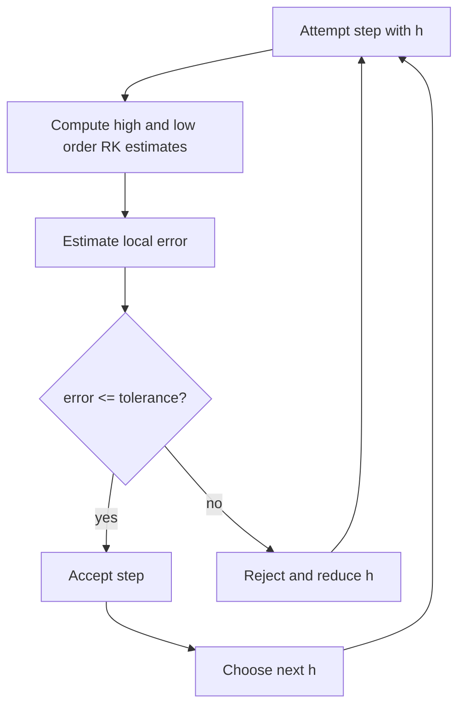

# Adaptive Runge Kutta and Multistep Methods

Fixed-step one-step methods are easy to explain, but real initial-value problems rarely need the same step size everywhere. Adaptive Runge-Kutta methods estimate the local error during a step and change $h$ automatically. Multistep methods use several previous solution values to reduce the cost per step after enough history has been built.

These two ideas answer different efficiency questions. Adaptive methods ask where effort should be spent. Multistep methods ask how to reuse information already computed. Many production ODE solvers combine both ideas with error control, order selection, and stiffness detection.

## Definitions

An **embedded Runge-Kutta pair** computes two approximations of different orders from nearly the same stages. If $w_{i+1}^{(p)}$ has order $p$ and $w_{i+1}^{(p+1)}$ has order $p+1$, then

$$
E_i=w_{i+1}^{(p+1)}-w_{i+1}^{(p)}
$$

estimates the local error of the lower-order approximation. A common step-size update is

$$
h_{new}=s h\left(\frac{\mathrm{tol}}{|E_i|}\right)^{1/(p+1)},
$$

where $s\lt 1$ is a safety factor.

A **linear multistep method** has the form

$$
\sum_{j=0}^{k}a_j w_{i+j}=h\sum_{j=0}^{k}b_j f(t_{i+j},w_{i+j}).
$$

If $b_k=0$, the method is explicit. Adams-Bashforth methods are explicit predictors; Adams-Moulton methods are implicit correctors. Backward differentiation formulas are implicit methods designed especially for stiff problems.

## Key results

Adaptive Runge-Kutta methods depend on local error estimates. A rejected step is not wasted entirely: it supplies information that a smaller step is needed. A successful step with error far below tolerance suggests that $h$ can grow. Practical solvers limit how quickly $h$ changes to avoid unstable oscillation in the controller.

A multistep method needs starting values. A $k$-step method cannot begin from only $w_0$, so a one-step method such as RK4 is often used to generate the first $k-1$ values. Multistep stability is more complicated than one-step stability because parasitic roots of the characteristic polynomial can grow even when the differential equation itself is harmless.

The second-order Adams-Bashforth method is

$$
w_{i+1}=w_i+\frac{h}{2}\left(3f(t_i,w_i)-f(t_{i-1},w_{i-1})\right).
$$

The trapezoidal Adams-Moulton corrector is

$$
w_{i+1}=w_i+\frac{h}{2}\left(f(t_{i+1},w_{i+1})+f(t_i,w_i)\right).
$$

Together they form a predictor-corrector pair: predict explicitly, evaluate the endpoint slope, then correct.

A reliable way to use these results is to keep the analysis tied to the actual numerical question rather than to the formula alone. For adaptive Runge-Kutta and multistep methods, the input record should include the ODE, tolerance, norm, accepted step history, and startup values. Without that record, two computations that look similar on paper may have different numerical meanings. The same formula can be a safe production tool in one scaling and a fragile experiment in another. This is why the examples on this page show the intermediate arithmetic: the goal is not only to reach a number, but to expose what assumptions made that number meaningful.

The next record is the verification record. Useful diagnostics for this topic include local error estimates, rejected-step counts, endpoint residual checks, and comparison against step halving. A diagnostic should be chosen before the computation is trusted, not after a pleasing answer appears. When an exact answer is unavailable, compare two independent approximations, refine the mesh or tolerance, check a residual, or test the method on a neighboring problem with known behavior. If several diagnostics disagree, treat the disagreement as information about conditioning, stability, or implementation rather than as a nuisance to be averaged away.

The cost record matters as well. In this topic the dominant costs are usually right-hand-side evaluations, linear solves for implicit variants, and memory for previous steps. Numerical analysis is full of methods that are mathematically attractive but computationally mismatched to the problem size. A dense factorization may be acceptable for a classroom matrix and impossible for a PDE grid. A high-order rule may use fewer steps but more expensive stages. A guaranteed method may take many iterations but provide a bound that a faster method cannot. The right comparison is therefore cost to reach a verified tolerance, not order or elegance in isolation.

Finally, every method here has a recognizable failure mode: overaggressive step growth, unstable multistep roots, and inaccurate starting values. These failures are not edge cases to memorize; they are signals that the hypotheses behind the result have been violated or that a different numerical model is needed. A good implementation makes such failures visible through exceptions, warnings, residual reports, or conservative stopping rules. A good hand solution does the same thing in prose by naming the assumption being used and checking it at the point where it matters.

For study purposes, the most useful habit is to separate four layers: the continuous mathematical problem, the discrete approximation, the algebraic or iterative algorithm used to compute it, and the diagnostic used to judge the result. Many mistakes come from mixing these layers. A small algebraic residual may not mean a small modeling error. A small step-to-step change may not mean the discrete equations are solved. A high-order truncation formula may not help when the data are noisy or the arithmetic is unstable. Keeping the layers separate makes the results on this page portable to larger examples.

## Visual



| Family | Memory | Error control | Cost pattern | Typical use |
|---|---:|---|---|---|
| Embedded RK | one current state | direct embedded estimate | several stages per step | general nonstiff IVPs |
| Adams-Bashforth | previous states | predictor estimate or pair | one new $f$ per step | smooth nonstiff IVPs |
| Adams-Moulton | previous plus new state | predictor-corrector | implicit solve or correction | higher accuracy, mild stiffness |
| BDF | previous states | variable order controllers | implicit solve | stiff systems |

## Worked example 1: step-size adjustment

**Problem.** An embedded fourth-order method takes a step with $h=0.1$ and estimates the local error as $E=2\times 10^{-5}$. The tolerance is $10^{-6}$. With safety factor $s=0.9$, compute the suggested new step size.

**Method.** For a fourth-order controlled solution, use exponent $1/(4+1)=1/5$.

1. Form the tolerance ratio:

$$
\frac{\mathrm{tol}}{|E|}=\frac{10^{-6}}{2\times 10^{-5}}=0.05.
$$

2. Apply the controller:

$$
h_{new}=0.9(0.1)(0.05)^{1/5}.
$$

3. Compute the fifth root:

$$
(0.05)^{1/5}=0.54928\ldots.
$$

4. Therefore

$$
h_{new}=0.0494\ldots.
$$

**Checked answer.** The proposed step is about $0.0494$, roughly half the original step, because the estimated error was twenty times too large.

## Worked example 2: Adams-Bashforth 2 step

**Problem.** Use AB2 for $y'=y$ with $h=0.1$, $w_0=1$, and $w_1=e^{0.1}=1.105170186\ldots$ to approximate $y(0.2)$.

**Method.** Here $f(t,w)=w$.

1. Write AB2:

$$
w_2=w_1+\frac{h}{2}(3w_1-w_0).
$$

2. Substitute values:

$$
w_2=1.105170186+0.05(3(1.105170186)-1).
$$

3. Simplify the slope combination:

$$
3(1.105170186)-1=2.315510558.
$$

4. Then

$$
w_2=1.105170186+0.115775528=1.220945714.
$$

**Checked answer.** The exact value is $e^{0.2}=1.221402758\ldots$, so the AB2 error is about $4.57\times 10^{-4}$.

## Code

```python
import math

def adaptive_heun(f, a, b, alpha, tol=1e-6, h_initial=0.1):
    t = a
    w = alpha
    h = h_initial
    out = [(t, w)]
    while t < b:
        h = min(h, b - t)
        k1 = f(t, w)
        euler = w + h * k1
        k2 = f(t + h, euler)
        heun = w + h * (k1 + k2) / 2.0
        err = abs(heun - euler)
        if err <= tol or h <= 1e-14:
            t += h
            w = heun
            out.append((t, w))
        factor = 2.0 if err == 0 else 0.9 * (tol / err) ** 0.5
        factor = min(2.0, max(0.25, factor))
        h *= factor
    return out

def adams_bashforth2(f, ts, ws, h, steps):
    ts = list(ts)
    ws = list(ws)
    for _ in range(steps):
        f_i = f(ts[-1], ws[-1])
        f_prev = f(ts[-2], ws[-2])
        ws.append(ws[-1] + h * (3.0 * f_i - f_prev) / 2.0)
        ts.append(ts[-1] + h)
    return list(zip(ts, ws))

f = lambda t, y: y
print(adaptive_heun(f, 0.0, 1.0, 1.0, tol=1e-5, h_initial=0.25)[-1])
print(adams_bashforth2(f, [0.0, 0.1], [1.0, math.exp(0.1)], 0.1, 3))
```

## Common pitfalls

- Accepting every adaptive step and only changing the next step size. A step whose error is too large should be recomputed.
- Letting the step size grow or shrink without bounds in one update.
- Starting a multistep method without sufficiently accurate history values.
- Ignoring stability restrictions for explicit multistep methods.
- Comparing multistep and Runge-Kutta methods only by order, not by function evaluations and rejected steps.

## Connections

- [Euler Taylor and Runge Kutta methods](/math/numerical-analysis/euler-taylor-runge-kutta)
- [ODE stability stiffness and systems](/math/numerical-analysis/ode-stability-stiffness-systems)
- [boundary value problems](/math/numerical-analysis/boundary-value-problems)
- [finite difference methods for PDEs](/math/numerical-analysis/finite-difference-pdes)
