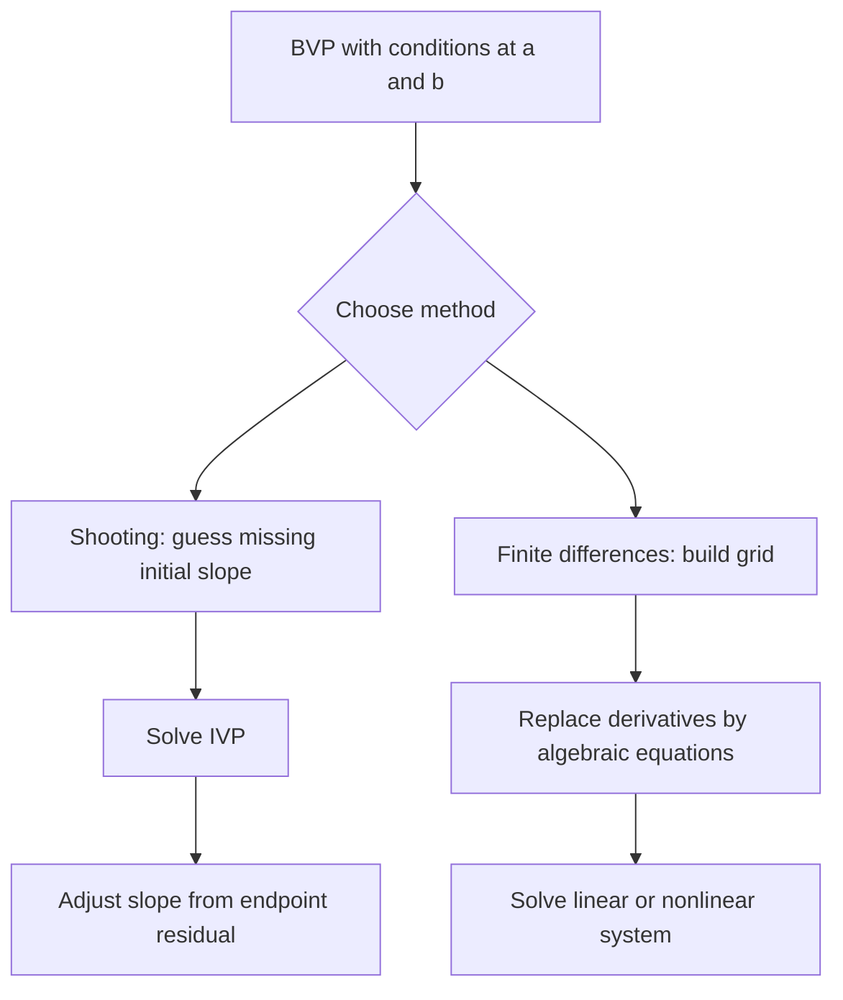

# Boundary Value Problems

Boundary value problems prescribe conditions at two or more points instead of giving all initial data at one point. This changes the numerical character of the problem. An initial-value method marches forward, while a boundary value method must coordinate the whole interval so that the endpoint conditions are satisfied together.

Two standard approaches are shooting and finite differences. Shooting guesses missing initial data and solves IVPs until the far boundary matches. Finite differences replace derivatives by algebraic equations at grid points, producing a linear or nonlinear system for all unknown values at once.

## Definitions

A second-order two-point boundary value problem has the form

$$
y''=f(x,y,y'),\qquad a\le x\le b,
$$

with boundary conditions

$$
y(a)=\alpha,
\qquad y(b)=\beta.
$$

The **shooting method** introduces a missing initial slope $s$ and solves the IVP

$$
y(a)=\alpha,
\qquad y'(a)=s.
$$

The value of $s$ is adjusted until the computed endpoint satisfies $y(b;s)=\beta$.

A finite difference method uses grid points $x_i=a+ih$ and replaces derivatives by formulas such as

$$
y''(x_i)\approx \frac{w_{i-1}-2w_i+w_{i+1}}{h^2}.
$$

The boundary values are known, and the interior values become unknowns in a system of algebraic equations.

## Key results

For linear problems of the form

$$
y''=p(x)y'+q(x)y+r(x),
$$

finite differences usually lead to a tridiagonal linear system. This structure should be exploited with a tridiagonal solver rather than dense elimination.

Shooting is intuitive and easy to implement when the IVP is stable with respect to the missing slope. It can be unreliable for unstable or stiff problems because small changes in the guessed slope may cause huge endpoint changes. Multiple solutions can also make the shooting residual nonlinear and difficult.

Finite difference methods are more global. For nonlinear BVPs, the finite difference equations form a nonlinear system that can be solved by Newton's method. The Jacobian is often banded because each equation involves only neighboring grid values.

Boundary conditions affect accuracy. A second-order centered difference in the interior may not give second-order global accuracy if boundary approximations are only first order.

A reliable way to use these results is to keep the analysis tied to the actual numerical question rather than to the formula alone. For boundary value problems, the input record should include the differential equation, boundary conditions, mesh, and choice of shooting or finite differences. Without that record, two computations that look similar on paper may have different numerical meanings. The same formula can be a safe production tool in one scaling and a fragile experiment in another. This is why the examples on this page show the intermediate arithmetic: the goal is not only to reach a number, but to expose what assumptions made that number meaningful.

The next record is the verification record. Useful diagnostics for this topic include endpoint mismatch for shooting or algebraic residuals for finite difference equations. A diagnostic should be chosen before the computation is trusted, not after a pleasing answer appears. When an exact answer is unavailable, compare two independent approximations, refine the mesh or tolerance, check a residual, or test the method on a neighboring problem with known behavior. If several diagnostics disagree, treat the disagreement as information about conditioning, stability, or implementation rather than as a nuisance to be averaged away.

The cost record matters as well. In this topic the dominant costs are usually IVP solves, nonlinear iterations, and banded linear solves. Numerical analysis is full of methods that are mathematically attractive but computationally mismatched to the problem size. A dense factorization may be acceptable for a classroom matrix and impossible for a PDE grid. A high-order rule may use fewer steps but more expensive stages. A guaranteed method may take many iterations but provide a bound that a faster method cannot. The right comparison is therefore cost to reach a verified tolerance, not order or elegance in isolation.

Finally, every method here has a recognizable failure mode: unstable shooting directions, boundary discretization errors, and multiple solutions. These failures are not edge cases to memorize; they are signals that the hypotheses behind the result have been violated or that a different numerical model is needed. A good implementation makes such failures visible through exceptions, warnings, residual reports, or conservative stopping rules. A good hand solution does the same thing in prose by naming the assumption being used and checking it at the point where it matters.

For study purposes, the most useful habit is to separate four layers: the continuous mathematical problem, the discrete approximation, the algebraic or iterative algorithm used to compute it, and the diagnostic used to judge the result. Many mistakes come from mixing these layers. A small algebraic residual may not mean a small modeling error. A small step-to-step change may not mean the discrete equations are solved. A high-order truncation formula may not help when the data are noisy or the arithmetic is unstable. Keeping the layers separate makes the results on this page portable to larger examples.

A useful BVP check is to compare the boundary residual with the interior residual. If the boundary values are satisfied to high accuracy while the interior equations are poor, the mesh equations or nonlinear solve are suspect. If the interior residual is small but the boundary residual is large, the shooting parameter, boundary insertion, or endpoint discretization should be inspected first.
 Mesh endpoints and unknown indexing should be written down, because off-by-one grid errors are common in BVP codes.

## Visual



| Method | Unknowns | Strength | Weakness |
|---|---|---|---|
| Shooting | missing initial data | reuses IVP solvers | sensitive to unstable IVPs |
| Linear finite difference | grid values | structured linear system | lower local detail unless grid refined |
| Nonlinear finite difference | grid values | handles nonlinear BVPs globally | requires Newton or nonlinear solver |
| Collocation | coefficients or nodal values | high accuracy | more complex assembly |

## Worked example 1: finite difference for $y''=0$

**Problem.** Solve

$$
y''=0,
\qquad y(0)=1,
\qquad y(1)=3
$$

using one interior grid point at $x=0.5$.

**Method.** Let $h=0.5$, $w_0=1$, $w_2=3$, and $w_1\approx y(0.5)$.

1. The centered second difference equation is

$$
\frac{w_0-2w_1+w_2}{h^2}=0.
$$

2. Multiply by $h^2$:

$$
w_0-2w_1+w_2=0.
$$

3. Substitute boundary values:

$$
1-2w_1+3=0.
$$

4. Solve:

$$
4-2w_1=0 \Rightarrow w_1=2.
$$

**Checked answer.** The exact solution is the line $y=1+2x$, so $y(0.5)=2$. The finite difference value is exact for this linear solution.

## Worked example 2: shooting slope for a forced equation

**Problem.** For

$$
y''=-\pi^2\sin(\pi x),
\qquad y(0)=0,
\qquad y(1)=0,
$$

find the initial slope required by shooting.

**Method.** Solve analytically with an unknown slope $s=y'(0)$.

1. Integrate twice. A particular solution is $\sin(\pi x)$, so

$$
y(x)=\sin(\pi x)+Cx+D.
$$

2. Apply $y(0)=0$:

$$
0+0+D=0 \Rightarrow D=0.
$$

3. Differentiate:

$$
y'(x)=\pi\cos(\pi x)+C.
$$

Thus

$$
s=y'(0)=\pi+C.
$$

4. Apply $y(1)=0$:

$$
0+C=0 \Rightarrow C=0.
$$

So $s=\pi$.

**Checked answer.** Shooting must use $y'(0)=\pi$ to satisfy the right boundary. The resulting solution is $y(x)=\sin(\pi x)$.

## Code

```python
import numpy as np

def finite_difference_poisson(a, b, alpha, beta, source, n):
    h = (b - a) / n
    xs = np.linspace(a, b, n + 1)
    m = n - 1
    A = np.zeros((m, m))
    rhs = np.zeros(m)
    for i in range(m):
        x = xs[i + 1]
        A[i, i] = -2.0
        if i > 0:
            A[i, i - 1] = 1.0
        if i < m - 1:
            A[i, i + 1] = 1.0
        rhs[i] = h * h * source(x)
    rhs[0] -= alpha
    rhs[-1] -= beta
    interior = np.linalg.solve(A, rhs)
    return xs, np.r_[alpha, interior, beta]

xs, ys = finite_difference_poisson(0.0, 1.0, 0.0, 0.0,
                                   lambda x: -np.pi**2 * np.sin(np.pi * x), 10)
print(max(abs(ys - np.sin(np.pi * xs))))
```

## Common pitfalls

- Treating a BVP like an IVP without accounting for the far boundary condition.
- Using shooting on an unstable IVP and blaming the root finder for sensitivity.
- Forgetting to insert boundary values into the finite difference right-hand side.
- Destroying tridiagonal or banded structure with dense assembly.
- Applying centered interior formulas but lower-order boundary formulas without checking global accuracy.

## Connections

- [Euler Taylor and Runge Kutta methods](/math/numerical-analysis/euler-taylor-runge-kutta)
- [nonlinear systems](/math/numerical-analysis/nonlinear-systems)
- [matrix factorizations and special systems](/math/numerical-analysis/matrix-factorizations-special-systems)
- [finite difference methods for PDEs](/math/numerical-analysis/finite-difference-pdes)
