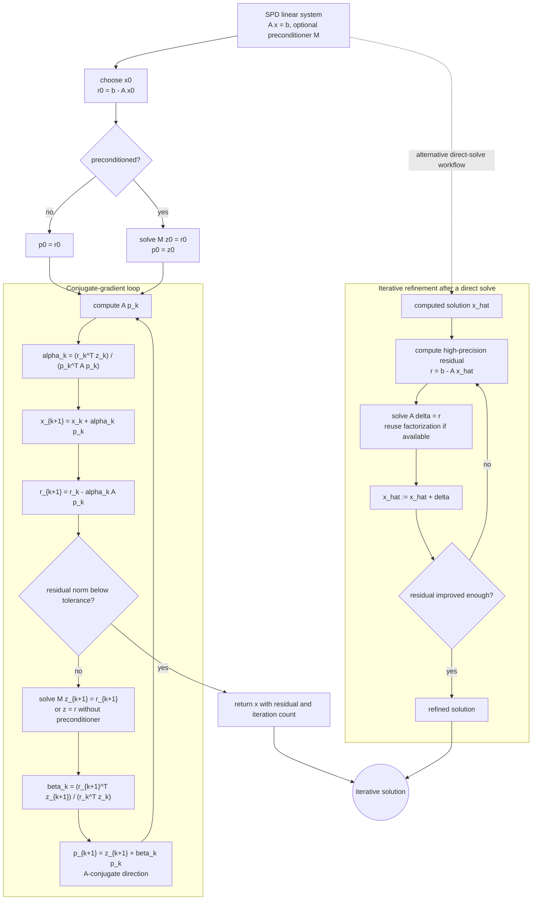

# Conjugate Gradient and Iterative Refinement

Conjugate gradient is an iterative method designed for symmetric positive definite linear systems. It improves on stationary iterations by choosing search directions that are conjugate with respect to the matrix $A$, which prevents the method from repeatedly correcting the same error component. For large sparse SPD systems, CG is often the first serious method to try.


*Figure: Matrix multiplication can be read geometrically as a transformation of vectors. Image: [Wikimedia Commons](https://commons.wikimedia.org/wiki/File:Matrix_multiplication.svg), Jakob.scholbach and Pbroks13, CC BY-SA 3.0.*

Iterative refinement is a different idea: compute a solution, form the residual, solve for a correction, and update the solution. It can improve the accuracy of a direct solve when the residual is computed accurately enough and the original problem is not too ill-conditioned.

## Definitions

For an SPD matrix $A$, solving $Ax=b$ is equivalent to minimizing the quadratic function

$$
\phi(x)=\frac12x^TAx-b^Tx.
$$

The residual is

$$
r^{(k)}=b-Ax^{(k)}.
$$

CG starts from $x^{(0)}$, sets $r^{(0)}=b-Ax^{(0)}$, and chooses the first search direction $p^{(0)}=r^{(0)}$. The basic recurrences are

$$
\alpha_k=\frac{(r^{(k)})^Tr^{(k)}}{(p^{(k)})^TAp^{(k)}},
$$

$$
x^{(k+1)}=x^{(k)}+\alpha_kp^{(k)},
\qquad
r^{(k+1)}=r^{(k)}-\alpha_kAp^{(k)},
$$

$$
\beta_k=\frac{(r^{(k+1)})^Tr^{(k+1)}}{(r^{(k)})^Tr^{(k)}},
\qquad
p^{(k+1)}=r^{(k+1)}+\beta_kp^{(k)}.
$$

Iterative refinement computes $r=b-A\hat{x}$, solves $Ad=r$, and replaces $\hat{x}$ by $\hat{x}+d$.

## Key results

In exact arithmetic, CG terminates in at most $n$ steps for an $n\times n$ SPD matrix. In floating-point arithmetic it is used as an iterative method, and convergence depends strongly on the eigenvalue distribution of $A$. A standard bound is

$$
\|x^{(k)}-x\|_A
\le
2\left(\frac{\sqrt{\kappa(A)}-1}{\sqrt{\kappa(A)}+1}\right)^k
\|x^{(0)}-x\|_A.
$$

The $A$-norm is defined by $\|v\|_A=\sqrt{v^TAv}$. The bound shows why preconditioning matters: reducing the effective condition number can dramatically reduce iteration count.

CG search directions satisfy $p_i^TAp_j=0$ for $i\ne j$ in exact arithmetic, and residuals are mutually orthogonal. These properties explain the method's efficiency. They also explain why roundoff can eventually slow progress; finite precision gradually erodes exact orthogonality.

Iterative refinement improves a computed solution when the correction equation is solved accurately enough relative to the conditioning. It is especially useful when factorization is done once and corrections are cheap triangular solves.

A reliable way to use these results is to keep the analysis tied to the actual numerical question rather than to the formula alone. For conjugate gradient and iterative refinement, the input record should include SPD structure, residual norm, preconditioner choice, and correction precision. Without that record, two computations that look similar on paper may have different numerical meanings. The same formula can be a safe production tool in one scaling and a fragile experiment in another. This is why the examples on this page show the intermediate arithmetic: the goal is not only to reach a number, but to expose what assumptions made that number meaningful.

The next record is the verification record. Useful diagnostics for this topic include residual norm, A-norm error estimates, and improvement after refinement. A diagnostic should be chosen before the computation is trusted, not after a pleasing answer appears. When an exact answer is unavailable, compare two independent approximations, refine the mesh or tolerance, check a residual, or test the method on a neighboring problem with known behavior. If several diagnostics disagree, treat the disagreement as information about conditioning, stability, or implementation rather than as a nuisance to be averaged away.

The cost record matters as well. In this topic the dominant costs are usually sparse matrix-vector products, preconditioner solves, and residual recomputation. Numerical analysis is full of methods that are mathematically attractive but computationally mismatched to the problem size. A dense factorization may be acceptable for a classroom matrix and impossible for a PDE grid. A high-order rule may use fewer steps but more expensive stages. A guaranteed method may take many iterations but provide a bound that a faster method cannot. The right comparison is therefore cost to reach a verified tolerance, not order or elegance in isolation.

Finally, every method here has a recognizable failure mode: loss of conjugacy, poor conditioning, and refinement residuals computed too inaccurately. These failures are not edge cases to memorize; they are signals that the hypotheses behind the result have been violated or that a different numerical model is needed. A good implementation makes such failures visible through exceptions, warnings, residual reports, or conservative stopping rules. A good hand solution does the same thing in prose by naming the assumption being used and checking it at the point where it matters.

For study purposes, the most useful habit is to separate four layers: the continuous mathematical problem, the discrete approximation, the algebraic or iterative algorithm used to compute it, and the diagnostic used to judge the result. Many mistakes come from mixing these layers. A small algebraic residual may not mean a small modeling error. A small step-to-step change may not mean the discrete equations are solved. A high-order truncation formula may not help when the data are noisy or the arithmetic is unstable. Keeping the layers separate makes the results on this page portable to larger examples.

## Visual



The CG loop shows the full state carried between iterations: residuals, optional preconditioned residuals, search directions, matrix-vector products, step lengths, and conjugacy updates. The separate refinement subgraph covers the direct-solve correction workflow, where a high-quality residual drives a correction equation. Both paths end with explicit residual reporting because convergence is a numerical claim, not just a loop exit.

| Method | Matrix class | Main cost | Strength | Limitation |
|---|---|---|---|---|
| CG | SPD | sparse matrix-vector products | fast for large sparse SPD | needs preconditioning for hard spectra |
| Jacobi/GS | special convergence cases | sparse sweeps | simple smoothers | slow alone |
| Iterative refinement | already factored systems | residual plus correction solves | improves direct solution | limited by conditioning and residual precision |
| Preconditioned CG | SPD with preconditioner | solve with $M$ plus matvec | reduces effective condition number | preconditioner design is problem-specific |

## Worked example 1: two CG steps solve a 2 by 2 system

**Problem.** Use CG from $x^{(0)}=(0,0)^T$ for

$$
A=\begin{bmatrix}4&1\\1&3\end{bmatrix},
\qquad
b=\begin{bmatrix}1\\2\end{bmatrix}.
$$

**Method.** Start with $r^{(0)}=b$ and $p^{(0)}=b$.

1. Compute

$$
Ap^{(0)}=\begin{bmatrix}6\\7\end{bmatrix},
\qquad
\alpha_0=\frac{b^Tb}{b^TA b}=\frac{5}{20}=0.25.
$$

2. Update

$$
x^{(1)}=\begin{bmatrix}0.25\\0.5\end{bmatrix},
\qquad
r^{(1)}=b-0.25\begin{bmatrix}6\\7\end{bmatrix}
=\begin{bmatrix}-0.5\\0.25\end{bmatrix}.
$$

3. Compute

$$
\beta_0=\frac{(r^{(1)})^Tr^{(1)}}{(r^{(0)})^Tr^{(0)}}=\frac{0.3125}{5}=0.0625.
$$

4. The next direction is

$$
p^{(1)}=r^{(1)}+0.0625p^{(0)}
=\begin{bmatrix}-0.4375\\0.375\end{bmatrix}.
$$

5. The second step gives $x^{(2)}=(0.090909,0.636364)^T$.

**Checked answer.** Direct solution gives $(1/11,7/11)^T$, matching the CG result after two steps in exact arithmetic.

## Worked example 2: one iterative refinement correction

**Problem.** For the same matrix and right-hand side, suppose

$$
\hat{x}=\begin{bmatrix}0.09\\0.64\end{bmatrix}.
$$

Compute one refinement correction.

**Method.** Form $r=b-A\hat{x}$.

1. Multiply:

$$
A\hat{x}=\begin{bmatrix}4(0.09)+0.64\\0.09+3(0.64)\end{bmatrix}
=\begin{bmatrix}1.00\\2.01\end{bmatrix}.
$$

2. Residual:

$$
r=\begin{bmatrix}1\\2\end{bmatrix}-\begin{bmatrix}1.00\\2.01\end{bmatrix}
=\begin{bmatrix}0\\-0.01\end{bmatrix}.
$$

3. Solve $Ad=r$. Since $A^{-1}=\frac1{11}\begin{bmatrix}3&-1\\-1&4\end{bmatrix}$,

$$
d=\frac1{11}\begin{bmatrix}0.01\\-0.04\end{bmatrix}
=\begin{bmatrix}0.000909\\-0.003636\end{bmatrix}.
$$

4. Correct:

$$
\hat{x}+d=\begin{bmatrix}0.090909\\0.636364\end{bmatrix}.
$$

**Checked answer.** One correction recovers the exact solution to the displayed precision.

## Code

```python
import numpy as np

def conjugate_gradient(A, b, x0=None, tol=1e-10, max_iter=None):
    A = np.asarray(A, dtype=float)
    b = np.asarray(b, dtype=float)
    n = len(b)
    x = np.zeros(n) if x0 is None else np.asarray(x0, dtype=float)
    max_iter = n if max_iter is None else max_iter
    r = b - A @ x
    p = r.copy()
    rs_old = float(r @ r)
    for k in range(1, max_iter + 1):
        Ap = A @ p
        alpha = rs_old / float(p @ Ap)
        x = x + alpha * p
        r = r - alpha * Ap
        rs_new = float(r @ r)
        if rs_new**0.5 < tol:
            return x, k
        p = r + (rs_new / rs_old) * p
        rs_old = rs_new
    return x, max_iter

def iterative_refinement(A, b, x, steps=1):
    A = np.asarray(A, dtype=float)
    b = np.asarray(b, dtype=float)
    x = np.asarray(x, dtype=float).copy()
    for _ in range(steps):
        r = b - A @ x
        d = np.linalg.solve(A, r)
        x = x + d
    return x

A = np.array([[4.0, 1.0], [1.0, 3.0]])
b = np.array([1.0, 2.0])
print(conjugate_gradient(A, b, max_iter=2))
print(iterative_refinement(A, b, np.array([0.09, 0.64])))
```

## Common pitfalls

- Using CG on a nonsymmetric or indefinite matrix. The standard method requires SPD structure.
- Monitoring only iterate changes instead of residual norms.
- Expecting the exact $n$-step termination property in floating-point arithmetic.
- Ignoring preconditioning for ill-conditioned SPD systems.
- Performing refinement with a residual computed at the same low precision that caused the original error.

## Connections

- [Jacobi Gauss Seidel and SOR](/math/numerical-analysis/iterative-linear-systems)
- [matrix factorizations and special systems](/math/numerical-analysis/matrix-factorizations-special-systems)
- [Gaussian elimination pivoting and LU](/math/numerical-analysis/gaussian-elimination-pivoting-lu)
- [finite difference methods for PDEs](/math/numerical-analysis/finite-difference-pdes)
