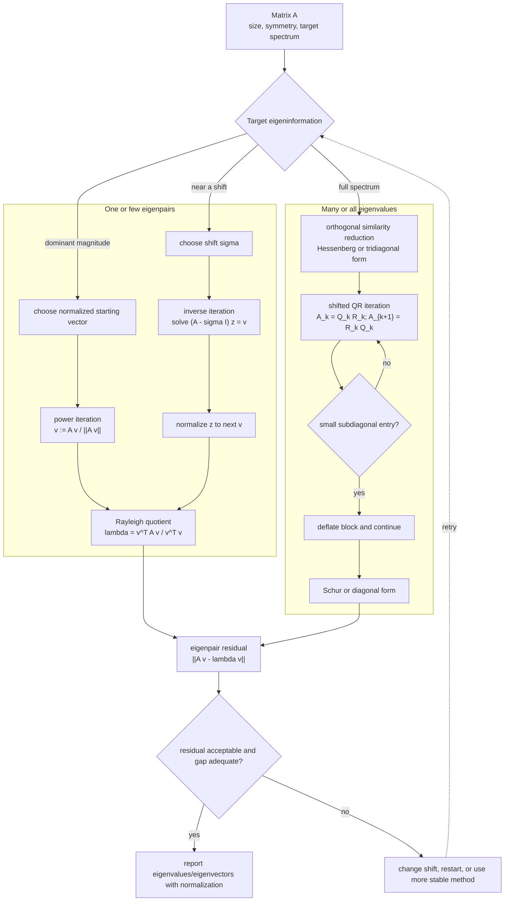

# Eigenvalue Methods

Eigenvalue algorithms approximate scalars and vectors satisfying $Av=\lambda v$. They are central because eigenvalues describe stability, vibration modes, principal components, graph connectivity, and convergence rates of iterative methods. Numerical eigenvalue methods are built from the same matrix transformations used in linear systems, but their goal is spectral information rather than a solution to one right-hand side.

The power method finds a dominant eigenvalue. Inverse iteration targets an eigenvalue near a shift. Householder reductions and QR iteration form the backbone of dense eigenvalue software. The algorithms differ in scope, but they all try to reveal eigenvalues while controlling the effect of roundoff.

## Definitions

An **eigenpair** of $A$ is a scalar-vector pair $(\lambda,v)$ with $v\ne 0$ such that

$$
Av=\lambda v.
$$

The Rayleigh quotient of a nonzero vector $x$ is

$$
\rho(x)=\frac{x^TAx}{x^Tx}.
$$

For symmetric matrices, the Rayleigh quotient is a natural eigenvalue estimate associated with $x$.

The power method repeats

$$
y^{(k)}=Ax^{(k)},
\qquad
x^{(k+1)}=\frac{y^{(k)}}{\|y^{(k)}\|}.
$$

Inverse iteration with shift $\mu$ solves

$$
(A-\mu I)y^{(k)}=x^{(k)}
$$

and normalizes $y^{(k)}$. It converges toward an eigenvector whose eigenvalue is near $\mu$ when the shifted system is well defined.

The QR algorithm forms

$$
A_k=Q_kR_k,
\qquad
A_{k+1}=R_kQ_k.
$$

## Key results

If $A$ has eigenvalues ordered by magnitude with

$$
|\lambda_1|\gt |\lambda_2|\ge \cdots,
$$

and the starting vector has a nonzero component in the dominant eigenvector direction, the power method converges linearly with asymptotic factor

$$
\left|\frac{\lambda_2}{\lambda_1}\right|.
$$

A small spectral gap leads to slow convergence.

QR iteration preserves eigenvalues because

$$
A_{k+1}=R_kQ_k=Q_k^TA_kQ_k,
$$

so $A_{k+1}$ is orthogonally similar to $A_k$. Orthogonal similarity is preferred because it preserves norms and is numerically stable. Practical QR algorithms first reduce a dense matrix to Hessenberg form, or to tridiagonal form in the symmetric case, and then use shifts to accelerate convergence.

For any computed eigenpair $(\hat\lambda,\hat v)$, the residual

$$
r=A\hat v-\hat\lambda\hat v
$$

is an essential diagnostic. A small residual is necessary, but eigenvalue sensitivity also depends on eigenvector conditioning, especially for nonsymmetric matrices.

A reliable way to use these results is to keep the analysis tied to the actual numerical question rather than to the formula alone. For eigenvalue methods, the input record should include the target part of the spectrum, symmetry, starting vector, and shift strategy. Without that record, two computations that look similar on paper may have different numerical meanings. The same formula can be a safe production tool in one scaling and a fragile experiment in another. This is why the examples on this page show the intermediate arithmetic: the goal is not only to reach a number, but to expose what assumptions made that number meaningful.

The next record is the verification record. Useful diagnostics for this topic include eigenpair residuals, Rayleigh quotients, and changes in invariant subspaces. A diagnostic should be chosen before the computation is trusted, not after a pleasing answer appears. When an exact answer is unavailable, compare two independent approximations, refine the mesh or tolerance, check a residual, or test the method on a neighboring problem with known behavior. If several diagnostics disagree, treat the disagreement as information about conditioning, stability, or implementation rather than as a nuisance to be averaged away.

The cost record matters as well. In this topic the dominant costs are usually matrix-vector products, factorizations, and orthogonal reductions. Numerical analysis is full of methods that are mathematically attractive but computationally mismatched to the problem size. A dense factorization may be acceptable for a classroom matrix and impossible for a PDE grid. A high-order rule may use fewer steps but more expensive stages. A guaranteed method may take many iterations but provide a bound that a faster method cannot. The right comparison is therefore cost to reach a verified tolerance, not order or elegance in isolation.

Finally, every method here has a recognizable failure mode: small spectral gaps, nonnormal sensitivity, and unshifted iterations that stagnate. These failures are not edge cases to memorize; they are signals that the hypotheses behind the result have been violated or that a different numerical model is needed. A good implementation makes such failures visible through exceptions, warnings, residual reports, or conservative stopping rules. A good hand solution does the same thing in prose by naming the assumption being used and checking it at the point where it matters.

For study purposes, the most useful habit is to separate four layers: the continuous mathematical problem, the discrete approximation, the algebraic or iterative algorithm used to compute it, and the diagnostic used to judge the result. Many mistakes come from mixing these layers. A small algebraic residual may not mean a small modeling error. A small step-to-step change may not mean the discrete equations are solved. A high-order truncation formula may not help when the data are noisy or the arithmetic is unstable. Keeping the layers separate makes the results on this page portable to larger examples.

Eigenvalue computations should also report normalization and phase conventions for eigenvectors. The vector $v$ and any nonzero multiple of $v$ represent the same eigenvector, so comparisons must use angles, residuals, or normalized signs rather than raw component equality. This is especially important when testing iterative methods against library routines.

## Visual



This eigenvalue-method diagram separates single-eigenpair iterations from full-spectrum QR architecture. Power and inverse iteration feed a Rayleigh-quotient and residual check, while the QR path first reduces the matrix by similarity transformations and then deflates converged blocks. The sensitivity branch records that residual size must be interpreted with spectral gaps and matrix conditioning in mind.

| Method | Target | Main cost | Convergence driver | Warning |
|---|---|---|---|---|
| Power method | largest magnitude eigenvalue | matrix-vector products | $\vert \lambda_2/\lambda_1\vert $ | fails if no dominant magnitude |
| Inverse iteration | eigenvalue near shift | linear solves | closeness to shift | shifted system may be ill-conditioned |
| Rayleigh quotient iteration | symmetric eigenpair | linear solves | often cubic locally | needs good starting vector |
| QR algorithm | many eigenvalues | factorizations | similarity transformations | unshifted version can be slow |

## Worked example 1: one power iteration

**Problem.** Apply one power-method step to

$$
A=\begin{bmatrix}2&1\\1&2\end{bmatrix}
$$

from $x^{(0)}=(1,0)^T$ using the Euclidean norm.

**Method.** Multiply and normalize.

1. Compute

$$
y^{(0)}=Ax^{(0)}=\begin{bmatrix}2\\1\end{bmatrix}.
$$

2. Its norm is

$$
\|y^{(0)}\|_2=\sqrt{2^2+1^2}=\sqrt5.
$$

3. Normalize:

$$
x^{(1)}=\frac1{\sqrt5}\begin{bmatrix}2\\1\end{bmatrix}
=\begin{bmatrix}0.894427\\0.447214\end{bmatrix}.
$$

4. The Rayleigh quotient is

$$
\rho(x^{(1)})=(x^{(1)})^TAx^{(1)}=2.8.
$$

**Checked answer.** The dominant eigenvalue is $3$, with eigenvector proportional to $(1,1)^T$. The first Rayleigh estimate $2.8$ is already moving toward $3$.

## Worked example 2: one QR similarity step

**Problem.** For

$$
A=\begin{bmatrix}2&1\\1&2\end{bmatrix},
$$

state why a QR step preserves eigenvalues.

**Method.** Factor $A=QR$ with $Q$ orthogonal, then set $A_1=RQ$.

1. Since $A=QR$, multiply by $Q^T$ on the left:

$$
R=Q^TA.
$$

2. The next QR iterate is

$$
A_1=RQ=Q^TAQ.
$$

3. This is a similarity transformation because $Q^{-1}=Q^T$.

4. Similar matrices have the same characteristic polynomial:

$$
\det(A_1-\lambda I)=\det(Q^T(A-\lambda I)Q)=\det(A-\lambda I).
$$

**Checked answer.** A QR step changes the matrix entries but preserves the eigenvalues. Repeated shifted QR steps drive the matrix toward triangular or diagonal form where eigenvalues are visible.

## Code

```python
import numpy as np

def power_method(A, x0=None, tol=1e-12, max_iter=1000):
    A = np.asarray(A, dtype=float)
    n = A.shape[0]
    x = np.ones(n) if x0 is None else np.asarray(x0, dtype=float)
    x = x / np.linalg.norm(x)
    last = None
    for k in range(1, max_iter + 1):
        y = A @ x
        x = y / np.linalg.norm(y)
        lam = float(x @ A @ x)
        if last is not None and abs(lam - last) < tol:
            return lam, x, k
        last = lam
    return last, x, max_iter

def qr_algorithm(A, tol=1e-12, max_iter=1000):
    Ak = np.array(A, dtype=float, copy=True)
    for _ in range(max_iter):
        Q, R = np.linalg.qr(Ak)
        Ak = R @ Q
        if np.linalg.norm(np.tril(Ak, -1)) < tol:
            break
    return np.diag(Ak), Ak

A = np.array([[2.0, 1.0], [1.0, 2.0]])
print(power_method(A, [1.0, 0.0]))
print(qr_algorithm(A)[0])
```

## Common pitfalls

- Using the power method when the dominant eigenvalue is not unique in magnitude.
- Reporting an eigenvalue without an eigenvector residual.
- Forgetting that nonsymmetric eigenvalue problems can be much more sensitive than symmetric ones.
- Running unshifted QR and expecting production-level performance.
- Solving shifted inverse iteration systems from scratch when repeated factorizations can be reused.

## Connections

- [ODE stability stiffness and systems](/math/numerical-analysis/ode-stability-stiffness-systems)
- [conjugate gradient and iterative refinement](/math/numerical-analysis/conjugate-gradient-iterative-refinement)
- [matrix factorizations and special systems](/math/numerical-analysis/matrix-factorizations-special-systems)
- [least squares and Chebyshev approximation](/math/numerical-analysis/least-squares-chebyshev-approximation)
