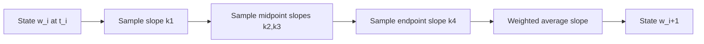

# Euler Taylor and Runge Kutta Methods

Initial-value problems ask for a function whose derivative is prescribed by an equation and whose starting value is known. Numerical ODE methods turn that continuous problem into a sequence of time steps. Euler's method is the simplest step, Taylor methods use analytic derivative information, and Runge-Kutta methods imitate Taylor accuracy using only evaluations of the right-hand side.

These methods are the foundation for later adaptive, multistep, stiff, and system solvers. The main questions are always the same: how much local error is made in one step, how does that error accumulate globally, and how many right-hand-side evaluations are worth spending per step?

## Definitions

An initial-value problem has the form

$$
y'=f(t,y),\qquad y(a)=\alpha.
$$

A one-step method computes approximations $w_i\approx y(t_i)$ on a grid $t_i=a+ih$. Euler's method is

$$
w_{i+1}=w_i+h f(t_i,w_i).
$$

A Taylor method of order $m$ expands the exact solution:

$$
w_{i+1}=w_i+h y'(t_i)+\frac{h^2}{2}y''(t_i)+\cdots+\frac{h^m}{m!}y^{(m)}(t_i),
$$

where the higher derivatives are rewritten using $f$ and its partial derivatives.

The classical fourth-order Runge-Kutta method, usually called RK4, is

$$
\begin{aligned}
k_1&=f(t_i,w_i),\\
k_2&=f(t_i+h/2,w_i+hk_1/2),\\
k_3&=f(t_i+h/2,w_i+hk_2/2),\\
k_4&=f(t_i+h,w_i+hk_3),\\
w_{i+1}&=w_i+\frac{h}{6}(k_1+2k_2+2k_3+k_4).
\end{aligned}
$$

## Key results

Euler's method has local truncation error $O(h^2)$ and global error $O(h)$ under standard Lipschitz assumptions. RK4 has local truncation error $O(h^5)$ and global error $O(h^4)$. The difference between local and global order comes from taking about $(b-a)/h$ steps.

A one-step method is **consistent** if its local truncation error tends to zero fast enough as $h\to 0$. It is **convergent** if the numerical solution approaches the exact solution on a fixed interval as $h\to 0$. For well-posed nonstiff IVPs, consistency plus stability gives convergence.

Runge-Kutta methods can be represented by a Butcher tableau, which records the internal stages and final weights. The tableau is more than notation: order conditions, embedded pairs, and stability functions are all expressed through those coefficients. RK4 is popular because it gives high accuracy for smooth nonstiff problems without requiring derivatives of $f$.

A reliable way to use these results is to keep the analysis tied to the actual numerical question rather than to the formula alone. For Euler, Taylor, and Runge-Kutta methods, the input record should include the IVP, step size, right-hand-side smoothness, and method order. Without that record, two computations that look similar on paper may have different numerical meanings. The same formula can be a safe production tool in one scaling and a fragile experiment in another. This is why the examples on this page show the intermediate arithmetic: the goal is not only to reach a number, but to expose what assumptions made that number meaningful.

The next record is the verification record. Useful diagnostics for this topic include global error checks, step-halving comparisons, and qualitative behavior against the ODE. A diagnostic should be chosen before the computation is trusted, not after a pleasing answer appears. When an exact answer is unavailable, compare two independent approximations, refine the mesh or tolerance, check a residual, or test the method on a neighboring problem with known behavior. If several diagnostics disagree, treat the disagreement as information about conditioning, stability, or implementation rather than as a nuisance to be averaged away.

The cost record matters as well. In this topic the dominant costs are usually function evaluations per step and derivative formulas for Taylor methods. Numerical analysis is full of methods that are mathematically attractive but computationally mismatched to the problem size. A dense factorization may be acceptable for a classroom matrix and impossible for a PDE grid. A high-order rule may use fewer steps but more expensive stages. A guaranteed method may take many iterations but provide a bound that a faster method cannot. The right comparison is therefore cost to reach a verified tolerance, not order or elegance in isolation.

Finally, every method here has a recognizable failure mode: stiffness, discontinuities, and confusing local order with global accuracy. These failures are not edge cases to memorize; they are signals that the hypotheses behind the result have been violated or that a different numerical model is needed. A good implementation makes such failures visible through exceptions, warnings, residual reports, or conservative stopping rules. A good hand solution does the same thing in prose by naming the assumption being used and checking it at the point where it matters.

For study purposes, the most useful habit is to separate four layers: the continuous mathematical problem, the discrete approximation, the algebraic or iterative algorithm used to compute it, and the diagnostic used to judge the result. Many mistakes come from mixing these layers. A small algebraic residual may not mean a small modeling error. A small step-to-step change may not mean the discrete equations are solved. A high-order truncation formula may not help when the data are noisy or the arithmetic is unstable. Keeping the layers separate makes the results on this page portable to larger examples.

## Visual

| Method | Stages per step | Global order | Uses derivatives of $f$? | Typical role |
|---|---:|---:|---|---|
| Euler | 1 | 1 | no | teaching, rough predictor |
| Taylor order 2 | 1 plus derivative formulas | 2 | yes | analysis and special problems |
| Midpoint RK | 2 | 2 | no | cheap improvement over Euler |
| Classical RK4 | 4 | 4 | no | reliable fixed-step baseline |



## Worked example 1: Euler steps for a standard IVP

**Problem.** Apply Euler's method with $h=0.5$ to

$$
y'=y-t^2+1,
\qquad y(0)=0.5,
$$

through $t=1$.

**Method.** Use $w_{i+1}=w_i+h(w_i-t_i^2+1)$.

1. At $t_0=0$, $w_0=0.5$:

$$
f(0,0.5)=0.5-0+1=1.5.
$$

$$
w_1=0.5+0.5(1.5)=1.25.
$$

2. At $t_1=0.5$, $w_1=1.25$:

$$
f(0.5,1.25)=1.25-0.25+1=2.0.
$$

$$
w_2=1.25+0.5(2.0)=2.25.
$$

3. The exact solution is

$$
y(t)=(t+1)^2-\frac12e^t.
$$

At $t=1$,

$$
y(1)=4-\frac12e=2.640859\ldots.
$$

**Checked answer.** Euler's approximation at $t=1$ is $2.25$, with absolute error about $0.390859$.

## Worked example 2: one RK4 step

**Problem.** Use one RK4 step of size $h=0.5$ for the same IVP from $t=0$ to $t=0.5$.

**Method.** Use $f(t,y)=y-t^2+1$ and $w_0=0.5$.

1. Stage values:

$$
k_1=f(0,0.5)=1.5.
$$

$$
k_2=f(0.25,0.5+0.25k_1)=f(0.25,0.875)=1.8125.
$$

$$
k_3=f(0.25,0.5+0.25k_2)=f(0.25,0.953125)=1.890625.
$$

$$
k_4=f(0.5,0.5+0.5k_3)=f(0.5,1.4453125)=2.1953125.
$$

2. Combine stages:

$$
w_1=0.5+\frac{0.5}{6}(1.5+2(1.8125)+2(1.890625)+2.1953125).
$$

3. Therefore

$$
w_1=1.4251302083\ldots.
$$

**Checked answer.** The exact value is $y(0.5)=2.25-0.5e^{0.5}=1.425639364\ldots$, so the one-step RK4 error is about $5.09\times 10^{-4}$.

## Code

```python
import math

def euler(f, a, b, alpha, n):
    h = (b - a) / n
    t = a
    w = alpha
    values = [(t, w)]
    for _ in range(n):
        w = w + h * f(t, w)
        t = t + h
        values.append((t, w))
    return values

def rk4(f, a, b, alpha, n):
    h = (b - a) / n
    t = a
    w = alpha
    values = [(t, w)]
    for _ in range(n):
        k1 = f(t, w)
        k2 = f(t + h / 2, w + h * k1 / 2)
        k3 = f(t + h / 2, w + h * k2 / 2)
        k4 = f(t + h, w + h * k3)
        w = w + h * (k1 + 2*k2 + 2*k3 + k4) / 6
        t = t + h
        values.append((t, w))
    return values

f = lambda t, y: y - t*t + 1
exact = lambda t: (t + 1)**2 - 0.5 * math.exp(t)
for t, w in rk4(f, 0.0, 2.0, 0.5, 10):
    print(t, w, exact(t), abs(w - exact(t)))
```

## Common pitfalls

- Confusing local truncation error with global error over many steps.
- Assuming RK4 is automatically stable for stiff equations. High order does not remove stability restrictions.
- Using Taylor methods without accounting for the cost and complexity of higher derivatives.
- Comparing methods only at the same step size instead of the same computational budget.
- Forgetting that event handling and discontinuities can invalidate smooth-error assumptions.

## Connections

- [adaptive Runge Kutta and multistep methods](/math/numerical-analysis/adaptive-runge-kutta-multistep)
- [ODE stability stiffness and systems](/math/numerical-analysis/ode-stability-stiffness-systems)
- [boundary value problems](/math/numerical-analysis/boundary-value-problems)
- [finite difference methods for PDEs](/math/numerical-analysis/finite-difference-pdes)
