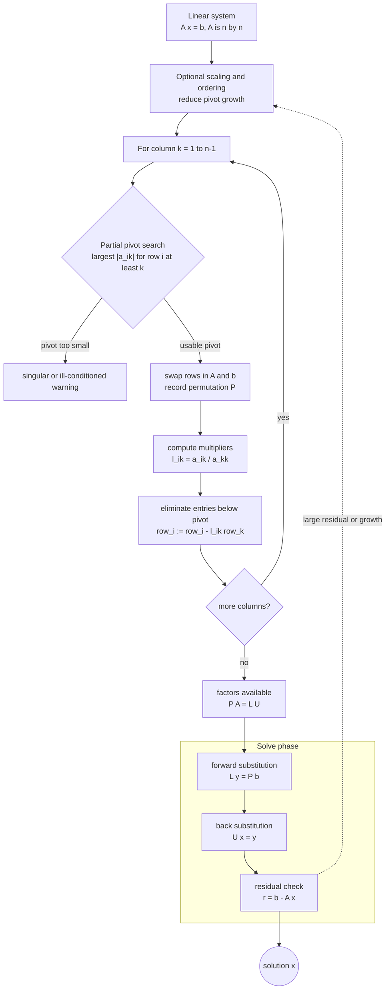

# Gaussian Elimination Pivoting and LU

Gaussian elimination solves a linear system by eliminating unknowns until the system is triangular. LU factorization records the elimination steps as matrix factors so that the same coefficient matrix can be reused for many right-hand sides. Pivoting makes the process reliable by avoiding zero or dangerously small pivots.


*Figure: Gaussian elimination uses row operations to expose pivots, rank, and solvability. Image: [Wikimedia Commons](https://commons.wikimedia.org/wiki/File:File_Gaussian_elimination.svg), Akira tanzivana, CC BY-SA 4.0.*

This topic is the entry point for direct linear algebra in numerical analysis. Later factorizations, iterative methods, least squares solvers, eigenvalue algorithms, and implicit differential equation methods all rely on the same ideas: preserve algebraic equivalence while controlling rounding error and computational cost.

## Definitions

A linear system is

$$
Ax=b,
$$

where $A\in\mathbb{R}^{n\times n}$ is the coefficient matrix, $x$ is the unknown vector, and $b$ is the right-hand side. Gaussian elimination uses row operations to transform $A$ into an upper triangular matrix $U$.

An LU factorization writes

$$
A=LU,
$$

where $L$ is lower triangular and $U$ is upper triangular. With row pivoting, the factorization is usually written

$$
PA=LU,
$$

where $P$ is a permutation matrix representing row swaps. To solve $Ax=b$, compute $Pb$, solve

$$
Ly=Pb,
$$

by forward substitution, then solve

$$
Ux=y
$$

by back substitution.

A **pivot** is the entry used to eliminate entries below it in a column. Partial pivoting chooses the largest available entry in magnitude in the current column and swaps it into the pivot position.

## Key results

Gaussian elimination without pivoting can fail on a nonsingular matrix if a zero pivot appears. It can also be unstable when a pivot is nonzero but tiny relative to entries below it. Partial pivoting avoids many of these failures and is the default dense direct strategy for general matrices.

The operation count for dense Gaussian elimination is about

$$
\frac{2}{3}n^3
$$

floating-point operations for the factorization, plus $O(n^2)$ for each triangular solve. This cost pattern is why LU is valuable when the same $A$ is used with several right-hand sides: factor once, solve many times.

Backward stability with partial pivoting is excellent in typical cases, although pathological growth factors exist. The residual

$$
r=b-A\hat{x}
$$

is easy to compute and should be used, but forward accuracy also depends on the condition number of $A$. A small residual does not guarantee a small forward error when $A$ is ill-conditioned.

A reliable way to use these results is to keep the analysis tied to the actual numerical question rather than to the formula alone. For Gaussian elimination with pivoting and LU, the input record should include the coefficient matrix, right-hand sides, pivoting policy, and expected reuse. Without that record, two computations that look similar on paper may have different numerical meanings. The same formula can be a safe production tool in one scaling and a fragile experiment in another. This is why the examples on this page show the intermediate arithmetic: the goal is not only to reach a number, but to expose what assumptions made that number meaningful.

The next record is the verification record. Useful diagnostics for this topic include residuals, pivot sizes, growth factors, and condition estimates. A diagnostic should be chosen before the computation is trusted, not after a pleasing answer appears. When an exact answer is unavailable, compare two independent approximations, refine the mesh or tolerance, check a residual, or test the method on a neighboring problem with known behavior. If several diagnostics disagree, treat the disagreement as information about conditioning, stability, or implementation rather than as a nuisance to be averaged away.

The cost record matters as well. In this topic the dominant costs are usually factorization cost and triangular solve cost. Numerical analysis is full of methods that are mathematically attractive but computationally mismatched to the problem size. A dense factorization may be acceptable for a classroom matrix and impossible for a PDE grid. A high-order rule may use fewer steps but more expensive stages. A guaranteed method may take many iterations but provide a bound that a faster method cannot. The right comparison is therefore cost to reach a verified tolerance, not order or elegance in isolation.

Finally, every method here has a recognizable failure mode: tiny pivots, forgotten permutations, and small residuals in ill-conditioned systems. These failures are not edge cases to memorize; they are signals that the hypotheses behind the result have been violated or that a different numerical model is needed. A good implementation makes such failures visible through exceptions, warnings, residual reports, or conservative stopping rules. A good hand solution does the same thing in prose by naming the assumption being used and checking it at the point where it matters.

For study purposes, the most useful habit is to separate four layers: the continuous mathematical problem, the discrete approximation, the algebraic or iterative algorithm used to compute it, and the diagnostic used to judge the result. Many mistakes come from mixing these layers. A small algebraic residual may not mean a small modeling error. A small step-to-step change may not mean the discrete equations are solved. A high-order truncation formula may not help when the data are noisy or the arithmetic is unstable. Keeping the layers separate makes the results on this page portable to larger examples.

## Visual



The elimination architecture shows factorization as a pivot-search, row-swap, multiplier, and elimination loop, followed by triangular solves. Recording the permutation makes the solve contract explicit: the computed factors satisfy $PA=LU$, so the right side must become $Pb$ before forward substitution. The residual feedback highlights that a small-looking triangular solve is not enough when pivot growth or conditioning is poor.

| Strategy | Factorization | Main benefit | Main risk |
|---|---|---|---|
| No pivoting | $A=LU$ | fastest simple form | zero or tiny pivots |
| Partial pivoting | $PA=LU$ | robust general default | row swaps and growth possible |
| Complete pivoting | $PAQ=LU$ | stronger pivot control | more search and bookkeeping |
| Cholesky | $A=LL^T$ | faster for SPD matrices | requires symmetry and positivity |

## Worked example 1: LU solve without pivoting

**Problem.** Solve

$$
\begin{bmatrix}2&1\\4&3\end{bmatrix}
\begin{bmatrix}x_1\\x_2\end{bmatrix}
=
\begin{bmatrix}1\\2\end{bmatrix}
$$

using elimination.

**Method.** Eliminate the entry below the first pivot.

1. The pivot is $2$, and the multiplier is

$$
\ell_{21}=\frac{4}{2}=2.
$$

2. Row 2 becomes row 2 minus $2$ times row 1:

$$
[4,3]-2[2,1]=[0,1].
$$

Thus

$$
L=\begin{bmatrix}1&0\\2&1\end{bmatrix},
\qquad
U=\begin{bmatrix}2&1\\0&1\end{bmatrix}.
$$

3. Forward solve $Ly=b$:

$$
y_1=1,
\qquad
2y_1+y_2=2 \Rightarrow y_2=0.
$$

4. Back solve $Ux=y$:

$$
x_2=0,
\qquad
2x_1+x_2=1 \Rightarrow x_1=\frac12.
$$

**Checked answer.** The solution is $x=(0.5,0)^T$, and $A x=(1,2)^T$.

## Worked example 2: why pivoting is needed

**Problem.** Explain how to start elimination for

$$
A=\begin{bmatrix}0&1\\2&3\end{bmatrix}.
$$

**Method.** The first pivot entry is zero, so elimination without pivoting cannot divide by it.

1. Inspect the first column below and including the pivot position:

$$
\begin{bmatrix}0\\2\end{bmatrix}.
$$

2. The largest magnitude entry is $2$ in row 2, so swap rows 1 and 2.

3. The permuted matrix is

$$
PA=\begin{bmatrix}2&3\\0&1\end{bmatrix}.
$$

4. This matrix is already upper triangular.

**Checked answer.** Partial pivoting changes an impossible first pivot into a valid pivot. The original matrix is nonsingular, but elimination without row swaps would fail immediately.

## Code

```python
import numpy as np

def lu_partial_pivot(A):
    A = np.array(A, dtype=float, copy=True)
    n = A.shape[0]
    P = np.eye(n)
    L = np.zeros((n, n))
    U = A.copy()
    for k in range(n):
        pivot = k + np.argmax(np.abs(U[k:, k]))
        if abs(U[pivot, k]) < 1e-15:
            raise np.linalg.LinAlgError("matrix is singular to working precision")
        if pivot != k:
            U[[k, pivot], :] = U[[pivot, k], :]
            P[[k, pivot], :] = P[[pivot, k], :]
            L[[k, pivot], :k] = L[[pivot, k], :k]
        L[k, k] = 1.0
        for i in range(k + 1, n):
            L[i, k] = U[i, k] / U[k, k]
            U[i, k:] -= L[i, k] * U[k, k:]
    return P, L, U

def solve_lu(P, L, U, b):
    pb = P @ np.asarray(b, dtype=float)
    y = np.linalg.solve(L, pb)
    return np.linalg.solve(U, y)

A = np.array([[2.0, 1.0], [4.0, 3.0]])
b = np.array([1.0, 2.0])
P, L, U = lu_partial_pivot(A)
x = solve_lu(P, L, U, b)
print(P)
print(L)
print(U)
print(x, "residual", b - A @ x)
```

## Common pitfalls

- Dividing by a pivot before checking whether it is zero or tiny.
- Forgetting to apply the same row swaps to the right-hand side.
- Recomputing an LU factorization for every new right-hand side.
- Judging accuracy only from a residual when the matrix may be ill-conditioned.
- Using a general LU solver for symmetric positive definite systems where Cholesky is more efficient.

## Connections

- [matrix factorizations and special systems](/math/numerical-analysis/matrix-factorizations-special-systems)
- [iterative linear systems](/math/numerical-analysis/iterative-linear-systems)
- [floating point conditioning and stability](/math/numerical-analysis/floating-point-conditioning-stability)
- [least squares and Chebyshev approximation](/math/numerical-analysis/least-squares-chebyshev-approximation)
