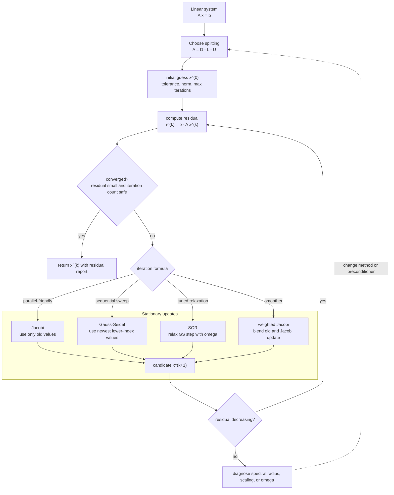

# Jacobi Gauss Seidel and SOR

Iterative methods for linear systems generate a sequence of approximate solutions instead of factoring the matrix directly. They are attractive when the matrix is large, sparse, and structured, because each iteration may be cheap and memory efficient. The tradeoff is that convergence is not automatic.

Jacobi, Gauss-Seidel, and successive over-relaxation are classical stationary iterations. They are easy to derive from a matrix splitting and they remain useful as smoothers, preconditioners, and teaching models for more advanced Krylov methods such as conjugate gradient.

## Definitions

Let

$$
Ax=b
$$

and split the matrix as

$$
A=D-L-U,
$$

where $D$ is the diagonal, $-L$ is the strictly lower triangular part, and $-U$ is the strictly upper triangular part. The Jacobi method is

$$
x^{(k+1)}=D^{-1}(L+U)x^{(k)}+D^{-1}b.
$$

In component form,

$$
x_i^{(k+1)}=\frac{1}{a_{ii}}\left(b_i-\sum_{j\ne i}a_{ij}x_j^{(k)}\right).
$$

Gauss-Seidel uses newest available components immediately:

$$
x^{(k+1)}=(D-L)^{-1}Ux^{(k)}+(D-L)^{-1}b.
$$

SOR introduces a relaxation parameter $\omega$:

$$
x_i^{(k+1)}=(1-\omega)x_i^{(k)}+\frac{\omega}{a_{ii}}\left(b_i-\sum_{j\lt i}a_{ij}x_j^{(k+1)}-\sum_{j\gt i}a_{ij}x_j^{(k)}\right).
$$

## Key results

A stationary iteration has the form

$$
x^{(k+1)}=Bx^{(k)}+c.
$$

It converges for every starting vector if and only if the spectral radius satisfies

$$
\rho(B)\lt 1.
$$

This condition is exact but may be expensive to check. Practical sufficient conditions include strict diagonal dominance and symmetry positive definiteness for Gauss-Seidel.

Jacobi is naturally parallel because all new components use only old values. Gauss-Seidel is often faster in iteration count because it uses updated values immediately, but that data dependence makes parallelization harder. SOR can accelerate Gauss-Seidel when $0\lt\omega\lt 2$ for suitable SPD systems, with $\omega=1$ reducing to Gauss-Seidel. Choosing $\omega$ well is problem dependent.

Residuals are essential. The change between iterates may become small even if the current vector is not accurate for an ill-conditioned system or a poorly scaled norm. A solver should report both an iteration count and a residual norm such as $\|b-Ax^{(k)}\|$.

A reliable way to use these results is to keep the analysis tied to the actual numerical question rather than to the formula alone. For Jacobi, Gauss-Seidel, and SOR, the input record should include the matrix splitting, initial guess, norm, and relaxation parameter. Without that record, two computations that look similar on paper may have different numerical meanings. The same formula can be a safe production tool in one scaling and a fragile experiment in another. This is why the examples on this page show the intermediate arithmetic: the goal is not only to reach a number, but to expose what assumptions made that number meaningful.

The next record is the verification record. Useful diagnostics for this topic include residual norms, spectral radius estimates, and monotonicity of error indicators. A diagnostic should be chosen before the computation is trusted, not after a pleasing answer appears. When an exact answer is unavailable, compare two independent approximations, refine the mesh or tolerance, check a residual, or test the method on a neighboring problem with known behavior. If several diagnostics disagree, treat the disagreement as information about conditioning, stability, or implementation rather than as a nuisance to be averaged away.

The cost record matters as well. In this topic the dominant costs are usually sparse sweeps, communication pattern, and iteration count. Numerical analysis is full of methods that are mathematically attractive but computationally mismatched to the problem size. A dense factorization may be acceptable for a classroom matrix and impossible for a PDE grid. A high-order rule may use fewer steps but more expensive stages. A guaranteed method may take many iterations but provide a bound that a faster method cannot. The right comparison is therefore cost to reach a verified tolerance, not order or elegance in isolation.

Finally, every method here has a recognizable failure mode: divergent iteration matrices, bad relaxation parameters, and stopping on iterate changes alone. These failures are not edge cases to memorize; they are signals that the hypotheses behind the result have been violated or that a different numerical model is needed. A good implementation makes such failures visible through exceptions, warnings, residual reports, or conservative stopping rules. A good hand solution does the same thing in prose by naming the assumption being used and checking it at the point where it matters.

For study purposes, the most useful habit is to separate four layers: the continuous mathematical problem, the discrete approximation, the algebraic or iterative algorithm used to compute it, and the diagnostic used to judge the result. Many mistakes come from mixing these layers. A small algebraic residual may not mean a small modeling error. A small step-to-step change may not mean the discrete equations are solved. A high-order truncation formula may not help when the data are noisy or the arithmetic is unstable. Keeping the layers separate makes the results on this page portable to larger examples.

## Visual

| Method | Uses newest values? | Parallel friendly? | Tuning parameter | Typical behavior |
|---|---|---|---|---|
| Jacobi | no | yes | none | simple, often slow |
| Gauss-Seidel | yes | less so | none | often faster than Jacobi |
| SOR | yes | less so | $\omega$ | can accelerate or destabilize |
| Weighted Jacobi | no | yes | weight | common smoother |



This iterative-solver diagram keeps the residual test outside the update formula, which is the safest way to compare Jacobi, Gauss-Seidel, SOR, and weighted Jacobi. The stationary-update subgraph shows exactly which values each method uses to build $x^{(k+1)}$. The divergence branch makes the convergence hypothesis visible instead of hiding it behind a fixed iteration count.

## Worked example 1: Jacobi iteration

**Problem.** Perform two Jacobi iterations from $x^{(0)}=(0,0)^T$ for

$$
\begin{bmatrix}4&1\\2&3\end{bmatrix}
\begin{bmatrix}x\\y\end{bmatrix}
=
\begin{bmatrix}1\\2\end{bmatrix}.
$$

**Method.** Rearrange each equation using old values:

$$
x^{(k+1)}=\frac{1-y^{(k)}}{4},
\qquad
y^{(k+1)}=\frac{2-2x^{(k)}}{3}.
$$

1. From $(0,0)$:

$$
x^{(1)}=\frac14=0.25,
\qquad
y^{(1)}=\frac23=0.666666\ldots.
$$

2. Second iteration:

$$
x^{(2)}=\frac{1-0.666666\ldots}{4}=0.083333\ldots,
$$

$$
y^{(2)}=\frac{2-2(0.25)}{3}=0.5.
$$

3. The exact solution is obtained from $4x+y=1$ and $2x+3y=2$:

$$
x=0.1,
\qquad y=0.6.
$$

**Checked answer.** After two Jacobi iterations, the approximation is $(0.083333,0.5)^T$, moving toward $(0.1,0.6)^T$.

## Worked example 2: spectral radius test

**Problem.** Check Jacobi convergence for the same matrix using the iteration matrix.

**Method.** The Jacobi matrix is

$$
B_J=\begin{bmatrix}0&-1/4\\-2/3&0\end{bmatrix}.
$$

1. For a matrix of the form

$$
\begin{bmatrix}0&a\\b&0\end{bmatrix},
$$

the eigenvalues satisfy $\lambda^2=ab$.

2. Here

$$
ab=\left(-\frac14\right)\left(-\frac23\right)=\frac16.
$$

3. Therefore

$$
\lambda=\pm \sqrt{\frac16}.
$$

4. The spectral radius is

$$
\rho(B_J)=\sqrt{\frac16}=0.408248\ldots\lt 1.
$$

**Checked answer.** Jacobi converges for this system from any starting vector because the spectral radius is less than one.

## Code

```python
import numpy as np

def jacobi(A, b, x0=None, tol=1e-10, max_iter=500):
    A = np.asarray(A, dtype=float)
    b = np.asarray(b, dtype=float)
    x = np.zeros_like(b) if x0 is None else np.asarray(x0, dtype=float)
    D = np.diag(A)
    R = A - np.diagflat(D)
    for k in range(1, max_iter + 1):
        x_new = (b - R @ x) / D
        if np.linalg.norm(b - A @ x_new, ord=np.inf) < tol:
            return x_new, k
        x = x_new
    return x, max_iter

def gauss_seidel(A, b, x0=None, omega=1.0, tol=1e-10, max_iter=500):
    A = np.asarray(A, dtype=float)
    b = np.asarray(b, dtype=float)
    x = np.zeros_like(b) if x0 is None else np.asarray(x0, dtype=float)
    n = len(b)
    for k in range(1, max_iter + 1):
        old = x.copy()
        for i in range(n):
            sigma = A[i, :i] @ x[:i] + A[i, i+1:] @ old[i+1:]
            candidate = (b[i] - sigma) / A[i, i]
            x[i] = (1.0 - omega) * old[i] + omega * candidate
        if np.linalg.norm(b - A @ x, ord=np.inf) < tol:
            return x, k
    return x, max_iter

A = np.array([[4.0, 1.0], [2.0, 3.0]])
b = np.array([1.0, 2.0])
print(jacobi(A, b))
print(gauss_seidel(A, b))
print(np.linalg.solve(A, b))
```

## Common pitfalls

- Assuming an iterative method converges just because the matrix is nonsingular.
- Stopping on small iterate changes without checking the residual.
- Choosing an SOR parameter outside a stable range.
- Destroying sparsity by forming dense matrices inside each iteration.
- Comparing iteration counts without comparing cost per iteration and preconditioning.

## Connections

- [Gaussian elimination pivoting and LU](/math/numerical-analysis/gaussian-elimination-pivoting-lu)
- [conjugate gradient and iterative refinement](/math/numerical-analysis/conjugate-gradient-iterative-refinement)
- [matrix factorizations and special systems](/math/numerical-analysis/matrix-factorizations-special-systems)
- [finite difference methods for PDEs](/math/numerical-analysis/finite-difference-pdes)
