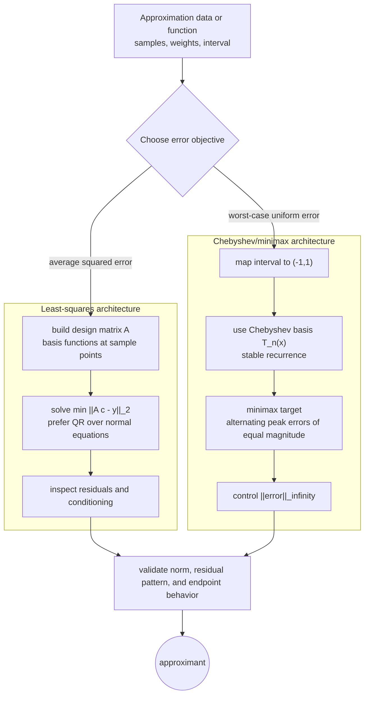

# Least Squares and Chebyshev Approximation

Approximation is different from interpolation. Interpolation insists on matching data exactly at nodes, while approximation looks for a simpler function that is close in a chosen sense. Least squares minimizes the sum of squared residuals. Chebyshev, or minimax, approximation minimizes the maximum error.


*Figure: Least squares turns geometric projection into a practical model-fitting method. Image: [Wikimedia Commons](https://commons.wikimedia.org/wiki/File:Linear_regression.svg), Sewaqu, public domain.*

The choice of norm changes the meaning of best. Least squares is natural for noisy data with many small independent errors. Chebyshev approximation is natural when the worst-case deviation matters, as in uniform polynomial approximation and filter design.

## Definitions

A linear least squares problem has the form

$$
\min_x \|Ax-b\|_2,
$$

where $A$ is often tall and rectangular. The residual is $r=b-Ax$. If $A$ has full column rank, the normal equations are

$$
A^TAx=A^Tb.
$$

A more stable approach uses QR factorization. If $A=QR$ with orthonormal columns in $Q$, then the least squares solution satisfies

$$
Rx=Q^Tb.
$$

Chebyshev polynomials are defined by

$$
T_n(x)=\cos(n\arccos x),\qquad -1\le x\le 1.
$$

They also satisfy the recurrence

$$
T_0(x)=1,
\quad T_1(x)=x,
\quad T_{n+1}(x)=2xT_n(x)-T_{n-1}(x).
$$

A minimax approximation minimizes $\|f-p\|_\infty$ over a chosen polynomial space.

## Key results

The normal equations come from orthogonality of the residual. At the least squares solution, every column of $A$ is orthogonal to the residual:

$$
A^T(b-Ax)=0.
$$

This is a projection statement. The vector $Ax$ is the orthogonal projection of $b$ onto the column space of $A$.

Although normal equations are mathematically elegant, they square the condition number:

$$
\kappa(A^TA)=\kappa(A)^2.
$$

Therefore QR is usually preferred for numerical least squares, especially when columns are nearly linearly dependent.

Chebyshev polynomials are important because $\vert T_n(x)\vert \le 1$ on $[-1,1]$ and their extrema alternate between $1$ and $-1$. The minimax polynomial error is characterized by equioscillation: under suitable conditions, the best approximation has an error curve that alternates equal positive and negative extremes at enough points.

Chebyshev nodes reduce interpolation oscillation because they cluster near endpoints, where polynomial interpolation with equally spaced points is most vulnerable.

A reliable way to use these results is to keep the analysis tied to the actual numerical question rather than to the formula alone. For least squares and Chebyshev approximation, the input record should include the data model, basis, norm, interval scaling, and noise assumptions. Without that record, two computations that look similar on paper may have different numerical meanings. The same formula can be a safe production tool in one scaling and a fragile experiment in another. This is why the examples on this page show the intermediate arithmetic: the goal is not only to reach a number, but to expose what assumptions made that number meaningful.

The next record is the verification record. Useful diagnostics for this topic include residual plots, orthogonality checks, and maximum-error alternation. A diagnostic should be chosen before the computation is trusted, not after a pleasing answer appears. When an exact answer is unavailable, compare two independent approximations, refine the mesh or tolerance, check a residual, or test the method on a neighboring problem with known behavior. If several diagnostics disagree, treat the disagreement as information about conditioning, stability, or implementation rather than as a nuisance to be averaged away.

The cost record matters as well. In this topic the dominant costs are usually QR factorizations, basis evaluation, and conditioning of the design matrix. Numerical analysis is full of methods that are mathematically attractive but computationally mismatched to the problem size. A dense factorization may be acceptable for a classroom matrix and impossible for a PDE grid. A high-order rule may use fewer steps but more expensive stages. A guaranteed method may take many iterations but provide a bound that a faster method cannot. The right comparison is therefore cost to reach a verified tolerance, not order or elegance in isolation.

Finally, every method here has a recognizable failure mode: normal-equation conditioning, unscaled intervals, and confusing L2 and Linf goals. These failures are not edge cases to memorize; they are signals that the hypotheses behind the result have been violated or that a different numerical model is needed. A good implementation makes such failures visible through exceptions, warnings, residual reports, or conservative stopping rules. A good hand solution does the same thing in prose by naming the assumption being used and checking it at the point where it matters.

For study purposes, the most useful habit is to separate four layers: the continuous mathematical problem, the discrete approximation, the algebraic or iterative algorithm used to compute it, and the diagnostic used to judge the result. Many mistakes come from mixing these layers. A small algebraic residual may not mean a small modeling error. A small step-to-step change may not mean the discrete equations are solved. A high-order truncation formula may not help when the data are noisy or the arithmetic is unstable. Keeping the layers separate makes the results on this page portable to larger examples.

In practice, approximation results should also be reported with the chosen basis, because changing from monomials to orthogonal polynomials can change the conditioning without changing the approximation space. For least squares, inspect residuals as data, not just as a norm: a curved residual pattern may mean the model class is wrong even when the norm is small. For Chebyshev approximation, inspect the largest positive and negative errors; imbalance often signals that the candidate is not minimax.
 State the norm explicitly whenever reporting an approximation, because a best fit in one norm can be visibly nonoptimal in another.

## Visual

| Approximation type | Objective | Typical equation | Best for | Numerical warning |
|---|---|---|---|---|
| Interpolation | exact node matching | $P(x_i)=y_i$ | trusted exact data | oscillation and noise fitting |
| Least squares | minimize $\|r\|_2$ | $A^TAx=A^Tb$ or QR | noisy overdetermined data | normal equations square conditioning |
| Chebyshev/minimax | minimize $\|r\|_\infty$ | equioscillation | uniform worst-case control | harder to compute directly |
| Chebyshev basis | stable polynomial basis | recurrence for $T_n$ | high-degree approximation | map intervals to $[-1,1]$ |



This diagram separates least-squares and Chebyshev approximation by their error contracts. Least squares builds and solves a design-matrix problem in the 2-norm, while Chebyshev approximation maps the interval and targets balanced peak error in the infinity norm. The shared validation node reminds the reader to report the norm because "best" changes with the objective.

## Worked example 1: least squares line fit

**Problem.** Fit a line $y=c_0+c_1x$ in the least squares sense to

$$
(0,1),\quad (1,2),\quad (2,2).
$$

**Method.** Build

$$
A=\begin{bmatrix}1&0\\1&1\\1&2\end{bmatrix},
\qquad
b=\begin{bmatrix}1\\2\\2\end{bmatrix}.
$$

1. Compute the normal matrix:

$$
A^TA=\begin{bmatrix}3&3\\3&5\end{bmatrix}.
$$

2. Compute the right-hand side:

$$
A^Tb=\begin{bmatrix}5\\6\end{bmatrix}.
$$

3. Solve

$$
\begin{bmatrix}3&3\\3&5\end{bmatrix}
\begin{bmatrix}c_0\\c_1\end{bmatrix}
=
\begin{bmatrix}5\\6\end{bmatrix}.
$$

The determinant is $15-9=6$.

4. Therefore

$$
c_0=\frac{5(5)-3(6)}{6}=\frac76,
\qquad
c_1=\frac{3(6)-3(5)}{6}=\frac12.
$$

**Checked answer.** The least squares line is $y=7/6+x/2$.

## Worked example 2: Chebyshev recurrence check

**Problem.** Use the recurrence to compute $T_3(x)$ and verify it at $x=1/2$.

**Method.** Start from $T_0=1$ and $T_1=x$.

1. Compute

$$
T_2(x)=2xT_1(x)-T_0(x)=2x^2-1.
$$

2. Compute

$$
T_3(x)=2xT_2(x)-T_1(x)=2x(2x^2-1)-x=4x^3-3x.
$$

3. At $x=1/2$,

$$
T_3(1/2)=4(1/8)-3(1/2)=0.5-1.5=-1.
$$

4. Since $1/2=\cos(\pi/3)$,

$$
T_3(1/2)=\cos(3\pi/3)=\cos(\pi)=-1.
$$

**Checked answer.** The recurrence and cosine definition agree.

## Code

```python
import numpy as np

def least_squares_qr(A, b):
    A = np.asarray(A, dtype=float)
    b = np.asarray(b, dtype=float)
    Q, R = np.linalg.qr(A, mode="reduced")
    return np.linalg.solve(R, Q.T @ b)

def chebyshev_values(x, n):
    values = [np.ones_like(x, dtype=float)]
    if n == 0:
        return values
    values.append(np.array(x, dtype=float))
    for k in range(1, n):
        values.append(2 * x * values[-1] - values[-2])
    return values

A = np.array([[1.0, 0.0], [1.0, 1.0], [1.0, 2.0]])
b = np.array([1.0, 2.0, 2.0])
print(least_squares_qr(A, b))
x = np.array([0.5])
print(chebyshev_values(x, 3)[-1])
```

## Common pitfalls

- Using interpolation when the data are noisy and overdetermined.
- Solving least squares through normal equations when $A$ is ill-conditioned.
- Forgetting to map a general interval $[a,b]$ to $[-1,1]$ before using Chebyshev formulas.
- Judging a least squares fit only by maximum error, or a minimax fit only by sum of squares.
- Assuming high polynomial degree fixes approximation. Basis choice and node placement matter.

## Connections

- [matrix factorizations and special systems](/math/numerical-analysis/matrix-factorizations-special-systems)
- [rational trigonometric approximation and FFT](/math/numerical-analysis/rational-trigonometric-fft)
- [interpolation Lagrange and Neville method](/math/numerical-analysis/interpolation-lagrange-neville)
- [eigenvalue methods](/math/numerical-analysis/eigenvalue-methods)
