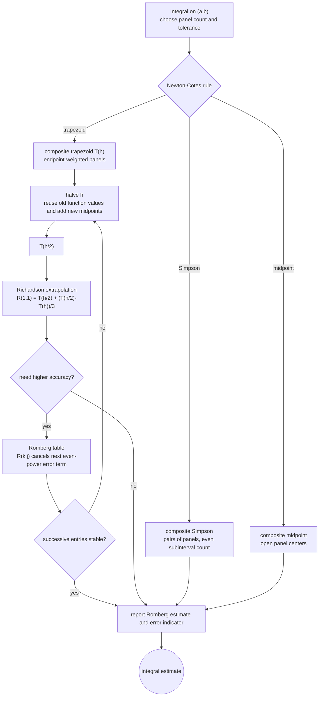

# Newton Cotes and Romberg Integration

Numerical integration, or quadrature, replaces an integral by a weighted sum of function values. Newton-Cotes formulas choose equally spaced nodes and integrate an interpolating polynomial through those nodes. The trapezoidal rule, midpoint rule, and Simpson's rule are the most common members of this family.

Romberg integration accelerates the composite trapezoidal rule by applying Richardson extrapolation to its even-power error expansion. It is a good example of a general numerical pattern: start with a simple approximation at several mesh sizes, then combine the approximations to cancel leading error terms.

## Definitions

A quadrature rule has the form

$$
\int_a^b f(x)\,dx \approx \sum_{i=0}^n w_i f(x_i),
$$

where the $x_i$ are nodes and the $w_i$ are weights. A **closed Newton-Cotes** rule includes the endpoints. The trapezoidal rule is

$$
T(f)=\frac{b-a}{2}\left[f(a)+f(b)\right].
$$

Simpson's rule uses the midpoint $m=(a+b)/2$:

$$
S(f)=\frac{b-a}{6}\left[f(a)+4f(m)+f(b)\right].
$$

A **composite** rule divides $[a,b]$ into subintervals and applies a simple rule repeatedly. If $h=(b-a)/n$, the composite trapezoidal rule is

$$
T_n=\frac{h}{2}\left[f(x_0)+2\sum_{i=1}^{n-1}f(x_i)+f(x_n)\right].
$$

Romberg integration builds a triangular table from $R_{k,1}=T_{2^{k-1}}$ and

$$
R_{k,j}=R_{k,j-1}+\frac{R_{k,j-1}-R_{k-1,j-1}}{4^{j-1}-1}.
$$

## Key results

The local trapezoidal error is proportional to $f''(\xi)(b-a)^3$, so the composite trapezoidal rule is second-order accurate for smooth functions. Simpson's rule is exact for polynomials of degree at most three and has fourth-order global accuracy when applied as a composite rule on an even number of subintervals.

The Euler-Maclaurin expansion explains why Romberg works. For sufficiently smooth $f$, the composite trapezoidal approximation has an error expansion of the form

$$
T(h)=I+c_2h^2+c_4h^4+c_6h^6+\cdots.
$$

Because only even powers appear under appropriate smoothness assumptions, replacing $h$ by $h/2$ and combining estimates can cancel $c_2h^2$, then $c_4h^4$, and so on. The first extrapolation is exactly

$$
R_{2,2}=T(h/2)+\frac{T(h/2)-T(h)}{3}.
$$

Newton-Cotes rules are easy to implement, but high-order closed Newton-Cotes formulas can have negative weights and poor stability. In practice, low-order composite rules, adaptive Simpson methods, and Gaussian quadrature are used more often than very high-degree Newton-Cotes rules.

A reliable way to use these results is to keep the analysis tied to the actual numerical question rather than to the formula alone. For Newton-Cotes and Romberg integration, the input record should include the integrand, interval, smoothness, panel count, and endpoint behavior. Without that record, two computations that look similar on paper may have different numerical meanings. The same formula can be a safe production tool in one scaling and a fragile experiment in another. This is why the examples on this page show the intermediate arithmetic: the goal is not only to reach a number, but to expose what assumptions made that number meaningful.

The next record is the verification record. Useful diagnostics for this topic include successive mesh differences, Romberg table stability, and comparison with known polynomial exactness. A diagnostic should be chosen before the computation is trusted, not after a pleasing answer appears. When an exact answer is unavailable, compare two independent approximations, refine the mesh or tolerance, check a residual, or test the method on a neighboring problem with known behavior. If several diagnostics disagree, treat the disagreement as information about conditioning, stability, or implementation rather than as a nuisance to be averaged away.

The cost record matters as well. In this topic the dominant costs are usually function evaluations and reuse of old trapezoid values. Numerical analysis is full of methods that are mathematically attractive but computationally mismatched to the problem size. A dense factorization may be acceptable for a classroom matrix and impossible for a PDE grid. A high-order rule may use fewer steps but more expensive stages. A guaranteed method may take many iterations but provide a bound that a faster method cannot. The right comparison is therefore cost to reach a verified tolerance, not order or elegance in isolation.

Finally, every method here has a recognizable failure mode: endpoint singularities, odd Simpson panel counts, and extrapolation outside the asymptotic regime. These failures are not edge cases to memorize; they are signals that the hypotheses behind the result have been violated or that a different numerical model is needed. A good implementation makes such failures visible through exceptions, warnings, residual reports, or conservative stopping rules. A good hand solution does the same thing in prose by naming the assumption being used and checking it at the point where it matters.

For study purposes, the most useful habit is to separate four layers: the continuous mathematical problem, the discrete approximation, the algebraic or iterative algorithm used to compute it, and the diagnostic used to judge the result. Many mistakes come from mixing these layers. A small algebraic residual may not mean a small modeling error. A small step-to-step change may not mean the discrete equations are solved. A high-order truncation formula may not help when the data are noisy or the arithmetic is unstable. Keeping the layers separate makes the results on this page portable to larger examples.

## Visual

| Rule | Nodes on one panel | Degree of precision | Composite order | Best use |
|---|---:|---:|---:|---|
| Trapezoidal | endpoints | 1 | 2 | smooth periodic or cheap evaluations |
| Midpoint | center | 1 | 2 | simple open-panel estimate |
| Simpson | endpoints and midpoint | 3 | 4 | smooth functions, even subinterval count |
| Romberg | nested trapezoids | increases by column | high for smooth functions | smooth non-singular integrands |



This integration diagram shows Newton-Cotes rules as panel-based approximations and Romberg integration as a nested refinement controller. The trapezoid path explicitly reuses function values after halving $h$, then Richardson extrapolation cancels the leading even-power error terms. The stability check on the Romberg table is the diagnostic that decides whether more refinement is justified.

## Worked example 1: trapezoidal and Simpson rules for $x^2$

**Problem.** Approximate

$$
\int_0^2 x^2\,dx
$$

using the single-panel trapezoidal rule and Simpson's rule.

**Method.** The exact integral is

$$
\int_0^2x^2\,dx=\frac{x^3}{3}\bigg|_0^2=\frac{8}{3}.
$$

1. Trapezoidal rule:

$$
T=\frac{2-0}{2}\left[f(0)+f(2)\right]
=1(0+4)=4.
$$

2. Simpson's rule with midpoint $1$:

$$
S=\frac{2-0}{6}\left[f(0)+4f(1)+f(2)\right].
$$

3. Substitute values:

$$
S=\frac{1}{3}(0+4+4)=\frac{8}{3}.
$$

**Checked answer.** The trapezoidal estimate is $4$, while Simpson's rule gives $8/3$ exactly because $x^2$ has degree less than or equal to three.

## Worked example 2: first Romberg extrapolation for $\pi$

**Problem.** Approximate

$$
\int_0^1 \frac{4}{1+x^2}\,dx=\pi
$$

using $T(h)$, $T(h/2)$, and one Romberg extrapolation.

**Method.** Use $h=1$ and then $h=1/2$.

1. One-panel trapezoidal rule:

$$
T(1)=\frac12\left[f(0)+f(1)\right]=\frac12(4+2)=3.
$$

2. Two-panel trapezoidal rule uses $x=0,0.5,1$:

$$
f(0.5)=\frac{4}{1.25}=3.2.
$$

$$
T(1/2)=\frac{0.5}{2}\left[4+2(3.2)+2\right]=3.1.
$$

3. Extrapolate:

$$
R_{2,2}=3.1+\frac{3.1-3.0}{3}=3.133333333\ldots.
$$

**Checked answer.** One extrapolation moves the estimate from $3.1$ to $3.133333\ldots$, closer to $\pi\approx 3.141592654$.

## Code

```python
import math

def composite_trapezoid(f, a, b, n):
    h = (b - a) / n
    total = 0.5 * (f(a) + f(b))
    for i in range(1, n):
        total += f(a + i * h)
    return h * total

def composite_simpson(f, a, b, n):
    if n % 2:
        raise ValueError("Simpson's rule requires an even number of subintervals")
    h = (b - a) / n
    total = f(a) + f(b)
    for i in range(1, n):
        total += (4 if i % 2 else 2) * f(a + i * h)
    return h * total / 3.0

def romberg(f, a, b, levels):
    table = []
    for k in range(levels):
        row = [composite_trapezoid(f, a, b, 2**k)]
        for j in range(1, k + 1):
            row.append(row[j - 1] + (row[j - 1] - table[k - 1][j - 1]) / (4**j - 1))
        table.append(row)
    return table

f = lambda x: 4.0 / (1.0 + x * x)
for row in romberg(f, 0.0, 1.0, 5):
    print(row)
print("pi", math.pi)
```

## Common pitfalls

- Applying Simpson's composite rule with an odd number of subintervals.
- Expecting high-order convergence when the integrand is not smooth enough.
- Using very high-degree Newton-Cotes rules instead of composite low-degree rules.
- Treating Romberg table entries as monotone. Extrapolation can overshoot.
- Ignoring endpoint singularities. Trapezoidal and Simpson error formulas assume bounded derivatives.

## Connections

- [adaptive and Gaussian quadrature](/math/numerical-analysis/adaptive-gaussian-quadrature)
- [numerical differentiation and Richardson extrapolation](/math/numerical-analysis/numerical-differentiation-richardson)
- [mathematical preliminaries and error analysis](/math/numerical-analysis/mathematical-preliminaries-error-analysis)
- [finite difference methods for PDEs](/math/numerical-analysis/finite-difference-pdes)
