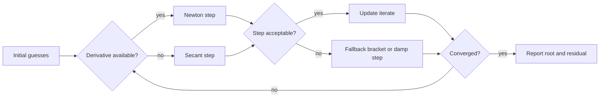

# Newton Secant and Polynomial Roots

Newton's method and the secant method are local root-finding algorithms. They are often much faster than bisection once a good starting point is available, because they use slope information, either explicitly or implicitly. Polynomial root algorithms add another layer: the function has algebraic structure, so evaluation, derivative computation, and deflation can be organized efficiently.

These methods should be read as part of a toolkit rather than as replacements for bracketing. In production solvers, Newton or secant steps are frequently guarded by interval tests, step-size limits, or fallback bisection. The mathematical rate is important, but so is the behavior when the derivative is small, the starting value is poor, or roots are multiple.

## Definitions

Newton's method for $f(x)=0$ is

$$
p_{n+1}=p_n-\frac{f(p_n)}{f'(p_n)}.
$$

It is obtained by replacing $f$ near $p_n$ with the tangent line and taking the tangent line's root as the next approximation. The method requires a derivative and can fail if $f'(p_n)$ is zero or very small. A damped Newton method replaces the full step by $p_{n+1}=p_n-\lambda f(p_n)/f'(p_n)$ with $0\lt \lambda\le 1$ to improve global behavior.

The secant method replaces the derivative by a finite slope through two previous points:

$$
p_{n+1}=p_n-f(p_n)\frac{p_n-p_{n-1}}{f(p_n)-f(p_{n-1})}.
$$

It uses one new function evaluation per step after initialization and avoids analytic derivatives. It is not a bracketing method unless extra logic preserves an interval.

For a polynomial

$$
P(x)=a_nx^n+a_{n-1}x^{n-1}+\cdots+a_0,
$$

Horner's method rewrites evaluation as nested multiplication. If $r$ is an approximate root, synthetic division can deflate the polynomial, but deflation must be used carefully because errors in early roots perturb later factors.

## Key results

If $f$ is twice continuously differentiable, $p$ is a simple root, and $p_0$ is sufficiently close to $p$, Newton's method converges quadratically:

$$
|p_{n+1}-p|\le C|p_n-p|^2.
$$

Quadratic convergence means the number of correct digits can roughly double after the asymptotic regime begins. Before that regime begins, Newton steps can leave the region of interest or divide by a poor derivative.

The secant method has superlinear order

$$
\alpha=\frac{1+\sqrt{5}}{2}\approx 1.618,
$$

under similar simple-root assumptions. It is slower per iteration than Newton's method but may be competitive when derivatives are expensive or unavailable.

Multiple roots reduce the apparent order. If $p$ is a root of multiplicity $m$, ordinary Newton iteration is typically only linearly convergent. A modified Newton step

$$
p_{n+1}=p_n-m\frac{f(p_n)}{f'(p_n)}
$$

restores quadratic convergence when $m$ is known, but estimating $m$ reliably is itself a numerical problem. For polynomial work, Horner's method evaluates $P$ in $O(n)$ arithmetic operations and can evaluate $P'$ at the same time by a second nested pass. This matters because the cost of root finding is often dominated by repeated function and derivative evaluations.

A reliable way to use these results is to keep the analysis tied to the actual numerical question rather than to the formula alone. For Newton, secant, and polynomial root methods, the input record should include initial guesses, derivatives or secant history, polynomial coefficients, and safeguards. Without that record, two computations that look similar on paper may have different numerical meanings. The same formula can be a safe production tool in one scaling and a fragile experiment in another. This is why the examples on this page show the intermediate arithmetic: the goal is not only to reach a number, but to expose what assumptions made that number meaningful.

The next record is the verification record. Useful diagnostics for this topic include residuals, step sizes, derivative magnitudes, and multiplicity indicators. A diagnostic should be chosen before the computation is trusted, not after a pleasing answer appears. When an exact answer is unavailable, compare two independent approximations, refine the mesh or tolerance, check a residual, or test the method on a neighboring problem with known behavior. If several diagnostics disagree, treat the disagreement as information about conditioning, stability, or implementation rather than as a nuisance to be averaged away.

The cost record matters as well. In this topic the dominant costs are usually function evaluations, derivative evaluations, and Horner passes. Numerical analysis is full of methods that are mathematically attractive but computationally mismatched to the problem size. A dense factorization may be acceptable for a classroom matrix and impossible for a PDE grid. A high-order rule may use fewer steps but more expensive stages. A guaranteed method may take many iterations but provide a bound that a faster method cannot. The right comparison is therefore cost to reach a verified tolerance, not order or elegance in isolation.

Finally, every method here has a recognizable failure mode: zero derivatives, bad deflation, and assuming local convergence is global. These failures are not edge cases to memorize; they are signals that the hypotheses behind the result have been violated or that a different numerical model is needed. A good implementation makes such failures visible through exceptions, warnings, residual reports, or conservative stopping rules. A good hand solution does the same thing in prose by naming the assumption being used and checking it at the point where it matters.

For study purposes, the most useful habit is to separate four layers: the continuous mathematical problem, the discrete approximation, the algebraic or iterative algorithm used to compute it, and the diagnostic used to judge the result. Many mistakes come from mixing these layers. A small algebraic residual may not mean a small modeling error. A small step-to-step change may not mean the discrete equations are solved. A high-order truncation formula may not help when the data are noisy or the arithmetic is unstable. Keeping the layers separate makes the results on this page portable to larger examples.

## Visual



| Method | Data per step | Local order | Strength | Failure mode |
|---|---|---:|---|---|
| Newton | $f$ and $f'$ | $2$ for simple roots | very fast near root | derivative zero or bad start |
| Secant | $f$ only | about $1.618$ | no analytic derivative | denominator nearly zero |
| Modified Newton | $f$, $f'$, multiplicity | $2$ if $m$ known | handles multiple roots | multiplicity usually unknown |
| Horner evaluation | polynomial coefficients | not iterative by itself | stable, cheap evaluation | coefficient scaling matters |

## Worked example 1: Newton's method for $\cos x-x$

**Problem.** Approximate the fixed point of cosine, equivalently the root of

$$
f(x)=\cos x-x,
$$

using Newton's method from $p_0=1$.

**Method.** Since $f'(x)=-\sin x-1$,

$$
p_{n+1}=p_n-\frac{\cos p_n-p_n}{-\sin p_n-1}.
$$

1. First step:

$$
f(1)=\cos(1)-1=-0.4596976941,
$$

$$
f'(1)=-\sin(1)-1=-1.8414709848,
$$

$$
p_1=1-\frac{-0.4596976941}{-1.8414709848}=0.7503638678.
$$

2. Second step:

$$
f(p_1)=\cos(0.7503638678)-0.7503638678=-0.0189230738,
$$

$$
f'(p_1)=-\sin(0.7503638678)-1=-1.6819049529,
$$

$$
p_2=0.7503638678-\frac{-0.0189230738}{-1.6819049529}=0.7391128909.
$$

3. A third step gives $p_3\approx 0.7390851334$.

**Checked answer.** The residual at $0.7390851334$ is about machine precision in double arithmetic, and the root is $p\approx 0.7390851332$. The iterates also show the characteristic jump from moderate accuracy to many correct digits.

## Worked example 2: Horner's method and one Newton correction

**Problem.** For

$$
P(x)=x^3-6x^2+11x-6,
$$

use Horner's method at $x=2.1$ and compute one Newton step.

**Method.** Horner evaluation for coefficients $1,-6,11,-6$ proceeds as follows.

1. Start $b_3=1$.

2. Multiply and add:

$$
b_2=-6+2.1(1)=-3.9,
$$

$$
b_1=11+2.1(-3.9)=2.81,
$$

$$
b_0=-6+2.1(2.81)=-0.099.
$$

Thus $P(2.1)=-0.099$.

3. Compute the derivative exactly:

$$
P'(x)=3x^2-12x+11,
\qquad
P'(2.1)=13.23-25.2+11=-0.97.
$$

4. Newton correction:

$$
p_1=2.1-\frac{-0.099}{-0.97}=1.9979381443\ldots.
$$

**Checked answer.** The polynomial factors as $(x-1)(x-2)(x-3)$, so the nearby root is $2$. One Newton step from $2.1$ moves very close to it.

## Code

```python
import math

def newton(f, fp, p0, tol=1e-12, max_iter=50):
    p = float(p0)
    for k in range(1, max_iter + 1):
        slope = fp(p)
        if slope == 0:
            raise ZeroDivisionError("Newton derivative vanished")
        q = p - f(p) / slope
        if abs(q - p) < tol:
            return q, k
        p = q
    raise RuntimeError("Newton method did not converge")

def secant(f, p0, p1, tol=1e-12, max_iter=50):
    f0, f1 = f(p0), f(p1)
    for k in range(2, max_iter + 1):
        denom = f1 - f0
        if denom == 0:
            raise ZeroDivisionError("secant denominator vanished")
        p2 = p1 - f1 * (p1 - p0) / denom
        if abs(p2 - p1) < tol:
            return p2, k
        p0, p1 = p1, p2
        f0, f1 = f1, f(p1)
    raise RuntimeError("secant method did not converge")

def horner(coeffs, x):
    value = coeffs[0]
    for c in coeffs[1:]:
        value = value * x + c
    return value

f = lambda x: math.cos(x) - x
fp = lambda x: -math.sin(x) - 1
print(newton(f, fp, 1.0))
print(secant(f, 0.5, 1.0))
print(horner([1.0, -6.0, 11.0, -6.0], 2.1))
```

## Common pitfalls

- Applying Newton's method without checking that $f'(p_n)$ is safely away from zero.
- Confusing fast local convergence with global convergence. Newton's method can diverge from poor starting values.
- Using secant steps when $f(p_n)$ and $f(p_{n-1})$ are nearly equal; the denominator can amplify noise.
- Deflating a polynomial after an inaccurate root and then trusting all later roots equally.
- Stopping solely on small step size for a multiple root. Also check the residual.
- Ranking methods only by convergence order. Function cost, derivative availability, and safeguards can dominate runtime.

## Connections

- [bisection and fixed point iteration](/math/numerical-analysis/bisection-fixed-point)
- [nonlinear systems](/math/numerical-analysis/nonlinear-systems)
- [floating point conditioning and stability](/math/numerical-analysis/floating-point-conditioning-stability)
- [eigenvalue methods](/math/numerical-analysis/eigenvalue-methods)
