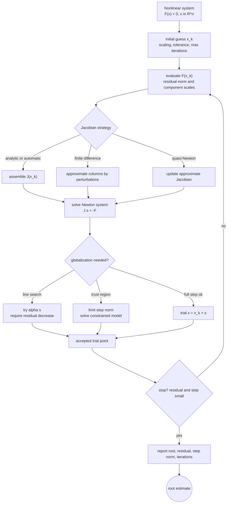

# Nonlinear Systems

A nonlinear system asks for a vector $x$ such that $F(x)=0$. Unlike scalar root finding, there is no simple sign-change bracket that guarantees a nearby solution in several dimensions. The geometry involves curves, surfaces, Jacobians, and local linear models.

Newton's method for systems generalizes the tangent-line idea: linearize all equations at the current point, solve a linear system for a correction, and update the vector. The method can be extremely fast near a regular solution, but globalization, scaling, and linear solve accuracy are central in practice.

## Definitions

Let

$$
F(x)=\begin{bmatrix}F_1(x)\\F_2(x)\\\vdots\\F_n(x)\end{bmatrix},
\qquad x\in\mathbb{R}^n.
$$

A root is a vector $p$ with $F(p)=0$. The Jacobian matrix is

$$
J_F(x)=\left[\frac{\partial F_i}{\partial x_j}(x)\right]_{i,j=1}^{n}.
$$

Newton's method solves

$$
J_F(x^{(k)})s^{(k)}=-F(x^{(k)})
$$

and updates

$$
x^{(k+1)}=x^{(k)}+s^{(k)}.
$$

A damped Newton method uses

$$
x^{(k+1)}=x^{(k)}+\lambda_k s^{(k)},\qquad 0\lt\lambda_k\le 1,
$$

where $\lambda_k$ is chosen to reduce a merit function such as $\|F(x)\|_2$.

A fixed-point system writes $x=G(x)$ and iterates $x^{(k+1)}=G(x^{(k)})$, but convergence requires a contraction condition in a vector norm.

## Key results

If $F$ is continuously differentiable near a root $p$, $J_F(p)$ is nonsingular, and the initial guess is sufficiently close to $p$, then Newton's method converges quadratically. This is the same local promise as scalar Newton's method, with the derivative replaced by the Jacobian.

The linear solve is part of the nonlinear method. An inaccurate or unstable solution of

$$
J_F(x^{(k)})s=-F(x^{(k)})
$$

can spoil the Newton step. For large systems, the step may be computed by an iterative linear solver, leading to inexact Newton methods.

Newton's method is not globally convergent by default. The full step can increase the residual norm or move into a region where the Jacobian is singular. Line search and trust-region methods add safeguards by limiting the step or requiring actual residual decrease.

Scaling matters because components of $F$ and $x$ may have different units. A stopping rule should combine a residual test, a step-size test, and a maximum iteration guard.

A reliable way to use these results is to keep the analysis tied to the actual numerical question rather than to the formula alone. For nonlinear systems, the input record should include the vector function, Jacobian strategy, scaling, initial guess, and globalization rule. Without that record, two computations that look similar on paper may have different numerical meanings. The same formula can be a safe production tool in one scaling and a fragile experiment in another. This is why the examples on this page show the intermediate arithmetic: the goal is not only to reach a number, but to expose what assumptions made that number meaningful.

The next record is the verification record. Useful diagnostics for this topic include residual norms, Newton step norms, linear-solve residuals, and merit-function decrease. A diagnostic should be chosen before the computation is trusted, not after a pleasing answer appears. When an exact answer is unavailable, compare two independent approximations, refine the mesh or tolerance, check a residual, or test the method on a neighboring problem with known behavior. If several diagnostics disagree, treat the disagreement as information about conditioning, stability, or implementation rather than as a nuisance to be averaged away.

The cost record matters as well. In this topic the dominant costs are usually Jacobian evaluations, factorizations, and line-search trials. Numerical analysis is full of methods that are mathematically attractive but computationally mismatched to the problem size. A dense factorization may be acceptable for a classroom matrix and impossible for a PDE grid. A high-order rule may use fewer steps but more expensive stages. A guaranteed method may take many iterations but provide a bound that a faster method cannot. The right comparison is therefore cost to reach a verified tolerance, not order or elegance in isolation.

Finally, every method here has a recognizable failure mode: singular Jacobians, poor scaling, and convergence to an unintended solution. These failures are not edge cases to memorize; they are signals that the hypotheses behind the result have been violated or that a different numerical model is needed. A good implementation makes such failures visible through exceptions, warnings, residual reports, or conservative stopping rules. A good hand solution does the same thing in prose by naming the assumption being used and checking it at the point where it matters.

For study purposes, the most useful habit is to separate four layers: the continuous mathematical problem, the discrete approximation, the algebraic or iterative algorithm used to compute it, and the diagnostic used to judge the result. Many mistakes come from mixing these layers. A small algebraic residual may not mean a small modeling error. A small step-to-step change may not mean the discrete equations are solved. A high-order truncation formula may not help when the data are noisy or the arithmetic is unstable. Keeping the layers separate makes the results on this page portable to larger examples.

## Visual



The nonlinear-systems diagram exposes Newton's method as a sequence of residual evaluation, Jacobian construction, linear solve, globalization, and stopping tests. The Jacobian branch distinguishes exact, finite-difference, and quasi-Newton approximations, while the globalization branch shows why full Newton steps are sometimes damped or constrained. The output includes diagnostics because a small step alone does not prove that $F(x)=0$ has been solved.

| Method | Derivative information | Local speed | Global safeguard | Main cost |
|---|---|---|---|---|
| Newton | full Jacobian | quadratic | line search or trust region | factor or solve Jacobian system |
| Fixed point | map derivative bound | usually linear | contraction region | evaluating $G$ |
| Broyden | approximate Jacobian | superlinear possible | line search often used | rank-one updates |
| Steepest descent on residual | gradients | slow near solution | natural decrease | many small steps |

## Worked example 1: one Newton correction on a circle-line system

**Problem.** Solve near the first-quadrant intersection of

$$
F(x,y)=\begin{bmatrix}x^2+y^2-1\\x-y\end{bmatrix}=0
$$

starting from $(0.7,0.7)$.

**Method.** The Jacobian is

$$
J(x,y)=\begin{bmatrix}2x&2y\\1&-1\end{bmatrix}.
$$

1. Evaluate at $(0.7,0.7)$:

$$
F(0.7,0.7)=\begin{bmatrix}-0.02\\0\end{bmatrix},
\qquad
J(0.7,0.7)=\begin{bmatrix}1.4&1.4\\1&-1\end{bmatrix}.
$$

2. Solve $Js=-F$:

$$
1.4s_1+1.4s_2=0.02,
\qquad
s_1-s_2=0.
$$

3. From $s_1=s_2$,

$$
2.8s_1=0.02 \Rightarrow s_1=s_2=0.007142857.
$$

4. Update:

$$
(x_1,y_1)=(0.707142857,0.707142857).
$$

**Checked answer.** The exact intersection is $(1/\sqrt2,1/\sqrt2)\approx(0.707106781,0.707106781)$, so one Newton step is already very close.

## Worked example 2: symmetric two-equation system

**Problem.** Apply two Newton steps from $(1,1)$ to

$$
F(x,y)=\begin{bmatrix}x^2+y-3\\x+y^2-3\end{bmatrix}.
$$

**Method.** The Jacobian is

$$
J(x,y)=\begin{bmatrix}2x&1\\1&2y\end{bmatrix}.
$$

1. At $(1,1)$,

$$
F=(-1,-1)^T,
\qquad
J=\begin{bmatrix}2&1\\1&2\end{bmatrix}.
$$

Solving $Js=(1,1)^T$ gives $s=(1/3,1/3)^T$.

2. Update to $(4/3,4/3)$.

3. At this point each residual component is

$$
(4/3)^2+4/3-3=\frac{16}{9}+\frac{12}{9}-\frac{27}{9}=\frac19.
$$

4. The Jacobian has diagonal $8/3$ and off-diagonal $1$. By symmetry the correction has equal components $q$, satisfying

$$
\left(\frac83+1\right)q=-\frac19.
$$

Thus $q=-1/33$.

5. The next iterate is

$$
\frac43-\frac1{33}=1.303030\ldots.
$$

**Checked answer.** The symmetric solution satisfies $z^2+z-3=0$, so $z=(-1+\sqrt{13})/2=1.302775\ldots$. Two Newton steps are close.

## Code

```python
import numpy as np

def newton_system(F, J, x0, tol=1e-10, max_iter=30):
    x = np.asarray(x0, dtype=float)
    for k in range(1, max_iter + 1):
        Fx = np.asarray(F(x), dtype=float)
        if np.linalg.norm(Fx, ord=2) < tol:
            return x, k - 1
        step = np.linalg.solve(np.asarray(J(x), dtype=float), -Fx)
        x = x + step
        if np.linalg.norm(step, ord=2) < tol:
            return x, k
    raise RuntimeError("Newton iteration did not converge")

F = lambda z: np.array([z[0]**2 + z[1]**2 - 1.0, z[0] - z[1]])
J = lambda z: np.array([[2*z[0], 2*z[1]], [1.0, -1.0]])
print(newton_system(F, J, [0.7, 0.7]))
```

## Common pitfalls

- Applying Newton's method when the Jacobian is singular or badly scaled.
- Trusting local quadratic convergence from a poor starting point.
- Stopping on small steps without checking the residual norm.
- Using finite-difference Jacobians with step sizes that are too large or too small.
- Forgetting that multiple solutions may exist and the initial guess influences which one is found.

## Connections

- [Newton Secant and polynomial roots](/math/numerical-analysis/newton-secant-polynomial-roots)
- [Gaussian elimination pivoting and LU](/math/numerical-analysis/gaussian-elimination-pivoting-lu)
- [ODE stability stiffness and systems](/math/numerical-analysis/ode-stability-stiffness-systems)
- [least squares and Chebyshev approximation](/math/numerical-analysis/least-squares-chebyshev-approximation)
