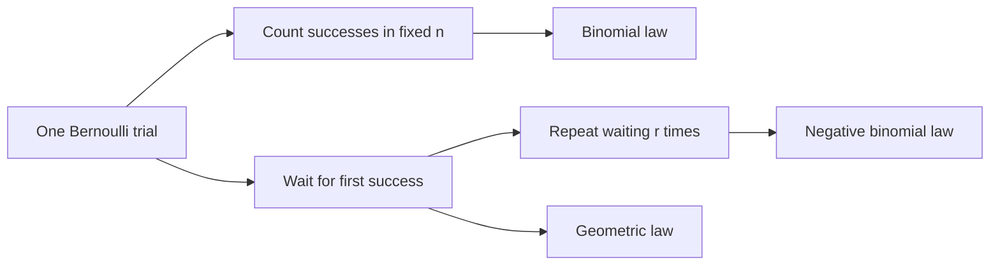

# Bernoulli, Binomial, Geometric, and Negative Binomial Laws

Repeated independent trials are the simplest laboratory for random variables. A single trial with success probability $p$ gives a Bernoulli random variable. Counting successes in a fixed number of trials gives a binomial random variable. Waiting for the first success gives a geometric random variable. Waiting for the $r$th success gives a negative binomial random variable.

These distributions appear early in MIT 18.440 because they connect counting, independence, expectation, variance, and recursion. They also teach a useful modeling distinction: sometimes the number of trials is fixed and the number of successes is random; sometimes the number of successes is fixed and the waiting time is random.

## Definitions

A **Bernoulli** random variable with parameter $p\in[0,1]$ takes values $1$ and $0$ with

$$
P(X=1)=p,\qquad P(X=0)=1-p=q.
$$

A **binomial** random variable with parameters $(n,p)$ counts successes in $n$ independent Bernoulli trials:

$$
P(X=k)=\binom{n}{k}p^k(1-p)^{n-k},
\qquad k=0,1,\ldots,n.
$$

A **geometric** random variable with parameter $p$ is the trial number of the first success:

$$
P(X=k)=q^{k-1}p,\qquad k=1,2,\ldots.
$$

This convention counts the successful trial itself. Some books use the number of failures before the first success; then the support is $0,1,2,\ldots$.

A **negative binomial** random variable with parameters $(r,p)$ is the trial number of the $r$th success:

$$
P(X=k)=\binom{k-1}{r-1}p^r q^{k-r},
\qquad k=r,r+1,\ldots.
$$

The factor $\binom{k-1}{r-1}$ chooses the locations of the first $r-1$ successes among the first $k-1$ trials; the $k$th trial must be a success.

## Key results

For Bernoulli $X$,

$$
E[X]=p,\qquad \operatorname{Var}(X)=p(1-p)=pq.
$$

This follows because $X^2=X$.

For $X\sim\operatorname{Binomial}(n,p)$,

$$
E[X]=np,\qquad \operatorname{Var}(X)=npq.
$$

Proof sketch: write $X=X_1+\cdots+X_n$, where the $X_i$ are independent Bernoulli$(p)$ indicators. Linearity gives $E[X]=np$. Independence gives

$$
\operatorname{Var}(X)=\sum_{i=1}^n\operatorname{Var}(X_i)=npq.
$$

For $X\sim\operatorname{Geometric}(p)$,

$$
E[X]=\frac1p,\qquad \operatorname{Var}(X)=\frac{q}{p^2}.
$$

A short expectation proof uses conditioning on the first trial. Let $m=E[X]$. With probability $p$, $X=1$. With probability $q$, one trial is used and the remaining waiting time has the same distribution as $X$. Thus

$$
m=p\cdot 1+q(1+m)=1+qm,
$$

so $m=1/p$.

For $X\sim\operatorname{NegativeBinomial}(r,p)$,

$$
E[X]=\frac{r}{p},
\qquad
\operatorname{Var}(X)=\frac{rq}{p^2}.
$$

This is because the waiting time for $r$ successes is a sum of $r$ independent geometric waiting times, one for each successive success.

The geometric distribution has the **memoryless property**:

$$
P(X>m+n\mid X>m)=P(X>n).
$$

In words, after $m$ failures, the remaining waiting time has the same distribution as the original waiting time.

The binomial and negative binomial distributions are complementary views of the same repeated-trial process. In the binomial model, time is fixed and the number of successes is random. In the negative binomial model, the number of successes is fixed and the time required is random. Many word problems can be solved only after identifying which of these two quantities is being held fixed.

For the binomial distribution, the coefficient $\binom nk$ counts locations of the successes. It does not count different probabilities; every sequence with $k$ successes and $n-k$ failures has probability $p^kq^{n-k}$. The coefficient appears because there are $\binom nk$ such sequences. This is the direct link back to the binomial theorem:

$$
\sum_{k=0}^n\binom nkp^kq^{n-k}=(p+q)^n=1.
$$

For the geometric distribution, the tail probability is especially simple:

$$
P(X>k)=q^k.
$$

This says the first $k$ trials all failed. The tail form is often easier than summing the PMF, and it makes memorylessness immediate:

$$
P(X>m+n\mid X>m)
=\frac{q^{m+n}}{q^m}
=q^n.
$$

Negative binomial waiting times can be decomposed as

$$
X=G_1+\cdots+G_r,
$$

where the $G_i$ are independent geometric waiting times for successive successes. After each success, the future sequence of trials has the same distribution as a fresh sequence. This decomposition gives the expectation and variance quickly, and it also explains why the negative binomial is a discrete analogue of the gamma distribution, which is a sum of exponential waiting times.

The parameter $p$ should be tied to a clearly defined success event. A "success" might mean heads, a defective item, a goal, or a baby crying in a particular minute. Changing the success definition changes $p$ and may change whether trials are plausibly independent.

## Visual

| Distribution | Random quantity | Support | PMF | Mean | Variance |
|---|---|---:|---|---:|---:|
| Bernoulli$(p)$ | one success indicator | $0,1$ | $p^xq^{1-x}$ | $p$ | $pq$ |
| Binomial$(n,p)$ | successes in $n$ trials | $0,\ldots,n$ | $\binom nkp^kq^{n-k}$ | $np$ | $npq$ |
| Geometric$(p)$ | trial of first success | $1,2,\ldots$ | $q^{k-1}p$ | $1/p$ | $q/p^2$ |
| Negative binomial$(r,p)$ | trial of $r$th success | $r,r+1,\ldots$ | $\binom{k-1}{r-1}p^rq^{k-r}$ | $r/p$ | $rq/p^2$ |



Read the table by first identifying the random quantity. "How many successes occur in ten trials?" points to the binomial row because the trial count is fixed. "How long until the first success?" points to the geometric row because the stopping time is random. "How long until the fifth success?" points to the negative binomial row. This classification step is often more important than the algebra, because the formulas can look similar but answer different questions.

## Worked example 1: six fair coin tosses

Problem: Toss a fair coin $6$ times. Let $X$ be the number of heads. Compute $P(X=4)$, $E[X]$, and $\operatorname{Var}(X)$.

Method:

1. The number of heads in $6$ independent tosses is binomial with $n=6$ and $p=1/2$.
2. The probability of exactly $4$ heads is

$$
P(X=4)=\binom64\left(\frac12\right)^4\left(\frac12\right)^2.
$$

3. Compute:

$$
\binom64=15,\qquad
\left(\frac12\right)^6=\frac1{64}.
$$

Thus

$$
P(X=4)=\frac{15}{64}.
$$

4. The expectation is

$$
E[X]=np=6\cdot\frac12=3.
$$

5. The variance is

$$
\operatorname{Var}(X)=npq=6\cdot\frac12\cdot\frac12=\frac32.
$$

Checked answer: $P(X=4)=15/64\approx0.234375$, and the mean $3$ is exactly the symmetry center of the distribution.

## Worked example 2: waiting for the third success

Problem: Independent trials have success probability $p=0.2$. What is the probability that the third success occurs on trial $10$? What is the expected trial number of the third success?

Method:

1. Let $X$ be the trial number of the third success. Then $X$ is negative binomial with $r=3$ and $p=0.2$.
2. If the third success occurs on trial $10$, then among the first $9$ trials there must be exactly $2$ successes.
3. Therefore

$$
P(X=10)=\binom{9}{2}(0.2)^3(0.8)^7.
$$

4. Compute step by step:

$$
\binom92=36,\qquad
(0.2)^3=0.008,\qquad
(0.8)^7=0.2097152.
$$

5. Hence

$$
P(X=10)=36\cdot0.008\cdot0.2097152
=0.0603979776.
$$

6. The expectation is

$$
E[X]=\frac{r}{p}=\frac{3}{0.2}=15.
$$

Checked answer: trial $10$ is earlier than the mean waiting time $15$, but it has nonnegligible probability because several successes can occur before the typical time.

## Code

```python
from math import comb

def binomial_pmf(n, p, k):
    return comb(n, k) * (p ** k) * ((1 - p) ** (n - k))

def negative_binomial_trial_pmf(r, p, k):
    if k < r:
        return 0.0
    q = 1 - p
    return comb(k - 1, r - 1) * (p ** r) * (q ** (k - r))

print("P(Binomial(6, .5)=4):", binomial_pmf(6, 0.5, 4))
print("P(third success on trial 10):", negative_binomial_trial_pmf(3, 0.2, 10))
print("Expected third success trial:", 3 / 0.2)

# Check that the first 1000 geometric probabilities nearly sum to 1.
p = 0.2
geom_sum = sum(((1 - p) ** (k - 1)) * p for k in range(1, 1001))
print("truncated geometric mass:", geom_sum)
```

## Common pitfalls

- Mixing the two geometric conventions. Always check whether $X$ counts trials until success or failures before success.
- Treating the final success in a negative binomial problem as optional. The last trial must be a success.
- Forgetting independence in the binomial model. The formula $\binom nkp^kq^{n-k}$ assumes independent repeated trials with the same $p$.
- Using binomial when the stopping rule is "continue until success". Fixed-trial and waiting-time questions have different distributions.
- Assuming the memoryless property applies to all waiting-time distributions. In this discrete setting it is special to the geometric law.

## Connections

- [Counting and combinatorics](/math/probability-and-random-variables/counting-and-combinatorics)
- [Discrete random variables, expectation, and variance](/math/probability-and-random-variables/discrete-random-variables-expectation-variance)
- [Poisson random variables and Poisson processes](/math/probability-and-random-variables/poisson-random-variables-and-processes)
- [Moment and characteristic functions](/math/probability-and-random-variables/moment-and-characteristic-functions)
- [Common discrete distributions](/math/probability/common-discrete-distributions)
