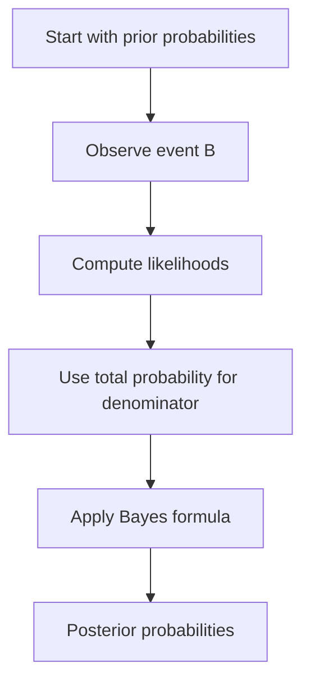

# Conditional Probability, Bayes, and Independence

Conditional probability is the mathematical operation of updating the sample space after learning information. If event $B$ has occurred, outcomes outside $B$ are no longer possible, and the probability measure is renormalized on $B$. This idea is simple in a finite picture, but it drives many subtle examples: witness reliability, medical testing, Monty Hall, repeated trials, and the difference between pairwise independence and full independence.


*Figure: Probability trees make the conditioning structure in Bayes' theorem explicit. Image: [Wikimedia Commons](https://commons.wikimedia.org/wiki/File:Bayes_theorem_tree_diagrams.svg), Gnathan87, CC0 1.0.*

The MIT lectures treat Bayes' formula as the algebra of probability revision and independence as the case where conditioning makes no difference. These ideas are linked: $A$ and $B$ are independent exactly when $P(A\mid B)=P(A)$, provided $P(B)\gt 0$. When they are not independent, Bayes' formula gives the disciplined way to update.

## Definitions

If $P(B)\gt 0$, the **conditional probability** of $A$ given $B$ is

$$
P(A\mid B)=\frac{P(A\cap B)}{P(B)}.
$$

Equivalently,

$$
P(A\cap B)=P(A\mid B)P(B)=P(B\mid A)P(A).
$$

The **multiplication rule** for events $E_1,\ldots,E_n$ is

$$
P(E_1\cap\cdots\cap E_n)
=
P(E_1)P(E_2\mid E_1)P(E_3\mid E_1\cap E_2)\cdots
P(E_n\mid E_1\cap\cdots\cap E_{n-1}),
$$

as long as the conditioning events have positive probability.

Events $A$ and $B$ are **independent** if

$$
P(A\cap B)=P(A)P(B).
$$

Events $E_1,\ldots,E_n$ are **mutually independent** if for every nonempty subset $I\subseteq\{1,\ldots,n\}$,

$$
P\left(\bigcap_{i\in I}E_i\right)=\prod_{i\in I}P(E_i).
$$

Pairwise independence only checks subsets of size $2$; it is weaker than mutual independence.

## Key results

**Bayes' formula** follows by writing $P(A\cap B)$ in two ways:

$$
P(A\mid B)=\frac{P(B\mid A)P(A)}{P(B)}.
$$

If $A_1,\ldots,A_n$ partition the sample space and each $P(A_i)\gt 0$, then the denominator can be expanded by the law of total probability:

$$
P(B)=\sum_{i=1}^{n}P(B\mid A_i)P(A_i).
$$

Thus

$$
P(A_j\mid B)=
\frac{P(B\mid A_j)P(A_j)}
{\sum_{i=1}^{n}P(B\mid A_i)P(A_i)}.
$$

This is the version used in base-rate problems. The prior $P(A_j)$ matters as much as the likelihood $P(B\mid A_j)$.

Conditional probability itself satisfies the probability axioms on the restricted space $B$: for fixed $B$ with $P(B)\gt 0$, the map $A\mapsto P(A\mid B)$ is a probability measure.

If $A$ and $B$ are independent and $0\lt P(B)\lt 1$, then $A$ is also independent of $B^c$:

$$
P(A\cap B^c)=P(A)-P(A\cap B)=P(A)-P(A)P(B)=P(A)P(B^c).
$$

This identity is often useful when independence is easier to state for the complementary event.

Bayes' formula is best understood as a ratio update. The posterior odds of $A$ versus $A^c$ are the prior odds multiplied by the likelihood ratio:

$$
\frac{P(A\mid B)}{P(A^c\mid B)}
=
\frac{P(A)}{P(A^c)}
\cdot
\frac{P(B\mid A)}{P(B\mid A^c)}.
$$

This form makes the base-rate effect explicit. Strong evidence can still lead to a modest posterior probability when the prior probability is small. Conversely, weak evidence can matter a lot when the competing hypotheses had similar prior probabilities.

The multiplication rule is the safest way to compute probabilities of sequential observations. For example, drawing cards without replacement should not be treated as independent trials. The probability of two aces in the first two cards is

$$
\frac{4}{52}\cdot\frac{3}{51},
$$

not $(4/52)^2$. The second factor is conditional on the first draw having already removed an ace. Independence would apply only if the card were replaced and the deck reshuffled between draws.

Independence is also a property of the probability model, not merely of the words in the story. Two events can sound unrelated but be dependent because of a hidden constraint. In two coin tosses, "first coin is heads" and "total number of heads is odd" are independent. But "first coin is heads" and "both coins have the same result" are also independent, even though the second event mentions the first coin indirectly. The definition, not intuition alone, decides.

For more than two events, mutual independence requires checking all nonempty subcollections. Pairwise independence means every pair factors, but it says nothing about triple intersections. This distinction becomes important in later random-variable settings, where variables may have zero pairwise covariance or pairwise independence while still being collectively constrained.

## Visual



| Concept | Formula | Interpretation |
|---|---|---|
| Conditional probability | $P(A\mid B)=P(A\cap B)/P(B)$ | renormalize on $B$ |
| Multiplication rule | $P(A\cap B)=P(A)P(B\mid A)$ | sequential probability |
| Independence | $P(A\cap B)=P(A)P(B)$ | learning $B$ does not change $A$ |
| Bayes' formula | $P(A\mid B)=P(B\mid A)P(A)/P(B)$ | reverse the conditioning |
| Total probability | $P(B)=\sum_iP(B\mid A_i)P(A_i)$ | average over cases |

## Worked example 1: the taxi witness problem

Problem: A town has two taxi companies. On the night of an accident, $85\%$ of taxis are green and $15\%$ are blue. A witness says the taxi was blue. Under similar conditions, the witness identifies taxi color correctly $80\%$ of the time. What is the probability the taxi was actually blue?

Method:

1. Let $B$ be the event "taxi is blue" and $W$ be "witness says blue".
2. Priors:

$$
P(B)=0.15,\qquad P(B^c)=0.85.
$$

3. Likelihoods:

$$
P(W\mid B)=0.80,\qquad P(W\mid B^c)=0.20.
$$

The second value is $0.20$ because a green taxi is mistakenly called blue when the witness is wrong.

4. Compute the denominator:

$$
\begin{aligned}
P(W)
&=P(W\mid B)P(B)+P(W\mid B^c)P(B^c)\\
&=0.80(0.15)+0.20(0.85)\\
&=0.12+0.17\\
&=0.29.
\end{aligned}
$$

5. Apply Bayes:

$$
P(B\mid W)=\frac{0.80(0.15)}{0.29}
=\frac{0.12}{0.29}
\approx 0.4138.
$$

Checked answer: even a fairly reliable witness does not overcome the base rate entirely. The posterior probability is about $41.4\%$, not $80\%$.

## Worked example 2: pairwise independent but not mutually independent

Problem: Toss two fair coins. Let $A$ be "first coin is heads", $B$ be "second coin is heads", and $C$ be "the number of heads is even". Are $A,B,C$ mutually independent?

Method:

1. The sample space is

$$
\{HH,HT,TH,TT\},
$$

with each outcome probability $1/4$.

2. The events are

$$
A=\{HH,HT\},\quad B=\{HH,TH\},\quad C=\{HH,TT\}.
$$

Each has probability $1/2$.

3. Pairwise intersections:

$$
A\cap B=\{HH\},\quad A\cap C=\{HH\},\quad B\cap C=\{HH\}.
$$

Each has probability $1/4$, which equals $(1/2)(1/2)$.

4. Thus the events are pairwise independent.

5. Check the triple intersection:

$$
A\cap B\cap C=\{HH\},
$$

so

$$
P(A\cap B\cap C)=\frac14.
$$

But

$$
P(A)P(B)P(C)=\frac12\cdot\frac12\cdot\frac12=\frac18.
$$

Checked answer: $A,B,C$ are pairwise independent but not mutually independent. Knowing any one of them alone gives no information about another one, but knowing two determines the third.

## Code

```python
def bayes(prior, sensitivity, false_positive):
    p_b = prior
    p_not_b = 1 - prior
    evidence = sensitivity * p_b + false_positive * p_not_b
    return sensitivity * p_b / evidence

print("Taxi posterior:", bayes(0.15, 0.80, 0.20))

outcomes = ["HH", "HT", "TH", "TT"]
events = {
    "A": {o for o in outcomes if o[0] == "H"},
    "B": {o for o in outcomes if o[1] == "H"},
    "C": {o for o in outcomes if o.count("H") % 2 == 0},
}

def prob(event):
    return len(event) / len(outcomes)

for x, y in [("A", "B"), ("A", "C"), ("B", "C")]:
    print(x, y, prob(events[x] & events[y]), prob(events[x]) * prob(events[y]))

triple = events["A"] & events["B"] & events["C"]
print("triple:", prob(triple), prob(events["A"]) * prob(events["B"]) * prob(events["C"]))
```

## Common pitfalls

- Ignoring the base rate in Bayes problems. $P(B\mid A)$ is not determined by test accuracy alone.
- Reversing conditional probabilities. In general $P(A\mid B)\ne P(B\mid A)$.
- Saying events are independent because they are disjoint. Nontrivial disjoint events are usually dependent because occurrence of one rules out the other.
- Checking only pairwise independence when a problem asks for mutual independence.
- Conditioning on an event of probability zero. For continuous random variables this requires conditional densities or a limiting interpretation, not the elementary ratio formula.

## Connections

- [Probability axioms and inclusion-exclusion](/math/probability-and-random-variables/probability-axioms-and-inclusion-exclusion)
- [Discrete random variables, expectation, and variance](/math/probability-and-random-variables/discrete-random-variables-expectation-variance)
- [Joint distributions, transformations, and independence](/math/probability-and-random-variables/joint-distributions-transformations-independence)
- [Conditional expectation](/math/probability-and-random-variables/covariance-correlation-conditional-expectation)
- [Conditional probability and Bayes in the shorter section](/math/probability/conditional-probability-bayes)
