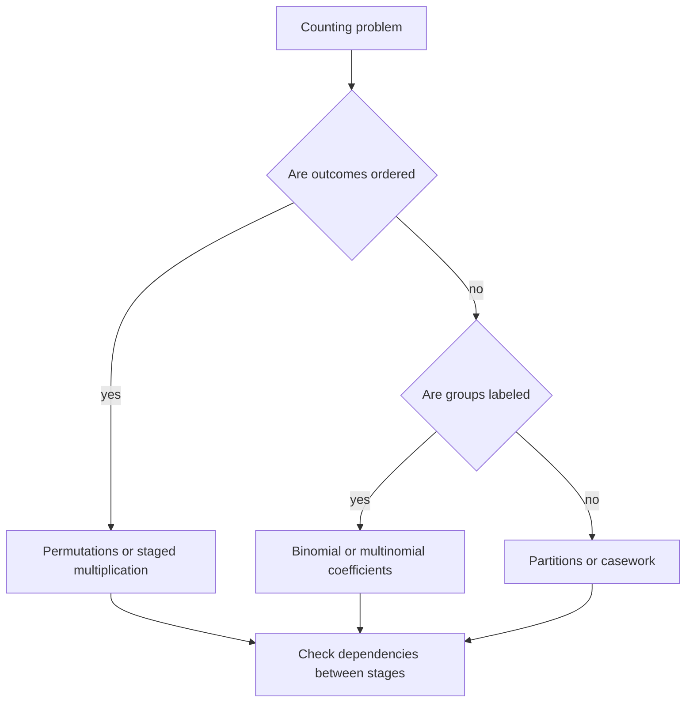

# Counting and Combinatorics

Probability begins with counting because many first models have finitely many equally likely outcomes. If every outcome in a sample space is equally likely, then probabilities reduce to ratios: favorable outcomes divided by total outcomes. The hard part is usually not the division; it is counting the numerator and denominator without double-counting, under-counting, or accidentally treating identical objects as distinct.

The first MIT 18.440 lectures use permutations, combinations, Pascal's triangle, multinomial coefficients, and partition-style problems as the basic language for finite probability. These methods remain useful even after the course moves to random variables, because binomial, multinomial, hypergeometric, geometric, and many occupancy models are all organized by the same counting principles.

## Definitions

A **permutation** of $n$ distinct objects is an ordering of all $n$ objects. There are

$$
n! = n(n-1)(n-2)\cdots 2 \cdot 1
$$

such orderings. More generally, the number of injective assignments of $k$ labeled positions from $n$ distinct objects is

$$
n(n-1)\cdots(n-k+1)=\frac{n!}{(n-k)!}.
$$

A **combination** is an unordered selection. The number of $k$-element subsets of an $n$-element set is the binomial coefficient

$$
\binom{n}{k}=\frac{n!}{k!(n-k)!}.
$$

The factor $k!$ removes the orderings of the selected objects, and the factor $(n-k)!$ removes the orderings of the unselected objects if one starts from all $n!$ permutations.

A **multinomial coefficient** counts ways to divide $n$ distinct objects into labeled groups of sizes $n_1,\ldots,n_r$ where $n_1+\cdots+n_r=n$:

$$
\binom{n}{n_1,\ldots,n_r}
=
\frac{n!}{n_1!n_2!\cdots n_r!}.
$$

Equivalently, it counts words of length $n$ containing $n_1$ copies of one letter, $n_2$ copies of another, and so on.

An **integer partition** writes an integer as a sum of positive integers where order is ignored, such as $5=3+1+1=2+2+1$. Integer partitions differ from multinomial counting because the parts themselves are not labeled by positions like "breakfast", "lunch", and "dinner".

## Key results

The **multiplication principle** says that if a procedure has $a_1$ choices at stage 1, $a_2$ choices at stage 2 no matter what happened at stage 1, and so on through $a_m$ choices at stage $m$, then the total number of outcomes is

$$
a_1a_2\cdots a_m.
$$

The phrase "no matter what happened earlier" is important. In many problems the number of later choices depends on earlier choices; then the multiplication principle must be applied after breaking the problem into cases.

The **addition principle** says that if a set of outcomes is split into disjoint cases with sizes $b_1,\ldots,b_m$, then the total number is $b_1+\cdots+b_m$. When cases overlap, inclusion-exclusion is needed; see [probability axioms and inclusion-exclusion](/math/probability-and-random-variables/probability-axioms-and-inclusion-exclusion).

The **binomial theorem** is

$$
(x+y)^n=\sum_{k=0}^n \binom{n}{k}x^k y^{n-k}.
$$

Proof sketch: expanding $(x+y)^n$ means choosing either $x$ or $y$ from each of $n$ factors. To obtain $x^k y^{n-k}$, choose which $k$ factors contribute $x$. There are $\binom{n}{k}$ such choices.

The **Pascal identity** is

$$
\binom{n}{k}=\binom{n-1}{k-1}+\binom{n-1}{k}.
$$

Proof sketch: count $k$-subsets of $\{1,\ldots,n\}$ according to whether they contain $n$. If they contain $n$, choose the other $k-1$ elements from the first $n-1$. If they do not, choose all $k$ elements from the first $n-1$.

The **multinomial theorem** is

$$
(x_1+\cdots+x_r)^n
=
\sum_{n_1+\cdots+n_r=n}
\frac{n!}{n_1!\cdots n_r!}
x_1^{n_1}\cdots x_r^{n_r}.
$$

It follows from the same expansion idea: every term records how many times each symbol $x_i$ was chosen from the $n$ factors.

A useful discipline in counting problems is to write down what the objects actually are before writing a formula. For example, "choose three people" and "choose a first, second, and third person" use the same underlying set of people but count different mathematical objects. The first object is a subset; the second is an ordered tuple with no repeated entries. Many mistakes come from silently changing the object halfway through the solution.

Another recurring method is to count the same set in two ways. Pascal's identity is one example, but the method is broader. If the same collection of objects can be described by first choosing a committee and then a chair, or by first choosing a chair and then the rest of the committee, the two resulting formulas must agree. Such identities are not just algebraic coincidences; they are evidence that the counting interpretation is correct.

The convention $0!=1$ is also forced by the formulas. There is exactly one way to arrange zero objects: do nothing. With this convention, $\binom{n}{0}=1$, $\binom{n}{n}=1$, and the binomial theorem works at the edges of Pascal's triangle. Similarly, multinomial coefficients allow some $n_i=0$, meaning one labeled group receives no elements.

Counting with replacement should be separated from counting without replacement. If $k$ independent selections are made from $n$ possibilities and repeats are allowed, the count is $n^k$. If repeats are forbidden and order matters, the count is $n!/(n-k)!$. If repeats are forbidden and order does not matter, the count is $\binom nk$. These three formulas answer different questions, even though the English wording may sound similar.

Finally, symmetry can simplify probability only after the equally likely outcomes have been identified. In a shuffled deck, all card orders are equally likely, but not all descriptions of hands are equally likely. For instance, "one pair", "two pair", and "full house" are not equally likely poker categories. The safe method is to define a uniform sample space first, usually all ordered shuffles or all unordered hands, and then count the favorable subset inside that space.

## Visual



| Pattern | Typical question | Count |
|---|---:|---:|
| Order all $n$ distinct objects | Assign $n$ hats to $n$ people | $n!$ |
| Order $k$ of $n$ distinct objects | Award gold, silver, bronze among $n$ people | $n!/(n-k)!$ |
| Select $k$ of $n$ distinct objects | Choose a poker hand by ranks only | $\binom{n}{k}$ |
| Split into labeled sizes | Choose 3 breakfast, 2 lunch, 3 dinner items from 8 | $8!/(3!2!3!)$ |
| Repeated-letter word | Arrange AAABBCCC | $8!/(3!2!3!)$ |

## Worked example 1: arranging a repeated-letter word

Problem: How many length-8 strings can be made from the multiset containing three A's, two B's, and three C's?

Method:

1. First pretend all letters are distinct. Label them $A_1,A_2,A_3,B_1,B_2,C_1,C_2,C_3$. There are $8!$ arrangements.
2. For any final visible string, the three A labels can be permuted in $3!$ ways without changing the visible string.
3. The two B labels can be permuted in $2!$ ways.
4. The three C labels can be permuted in $3!$ ways.
5. Therefore every visible string was counted $3!2!3!$ times by the labeled count.

Thus

$$
\frac{8!}{3!2!3!}
=
\frac{40320}{6\cdot 2\cdot 6}
=
560.
$$

Checked answer: the same number is obtained by sequentially choosing positions:

$$
\binom{8}{3}\binom{5}{2}\binom{3}{3}
=56\cdot 10\cdot 1
=560.
$$

The two methods agree because the first chooses all labels and divides out internal symmetries, while the second chooses positions for each letter type.

## Worked example 2: coefficient in a multinomial expansion

Problem: Find the coefficient of $x^2y^3z$ in $(x+y+z)^6$.

Method:

1. The term $x^2y^3z$ has exponents $2,3,1$, and they add to $6$, so it can occur in the expansion.
2. In expanding the six factors, choose which two factors contribute $x$, which three contribute $y$, and which one contributes $z$.
3. The number of such choices is the multinomial coefficient

$$
\binom{6}{2,3,1}
=
\frac{6!}{2!3!1!}.
$$

4. Compute:

$$
\frac{720}{2\cdot 6\cdot 1}=60.
$$

Checked answer: choose the $x$ positions first, then $y$ positions:

$$
\binom{6}{2}\binom{4}{3}\binom{1}{1}
=15\cdot 4\cdot 1
=60.
$$

So the coefficient of $x^2y^3z$ is $60$.

## Code

```python
from math import factorial, comb

def multinomial(*parts):
    n = sum(parts)
    out = factorial(n)
    for p in parts:
        out //= factorial(p)
    return out

print("AAABBCCC strings:", multinomial(3, 2, 3))
print("Coefficient of x^2 y^3 z in (x+y+z)^6:", multinomial(2, 3, 1))

# Pascal identity check for a row
n = 10
for k in range(1, n):
    assert comb(n, k) == comb(n - 1, k - 1) + comb(n - 1, k)
print("Pascal identity verified for row", n)
```

## Common pitfalls

- Treating ordered and unordered selections as the same problem. A committee of three people and a president/secretary/treasurer assignment have different counts.
- Applying the multiplication principle when the number of later choices depends on previous choices. If dependencies matter, split into cases or track the state carefully.
- Dividing by a symmetry factor that is not constant. Division works cleanly only when every final object is counted the same number of times.
- Forgetting that groups may be labeled. Three foods for breakfast and two for lunch is different from merely splitting foods into an unlabeled pile of size three and an unlabeled pile of size two.
- Using $\binom{n}{k}$ when repetitions are allowed. The usual binomial coefficient selects distinct objects without replacement.

## Connections

- [Probability axioms and inclusion-exclusion](/math/probability-and-random-variables/probability-axioms-and-inclusion-exclusion)
- [Bernoulli, binomial, geometric, and negative binomial laws](/math/probability-and-random-variables/bernoulli-binomial-geometric-negative-binomial)
- [Poisson random variables and Poisson processes](/math/probability-and-random-variables/poisson-random-variables-and-processes)
- [Discrete probability in Rosen's style](/math/discrete/discrete-probability)
- [Counting principles in the shorter probability section](/math/probability/counting-principles)
