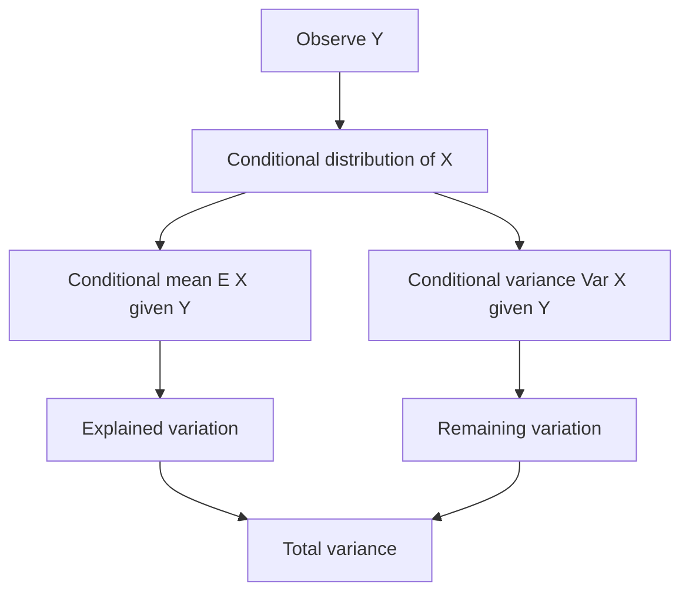

# Covariance, Correlation, and Conditional Expectation

Variance measures how one random variable spreads around its mean. Covariance measures how two variables move together. Conditional expectation measures the best average prediction after observing information. These ideas are conceptually different, but they meet in formulas such as the law of total variance and in examples where one random variable is used to predict another.

MIT 18.440 develops covariance and correlation before moving to conditional expectation. The lectures emphasize two warnings: independence implies zero covariance, but zero covariance does not imply independence; and conditional expectation can behave counterintuitively when expectations are infinite or when the conditioning information is misunderstood.

## Definitions

For random variables $X,Y$ with finite second moments, the **covariance** is

$$
\operatorname{Cov}(X,Y)
=E[(X-E[X])(Y-E[Y])].
$$

Equivalently,

$$
\operatorname{Cov}(X,Y)=E[XY]-E[X]E[Y].
$$

The **correlation coefficient** is

$$
\rho(X,Y)=
\frac{\operatorname{Cov}(X,Y)}
{\sqrt{\operatorname{Var}(X)}\sqrt{\operatorname{Var}(Y)}},
$$

provided both variances are positive and finite.

For jointly discrete random variables, the **conditional mass function** of $X$ given $Y=y$ is

$$
p_{X\mid Y}(x\mid y)
=
\frac{p_{X,Y}(x,y)}{p_Y(y)},
$$

when $p_Y(y)\gt 0$. The conditional expectation is

$$
E[X\mid Y=y]=\sum_x x\,p_{X\mid Y}(x\mid y).
$$

The expression $E[X\mid Y]$ is itself a random variable: it is the function of $Y$ that takes value $E[X\mid Y=y]$ when $Y=y$.

## Key results

Covariance is bilinear:

$$
\operatorname{Cov}(aX+bY,Z)
=a\operatorname{Cov}(X,Z)+b\operatorname{Cov}(Y,Z),
$$

and similarly in the second argument. Variance of a sum satisfies

$$
\operatorname{Var}(X+Y)
=
\operatorname{Var}(X)+\operatorname{Var}(Y)+2\operatorname{Cov}(X,Y).
$$

If $X$ and $Y$ are independent, then

$$
E[XY]=E[X]E[Y],
$$

so $\operatorname{Cov}(X,Y)=0$. The converse is false.

The **law of total expectation** is

$$
E[E[X\mid Y]]=E[X].
$$

It says that averaging the conditional averages over the distribution of $Y$ returns the original average.

The **law of total variance** is

$$
\operatorname{Var}(X)
=
\operatorname{Var}(E[X\mid Y])
+E[\operatorname{Var}(X\mid Y)].
$$

Interpretation: uncertainty in $X$ can be decomposed into uncertainty explained by $Y$ and average uncertainty remaining after $Y$ is known.

Conditional expectation is also the best mean-square predictor among functions of the observed variable:

$$
E[(X-g(Y))^2]
$$

is minimized by $g(Y)=E[X\mid Y]$.

Covariance is sensitive to units. If height is measured in centimeters rather than meters, covariance with another variable is multiplied by $100$. Correlation removes this dependence by dividing by standard deviations, so it always lies between $-1$ and $1$. Values near $1$ or $-1$ indicate strong linear association, while values near $0$ indicate little linear association, not necessarily no relationship at all.

The identity

$$
\operatorname{Var}(X+Y)
=\operatorname{Var}(X)+\operatorname{Var}(Y)+2\operatorname{Cov}(X,Y)
$$

explains why dependence matters for sums. Positive covariance increases the variance of a sum; negative covariance decreases it. In portfolio language, negatively correlated assets can reduce total risk. In probability computations, covariance terms are the price one pays when indicator variables are not independent.

Conditional expectation should be read as an averaging operation under a revised probability law. If $Y=y$ is observed, the distribution of $X$ changes to the conditional distribution, and $E[X\mid Y=y]$ is the mean under that new distribution. As $y$ varies, these means form a function. Evaluating that function at the random value $Y$ gives the random variable $E[X\mid Y]$.

The total expectation formula says that there are two equivalent ways to average: average directly, or first average within each conditional slice and then average the slice means. This is the probability version of computing a class average by first computing section averages and then weighting by section sizes. The law of total variance adds that total spread splits into spread of the slice means plus average spread within slices.

The best-predictor property is one reason conditional expectation is central in stochastic processes and statistics. If squared error is the loss function and the available information is $Y$, then no other function of $Y$ beats $E[X\mid Y]$ on average. This interpretation leads naturally to martingales, where successive conditional expectations are revised best guesses as information arrives.

## Visual



| Quantity | Formula | Role |
|---|---|---|
| Covariance | $E[XY]-E[X]E[Y]$ | signed joint variation |
| Correlation | covariance divided by standard deviations | unitless linear association |
| Conditional mean | $E[X\mid Y=y]$ | average after observing $Y=y$ |
| Total expectation | $E[E[X\mid Y]]=E[X]$ | average the conditional averages |
| Total variance | $\operatorname{Var}(E[X\mid Y])+E[\operatorname{Var}(X\mid Y)]$ | explained plus residual spread |

The diagram should be read as a two-stage experiment. First $Y$ is observed, which selects a conditional distribution for $X$. That conditional distribution has its own mean and variance. Across repeated experiments, the conditional mean changes because $Y$ changes; that changing mean accounts for the explained part of the variance. The conditional variance accounts for the randomness left after $Y$ is known. This is the same decomposition used informally when analysts say that some predictors explain part, but not all, of the variation in an outcome.

Covariance and conditional expectation answer related but distinct questions. Covariance asks for one number summarizing linear co-movement. Conditional expectation asks for an entire function describing the average of $X$ at each observed value of $Y$. When the conditional expectation is linear in $Y$, the two viewpoints are closely aligned. When it is nonlinear, covariance may miss important structure.

This perspective is also the bridge to regression in statistics: a regression curve estimates a conditional mean, while residual variance measures what remains unexplained after conditioning on the predictors.

## Worked example 1: covariance with a noisy sum

Problem: Let $X$ and $Y$ be independent random variables with $E[X]=E[Y]=0$, variances $\sigma_X^2$ and $\sigma_Y^2$, and define $Z=X+Y$. Compute $\operatorname{Cov}(X,Z)$ and $\rho(X,Z)$.

Method:

1. Use bilinearity:

$$
\operatorname{Cov}(X,Z)
=\operatorname{Cov}(X,X+Y)
=\operatorname{Cov}(X,X)+\operatorname{Cov}(X,Y).
$$

2. Since $\operatorname{Cov}(X,X)=\operatorname{Var}(X)=\sigma_X^2$ and independence gives $\operatorname{Cov}(X,Y)=0$,

$$
\operatorname{Cov}(X,Z)=\sigma_X^2.
$$

3. The variance of $Z$ is

$$
\operatorname{Var}(Z)=\operatorname{Var}(X)+\operatorname{Var}(Y)
=\sigma_X^2+\sigma_Y^2.
$$

4. Therefore

$$
\rho(X,Z)
=
\frac{\sigma_X^2}
{\sigma_X\sqrt{\sigma_X^2+\sigma_Y^2}}
=
\frac{\sigma_X}{\sqrt{\sigma_X^2+\sigma_Y^2}}.
$$

Checked answer: if $\sigma_Y^2$ is large, $Z$ contains much noise unrelated to $X$, so the correlation is small. If $\sigma_Y^2=0$, then $Z=X$ and the correlation is $1$.

## Worked example 2: conditional expectation from a dice sum

Problem: Roll two fair dice. Let $X$ be the first die, $Y$ the second die, and $Z=X+Y$. Find $E[X\mid Z=5]$.

Method:

1. The event $Z=5$ consists of outcomes

$$
(1,4),(2,3),(3,2),(4,1).
$$

2. Under the fair dice model, these four outcomes are equally likely after conditioning on $Z=5$.
3. Therefore the conditional distribution of $X$ given $Z=5$ is uniform on $\{1,2,3,4\}$.
4. Compute the conditional expectation:

$$
E[X\mid Z=5]
=\frac{1+2+3+4}{4}
=\frac{10}{4}
=\frac52.
$$

Checked answer: by symmetry, if the sum is $5$, each die has the same conditional expectation, and the two conditional expectations must add to $5$. Thus each is $5/2$.

## Code

```python
from collections import defaultdict

# Conditional expectation for dice.
outcomes = [(x, y) for x in range(1, 7) for y in range(1, 7)]
groups = defaultdict(list)
for x, y in outcomes:
    groups[x + y].append(x)

for z in [5, 7, 10]:
    print(z, sum(groups[z]) / len(groups[z]))

# Covariance and correlation for X and Z = X + Y.
sigma_x = 2.0
sigma_y = 3.0
cov_xz = sigma_x ** 2
var_z = sigma_x ** 2 + sigma_y ** 2
corr_xz = cov_xz / (sigma_x * (var_z ** 0.5))
print("Cov(X,Z):", cov_xz)
print("Corr(X,Z):", corr_xz)
```

## Common pitfalls

- Concluding independence from zero covariance. Zero covariance only rules out linear association in a second-moment sense.
- Forgetting that correlation is undefined if a variance is zero.
- Treating $E[X\mid Y]$ as a number rather than a random variable depending on $Y$.
- Confusing $E[X\mid Y=y]$ with $E[Y\mid X=x]$. Conditioning direction matters.
- Applying conditional-expectation paradoxes without checking whether the relevant expectations are finite.

## Connections

- [Discrete random variables, expectation, and variance](/math/probability-and-random-variables/discrete-random-variables-expectation-variance)
- [Joint distributions, transformations, and independence](/math/probability-and-random-variables/joint-distributions-transformations-independence)
- [Sums, convolutions, and order statistics](/math/probability-and-random-variables/sums-convolutions-order-statistics)
- [Martingales, risk-neutral probability, and Black-Scholes](/math/probability-and-random-variables/martingales-risk-neutral-probability-black-scholes)
- [Covariance, correlation, and independence](/math/probability/covariance-correlation-independence)
