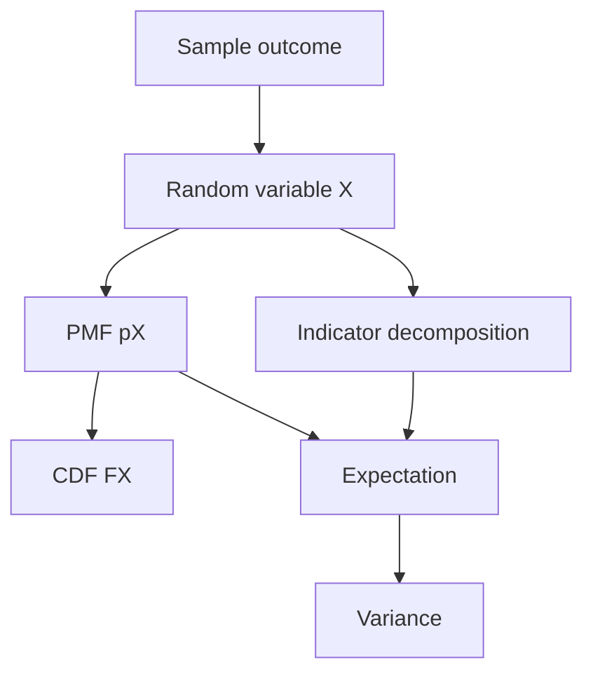

# Discrete Random Variables, Expectation, and Variance

A random variable turns outcomes into numbers. This change of viewpoint is one of the main transitions in probability: instead of asking only which event occurred, we ask for numerical summaries such as the number of heads, the number of fixed points in a shuffled hat problem, or the total payoff from a gamble. Once outcomes have numerical values, expectation and variance become the central quantities.

The MIT lectures introduce random variables as functions on the sample space, then define probability mass functions, cumulative distribution functions, expectation, variance, and the decomposition trick of writing complicated variables as sums of simple indicator variables. Linearity of expectation is the most important early result: it does not require independence and is often the simplest way to compute an expected count.

## Definitions

A **random variable** $X$ is a function from the sample space $S$ to the real numbers. It assigns a numerical value $X(\omega)$ to each outcome $\omega$.

A random variable is **discrete** if it takes values in a finite or countable set with probability one. Its **probability mass function** is

$$
p_X(x)=P(X=x).
$$

The **cumulative distribution function** is

$$
F_X(a)=P(X\le a)=\sum_{x\le a}p_X(x).
$$

If the relevant sums converge absolutely, the **expectation** is

$$
E[X]=\sum_x x p_X(x).
$$

If $g$ is a function, then

$$
E[g(X)]=\sum_x g(x)p_X(x),
$$

which is often called the law of the unconscious statistician.

The **variance** of $X$ is

$$
\operatorname{Var}(X)=E[(X-\mu)^2],
\qquad \mu=E[X].
$$

The **standard deviation** is $\sqrt{\operatorname{Var}(X)}$.

An **indicator random variable** for event $A$ is

$$
1_A=
\begin{cases}
1,& A\text{ occurs},\\
0,& A\text{ does not occur}.
\end{cases}
$$

Its expectation is $E[1_A]=P(A)$.

## Key results

Expectation is linear:

$$
E[aX+bY]=aE[X]+bE[Y],
$$

whenever the expectations exist. No independence assumption is needed. For a countable sample space this follows by summing over outcomes:

$$
\sum_{\omega\in S}(aX(\omega)+bY(\omega))P(\omega)
=a\sum_{\omega\in S}X(\omega)P(\omega)
+b\sum_{\omega\in S}Y(\omega)P(\omega).
$$

The computational variance formula is

$$
\operatorname{Var}(X)=E[X^2]-(E[X])^2.
$$

Proof:

$$
\begin{aligned}
E[(X-\mu)^2]
&=E[X^2-2\mu X+\mu^2]\\
&=E[X^2]-2\mu E[X]+\mu^2\\
&=E[X^2]-2\mu^2+\mu^2\\
&=E[X^2]-\mu^2.
\end{aligned}
$$

Scaling and shifting behave as follows:

$$
E[aX+b]=aE[X]+b,
\qquad
\operatorname{Var}(aX+b)=a^2\operatorname{Var}(X).
$$

The **indicator decomposition trick** writes a count as

$$
X=1_{A_1}+\cdots+1_{A_n}.
$$

Then

$$
E[X]=P(A_1)+\cdots+P(A_n),
$$

even when the events are dependent. This explains why expected counts can be much easier than exact distributions.

There are two common ways to compute an expectation. One sums over values of the random variable:

$$
E[X]=\sum_x xp_X(x).
$$

The other sums over the original sample space:

$$
E[X]=\sum_{\omega\in S}X(\omega)P(\{\omega\}).
$$

These are the same calculation grouped differently. The value-based formula groups together all outcomes with the same $X$ value. The state-space formula is sometimes easier when the sample space is small; the value-based formula is usually easier when the distribution of $X$ is already known.

Expectation can exist even when a most likely value is absent or misleading. For a fair die, the expectation is $3.5$, which is not an outcome. In a lottery, a very large rare payoff can dominate the expectation even though the typical outcome is zero. This is why the lectures introduce variance immediately after expectation: the mean alone does not describe risk, spread, or typical behavior.

Variance depends on squared deviations, so it is sensitive to rare large values. If $X$ is measured in dollars, then $\operatorname{Var}(X)$ is measured in squared dollars, which is one reason the standard deviation is often easier to interpret. Still, variance is algebraically convenient because squares expand cleanly and because independent variances add.

Indicator variables turn probability questions into expectation questions. If $X$ counts the number of successes among many possibly dependent events, then $E[X]$ only needs the individual success probabilities. This is why the expected number of fixed points in a random permutation is easy even though the exact distribution of fixed points requires inclusion-exclusion. The method also prepares for binomial variables, where a sum of independent indicators gives both the expectation and variance.

One must be more careful with infinite sums. A discrete random variable with values $1,2,3,\ldots$ may have probabilities summing to $1$ but still fail to have a finite expectation. The expression $\sum_x xp_X(x)$ must converge in the usual absolute sense for expectation to be safely manipulated by linearity and variance formulas.

## Visual



| Quantity | Formula | What it measures |
|---|---|---|
| PMF | $p_X(x)=P(X=x)$ | probability at each value |
| CDF | $F_X(a)=P(X\le a)$ | accumulated probability |
| Mean | $E[X]=\sum_x xp_X(x)$ | center or long-run average |
| Second moment | $E[X^2]$ | raw squared size |
| Variance | $E[X^2]-(E[X])^2$ | spread around the mean |
| Indicator mean | $E[1_A]=P(A)$ | probability as expectation |

The table separates distributional information from summary information. A PMF or CDF can determine all probabilities involving $X$. The mean and variance compress that information into two numbers. Compression is useful, but it loses detail. Two random variables can have the same mean and variance while having very different shapes, tail behavior, or most likely values. Later limit theorems explain why mean and variance are often enough for averages, but individual distributions still require more information.

When a problem asks for an expected count, try indicators before trying to find the whole PMF. When a problem asks for the probability that the count equals a specific value, the PMF is unavoidable. This distinction explains why the expected number of fixed hats is much easier than the probability that exactly three people get their own hats.

## Worked example 1: expectation and variance of a die roll

Problem: Let $X$ be the result of a fair six-sided die. Compute $E[X]$ and $\operatorname{Var}(X)$.

Method:

1. The PMF is $p_X(k)=1/6$ for $k=1,\ldots,6$.
2. The expectation is

$$
E[X]=\sum_{k=1}^{6}k\frac16
=\frac{1+2+3+4+5+6}{6}
=\frac{21}{6}
=\frac72.
$$

3. Compute the second moment:

$$
E[X^2]=\sum_{k=1}^{6}k^2\frac16
=\frac{1+4+9+16+25+36}{6}
=\frac{91}{6}.
$$

4. Use the variance formula:

$$
\operatorname{Var}(X)
=\frac{91}{6}-\left(\frac72\right)^2
=\frac{91}{6}-\frac{49}{4}
=\frac{182-147}{12}
=\frac{35}{12}.
$$

Checked answer: the standard deviation is $\sqrt{35/12}\approx 1.708$, which is plausible because die values range only from $1$ to $6$.

## Worked example 2: expected fixed points in the hat shuffle

Problem: In a random shuffle of $n$ hats among $n$ people, let $X$ be the number of people who get their own hat. Compute $E[X]$.

Method:

1. Let $A_i$ be the event that person $i$ receives their own hat.
2. Define indicators

$$
X_i=1_{A_i}.
$$

3. Then the total number of fixed points is

$$
X=X_1+\cdots+X_n.
$$

4. For each person, symmetry gives

$$
P(A_i)=\frac1n.
$$

5. Therefore

$$
E[X_i]=\frac1n.
$$

6. By linearity,

$$
E[X]=\sum_{i=1}^{n}E[X_i]
=n\cdot\frac1n
=1.
$$

Checked answer: the expected number of people receiving their own hat is always $1$, no matter how large $n$ is. This does not mean exactly one person usually gets their hat; it means the average count over many random shuffles is $1$.

## Code

```python
from fractions import Fraction

values = range(1, 7)
mean = sum(Fraction(k, 6) for k in values)
second_moment = sum(Fraction(k * k, 6) for k in values)
variance = second_moment - mean * mean

print("die mean:", mean)
print("die variance:", variance)

def expected_fixed_points(n):
    return sum(1 / n for _ in range(n))

for n in [3, 10, 100]:
    print(n, expected_fixed_points(n))
```

## Common pitfalls

- Thinking a random variable is an event. An event is a subset of outcomes; a random variable is a numerical function on outcomes.
- Forgetting that a PMF must sum to $1$.
- Assuming linearity of expectation requires independence. It does not.
- Assuming variance is linear. In general $\operatorname{Var}(X+Y)$ is not $\operatorname{Var}(X)+\operatorname{Var}(Y)$ unless covariance is zero.
- Interpreting expectation as the most likely value. A random variable may have expectation $1$ without ever equaling $1$.

## Connections

- [Conditional probability, Bayes, and independence](/math/probability-and-random-variables/conditional-probability-bayes-independence)
- [Bernoulli, binomial, geometric, and negative binomial laws](/math/probability-and-random-variables/bernoulli-binomial-geometric-negative-binomial)
- [Poisson random variables and Poisson processes](/math/probability-and-random-variables/poisson-random-variables-and-processes)
- [Covariance, correlation, and conditional expectation](/math/probability-and-random-variables/covariance-correlation-conditional-expectation)
- [Expectation, variance, and moments](/math/probability/expectation-variance-moments)
