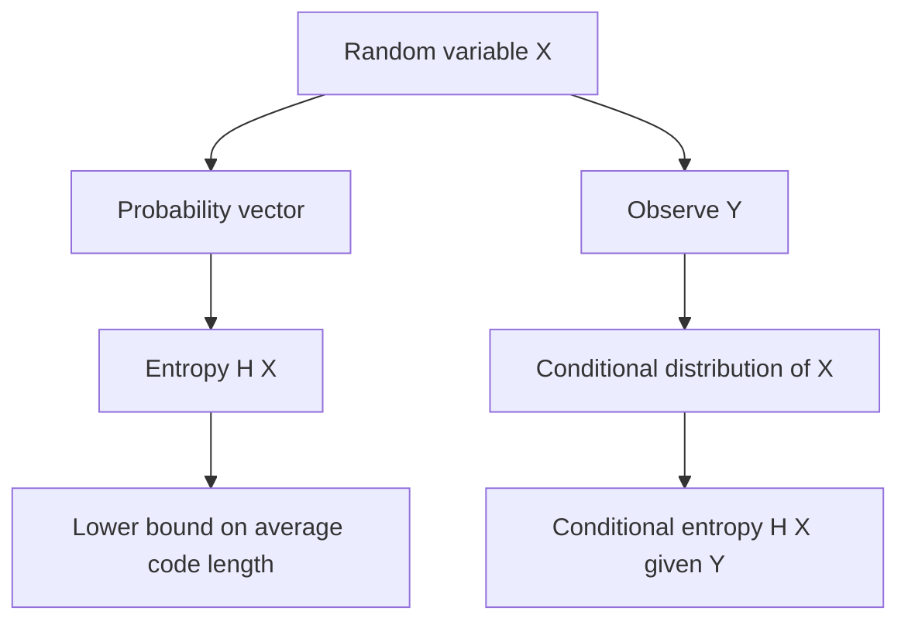

# Entropy and Coding

Entropy measures the average information or uncertainty in a random variable. A fair coin has one bit of entropy because one yes-or-no question is needed on average to learn its outcome. A biased coin has less entropy because one outcome is easier to guess. A uniform choice among many possibilities has more entropy because the outcome is harder to identify.

MIT 18.440 introduces Shannon entropy, noiseless coding, entropy of pairs, and conditional entropy. The main conceptual result is that entropy lower-bounds the expected number of binary questions needed to identify a random outcome. Conditional entropy then formalizes how much uncertainty remains about one random variable after observing another.

## Definitions

If a discrete random variable $X$ takes values $x_1,\ldots,x_n$ with probabilities $p_1,\ldots,p_n$, its **Shannon entropy** in bits is

$$
H(X)=-\sum_{i=1}^{n}p_i\log_2 p_i.
$$

Terms with $p_i=0$ are omitted, using the convention $0\log 0=0$.

The entropy of a pair is the entropy of the combined random variable:

$$
H(X,Y)=-\sum_{x,y}p_{X,Y}(x,y)\log_2 p_{X,Y}(x,y).
$$

The **conditional entropy** of $X$ given $Y=y$ is

$$
H(X\mid Y=y)
=
-\sum_x p(x\mid y)\log_2 p(x\mid y).
$$

The average conditional entropy is

$$
H(X\mid Y)=\sum_yP(Y=y)H(X\mid Y=y).
$$

A binary **code** assigns bit strings to possible values of $X$. A valid prefix-free code has no codeword that is the prefix of another; such codes can be decoded unambiguously as bits are read.

## Key results

Entropy is maximized by the uniform distribution. If $X$ is uniform on $n$ values, then

$$
H(X)=-n\cdot\frac1n\log_2\frac1n=\log_2 n.
$$

If $X$ is deterministic, then $H(X)=0$.

For independent random variables,

$$
H(X,Y)=H(X)+H(Y).
$$

Proof sketch:

$$
p_{X,Y}(x,y)=p_X(x)p_Y(y),
$$

so

$$
\begin{aligned}
H(X,Y)
&=-\sum_{x,y}p_X(x)p_Y(y)\log_2(p_X(x)p_Y(y))\\
&=-\sum_{x,y}p_X(x)p_Y(y)(\log_2p_X(x)+\log_2p_Y(y))\\
&=H(X)+H(Y).
\end{aligned}
$$

The **chain rule for entropy** is

$$
H(X,Y)=H(Y)+H(X\mid Y)
=H(X)+H(Y\mid X).
$$

Conditioning reduces entropy:

$$
H(X\mid Y)\le H(X),
$$

with equality when $X$ and $Y$ are independent. Intuitively, observing $Y$ cannot increase the average amount of uncertainty left about $X$. The proof uses concavity of the entropy function, a vector version of Jensen's inequality.

The noiseless coding theorem in the lecture says that the expected number of binary questions needed to identify $X$ is at least $H(X)$. Well-designed codes can approach this limit for long independent sequences.

Entropy is measured relative to the logarithm base. Base $2$ gives bits, which match yes-or-no questions. Natural logarithms give nats, which are common in mathematical physics and some information theory formulas. Changing the base only multiplies entropy by a constant, so the qualitative comparisons are unchanged.

The formula $-p\log p$ has two important features. First, it is zero when $p=1$, because a certain event carries no surprise. Second, it approaches zero as $p\to0$, because an event that almost never occurs contributes little to average uncertainty. Entropy is largest when probability mass is spread evenly, not when it is concentrated.

Coding gives entropy an operational meaning. If one outcome has probability $1/2$, another has probability $1/4$, and two more have probability $1/8$ each, a good binary code can assign shorter strings to more likely outcomes and longer strings to less likely outcomes. The expected code length is then close to the entropy. A fixed-length code ignores probabilities and may waste bits.

Conditional entropy measures remaining uncertainty, not the information in the observed variable itself. If $Y$ determines $X$, then $H(X\mid Y)=0$. If $Y$ is independent of $X$, then $H(X\mid Y)=H(X)$. Between these extremes, observing $Y$ partially reduces uncertainty about $X$.

The chain rule

$$
H(X,Y)=H(Y)+H(X\mid Y)
$$

matches a two-stage questioning strategy: first learn $Y$, then learn whatever remains uncertain about $X$. The total expected information is the cost of the first stage plus the expected cost of the second stage. This parallels the law of total expectation, but with uncertainty rather than numerical value.

Conditioning reduces entropy on average because the original distribution of $X$ is a mixture of the conditional distributions given $Y=y$. Entropy is concave as a function of the probability vector, so the entropy of the mixture is at least the mixture of the entropies. This is Jensen's inequality appearing in information-theoretic form.

## Visual



| Distribution of $X$ | Entropy | Interpretation |
|---|---:|---|
| deterministic | $0$ | no question needed |
| fair bit | $1$ bit | one yes-or-no question |
| uniform on $n$ values | $\log_2 n$ | balanced uncertainty |
| biased bit with $P(1)=p$ | $-p\log_2p-(1-p)\log_2(1-p)$ | less than or equal to $1$ |

The visual separates two meanings of information. Before observing $X$, the probability vector determines how uncertain the outcome is. After designing a code, entropy becomes a lower bound on the expected number of bits needed to communicate the value. These are the same quantity because an efficient questioning strategy spends short questions on likely outcomes and longer question sequences on rare outcomes.

Conditional entropy fits the same coding picture. If the decoder already knows $Y$, the sender only needs enough bits to distinguish the remaining possibilities for $X$ within the conditional distribution determined by $Y$. Averaging over the possible $Y$ values gives $H(X\mid Y)$. If $Y$ is very informative, the remaining code can be short; if $Y$ is irrelevant, no compression is gained.

Entropy is therefore not a property of the labels $x_i$ themselves. Renaming outcomes does not change entropy; only the probability vector matters. Numerical distances between labels matter for variance, but not for Shannon entropy.

## Worked example 1: entropy of a biased coin

Problem: A coin lands heads with probability $p=0.9$ and tails with probability $0.1$. Compute its entropy.

Method:

1. The probabilities are

$$
p_H=0.9,\qquad p_T=0.1.
$$

2. Entropy is

$$
H(X)=-0.9\log_2(0.9)-0.1\log_2(0.1).
$$

3. Use approximate logarithms:

$$
\log_2(0.9)\approx -0.1520,
\qquad
\log_2(0.1)\approx -3.3219.
$$

4. Substitute:

$$
\begin{aligned}
H(X)
&=-0.9(-0.1520)-0.1(-3.3219)\\
&=0.1368+0.3322\\
&=0.4690.
\end{aligned}
$$

Checked answer: the entropy is about $0.469$ bits, less than the $1$ bit of a fair coin because the outcome is easier to guess.

## Worked example 2: conditional entropy with a noisy copy

Problem: Let $X$ be a fair bit. Let $Y=X$ with probability $0.8$, and $Y=1-X$ with probability $0.2$. Compute $H(X)$ and $H(X\mid Y)$.

Method:

1. Since $X$ is fair,

$$
H(X)=1\text{ bit}.
$$

2. By symmetry, $Y$ is also fair.
3. Given $Y=y$, the probability that $X=y$ is $0.8$, and the probability that $X=1-y$ is $0.2$.
4. Therefore the conditional entropy for each observed $y$ is the entropy of $(0.8,0.2)$:

$$
H(X\mid Y=y)
=-0.8\log_2(0.8)-0.2\log_2(0.2).
$$

5. Approximate:

$$
\log_2(0.8)\approx -0.3219,
\qquad
\log_2(0.2)\approx -2.3219.
$$

6. Then

$$
H(X\mid Y)
=0.8(0.3219)+0.2(2.3219)
=0.2575+0.4644
=0.7219.
$$

Checked answer: observing $Y$ reduces uncertainty from $1$ bit to about $0.722$ bits, but does not eliminate it because the copy is noisy.

## Code

```python
from math import log2

def entropy(probs):
    return -sum(p * log2(p) for p in probs if p > 0)

print("biased coin H(0.9,0.1):", entropy([0.9, 0.1]))
print("fair bit:", entropy([0.5, 0.5]))
print("uniform four values:", entropy([0.25] * 4))

conditional = entropy([0.8, 0.2])
print("H(X|Y) for noisy copy:", conditional)
print("information learned:", 1 - conditional)
```

## Common pitfalls

- Using natural logarithms without tracking units. Natural logs give nats; base-2 logs give bits.
- Thinking entropy is the same as variance. Entropy measures uncertainty in a distribution, not numerical spread around a mean.
- Forgetting the convention $0\log 0=0$.
- Assuming conditioning always reduces entropy for every individual observed value. The average conditional entropy is at most the original entropy.
- Confusing expected code length lower bounds with exact code lengths for one symbol. Entropy limits are approached most cleanly for long sequences.

## Connections

- [Strong law and Jensen's inequality](/math/probability-and-random-variables/strong-law-and-jensens-inequality)
- [Conditional probability, Bayes, and independence](/math/probability-and-random-variables/conditional-probability-bayes-independence)
- [Markov chains](/math/probability-and-random-variables/markov-chains)
- [Discrete random variables, expectation, and variance](/math/probability-and-random-variables/discrete-random-variables-expectation-variance)
- [Statistics overview](/math/statistics)
