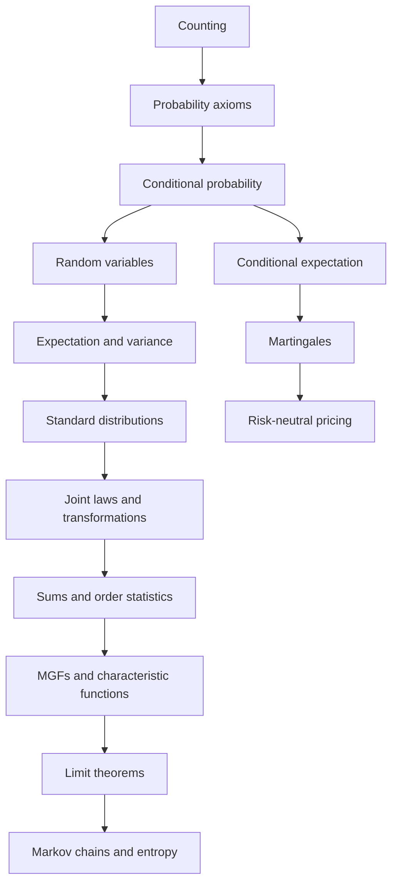

# Probability and Random Variables

This section is a rigorous probability course map following MIT 18.440 Probability and Random Variables, Scott Sheffield, Spring 2014. It begins with counting and axioms, then builds random variables, expectation, variance, standard distributions, joint laws, transforms, limit theorems, Markov chains, entropy, martingales, and the risk-neutral probability viewpoint used in Black-Scholes.

The notes are meant to sit between a short applied probability introduction and a measure-theoretic graduate course. They use finite and countable models when possible, continuous densities when needed, and proof sketches for the structural results that students repeatedly use. The section also links outward to the shorter `/math/probability/` pages, discrete mathematics probability, and statistics when the same ideas appear in a different style.

## Definitions

The section treats **probability** as a mathematical measure $P$ on events in a sample space, **random variables** as real-valued functions on that space, and **distributions** as the induced laws of those variables. The early pages emphasize exact finite models; the middle pages emphasize densities and joint laws; the later pages emphasize asymptotic behavior and stochastic processes.

The generated pages, in lecture order, are:

1. [Counting and combinatorics](/math/probability-and-random-variables/counting-and-combinatorics)
2. [Probability axioms and inclusion-exclusion](/math/probability-and-random-variables/probability-axioms-and-inclusion-exclusion)
3. [Conditional probability, Bayes, and independence](/math/probability-and-random-variables/conditional-probability-bayes-independence)
4. [Discrete random variables, expectation, and variance](/math/probability-and-random-variables/discrete-random-variables-expectation-variance)
5. [Bernoulli, binomial, geometric, and negative binomial laws](/math/probability-and-random-variables/bernoulli-binomial-geometric-negative-binomial)
6. [Poisson random variables and Poisson processes](/math/probability-and-random-variables/poisson-random-variables-and-processes)
7. [Continuous random variables and uniform laws](/math/probability-and-random-variables/continuous-random-variables-and-uniform-laws)
8. [Normal, exponential, gamma, beta, and Cauchy laws](/math/probability-and-random-variables/normal-exponential-gamma-beta-cauchy)
9. [Joint distributions, transformations, and independence](/math/probability-and-random-variables/joint-distributions-transformations-independence)
10. [Sums, convolutions, and order statistics](/math/probability-and-random-variables/sums-convolutions-order-statistics)
11. [Covariance, correlation, and conditional expectation](/math/probability-and-random-variables/covariance-correlation-conditional-expectation)
12. [Moment and characteristic functions](/math/probability-and-random-variables/moment-and-characteristic-functions)
13. [Weak law, concentration, and the central limit theorem](/math/probability-and-random-variables/weak-law-concentration-central-limit-theorem)
14. [Strong law and Jensen's inequality](/math/probability-and-random-variables/strong-law-and-jensens-inequality)
15. [Markov chains](/math/probability-and-random-variables/markov-chains)
16. [Entropy and coding](/math/probability-and-random-variables/entropy-and-coding)
17. [Martingales, risk-neutral probability, and Black-Scholes](/math/probability-and-random-variables/martingales-risk-neutral-probability-black-scholes)

## Key results

The first organizing principle is that finite probability is counting plus normalization. If $S$ is a finite sample space with equally likely outcomes, then

$$
P(A)=\frac{|A|}{|S|}.
$$

The hard part is usually choosing $S$ so that this ratio is legitimate. Counting tools such as permutations, binomial coefficients, multinomial coefficients, complements, and inclusion-exclusion provide the numerator and denominator.

The second organizing principle is conditioning. For $P(B)\gt 0$,

$$
P(A\mid B)=\frac{P(A\cap B)}{P(B)}.
$$

Bayes' formula, independence, conditional distributions, conditional expectation, and martingales are all extensions of this idea. Conditioning is the formal way probability updates when information arrives.

The third organizing principle is that random variables allow algebra. Means, variances, covariance, sums, transformations, moment generating functions, and characteristic functions all work because a random variable turns an outcome into a number. The two most used identities are

$$
E[X+Y]=E[X]+E[Y]
$$

and, when covariance is controlled,

$$
\operatorname{Var}(X+Y)
=
\operatorname{Var}(X)+\operatorname{Var}(Y)+2\operatorname{Cov}(X,Y).
$$

The fourth organizing principle is asymptotic regularity. Under suitable hypotheses, averages stabilize and normalized errors become normal:

$$
\frac{X_1+\cdots+X_n}{n}\to \mu,
\qquad
\frac{X_1+\cdots+X_n-n\mu}{\sigma\sqrt n}\Rightarrow N(0,1).
$$

The law of large numbers and the central limit theorem explain why large random systems can be predictable even when individual outcomes remain random.

The pages are deliberately cumulative. A later page often reuses an earlier idea rather than re-proving it from scratch. Poisson processes rely on binomial rare-event limits and exponential waiting times. Conditional expectation relies on conditional probability and joint distributions. Martingales rely on conditional expectation. Risk-neutral pricing relies on martingales, expectation, and the normal distribution. When a computation feels mysterious, the right repair is usually to walk backward through this dependency chain until the sample space, conditioning event, or distributional mechanism is explicit.

The section also separates exact answers from approximations. Inclusion-exclusion, conditioning, convolution, and transform identities are exact when their assumptions hold. Poisson approximation, normal approximation, and large-number reasoning become accurate in limiting regimes. A rigorous solution should say which mode it is using. For example, a binomial formula may give an exact probability, a Poisson law may give a rare-event approximation, and a normal law may give a large-sample approximation to the same family of problems.

## Visual



| Course block | Main question | Representative page |
|---|---|---|
| Counting and axioms | How are probabilities assigned consistently? | [Probability axioms and inclusion-exclusion](/math/probability-and-random-variables/probability-axioms-and-inclusion-exclusion) |
| Conditioning | How does information update probabilities? | [Conditional probability, Bayes, and independence](/math/probability-and-random-variables/conditional-probability-bayes-independence) |
| Random variables | How do numerical outcomes behave? | [Discrete random variables, expectation, and variance](/math/probability-and-random-variables/discrete-random-variables-expectation-variance) |
| Distributions | Which laws model common mechanisms? | [Normal, exponential, gamma, beta, and Cauchy laws](/math/probability-and-random-variables/normal-exponential-gamma-beta-cauchy) |
| Limit theory | What happens after many trials? | [Weak law, concentration, and the central limit theorem](/math/probability-and-random-variables/weak-law-concentration-central-limit-theorem) |
| Processes and information | How does randomness evolve or encode uncertainty? | [Markov chains](/math/probability-and-random-variables/markov-chains) |

## Worked example 1: choosing the right early-course tool

Problem: A probability problem says $n$ hats are shuffled randomly among $n$ people. It asks for the probability that nobody gets their own hat. Which pages should be used, and what is the solution path?

Method:

1. The phrase "shuffled randomly" suggests a finite equally likely model: all $n!$ permutations are equally likely. Start with [counting and combinatorics](/math/probability-and-random-variables/counting-and-combinatorics).
2. The event "nobody gets their own hat" is a complement of a union. Let $E_i$ be the event that person $i$ gets their own hat.
3. The desired event is

$$
E_1^c\cap\cdots\cap E_n^c
=
(E_1\cup\cdots\cup E_n)^c.
$$

4. This points to [probability axioms and inclusion-exclusion](/math/probability-and-random-variables/probability-axioms-and-inclusion-exclusion).
5. For any fixed set of $r$ people, the probability all $r$ get their own hats is

$$
\frac{(n-r)!}{n!}.
$$

6. Inclusion-exclusion gives

$$
P(\text{nobody gets own hat})
=
\sum_{r=0}^{n}(-1)^r\frac1{r!}.
$$

Checked answer: for large $n$, this is close to $e^{-1}$. The navigation is counting first, axioms second, inclusion-exclusion third.

## Worked example 2: choosing the right late-course tool

Problem: A fair coin is tossed $400$ times. We want to know why the fraction of heads should be close to $1/2$ and how to approximate the chance of seeing between $190$ and $210$ heads.

Method:

1. Let $X$ be the number of heads. The count is binomial$(400,1/2)$, so begin with [Bernoulli, binomial, geometric, and negative binomial laws](/math/probability-and-random-variables/bernoulli-binomial-geometric-negative-binomial).
2. The expected count and variance are

$$
E[X]=400\cdot\frac12=200,
\qquad
\operatorname{Var}(X)=400\cdot\frac12\cdot\frac12=100.
$$

3. The fraction $X/400$ is close to $1/2$ by the law of large numbers, so use [weak law, concentration, and the central limit theorem](/math/probability-and-random-variables/weak-law-concentration-central-limit-theorem).
4. For an approximation of the interval probability, use the central limit theorem. Standard deviation is $10$.
5. With continuity correction,

$$
P(190\le X\le 210)
\approx
P(189.5\le N\le 210.5),
$$

where $N$ is normal with mean $200$ and standard deviation $10$.
6. Standardizing gives

$$
P(-1.05\le Z\le 1.05)
=\Phi(1.05)-\Phi(-1.05)
\approx 0.706.
$$

Checked answer: the section path is binomial model, then expectation and variance, then CLT approximation.

## Code

```python
pages = [
    ("Counting", "/math/probability-and-random-variables/counting-and-combinatorics"),
    ("Axioms", "/math/probability-and-random-variables/probability-axioms-and-inclusion-exclusion"),
    ("Conditioning", "/math/probability-and-random-variables/conditional-probability-bayes-independence"),
    ("Random variables", "/math/probability-and-random-variables/discrete-random-variables-expectation-variance"),
    ("Limit theorems", "/math/probability-and-random-variables/weak-law-concentration-central-limit-theorem"),
]

def suggest_pages(problem_text):
    text = problem_text.lower()
    suggestions = []
    if "shuffle" in text or "choose" in text or "count" in text:
        suggestions.append(pages[0])
    if "at least" in text or "none" in text or "union" in text:
        suggestions.append(pages[1])
    if "given" in text or "test" in text or "bayes" in text:
        suggestions.append(pages[2])
    if "average" in text or "many" in text or "normal approximation" in text:
        suggestions.append(pages[4])
    return suggestions

for title, link in suggest_pages("many fair coin tosses need a normal approximation"):
    print(title, "->", link)
```

## Common pitfalls

- Skipping the sample-space step and applying formulas to outcomes that are not equally likely.
- Treating conditional probabilities as reversible; $P(A\mid B)$ and $P(B\mid A)$ answer different questions.
- Memorizing distribution formulas without identifying the random mechanism: fixed number of trials, waiting time, rare-event count, memoryless wait, or accumulated small effects.
- Using independence when the story describes sampling without replacement or a shared constraint.
- Applying limit theorems without checking finite mean, finite variance, independence, and scaling.
- Treating martingale and risk-neutral probability statements as ordinary real-world frequency claims rather than conditional-expectation and pricing statements.

## Connections

- [Short probability introduction](/math/probability)
- [Discrete probability](/math/discrete/discrete-probability)
- [Statistics overview](/math/statistics)
- [Calculus limits](/math/calculus/limits)
- [Linear algebra overview](/math/linear-algebra)
