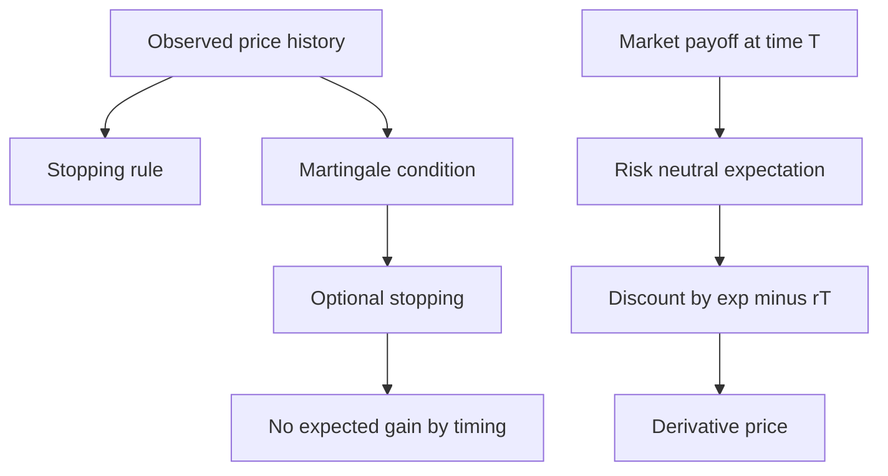

# Martingales, Risk-Neutral Probability, and Black-Scholes

The final MIT 18.440 lectures connect probability to fair games and mathematical finance. A martingale is a stochastic process whose conditional expected future value equals its current value. This captures the mathematical version of a fair game: if the price process is a martingale, no strategy based only on past and present information should create positive expected gain by timing the market.


*Figure: Pierre-Simon de Laplace is a key figure in probability, transforms, and potential theory. Image: [Wikimedia Commons](https://commons.wikimedia.org/wiki/File:Pierre-Simon_de_Laplace.jpg), Louis Delaistre after Armand-Charles Guilleminot, public domain.*

Risk-neutral probability then turns market prices into a probability measure for pricing future payoffs. Black-Scholes uses a lognormal risk-neutral model for a future stock price to compute option prices as discounted expectations. The formulas use earlier course tools: expectations, conditional expectation, normal and lognormal distributions, martingales, and no-arbitrage reasoning.

## Definitions

A sequence $X_0,X_1,X_2,\ldots$ is a **martingale** with respect to the information revealed over time if

$$
E[|X_n|]<\infty
$$

and

$$
E[X_{n+1}\mid X_0,X_1,\ldots,X_n]=X_n
$$

for all $n$.

A nonnegative integer-valued random time $T$ is a **stopping time** if the event $\{T=n\}$ can be decided using only information available through time $n$. A rule such as "sell the first time the price reaches $70$" is a stopping time; a rule such as "sell one day before the maximum price" is not.

The **optional stopping theorem**, in the bounded version stated in the lecture, says: if $X_0,X_1,\ldots$ is a bounded martingale and $T$ is a stopping time, then

$$
E[X_T]=X_0.
$$

For a fixed future time $T$ and constant risk-free rate $r$, a **risk-neutral probability** prices event contracts by

$$
\text{price of payoff }1_A\text{ at time }T
=e^{-rT}P_{\mathrm{RN}}(A).
$$

More generally, a payoff $G$ at time $T$ has no-arbitrage price

$$
e^{-rT}E_{\mathrm{RN}}[G].
$$

## Key results

Two standard martingale examples are:

1. Sums of independent mean-zero increments:

$$
S_n=Y_1+\cdots+Y_n,\qquad E[Y_i]=0.
$$

Then

$$
E[S_{n+1}\mid S_0,\ldots,S_n]=S_n.
$$

2. Successively revised best guesses:

$$
M_n=E[X\mid Y_1,\ldots,Y_n].
$$

As more information is revealed, $M_n$ changes, but its conditional expected next value remains its current value.

Optional stopping explains why bounded fair games cannot be beaten in expectation by a stopping strategy. The boundedness and stopping-time hypotheses matter; without them, doubling strategies and infinite expectations can produce misleading calculations.

For Black-Scholes, suppose the future stock price is

$$
S_T=e^N,
$$

where under risk-neutral probability

$$
N\sim \operatorname{Normal}(\mu,\sigma^2T).
$$

If the current stock price is $S_0$ and the stock pays no dividends, no arbitrage requires

$$
S_0=e^{-rT}E_{\mathrm{RN}}[S_T].
$$

Since $E[e^N]=e^{\mu+\sigma^2T/2}$,

$$
S_0=e^{-rT}e^{\mu+\sigma^2T/2},
$$

so

$$
\mu=\log S_0+\left(r-\frac{\sigma^2}{2}\right)T.
$$

A European call option with strike $K$ has payoff

$$
(S_T-K)^+.
$$

Its Black-Scholes price is the discounted risk-neutral expectation of this payoff.

The martingale condition depends on the information filtration, even when that word is not emphasized. The expression

$$
E[X_{n+1}\mid X_0,\ldots,X_n]
$$

means the conditional expectation using the information available by time $n$. If extra information were available, the same process might fail to be a martingale relative to the larger information set. In finance, this is why insider information changes the model.

Stopping times formalize admissible strategies. A trader may decide to sell when the current price crosses a threshold because that decision can be made at the crossing time. A trader may not decide to sell at the last local maximum before a crash unless the future crash is already known. Optional stopping rules out profits from honest timing rules under bounded fair-game assumptions, not from impossible hindsight strategies.

Risk-neutral probability is not a claim about real-world frequencies. It is a pricing measure. If a contract paying one dollar in event $A$ costs $0.30e^{-rT}$, then the risk-neutral probability of $A$ is $0.30$ under the chosen numeraire. A person may believe the real chance is different, but then the financial question is whether the market price offers a favorable trade after risk, liquidity, and model assumptions are considered.

The Black-Scholes lognormal assumption can be motivated by multiplicative price changes. If a price is repeatedly multiplied by small independent factors, then the log price is a sum of many small terms. The central limit theorem suggests approximate normality for the log price. The lecture also notes why this is not exact in real markets: implied volatility varies with strike, and market-implied tails are often heavier than a lognormal model predicts.

The call-option payoff is convex in the terminal stock price. This convexity is why volatility increases call value in the Black-Scholes formula: more spread creates more upside participation while losses are limited by the option expiring worthless. This is another appearance of Jensen-style reasoning in the finance part of the course.

## Visual



| Concept | Formula | Financial reading |
|---|---|---|
| Martingale | $E[X_{n+1}\mid\mathcal F_n]=X_n$ | fair current price |
| Stopping time | decision uses current and past only | admissible timing rule |
| Optional stopping | $E[X_T]=X_0$ | bounded fair game cannot be beaten in expectation |
| Risk-neutral price | $e^{-rT}E_{\mathrm{RN}}[G]$ | no-arbitrage derivative value |
| Black-Scholes assumption | $\log S_T$ normal under $P_{\mathrm{RN}}$ | lognormal terminal stock price |

The two halves of the diagram are connected by no-arbitrage thinking. Martingales describe fair evolution under the right probability measure, while risk-neutral pricing uses that measure to value future payoffs. In discrete examples, optional stopping says that timing a bounded martingale does not create expected value. In derivative pricing, discounted asset prices are modeled as martingales under risk-neutral probability, so a payoff is priced by discounting its risk-neutral expectation.

The Black-Scholes formula in the code section is a closed-form evaluation of such an expectation for the call payoff. The page's main conceptual point is not memorizing that formula, but understanding the chain of reductions: no arbitrage gives discounted risk-neutral expectation; the model makes the terminal price lognormal; the normal distribution allows the expectation of the positive part to be computed.

## Worked example 1: hitting probability by martingale stopping

Problem: A simple fair random walk starts at $50$ and moves by $+1$ or $-1$ with equal probability each step. It stops when it first reaches $40$ or $70$. What is the probability it hits $70$ before $40$?

Method:

1. Let $X_n$ be the walk position. It is a martingale because the next increment has mean zero.
2. Let $T$ be the first time the walk reaches $40$ or $70$. For the stopped bounded walk, optional stopping gives

$$
E[X_T]=X_0=50.
$$

3. Let

$$
p=P(X_T=70).
$$

Then

$$
P(X_T=40)=1-p.
$$

4. Compute the expectation:

$$
E[X_T]=70p+40(1-p).
$$

5. Set equal to $50$:

$$
70p+40-40p=50.
$$

6. Solve:

$$
30p=10
\quad\Rightarrow\quad
p=\frac13.
$$

Checked answer: starting at $50$ is one third of the way from $40$ to $70$, so the probability of hitting the upper boundary first is $1/3$.

## Worked example 2: pricing a simple event contract

Problem: A contract pays $1$ dollar at time $T=2$ years if event $A$ occurs. The continuously compounded risk-free rate is $r=0.05$, and the market-implied risk-neutral probability of $A$ is $0.30$. What is the no-arbitrage price?

Method:

1. The payoff is $1_A$.
2. Its risk-neutral expectation is

$$
E_{\mathrm{RN}}[1_A]=P_{\mathrm{RN}}(A)=0.30.
$$

3. Discount by $e^{-rT}$:

$$
\text{price}=e^{-0.05\cdot2}\cdot0.30.
$$

4. Compute the discount factor:

$$
e^{-0.10}\approx0.9048.
$$

5. Therefore

$$
\text{price}\approx0.9048\cdot0.30=0.2714.
$$

Checked answer: the price is less than $0.30$ because the payoff is delayed two years and must be discounted.

## Code

```python
from math import exp, log, sqrt, erf

def normal_cdf(x):
    return 0.5 * (1 + erf(x / sqrt(2)))

def black_scholes_call(S0, K, r, sigma, T):
    d1 = (log(S0 / K) + (r + 0.5 * sigma ** 2) * T) / (sigma * sqrt(T))
    d2 = d1 - sigma * sqrt(T)
    return S0 * normal_cdf(d1) - K * exp(-r * T) * normal_cdf(d2)

def event_contract_price(prob_rn, r, T):
    return exp(-r * T) * prob_rn

print("hitting probability upper first:", (50 - 40) / (70 - 40))
print("event contract price:", event_contract_price(0.30, 0.05, 2))
print("sample call price:", black_scholes_call(S0=100, K=105, r=0.04, sigma=0.2, T=1))
```

## Common pitfalls

- Treating every fair-looking process as a martingale without checking the conditional expectation.
- Using optional stopping without verifying stopping-time and boundedness or integrability conditions.
- Confusing real-world probability with risk-neutral probability. Risk-neutral probabilities are inferred from prices under a chosen numeraire and no-arbitrage assumptions.
- Forgetting discounting in derivative pricing.
- Thinking Black-Scholes says actual stock returns are exactly lognormal. The lecture notes emphasize that market-implied distributions often have heavier tails and volatility smiles.

## Connections

- [Covariance, correlation, and conditional expectation](/math/probability-and-random-variables/covariance-correlation-conditional-expectation)
- [Markov chains](/math/probability-and-random-variables/markov-chains)
- [Normal, exponential, gamma, beta, and Cauchy laws](/math/probability-and-random-variables/normal-exponential-gamma-beta-cauchy)
- [Strong law and Jensen's inequality](/math/probability-and-random-variables/strong-law-and-jensens-inequality)
- [Statistics overview](/math/statistics)
