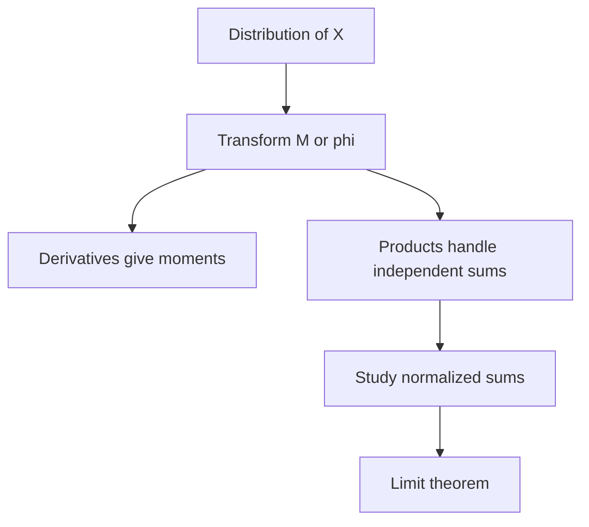

# Moment and Characteristic Functions

Moment generating functions and characteristic functions encode probability laws as functions. The central idea is that multiplying independent transforms is easier than convolving densities or mass functions. This is why transforms are powerful for sums of independent random variables and why MIT 18.440 uses them to prove the weak law of large numbers and the central limit theorem.


*Figure: Pierre-Simon de Laplace is a key figure in probability, transforms, and potential theory. Image: [Wikimedia Commons](https://commons.wikimedia.org/wiki/File:Pierre-Simon_de_Laplace.jpg), Louis Delaistre after Armand-Charles Guilleminot, public domain.*

Moment generating functions are intuitive because their derivatives generate moments, but they may fail to exist for heavy-tailed distributions. Characteristic functions insert the complex number $i$ and are always defined, making them more robust. They are Fourier transforms of probability distributions and are the standard tool behind convergence in distribution.

## Definitions

The **moment generating function** of a random variable $X$ is

$$
M_X(t)=E[e^{tX}],
$$

for values of $t$ where the expectation is finite.

If $X$ is discrete,

$$
M_X(t)=\sum_x e^{tx}p_X(x).
$$

If $X$ has density $f_X$,

$$
M_X(t)=\int_{-\infty}^{\infty} e^{tx}f_X(x)\,dx.
$$

The **characteristic function** of $X$ is

$$
\varphi_X(t)=E[e^{itX}],
$$

where $i^2=-1$. Since $\vert e^{itX}\vert =1$, this expectation always exists.

We say $X_n$ **converges in distribution** to $X$ if

$$
F_{X_n}(x)\to F_X(x)
$$

at every continuity point $x$ of $F_X$.

## Key results

Moment generating functions generate moments when derivatives exist near zero:

$$
M_X'(0)=E[X],
\qquad
M_X''(0)=E[X^2],
$$

and more generally

$$
M_X^{(m)}(0)=E[X^m].
$$

Proof sketch: differentiate $e^{tX}$ with respect to $t$:

$$
\frac{d^m}{dt^m}e^{tX}=X^m e^{tX}.
$$

Then evaluate at $t=0$. Justifying interchange of derivative and expectation requires regularity, which is why existence near zero matters.

If $X$ and $Y$ are independent, then

$$
M_{X+Y}(t)=M_X(t)M_Y(t),
$$

because

$$
E[e^{t(X+Y)}]=E[e^{tX}e^{tY}]=E[e^{tX}]E[e^{tY}].
$$

The same identity holds for characteristic functions:

$$
\varphi_{X+Y}(t)=\varphi_X(t)\varphi_Y(t).
$$

Scaling satisfies

$$
M_{aX}(t)=M_X(at),
\qquad
\varphi_{aX}(t)=\varphi_X(at).
$$

Important examples:

| Distribution | MGF |
|---|---|
| Bernoulli$(p)$ | $q+pe^t$ |
| Binomial$(n,p)$ | $(q+pe^t)^n$ |
| Poisson$(\lambda)$ | $\exp(\lambda(e^t-1))$ |
| Normal$(\mu,\sigma^2)$ | $\exp(\mu t+\sigma^2t^2/2)$ |
| Exponential$(\lambda)$ | $\lambda/(\lambda-t)$ for $t\lt \lambda$ |

Levy's continuity theorem, in the form used in the lectures, says that convergence of characteristic functions to a characteristic function implies convergence in distribution. This makes characteristic functions a rigorous route to limit theorems.

Transforms are useful because they convert hard operations into easier ones. Convolution of densities becomes multiplication of transforms. Scaling a random variable becomes rescaling the transform argument. Moments become derivatives at zero. These rules allow one to prove distributional identities without performing difficult integrals directly.

The MGF may fail for two different reasons. It may be infinite for all nonzero $t$, as with very heavy-tailed distributions, or it may exist only on one side of zero. For an exponential random variable with rate $\lambda$, $M(t)=\lambda/(\lambda-t)$ exists only for $t\lt \lambda$. That restricted domain is still enough for many calculations, but one must not plug in arbitrary $t$ values.

Characteristic functions avoid this integrability problem because $e^{itX}$ has absolute value $1$. They can be complex-valued, but their real and imaginary parts are simply expectations of cosine and sine:

$$
\varphi_X(t)=E[\cos(tX)]+iE[\sin(tX)].
$$

This bounded oscillatory structure is why characteristic functions are always defined and why they are closely related to Fourier analysis.

For integer-valued random variables, characteristic functions contain periodic information. Since $e^{i2\pi X}=1$ whenever $X$ is an integer, $\varphi_X(2\pi)=1$. More generally, the pattern of $\varphi_X(t)$ reflects lattice structure in the distribution. This is one reason characteristic functions are more than a technical proof device.

In limit theorem proofs, the logarithm of a transform often exposes the first few moments. If $E[X]=0$ and $\operatorname{Var}(X)=1$, then near zero the transform behaves like $1+t^2/2$ for MGFs or $1-t^2/2$ for characteristic functions. Raising this expression to the $n$th power at argument $t/\sqrt n$ produces an exponential limit, which is the normal transform.

## Visual



| Feature | MGF $M_X(t)$ | Characteristic function $\varphi_X(t)$ |
|---|---|---|
| Definition | $E[e^{tX}]$ | $E[e^{itX}]$ |
| Always exists | no | yes |
| Moments by derivatives | direct when finite | with powers of $i$ |
| Independent sums | products | products |
| Limit theorem use | useful when it exists near zero | more general |
| Heavy-tail behavior | may fail | still defined |

The contrast in the table is the practical reason for learning both transforms. MGFs are friendlier in elementary calculations because derivatives at zero have no complex constants, and common distributions have simple MGFs. Characteristic functions require complex notation, but they work for every probability distribution. The later lectures use this extra generality to prove limit theorems under hypotheses where MGFs might not exist.

Transform uniqueness is the background principle. Under the standard hypotheses used in probability, a distribution is determined by its characteristic function, and an MGF determines the distribution when it exists in a neighborhood of zero. Therefore, showing two random variables have the same transform is a legitimate way to show they have the same distribution. This is what happens when proving that independent Poisson sums remain Poisson.

One should still keep transforms connected to probability. A transform is not just an algebraic gadget; it is an expectation of a function of $X$. Its value depends on the whole distribution, weighting every possible outcome by an exponential or oscillatory factor.

When using transforms, always record the interval of $t$ values where the calculation is valid. Two expressions that agree only outside the domain of an MGF do not prove anything about the distribution. Characteristic functions avoid this particular domain issue, but they require tracking complex arithmetic carefully. In proofs, this bookkeeping is part of the argument, not a cosmetic detail. It is also where many otherwise plausible transform solutions fail. Always state the transform and its domain together before comparing formulas.

## Worked example 1: binomial MGF from Bernoulli trials

Problem: Find the MGF of a binomial$(n,p)$ random variable and use it to compute the mean.

Method:

1. For a Bernoulli$(p)$ variable $B$,

$$
M_B(t)=E[e^{tB}]
=e^0P(B=0)+e^tP(B=1)
=q+pe^t.
$$

2. If $X\sim\operatorname{Binomial}(n,p)$, write

$$
X=B_1+\cdots+B_n
$$

with independent Bernoulli$(p)$ variables.

3. Therefore

$$
M_X(t)=\prod_{j=1}^n M_{B_j}(t)
=(q+pe^t)^n.
$$

4. Differentiate:

$$
M_X'(t)=n(q+pe^t)^{n-1}pe^t.
$$

5. Evaluate at $t=0$:

$$
M_X'(0)=n(q+p)^{n-1}p=np.
$$

Checked answer: the transform method agrees with the indicator decomposition result $E[X]=np$.

## Worked example 2: sum of independent Poisson variables

Problem: Use MGFs to show that if $X\sim\operatorname{Poisson}(\lambda_1)$ and $Y\sim\operatorname{Poisson}(\lambda_2)$ are independent, then $X+Y$ is Poisson with parameter $\lambda_1+\lambda_2$.

Method:

1. The Poisson MGF is

$$
M_X(t)=\exp(\lambda_1(e^t-1)),
\qquad
M_Y(t)=\exp(\lambda_2(e^t-1)).
$$

2. For $Z=X+Y$, independence gives

$$
M_Z(t)=M_X(t)M_Y(t).
$$

3. Multiply:

$$
\begin{aligned}
M_Z(t)
&=\exp(\lambda_1(e^t-1))\exp(\lambda_2(e^t-1))\\
&=\exp((\lambda_1+\lambda_2)(e^t-1)).
\end{aligned}
$$

4. This is exactly the MGF of a Poisson random variable with parameter $\lambda_1+\lambda_2$.

Checked answer: the result matches the Poisson process interpretation that independent event streams add their rates.

## Code

```python
from math import exp

def bernoulli_mgf(p, t):
    return (1 - p) + p * exp(t)

def binomial_mgf(n, p, t):
    return bernoulli_mgf(p, t) ** n

def poisson_mgf(lam, t):
    return exp(lam * (exp(t) - 1))

p = 0.3
n = 10
h = 1e-5
numerical_mean = (binomial_mgf(n, p, h) - binomial_mgf(n, p, -h)) / (2 * h)
print("numerical binomial mean:", numerical_mean)
print("exact binomial mean:", n * p)

lam1, lam2, t = 2.0, 5.0, 0.4
product = poisson_mgf(lam1, t) * poisson_mgf(lam2, t)
combined = poisson_mgf(lam1 + lam2, t)
print("Poisson MGF product equals combined:", product, combined)
```

## Common pitfalls

- Assuming an MGF exists for every distribution. Heavy-tailed laws such as Cauchy do not have finite MGFs near zero.
- Forgetting independence when multiplying transforms of sums.
- Confusing $M_X(t)$ and $\varphi_X(t)$. Characteristic functions use $e^{itX}$ and may be complex-valued.
- Thinking equality of a few moments determines a distribution. A transform, when valid in the required sense, carries much more information.
- Applying a continuity theorem without checking that the limiting function is the transform of a probability law.

## Connections

- [Sums, convolutions, and order statistics](/math/probability-and-random-variables/sums-convolutions-order-statistics)
- [Poisson random variables and Poisson processes](/math/probability-and-random-variables/poisson-random-variables-and-processes)
- [Weak law, concentration, and the central limit theorem](/math/probability-and-random-variables/weak-law-concentration-central-limit-theorem)
- [Strong law and Jensen's inequality](/math/probability-and-random-variables/strong-law-and-jensens-inequality)
- [Generating functions](/math/probability/generating-functions)
