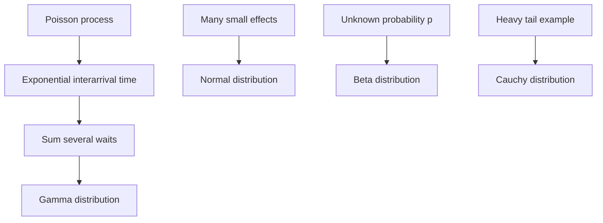

# Normal, Exponential, Gamma, Beta, and Cauchy Laws

The continuous distributions in the middle of MIT 18.440 each encode a different mechanism. The normal law describes the accumulated effect of many small mostly independent influences. The exponential law describes memoryless waiting times. The gamma law describes sums of exponential waits. The beta law describes random probabilities and order-statistic shapes. The Cauchy law is a warning: a natural density may fail to have a finite mean or variance.

These distributions are not just a catalog. Their formulas explain why later theorems need hypotheses. The central limit theorem uses finite variance; the law of large numbers needs finite mean; the Cauchy distribution violates these assumptions. The exponential and gamma laws connect continuous densities back to Poisson processes.

## Definitions

A **standard normal** random variable has density

$$
\phi(x)=\frac{1}{\sqrt{2\pi}}e^{-x^2/2},
\qquad -\infty<x<\infty.
$$

A normal random variable with mean $\mu$ and variance $\sigma^2$ has density

$$
f(x)=\frac{1}{\sigma\sqrt{2\pi}}
e^{-(x-\mu)^2/(2\sigma^2)}.
$$

An **exponential** random variable with rate $\lambda\gt 0$ has density

$$
f(x)=
\begin{cases}
\lambda e^{-\lambda x},&x\ge0,\\
0,&x<0.
\end{cases}
$$

A **gamma** random variable with rate $\lambda\gt 0$ and shape $\alpha\gt 0$ has density

$$
f(x)=
\frac{\lambda^\alpha}{\Gamma(\alpha)}x^{\alpha-1}e^{-\lambda x},
\qquad x>0,
$$

where

$$
\Gamma(\alpha)=\int_0^\infty x^{\alpha-1}e^{-x}\,dx.
$$

A **beta** random variable with parameters $a,b\gt 0$ has density on $[0,1]$

$$
f(x)=\frac{\Gamma(a+b)}{\Gamma(a)\Gamma(b)}x^{a-1}(1-x)^{b-1}.
$$

A **standard Cauchy** random variable has density

$$
f(x)=\frac{1}{\pi(1+x^2)}.
$$

## Key results

If $Z$ is standard normal, then

$$
E[Z]=0,\qquad \operatorname{Var}(Z)=1.
$$

If $X=\mu+\sigma Z$, then $X$ is normal with mean $\mu$ and variance $\sigma^2$. Standardization reverses this:

$$
Z=\frac{X-\mu}{\sigma}.
$$

If $X$ is exponential with rate $\lambda$, then

$$
P(X>t)=e^{-\lambda t},
\qquad
E[X]=\frac1\lambda,
\qquad
\operatorname{Var}(X)=\frac1{\lambda^2}.
$$

The exponential law is memoryless:

$$
P(X>s+t\mid X>s)=P(X>t).
$$

If $X_1,\ldots,X_n$ are independent exponential$(\lambda)$ random variables, then

$$
X_1+\cdots+X_n\sim\operatorname{Gamma}(\lambda,n).
$$

More generally, gamma random variables with the same rate add by shapes:

$$
\operatorname{Gamma}(\lambda,s)+\operatorname{Gamma}(\lambda,t)
\sim
\operatorname{Gamma}(\lambda,s+t),
$$

when the variables are independent.

The beta distribution appears naturally when a probability parameter is unknown. If $p$ is initially uniform on $[0,1]$ and then $n$ coin tosses produce $h$ heads and $t$ tails, the posterior density for $p$ is proportional to

$$
p^h(1-p)^t,
$$

which is beta$(h+1,t+1)$.

The Cauchy distribution has no finite expectation. The positive and negative tails are too heavy for $\int \vert x\vert f(x)\,dx$ to converge. This is why one must not apply mean-based limit theorems blindly.

The normal distribution is determined by location and scale. Translating changes the mean but not the shape; multiplying by a positive constant stretches the standard deviation by that constant and the variance by its square. This is why standardization is so useful: every normal probability can be reduced to a probability for the standard normal variable $Z$.

The exponential distribution is the continuous analogue of the geometric distribution. Both are memoryless, and both describe waiting for the first success or event. The parameter conventions are different: geometric uses success probability per trial, while exponential uses rate per unit time. In a Poisson process with rate $\lambda$, the exponential mean $1/\lambda$ is the average waiting time between events.

The gamma distribution keeps track of repeated exponential waiting. If the first event time is exponential, the time of the $n$th event is a sum of $n$ independent exponential interarrival times and is gamma with shape $n$. The formula with $\Gamma(\alpha)$ extends this distribution to non-integer shapes, but the waiting-time story is most literal for positive integer shape.

The beta distribution is flexible on $[0,1]$. When $a=b=1$, it is uniform. When $a$ and $b$ are large, it concentrates near $a/(a+b)$. When $a\lt 1$ or $b\lt 1$, it can pile density near the endpoints. In Bayesian coin-toss examples, $a$ and $b$ behave like prior counts plus observed successes and failures.

The Cauchy distribution shows why formulas must include hypotheses. It has a symmetric bell-like density, but its tails decay like $1/x^2$, too slowly for $E[\vert X\vert ]$ to be finite. A sample average of independent Cauchy variables does not settle down according to the usual law of large numbers; in fact, the average has the same Cauchy distribution as each summand. This is not a contradiction, because the theorem's finite-mean assumption fails.

## Visual

| Distribution | Support | Main mechanism | Mean | Variance |
|---|---|---|---:|---:|
| Normal$(\mu,\sigma^2)$ | all real numbers | accumulated small effects | $\mu$ | $\sigma^2$ |
| Exponential$(\lambda)$ | $[0,\infty)$ | memoryless waiting time | $1/\lambda$ | $1/\lambda^2$ |
| Gamma$(\lambda,\alpha)$ | $[0,\infty)$ | sum of exponential waits | $\alpha/\lambda$ | $\alpha/\lambda^2$ |
| Beta$(a,b)$ | $[0,1]$ | random probability or order statistic | $a/(a+b)$ | $ab/((a+b)^2(a+b+1))$ |
| Cauchy | all real numbers | heavy-tailed ratio or tangent angle | undefined | undefined |



The comparison table is meant to prevent formula memorization from replacing model recognition. A waiting-time story with no memory points to exponential; a waiting time for several events points to gamma; a proportion or unknown probability points to beta; accumulated small effects point to normal; a heavy-tailed angle or ratio story may produce Cauchy. Once the mechanism is identified, the support and parameter meanings usually follow.

These families also interact. Exponential waiting times come from Poisson processes, gamma variables are sums of exponentials, normal variables are stable under independent addition, and beta variables arise from uniform order statistics and Bayesian updating for Bernoulli trials. The Cauchy law is deliberately different: it is stable under averaging in a way that breaks the usual mean-based intuition.

## Worked example 1: a standardized normal probability

Problem: Let $X$ be normal with mean $10$ and variance $4$. Express $P(8\le X\le 13)$ in terms of the standard normal CDF $\Phi$.

Method:

1. The standard deviation is $\sigma=2$.
2. Standardize:

$$
Z=\frac{X-10}{2}.
$$

3. Convert the lower endpoint:

$$
X=8
\quad\Rightarrow\quad
Z=\frac{8-10}{2}=-1.
$$

4. Convert the upper endpoint:

$$
X=13
\quad\Rightarrow\quad
Z=\frac{13-10}{2}=1.5.
$$

5. Therefore

$$
P(8\le X\le13)=P(-1\le Z\le1.5).
$$

6. In CDF form,

$$
P(-1\le Z\le1.5)=\Phi(1.5)-\Phi(-1).
$$

Checked answer: using approximate values $\Phi(1.5)\approx0.9332$ and $\Phi(-1)\approx0.1587$, the probability is about $0.7745$.

## Worked example 2: competing exponential clocks

Problem: Two independent clocks ring after exponential waiting times. Clock 1 has rate $\lambda_1=2$ per hour, and clock 2 has rate $\lambda_2=3$ per hour. Find the distribution of the first ringing time and the probability clock 1 rings first.

Method:

1. Let $X_1\sim\operatorname{Exponential}(2)$ and $X_2\sim\operatorname{Exponential}(3)$.
2. The first ringing time is

$$
T=\min(X_1,X_2).
$$

3. For $t\ge0$,

$$
\begin{aligned}
P(T>t)
&=P(X_1>t,\ X_2>t)\\
&=P(X_1>t)P(X_2>t)\\
&=e^{-2t}e^{-3t}\\
&=e^{-5t}.
\end{aligned}
$$

Thus $T$ is exponential with rate $5$.

4. The probability clock 1 rings first is

$$
P(X_1<X_2)=\int_0^\infty P(X_2>x)f_{X_1}(x)\,dx.
$$

5. Substitute:

$$
\int_0^\infty e^{-3x}\cdot 2e^{-2x}\,dx
=2\int_0^\infty e^{-5x}\,dx
=\frac25.
$$

Checked answer: clock 1 has rate $2$ out of total rate $5$, so its chance of being first is $2/5$.

## Code

```python
from math import erf, sqrt, exp

def normal_cdf(x, mu=0.0, sigma=1.0):
    z = (x - mu) / (sigma * sqrt(2))
    return 0.5 * (1 + erf(z))

prob = normal_cdf(13, 10, 2) - normal_cdf(8, 10, 2)
print("P(8 <= X <= 13):", prob)

lambda1, lambda2 = 2.0, 3.0
print("first ringing rate:", lambda1 + lambda2)
print("P(clock 1 first):", lambda1 / (lambda1 + lambda2))

def exponential_survival(rate, t):
    return exp(-rate * t)

print("P(first ringing after 0.5 hours):", exponential_survival(5, 0.5))
```

## Common pitfalls

- Forgetting the normalizing factor $1/(\sigma\sqrt{2\pi})$ in a normal density.
- Confusing exponential rate $\lambda$ with mean $1/\lambda$.
- Applying the exponential memoryless property to normal, uniform, or gamma waiting times.
- Assuming every familiar-looking density has a finite mean. The Cauchy density is the standard warning example.
- Using a beta distribution outside $[0,1]$. It models proportions and probabilities, not arbitrary real-valued measurements.

## Connections

- [Poisson random variables and Poisson processes](/math/probability-and-random-variables/poisson-random-variables-and-processes)
- [Continuous random variables and uniform laws](/math/probability-and-random-variables/continuous-random-variables-and-uniform-laws)
- [Sums, convolutions, and order statistics](/math/probability-and-random-variables/sums-convolutions-order-statistics)
- [Weak law, concentration, and the central limit theorem](/math/probability-and-random-variables/weak-law-concentration-central-limit-theorem)
- [Common continuous distributions](/math/probability/common-continuous-distributions)
