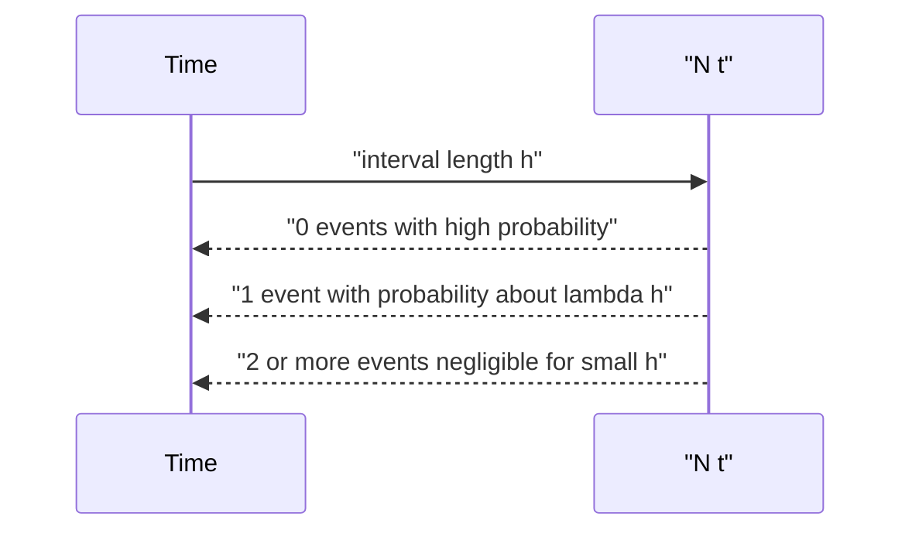

# Poisson Random Variables and Poisson Processes

The Poisson distribution models counts of rare events in a fixed region of time or space: emissions in a time interval, calls to a call center, goals in a match, or unusual events in a large number of trials. MIT 18.440 introduces it as a limit of binomial random variables where $n$ is large, $p$ is small, and $np$ remains near a fixed value $\lambda$.

The Poisson process extends this count model from one interval to an entire random counting function $N(t)$. Its central assumptions are independent increments, stationary increments, and a constant rate. From these assumptions come Poisson counts over intervals and exponential waiting times between events, linking this page to the continuous distributions later in the course.

## Definitions

A random variable $X$ has the **Poisson distribution** with parameter $\lambda\gt 0$ if

$$
P(X=k)=e^{-\lambda}\frac{\lambda^k}{k!},
\qquad k=0,1,2,\ldots.
$$

The parameter $\lambda$ is both the mean and the variance.

A **Poisson process** with rate $\lambda\gt 0$ is a random counting function $N(t)$, $t\ge0$, satisfying:

1. $N(0)=0$.
2. $N(t)$ is nondecreasing and integer-valued.
3. Counts in disjoint time intervals are independent.
4. The distribution of the number of events in an interval depends only on the interval length.
5. For interval length $t$, $N(t)$ has Poisson parameter $\lambda t$.

The waiting time $T_1$ until the first event satisfies

$$
P(T_1>t)=P(N(t)=0)=e^{-\lambda t},
$$

so $T_1$ is exponential with rate $\lambda$.

## Key results

The Poisson distribution arises from the binomial law. Let $X_n\sim\operatorname{Binomial}(n,\lambda/n)$. For fixed $k$,

$$
\begin{aligned}
P(X_n=k)
&=\binom nk\left(\frac{\lambda}{n}\right)^k
\left(1-\frac{\lambda}{n}\right)^{n-k}\\
&=
\frac{n(n-1)\cdots(n-k+1)}{k!n^k}
\lambda^k
\left(1-\frac{\lambda}{n}\right)^n
\left(1-\frac{\lambda}{n}\right)^{-k}.
\end{aligned}
$$

As $n\to\infty$, the first factor tends to $1/k!$, the middle exponential factor tends to $e^{-\lambda}$, and the last factor tends to $1$. Therefore

$$
P(X_n=k)\to e^{-\lambda}\frac{\lambda^k}{k!}.
$$

The probabilities sum to one because

$$
\sum_{k=0}^{\infty}e^{-\lambda}\frac{\lambda^k}{k!}
=
e^{-\lambda}e^\lambda
=1.
$$

The expectation is

$$
\begin{aligned}
E[X]
&=\sum_{k=0}^{\infty}k e^{-\lambda}\frac{\lambda^k}{k!}\\
&=\sum_{k=1}^{\infty}e^{-\lambda}\frac{\lambda^k}{(k-1)!}\\
&=\lambda e^{-\lambda}\sum_{j=0}^{\infty}\frac{\lambda^j}{j!}\\
&=\lambda.
\end{aligned}
$$

One can similarly show $\operatorname{Var}(X)=\lambda$, or use the binomial approximation with $np=\lambda$ and $np(1-p)\to\lambda$.

If $X\sim\operatorname{Poisson}(\lambda_1)$ and $Y\sim\operatorname{Poisson}(\lambda_2)$ are independent, then

$$
X+Y\sim\operatorname{Poisson}(\lambda_1+\lambda_2).
$$

This matches the process interpretation: joining independent event streams adds their rates.

The Poisson approximation is most reliable when the count is a sum of many indicators, each with small probability, and no single indicator has a large influence. In the binomial limit this is explicit: $n$ grows, $p$ shrinks, and $np$ stays fixed. The approximation can also work for events that are not literally independent if dependence is weak and local, but the lecture-level model is the clean independent-trial limit.

The ratio of successive probabilities is often useful:

$$
\frac{P(X=k+1)}{P(X=k)}
=
\frac{\lambda}{k+1}.
$$

The probabilities increase while $k+1\lt \lambda$ and decrease once $k+1\gt \lambda$. Thus the mass is centered near $\lambda$, consistent with the mean. This ratio is also a stable way to compute Poisson probabilities numerically without evaluating large factorials directly.

For a Poisson process, the phrase "rate $\lambda$" means expected events per unit time. Counts over an interval of length $t$ have parameter $\lambda t$, not $\lambda$ unless the interval length is one. This scaling is essential when changing units. A rate of $3$ per hour is the same as $1/20$ per minute, and a $20$ minute interval has parameter $1$.

Independent increments imply that what happens in disjoint intervals does not affect the count distribution in another interval. Stationary increments imply that only the length of the interval matters, not its location on the time axis. Together, these properties make the process mathematically tractable and lead to exponential interarrival times.

The no-event probability is the bridge between counts and waits. The event $\{T_1\gt t\}$ is exactly the event $\{N(t)=0\}$, so

$$
P(T_1>t)=P(N(t)=0)=e^{-\lambda t}.
$$

Differentiating $1-e^{-\lambda t}$ gives the exponential density $\lambda e^{-\lambda t}$. This is why the Poisson and exponential distributions should be learned as a pair, not as unrelated formulas.

## Visual



| Object | Formula | Interpretation |
|---|---|---|
| Poisson count | $P(X=k)=e^{-\lambda}\lambda^k/k!$ | rare-event count |
| Mean | $E[X]=\lambda$ | expected count |
| Variance | $\operatorname{Var}(X)=\lambda$ | spread equals rate parameter |
| Process count | $N(t)-N(s)\sim\operatorname{Poisson}(\lambda(t-s))$ | events in interval |
| First wait | $P(T_1\gt t)=e^{-\lambda t}$ | exponential survival |
| Superposition | rates add | independent streams combine |

The sequence diagram describes a small-time heuristic. Over a tiny interval of length $h$, a rate $\lambda$ process has probability about $\lambda h$ of one event and much smaller probability of two or more events. Splitting a longer interval into many tiny pieces then resembles many Bernoulli trials with small success probability. Taking the limit gives the Poisson distribution with parameter $\lambda t$.

This heuristic also explains why simultaneous events have probability zero in the ideal continuous-time model. If the interval is made very small, the chance of two or more events in that interval is negligible compared with $h$. Real systems may have batching or dependence, but the mathematical Poisson process assumes events arrive singly in continuous time.

## Worked example 1: rare poker event approximation

Problem: Suppose the probability that a five-card poker hand is a royal flush is $1/649740$. In $1{,}000{,}000$ independent hands, approximate the probability of seeing exactly two royal flushes.

Method:

1. The exact count is binomial with

$$
n=1{,}000{,}000,\qquad p=\frac{1}{649740}.
$$

2. The Poisson parameter is

$$
\lambda=np=\frac{1{,}000{,}000}{649740}\approx 1.5391.
$$

3. Use the Poisson probability for $k=2$:

$$
P(X=2)\approx e^{-\lambda}\frac{\lambda^2}{2!}.
$$

4. Substitute:

$$
P(X=2)\approx e^{-1.5391}\frac{(1.5391)^2}{2}.
$$

5. Numerically,

$$
e^{-1.5391}\approx 0.2146,\qquad
\frac{(1.5391)^2}{2}\approx 1.1844.
$$

Thus

$$
P(X=2)\approx 0.2146\cdot 1.1844\approx 0.2542.
$$

Checked answer: the expected number is about $1.54$, so seeing exactly two is quite plausible.

## Worked example 2: waiting for the first event in a process

Problem: Calls arrive according to a Poisson process at rate $\lambda=3$ per hour. What is the probability that no call arrives in the next $20$ minutes, and what is the expected waiting time until the first call?

Method:

1. Convert $20$ minutes to hours:

$$
t=\frac{20}{60}=\frac13.
$$

2. The count in this interval is Poisson with parameter

$$
\lambda t=3\cdot\frac13=1.
$$

3. The probability of no call is

$$
P(N(t)=0)=e^{-1}\frac{1^0}{0!}=e^{-1}\approx 0.3679.
$$

4. The first waiting time $T_1$ is exponential with rate $3$ per hour.
5. Its expectation is

$$
E[T_1]=\frac1\lambda=\frac13\text{ hour}=20\text{ minutes}.
$$

Checked answer: the probability of waiting longer than the mean is $e^{-1}$ for an exponential random variable, exactly matching the no-call probability over $20$ minutes.

## Code

```python
from math import exp, factorial

def poisson_pmf(lam, k):
    return exp(-lam) * (lam ** k) / factorial(k)

lam = 1_000_000 / 649_740
print("lambda:", lam)
print("P(two royal flushes):", poisson_pmf(lam, 2))

rate_per_hour = 3
t_hours = 20 / 60
print("P(no calls in 20 minutes):", poisson_pmf(rate_per_hour * t_hours, 0))
print("Expected wait in minutes:", 60 / rate_per_hour)

# Verify total mass over a large initial range.
print("Poisson mass k<=30:", sum(poisson_pmf(4.0, k) for k in range(31)))
```

## Common pitfalls

- Using a Poisson approximation when events are not rare or trials are not close to independent.
- Confusing the process rate $\lambda$ with the interval parameter $\lambda t$.
- Forgetting that variance equals mean for a Poisson random variable. If data have much larger variance than mean, a simple Poisson model may be poor.
- Treating independent increments as automatic. It is an assumption of the Poisson process model.
- Thinking exponential waiting times are an extra assumption unrelated to Poisson counts. In the process model, they are two views of the same structure.

## Connections

- [Bernoulli, binomial, geometric, and negative binomial laws](/math/probability-and-random-variables/bernoulli-binomial-geometric-negative-binomial)
- [Continuous random variables and uniform laws](/math/probability-and-random-variables/continuous-random-variables-and-uniform-laws)
- [Normal, exponential, gamma, beta, and Cauchy laws](/math/probability-and-random-variables/normal-exponential-gamma-beta-cauchy)
- [Sums, convolutions, and order statistics](/math/probability-and-random-variables/sums-convolutions-order-statistics)
- [Common discrete distributions](/math/probability/common-discrete-distributions)
