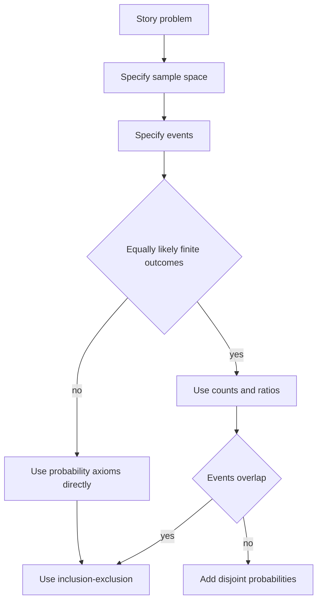

# Probability Axioms and Inclusion-Exclusion

After counting comes formal probability. A sample space records the possible outcomes of an experiment, events are subsets of that space, and a probability measure assigns numbers to events in a way that behaves like normalized size. The MIT lectures emphasize that the axioms are not merely formal rules: they encode consistency requirements for frequency interpretations, market prices, and personal degrees of belief.

Finite equally likely models are the easiest place to see the connection between counting and probability. If every outcome in a finite sample space has the same probability, then $P(A)=\vert A\vert /\vert S\vert $. The axioms then explain how probabilities of complements, unions, and intersections must behave. Inclusion-exclusion is the main tool for turning overlapping event counts into exact probabilities.

## Definitions

A **sample space** $S$ is the set of possible outcomes. An **event** is a subset $A\subseteq S$. The complement of $A$ is $A^c=S\setminus A$. The union $A\cup B$ means "$A$ or $B$"; the intersection $A\cap B$ means "$A$ and $B$".

A **probability measure** $P$ assigns a number $P(A)$ to each event $A$ and satisfies:

1. Nonnegativity: $P(A)\ge 0$.
2. Normalization: $P(S)=1$.
3. Countable additivity: if $A_1,A_2,\ldots$ are pairwise disjoint, then

$$
P\left(\bigcup_{j=1}^{\infty}A_j\right)=\sum_{j=1}^{\infty}P(A_j).
$$

In a finite equally likely model,

$$
P(A)=\frac{|A|}{|S|}.
$$

De Morgan's laws describe complements of unions and intersections:

$$
(A\cup B)^c=A^c\cap B^c,
\qquad
(A\cap B)^c=A^c\cup B^c.
$$

The laws extend to any finite or countable collection of events.

## Key results

Several basic facts follow from the axioms:

$$
P(A^c)=1-P(A),
$$

because $A$ and $A^c$ are disjoint and $A\cup A^c=S$.

If $A\subseteq B$, then

$$
P(A)\le P(B),
$$

because $B=A\cup(B\setminus A)$ is a disjoint union.

For two events,

$$
P(A\cup B)=P(A)+P(B)-P(A\cap B).
$$

The subtraction corrects for the overlap, which was counted twice.

The general **inclusion-exclusion formula** is

$$
\begin{aligned}
P\left(\bigcup_{i=1}^n E_i\right)
&=
\sum_i P(E_i)
-
\sum_{i<j}P(E_i\cap E_j)
+\sum_{i<j<k}P(E_i\cap E_j\cap E_k)
-\cdots \\
&\quad
+(-1)^{n+1}P(E_1\cap\cdots\cap E_n).
\end{aligned}
$$

Proof sketch: fix an outcome $\omega$. Suppose $\omega$ lies in exactly $m$ of the events. Its total coefficient on the right side is

$$
\binom{m}{1}-\binom{m}{2}+\binom{m}{3}-\cdots+(-1)^{m+1}\binom{m}{m}=1
$$

when $m\gt 0$, by the binomial theorem applied to $1-(1-1)^m$. If $m=0$, its coefficient is $0$. Thus the right side counts exactly the union.

The axioms also provide consistency checks for proposed answers. If a proposed probability of $A\cap B$ is larger than $P(A)$, it cannot be correct. If a proposed value of $P(A\cup B)$ is smaller than either $P(A)$ or $P(B)$, it violates monotonicity. These checks are simple, but they catch many errors in word problems where several overlapping conditions are being counted at once.

In finite equally likely models, probability and counting are interchangeable only after the sample space is chosen. Rolling two dice should usually be modeled by the $36$ ordered pairs $(i,j)$, not by the $11$ possible sums, because the sums are not equally likely. A sum of $7$ has six ordered pairs, while a sum of $2$ has only one. The axioms allow nonuniform probabilities, but the shortcut $P(A)=\vert A\vert /\vert S\vert $ does not.

Inclusion-exclusion is most useful when intersections are easier than unions. The hat problem is the lecture's central example: "person $i$ gets their own hat" is easy to intersect because fixing several people leaves a smaller permutation problem. Directly counting "nobody gets their own hat" is less transparent until inclusion-exclusion converts it into those fixed-point intersections.

Complements are often the simplest special case of the same philosophy. Events such as "at least one match", "at least one repeated birthday", or "at least one six" may overlap in many ways. Their complements, such as "no matches", "all birthdays distinct", or "no sixes", often have a clean sequential count. The answer is then $1$ minus the complement probability.

De Morgan's laws help prevent logical errors when taking complements. The complement of "rain or snow" is "not rain and not snow", not "not rain or not snow". In symbols, complements turn unions into intersections and intersections into unions. This is why probability computations involving "none", "all", "at least one", and "not both" should usually be translated into set notation before manipulating formulas.

## Visual



| Identity | Meaning | Common use |
|---|---|---|
| $P(A^c)=1-P(A)$ | complement rule | "at least one" via "none" |
| $P(A\cup B)=P(A)+P(B)-P(A\cap B)$ | two-event inclusion-exclusion | overlapping conditions |
| $P(A)\le P(B)$ if $A\subseteq B$ | monotonicity | checking impossible answers |
| $P(\emptyset)=0$ | null event | eliminating disjoint leftovers |
| $P(A)=\vert A\vert /\vert S\vert $ | finite uniform law | dice, cards, shuffled hats |

The flowchart emphasizes a practical habit: do not begin with inclusion-exclusion just because several events are mentioned. First ask whether the events are disjoint, whether a complement is simpler, and whether a finite uniform model has actually been justified. Inclusion-exclusion is exact but can be algebraically heavy. For many "at least one" problems, the complement is a one-line count. For problems with many overlapping events, such as derangements, inclusion-exclusion is the natural systematic method.

## Worked example 1: derangements in the hat problem

Problem: $n$ people put their hats in a bin, hats are randomly shuffled, and each person receives one hat. What is the probability that nobody receives their own hat?

Method:

1. Let $E_i$ be the event that person $i$ gets their own hat.
2. We want

$$
P(E_1^c\cap\cdots\cap E_n^c)
=
1-P(E_1\cup\cdots\cup E_n).
$$

3. For any fixed set of $r$ people, the probability that all $r$ get their own hats is

$$
\frac{(n-r)!}{n!}.
$$

There are $(n-r)!$ permutations fixing those $r$ hats, out of $n!$ total permutations.

4. Inclusion-exclusion gives

$$
\begin{aligned}
P(E_1\cup\cdots\cup E_n)
&=
\sum_{r=1}^{n}(-1)^{r+1}\binom{n}{r}\frac{(n-r)!}{n!} \\
&=
\sum_{r=1}^{n}(-1)^{r+1}\frac{1}{r!}.
\end{aligned}
$$

5. Therefore the probability of no fixed points is

$$
1-\sum_{r=1}^{n}(-1)^{r+1}\frac{1}{r!}
=
\sum_{r=0}^{n}(-1)^r\frac{1}{r!}.
$$

Checked answer: as $n$ grows, this approaches $e^{-1}$. For $n=4$,

$$
1-1+\frac{1}{2}-\frac{1}{6}+\frac{1}{24}=\frac{9}{24}=\frac{3}{8}.
$$

Indeed, there are $9$ derangements of $4$ objects out of $24$ permutations.

## Worked example 2: birthday collision by the complement

Problem: In a room of $23$ people, assuming birthdays are independent and uniformly distributed among $365$ days, what is the probability that at least two people share a birthday?

Method:

1. Directly counting all possible collisions is awkward because many collision patterns overlap.
2. Use the complement: no two people share a birthday.
3. The total number of birthday assignments is $365^{23}$.
4. The number with all birthdays distinct is

$$
365\cdot 364\cdot 363\cdots(365-22).
$$

5. Thus

$$
P(\text{no shared birthday})
=
\frac{365\cdot 364\cdots 343}{365^{23}}.
$$

6. Therefore

$$
P(\text{at least one shared birthday})
=
1-\frac{365\cdot 364\cdots 343}{365^{23}}.
$$

Checked numerical value:

$$
1-\prod_{j=0}^{22}\left(1-\frac{j}{365}\right)\approx 0.5073.
$$

The answer is slightly above one half, which is the well-known birthday surprise.

## Code

```python
from math import factorial, prod, e

def derangement_probability(n):
    return sum(((-1) ** r) / factorial(r) for r in range(n + 1))

def birthday_collision_probability(people, days=365):
    no_collision = prod((days - j) / days for j in range(people))
    return 1 - no_collision

for n in [4, 6, 10]:
    print(n, derangement_probability(n), "limit about", 1 / e)

print("23-person birthday collision:", birthday_collision_probability(23))
```

## Common pitfalls

- Treating $P(A\cup B)$ as $P(A)+P(B)$ when $A$ and $B$ overlap. Additivity only applies to disjoint events.
- Forgetting to define the sample space before declaring outcomes equally likely. Some descriptions hide unequal likelihoods.
- Counting a complement correctly and then forgetting to subtract from $1$.
- Confusing "at least one" with "exactly one". Complements often help with "at least one", but exact counts usually require a separate condition.
- Assuming that a probability larger than a more detailed event is impossible. The axioms imply $P(A\cap B)\le P(A)$, so a conjunction cannot be more likely than one of its parts.

## Connections

- [Counting and combinatorics](/math/probability-and-random-variables/counting-and-combinatorics)
- [Conditional probability, Bayes, and independence](/math/probability-and-random-variables/conditional-probability-bayes-independence)
- [Discrete random variables, expectation, and variance](/math/probability-and-random-variables/discrete-random-variables-expectation-variance)
- [Probability pitfalls and intuition](/math/probability/probability-pitfalls-intuition)
- [Counting principles](/math/probability/counting-principles)
