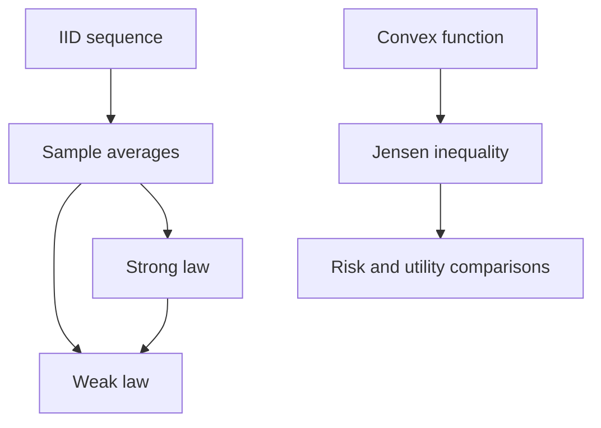

# Strong Law and Jensen's Inequality

The strong law of large numbers upgrades the weak law from high-probability convergence to almost-sure convergence. Instead of saying that the probability of a large error goes to zero, it says that with probability one the sample averages eventually settle to the mean along the actual infinite sequence of trials. This is a stronger and more pathwise statement.

Jensen's inequality is a different kind of result: it compares the average value of a convex function to the function of an average. MIT 18.440 places Jensen after the strong law and uses economic examples to show why convexity and concavity matter. A risk with the same expected value can be preferable or worse depending on the shape of the utility or payoff function.

## Definitions

Let $X_1,X_2,\ldots$ be i.i.d. random variables with mean $\mu$, and define

$$
A_n=\frac{X_1+\cdots+X_n}{n}.
$$

The **strong law of large numbers** states that, under suitable hypotheses such as finite mean,

$$
P\left(\lim_{n\to\infty}A_n=\mu\right)=1.
$$

This is also called **almost sure convergence** of $A_n$ to $\mu$.

A function $g$ is **convex** if for $0\le\theta\le1$,

$$
g(\theta x+(1-\theta)y)
\le
\theta g(x)+(1-\theta)g(y).
$$

If $g$ is twice differentiable, convexity is implied by

$$
g''(x)\ge0
$$

for all $x$ in the interval. A function is **concave** if $-g$ is convex.

**Jensen's inequality** says that for convex $g$,

$$
E[g(X)]\ge g(E[X]),
$$

whenever the expectations exist. For concave $g$, the inequality reverses:

$$
E[g(X)]\le g(E[X]).
$$

## Key results

The strong law implies the weak law. Suppose $A_n\to\mu$ almost surely. Fix $\epsilon\gt 0$. On almost every sample path, there is a last time after which $\vert A_n-\mu\vert \le\epsilon$. Define

$$
Y=\max\{n: |A_n-\mu|>\epsilon\},
$$

with $Y$ finite almost surely. Then

$$
P(|A_n-\mu|>\epsilon)\le P(Y\ge n)\to0.
$$

Thus almost-sure convergence forces convergence in probability.

One proof route for the strong law assumes a fourth moment. After centering so $E[X_i]=0$, one studies

$$
E[A_n^4].
$$

Independence and centering kill many mixed terms, leaving a bound of order $1/n^2$. Summing over a sparse subsequence and controlling gaps leads to almost-sure convergence. The full strong law under finite mean is deeper, but the lecture proof illustrates why higher moments can make pathwise convergence accessible.

Jensen's inequality can be proved geometrically. For a convex function $g$, at the point $\mu=E[X]$ there is a supporting line

$$
\ell(x)=g(\mu)+m(x-\mu)
$$

such that $g(x)\ge\ell(x)$ for all $x$. Taking expectations gives

$$
E[g(X)]\ge E[\ell(X)]
=g(\mu)+m(E[X]-\mu)
=g(\mu).
$$

For $g(x)=x^2$, Jensen gives

$$
E[X^2]\ge (E[X])^2,
$$

which is the nonnegativity of variance.

Almost sure convergence is a statement about entire infinite sequences. It says that the set of sample paths for which convergence fails has probability zero. This does not mean failure is logically impossible; rather, it is negligible under the probability model. In repeated coin tossing, one exceptional path is all heads forever, but that single path has probability zero.

The strong law is the rigorous version of the long-run frequency idea. If $X_i$ is the indicator of heads on toss $i$, then $A_n$ is the fraction of heads in the first $n$ tosses. The strong law says that, with probability one, this fraction tends to $p$. The weak law says only that for any fixed large $n$, the probability of a noticeable deviation is small.

The lecture's fourth-moment proof strategy illustrates a common theme: stronger moment assumptions give stronger control over rare large deviations. Bounds on $E[A_n^4]$ can be used with summability ideas to control infinitely many bad events. This is different from Chebyshev's inequality at one fixed $n$, which by itself does not directly rule out infinitely many deviations.

Jensen's inequality is both geometric and probabilistic. A convex function rewards variability because the chord between two points lies above the graph. Thus randomizing around a fixed mean increases the expected value of a convex payoff. A concave utility function does the opposite: it penalizes variability, which is why risk-averse decision makers can prefer a certain payoff to a risky payoff with the same monetary expectation.

The hedge-fund-style example in the lecture uses a convex compensation function. If a manager receives a large upside share but limited downside penalty, the manager's expected compensation can increase with risk even when the investor's expected return does not. Jensen's inequality is the mathematical reason this principal-agent tension appears: convex payoffs make variability valuable to the payoff holder.

## Visual



| Idea | Statement | Type of conclusion |
|---|---|---|
| Weak law | $P(\vert A_n-\mu\vert \gt \epsilon)\to0$ | high-probability convergence |
| Strong law | $P(\lim A_n=\mu)=1$ | pathwise convergence |
| Convex Jensen | $E[g(X)]\ge g(E[X])$ | variability raises convex payoffs |
| Concave Jensen | $E[g(X)]\le g(E[X])$ | variability lowers concave utility |

The table puts two different uses of averaging side by side. The strong law studies what happens when many independent observations are averaged. Jensen studies what happens when a function is applied before or after averaging. In one case the issue is convergence of data; in the other, it is the effect of nonlinear transformation. Both are central because probability repeatedly alternates between averaging random quantities and transforming them.

For convex $g$, the gap

$$
E[g(X)]-g(E[X])
$$

can be interpreted as the value of variability under that convex payoff. For concave $g$, the sign reverses and variability is costly. This gives a mathematical vocabulary for risk preference without leaving the probability framework.

Both results also warn against overinterpreting averages. A long-run average can stabilize almost surely, while a nonlinear payoff of each observation may still favor or penalize variability through Jensen's inequality. The order of averaging and transforming matters.

## Worked example 1: strong law implies weak law in a concrete event

Problem: Suppose the strong law holds for sample averages $A_n$. Show that for $\epsilon=0.1$,

$$
P(|A_n-\mu|>0.1)\to0.
$$

Method:

1. The strong law says that with probability one,

$$
A_n\to\mu.
$$

2. On any sample path where this convergence occurs, there is some random index $N$ such that for all $n\ge N$,

$$
|A_n-\mu|\le0.1.
$$

3. Let

$$
Y=\max\{n: |A_n-\mu|>0.1\}.
$$

For convergent sample paths, $Y$ is finite.

4. If $\vert A_n-\mu\vert \gt 0.1$, then $Y\ge n$.
5. Therefore

$$
P(|A_n-\mu|>0.1)\le P(Y\ge n).
$$

6. Since $Y$ is finite almost surely,

$$
P(Y\ge n)\to0.
$$

Checked answer: the desired probability tends to zero, exactly the weak-law statement for this fixed tolerance.

## Worked example 2: Jensen and a risky payoff

Problem: An investment returns $X=0$ with probability $1/2$ and $X=100$ with probability $1/2$. Compare $E[\sqrt X]$ with $\sqrt{E[X]}$.

Method:

1. The mean return is

$$
E[X]=\frac12\cdot0+\frac12\cdot100=50.
$$

2. The square-root function is concave on $[0,\infty)$.
3. Compute expected utility:

$$
E[\sqrt X]
=\frac12\sqrt0+\frac12\sqrt{100}
=0+5
=5.
$$

4. Compute utility of the mean:

$$
\sqrt{E[X]}=\sqrt{50}\approx7.071.
$$

5. Jensen for concave functions predicts

$$
E[\sqrt X]\le\sqrt{E[X]}.
$$

Checked answer: $5\lt 7.071$, so a decision maker with square-root utility prefers the certain payoff $50$ to the risky payoff with the same expected monetary value.

## Code

```python
import numpy as np

rng = np.random.default_rng(1)
trials = rng.integers(0, 2, size=100_000)  # Bernoulli(1/2)
averages = np.cumsum(trials) / np.arange(1, len(trials) + 1)

print("last sample average:", averages[-1])
print("max error after 1000:", np.max(np.abs(averages[1000:] - 0.5)))

values = np.array([0.0, 100.0])
probs = np.array([0.5, 0.5])
expected_x = np.dot(probs, values)
expected_sqrt = np.dot(probs, np.sqrt(values))
sqrt_expected = np.sqrt(expected_x)

print("E[sqrt(X)]:", expected_sqrt)
print("sqrt(E[X]):", sqrt_expected)
```

## Common pitfalls

- Saying the weak law and strong law are the same because both involve averages. Almost-sure convergence is stronger than convergence in probability.
- Interpreting "with probability one" as "for every possible outcome". Probability-zero exceptional paths may exist.
- Applying Jensen in the wrong direction. Convex functions put the expectation above the function at the mean; concave functions reverse this.
- Forgetting integrability assumptions. Jensen requires the relevant expectations to be defined.
- Treating higher expected payoff as automatically better when utility is concave or when payoff functions are nonlinear.

## Connections

- [Weak law, concentration, and the central limit theorem](/math/probability-and-random-variables/weak-law-concentration-central-limit-theorem)
- [Moment and characteristic functions](/math/probability-and-random-variables/moment-and-characteristic-functions)
- [Covariance, correlation, and conditional expectation](/math/probability-and-random-variables/covariance-correlation-conditional-expectation)
- [Martingales, risk-neutral probability, and Black-Scholes](/math/probability-and-random-variables/martingales-risk-neutral-probability-black-scholes)
- [Limit theorems](/math/probability/limit-theorems)
