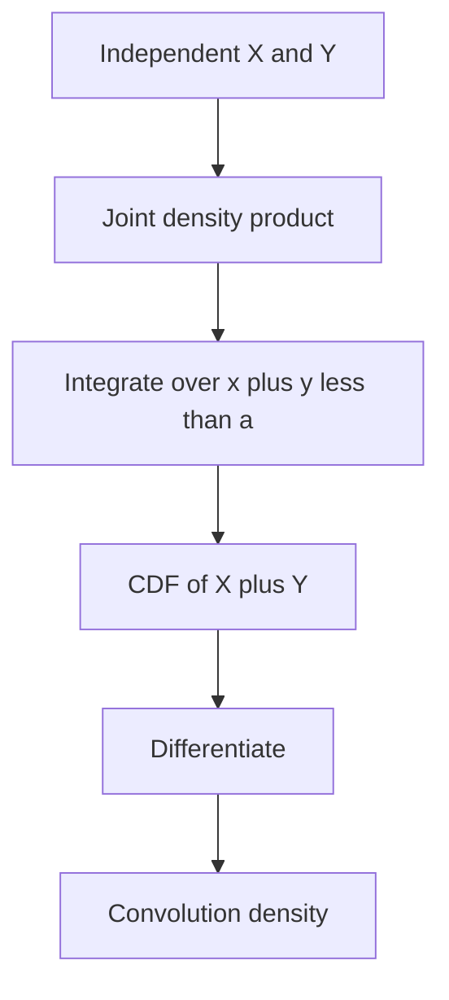

# Sums, Convolutions, and Order Statistics

Once random variables are defined jointly, the next natural question is what happens when we combine them. Sums of independent random variables produce convolutions. Maxima, minima, and sorted samples produce order statistics. These constructions explain why gamma distributions arise from exponential waiting times, why sums of uniforms have triangular and then smoother densities, and why sorted uniform samples lead to beta distributions.

MIT 18.440 uses these topics to connect earlier distribution families with joint densities and conditional reasoning. A key theme is that formulas often become simple when one first draws the right region in the plane or cube: the density of $X+Y$ integrates over the line $x+y=a$, while order statistics integrate over the ways sample points can be arranged.

## Definitions

If $X$ and $Y$ are independent continuous random variables with densities $f_X$ and $f_Y$, then the density of $Z=X+Y$ is the **convolution**

$$
f_Z(a)=\int_{-\infty}^{\infty} f_X(a-y)f_Y(y)\,dy.
$$

The corresponding CDF computation is

$$
\begin{aligned}
F_Z(a)
&=P(X+Y\le a)\\
&=\int_{-\infty}^{\infty}P(X\le a-y)f_Y(y)\,dy\\
&=\int_{-\infty}^{\infty}F_X(a-y)f_Y(y)\,dy.
\end{aligned}
$$

For discrete independent variables,

$$
P(X+Y=k)=\sum_j P(X=k-j)P(Y=j).
$$

If $X_1,\ldots,X_n$ are sampled and then sorted, the ordered values are called **order statistics**:

$$
Y_1\le Y_2\le\cdots\le Y_n.
$$

For i.i.d. uniform variables on $[0,1]$, $Y_k$ has beta distribution with parameters $(k,n+1-k)$:

$$
f_{Y_k}(y)=
\frac{n!}{(k-1)!(n-k)!}
y^{k-1}(1-y)^{n-k},
\qquad 0<y<1.
$$

## Key results

Sums preserve several distribution families:

| Independent summands | Sum distribution | Reason |
|---|---|---|
| Binomial$(m,p)$ and Binomial$(n,p)$ | Binomial$(m+n,p)$ | combine trials |
| Poisson$(\lambda_1)$ and Poisson$(\lambda_2)$ | Poisson$(\lambda_1+\lambda_2)$ | superpose processes |
| Normal$(\mu_1,\sigma_1^2)$ and Normal$(\mu_2,\sigma_2^2)$ | Normal$(\mu_1+\mu_2,\sigma_1^2+\sigma_2^2)$ | transform or bell-curve geometry |
| Gamma$(\lambda,s)$ and Gamma$(\lambda,t)$ | Gamma$(\lambda,s+t)$ | convolution with common rate |

For independent variables with finite means,

$$
E[X+Y]=E[X]+E[Y].
$$

For independent variables with finite variances,

$$
\operatorname{Var}(X+Y)=\operatorname{Var}(X)+\operatorname{Var}(Y).
$$

The minimum and maximum of i.i.d. variables can be handled using CDFs. If $M=\max(X_1,\ldots,X_n)$ and the $X_i$ have CDF $F$, then

$$
P(M\le a)=P(X_1\le a,\ldots,X_n\le a)=F(a)^n.
$$

If $m=\min(X_1,\ldots,X_n)$, then

$$
P(m>a)=P(X_1>a,\ldots,X_n>a)=(1-F(a))^n.
$$

These formulas are often easier than starting with densities.

Convolution is best understood as adding up all ways a target sum can occur. In the discrete case, the sum $X+Y=k$ can happen through pairs $(k-j,j)$, so one sums over $j$. In the continuous case, a line $x+y=a$ has infinitely many points, and the integral accumulates density along the compatible values. The formula

$$
f_{X+Y}(a)=\int f_X(a-y)f_Y(y)\,dy
$$

is the continuous version of the same bookkeeping.

Support is often the hardest part of convolution. Before integrating, determine where the summands can live and what range the sum can have. For two uniforms on $[0,1]$, the sum ranges over $[0,2]$, but the integration length increases on $[0,1]$ and decreases on $[1,2]$. This piecewise behavior is typical when densities have bounded support.

Order statistics are another way of organizing a joint sample. If $n$ independent points are sampled from a continuous distribution, ties have probability zero, so sorting creates a unique ordered vector. For uniforms, the event $Y_k\in dy$ requires $k-1$ sample points below $y$, one point near $y$, and $n-k$ points above $y$. The combinatorial coefficient counts which original sample point lands near $y$ and which points lie on each side.

For uniform order statistics, the beta connection is not accidental. The density

$$
f_{Y_k}(y)\propto y^{k-1}(1-y)^{n-k}
$$

contains one factor for each point below and above the observed order statistic. This is the same algebraic shape as a beta posterior after observing successes and failures. In both settings, powers of $y$ and $1-y$ record counts.

Sums and order statistics also demonstrate that functions of independent variables need not be independent. The pair $(X+Y,X-Y)$ may be independent in special normal cases, but not generally. The sorted values of a sample are especially dependent: if the maximum is small, all other order statistics must also be small.

## Visual



```text
Region for X+Y <= a in the unit square

y
1 |---------+
  |       / |
  |     /   |
  |   /     |
0 +--------- x
  0    a    1

For 0 <= a <= 1, the area is a triangle with area a^2/2.
```

The first diagram gives the algebraic route: compute a CDF over a region, then differentiate to get a density. The ASCII square gives the geometric route for the uniform example. Both routes are the same calculation in different language. Geometry is often the fastest way to avoid wrong integration limits, especially when the support is a polygon or simplex.

Order statistics have a similar geometric interpretation in higher-dimensional cubes. For $n$ independent uniforms, the unordered sample is uniform on the cube $[0,1]^n$. Sorting folds the cube into $n!$ congruent regions corresponding to the possible orderings. This symmetry is why factorial factors appear in order-statistic densities.

For repeated sums, direct convolution quickly becomes cumbersome. This is why the course soon moves to moment generating functions and characteristic functions: transforms turn repeated convolution into powers of a single function. The convolution view is still essential, because it explains what those transforms are simplifying and how support constraints enter before algebra begins. Without that geometric understanding, transform answers can become detached from the original random variables. Start with the region, then simplify the algebra carefully afterward.

## Worked example 1: sum of two independent uniforms

Problem: Let $X,Y$ be independent uniform random variables on $[0,1]$. Find the density of $Z=X+Y$.

Method:

1. Since $0\le X,Y\le1$, the support of $Z$ is $[0,2]$.
2. The convolution is

$$
f_Z(a)=\int_{-\infty}^{\infty} f_X(a-y)f_Y(y)\,dy.
$$

3. The integrand equals $1$ exactly when

$$
0\le y\le1
\quad\text{and}\quad
0\le a-y\le1.
$$

4. The second condition is

$$
a-1\le y\le a.
$$

5. Therefore $y$ must lie in

$$
[\max(0,a-1),\min(1,a)].
$$

6. The length of this interval is the density.

For $0\le a\le1$:

$$
f_Z(a)=a.
$$

For $1\le a\le2$:

$$
f_Z(a)=2-a.
$$

Outside $[0,2]$, $f_Z(a)=0$.

Checked answer: the density integrates to

$$
\int_0^1 a\,da+\int_1^2(2-a)\,da
=\frac12+\frac12=1.
$$

## Worked example 2: maximum of independent uniforms

Problem: Let $X_1,\ldots,X_n$ be independent uniform variables on $[0,1]$, and let $M=\max(X_1,\ldots,X_n)$. Find the CDF, density, and expectation of $M$.

Method:

1. For $0\le a\le1$,

$$
P(M\le a)=P(X_1\le a,\ldots,X_n\le a).
$$

2. Independence gives

$$
F_M(a)=a^n.
$$

3. Differentiate:

$$
f_M(a)=na^{n-1},\qquad 0<a<1.
$$

4. Compute the expectation:

$$
E[M]=\int_0^1 a\cdot na^{n-1}\,da
=n\int_0^1 a^n\,da
=\frac{n}{n+1}.
$$

Checked answer: for $n=1$, $E[M]=1/2$, the mean of one uniform. As $n$ grows, $n/(n+1)$ approaches $1$, which matches the intuition that the maximum of many uniform samples is near the right endpoint.

## Code

```python
import numpy as np

def triangular_sum_density(z):
    z = np.asarray(z)
    out = np.zeros_like(z, dtype=float)
    left = (0 <= z) & (z <= 1)
    right = (1 < z) & (z <= 2)
    out[left] = z[left]
    out[right] = 2 - z[right]
    return out

grid = np.linspace(0, 2, 2001)
area = np.trapz(triangular_sum_density(grid), grid)
print("area under triangular density:", area)

def max_uniform_mean(n):
    return n / (n + 1)

for n in [1, 2, 10, 100]:
    print(n, max_uniform_mean(n))

rng = np.random.default_rng(0)
samples = rng.random((100_000, 10)).max(axis=1)
print("simulated max mean for n=10:", samples.mean())
```

## Common pitfalls

- Forgetting independence in convolution formulas. Without independence, the joint density is not the product of marginals.
- Using the same convolution limits for every value of $a$. Supports change the limits piece by piece.
- Confusing the density of $X+Y$ with the CDF of $X+Y$.
- Assuming order statistics are independent. Sorted sample values are strongly dependent.
- Forgetting the combinatorial factor in the density of the $k$th order statistic.

## Connections

- [Joint distributions, transformations, and independence](/math/probability-and-random-variables/joint-distributions-transformations-independence)
- [Normal, exponential, gamma, beta, and Cauchy laws](/math/probability-and-random-variables/normal-exponential-gamma-beta-cauchy)
- [Covariance, correlation, and conditional expectation](/math/probability-and-random-variables/covariance-correlation-conditional-expectation)
- [Moment and characteristic functions](/math/probability-and-random-variables/moment-and-characteristic-functions)
- [Transformations of random variables](/math/probability/transformations-random-variables)
