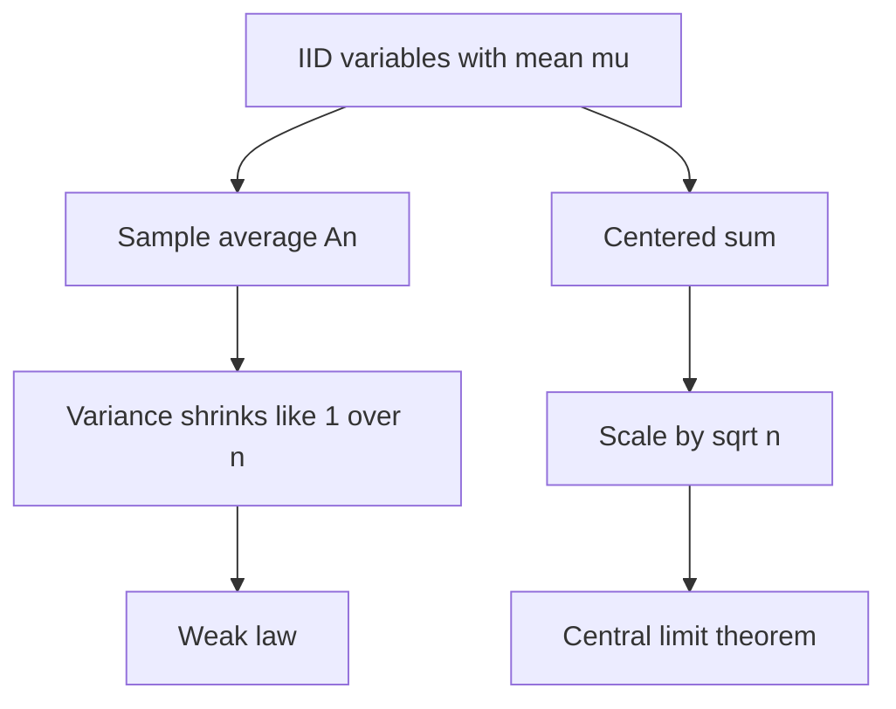

# Weak Law, Concentration, and the Central Limit Theorem

Limit theorems explain why probability becomes predictable at large scale. The weak law of large numbers says sample averages concentrate near the mean. The central limit theorem says the remaining fluctuations, after scaling by $\sqrt n$, often look normal. These two statements answer different questions: the weak law gives convergence to a constant, while the central limit theorem describes the shape of the error.

MIT 18.440 proves the weak law first through Markov and Chebyshev inequalities, then revisits it with characteristic functions. The central limit theorem is then proved with transform methods. The lecture sequence makes clear why moment hypotheses matter: finite variance gives a short Chebyshev proof of the weak law, while characteristic functions allow more general convergence arguments.

## Definitions

For a nonnegative random variable $X$ and $a\gt 0$, **Markov's inequality** is

$$
P(X\ge a)\le \frac{E[X]}{a}.
$$

For a random variable $X$ with mean $\mu$ and variance $\sigma^2$, **Chebyshev's inequality** is

$$
P(|X-\mu|\ge k)\le \frac{\sigma^2}{k^2}.
$$

Let $X_1,X_2,\ldots$ be independent identically distributed random variables with mean $\mu$, and define the sample average

$$
A_n=\frac{X_1+\cdots+X_n}{n}.
$$

The **weak law of large numbers** states that for every $\epsilon\gt 0$,

$$
P(|A_n-\mu|>\epsilon)\to0
\qquad\text{as }n\to\infty.
$$

If the $X_i$ have variance $\sigma^2$, the normalized sum is

$$
B_n=\frac{X_1+\cdots+X_n-n\mu}{\sigma\sqrt n}.
$$

The **central limit theorem** states that

$$
B_n\Rightarrow Z,
$$

where $Z$ is standard normal and $\Rightarrow$ denotes convergence in distribution.

## Key results

Markov's inequality proof: since $X\ge0$,

$$
E[X]\ge E[X1_{\{X\ge a\}}]\ge aP(X\ge a).
$$

Dividing by $a$ gives the result.

Chebyshev follows by applying Markov to the nonnegative random variable $(X-\mu)^2$:

$$
P(|X-\mu|\ge k)
=P((X-\mu)^2\ge k^2)
\le \frac{E[(X-\mu)^2]}{k^2}
=\frac{\sigma^2}{k^2}.
$$

Weak law with finite variance: if the $X_i$ are i.i.d. with variance $\sigma^2$, then

$$
E[A_n]=\mu,
\qquad
\operatorname{Var}(A_n)=\frac{\sigma^2}{n}.
$$

Chebyshev gives

$$
P(|A_n-\mu|\ge\epsilon)
\le
\frac{\sigma^2}{n\epsilon^2}
\to0.
$$

The transform proof of the central limit theorem begins by standardizing so $E[X_i]=0$ and $\operatorname{Var}(X_i)=1$. If $M(t)=E[e^{tX_1}]$ exists near zero, then

$$
M(t)=1+\frac{t^2}{2}+o(t^2).
$$

For

$$
B_n=\frac{X_1+\cdots+X_n}{\sqrt n},
$$

independence gives

$$
M_{B_n}(t)=\left(M\left(\frac{t}{\sqrt n}\right)\right)^n.
$$

Using the expansion,

$$
M_{B_n}(t)\to e^{t^2/2},
$$

the MGF of a standard normal variable. Characteristic functions give the same argument under the finite-variance assumption without requiring the MGF to exist.

The weak law and the central limit theorem should be compared through the sample average:

$$
A_n-\mu=\frac{\sigma}{\sqrt n}B_n.
$$

The CLT says $B_n$ has an approximately stable normal distribution for large $n$. Multiplying by $\sigma/\sqrt n$ then says the actual average error is typically of order $1/\sqrt n$. The weak law records only the consequence that this error goes to zero in probability, while the CLT describes the scale and shape of the error.

Markov and Chebyshev inequalities are deliberately crude. They do not assume a particular distribution, so they cannot give sharp normal-tail estimates in general. Their strength is robustness: with only a mean or variance, they still produce valid bounds. In applications, a loose guaranteed bound can be more valuable than a sharper approximation that depends on unverified distributional assumptions.

The finite-variance proof of the weak law also shows why independence matters. If $X_1,\ldots,X_n$ are not independent and remain highly correlated, the variance of the average may fail to shrink like $1/n$. For example, if all $X_i$ are actually the same random variable, then $A_n=X_1$ for every $n$ and averaging does not reduce uncertainty.

The CLT is robust but not universal. Heavy-tailed variables without finite variance can have different stable limits, and variables without finite mean may not satisfy the usual law of large numbers. The Cauchy distribution is the standard warning. Its sample average does not concentrate around a mean because no finite mean exists.

The De Moivre-Laplace theorem for coin tosses is the binomial special case of the CLT. If $X\sim\operatorname{Binomial}(n,p)$, then

$$
\frac{X-np}{\sqrt{np(1-p)}}
$$

is approximately standard normal for large $n$, provided $p$ is not too close to $0$ or $1$. This is the origin of the familiar bell curve in repeated-trial counting problems.

## Visual



| Result | Scale | Conclusion | Main tool |
|---|---:|---|---|
| Markov inequality | one variable | large nonnegative values are limited by mean | expectation |
| Chebyshev inequality | one variable | deviations are limited by variance | Markov on square |
| Weak law | $A_n$ | average converges in probability to $\mu$ | Chebyshev or characteristic functions |
| CLT | $\sqrt n(A_n-\mu)/\sigma$ | normalized error tends to normal | MGFs or characteristic functions |

The table separates inequalities from asymptotic theorems. Markov and Chebyshev are finite-$n$ statements: they are true for a single random variable or a single sample average. The weak law and CLT are limiting statements about sequences. In practice, the finite inequalities are often used to prove limits, while the limits explain the behavior of large systems.

The CLT row also clarifies why the normal distribution appears even when the original variables are not normal. The theorem is about normalized sums, not the raw summands. Bernoulli, uniform, and many other finite-variance distributions produce approximately normal centered sums after enough independent addition.

The hypotheses should always be kept visible. Independence, identical distribution, finite mean, and finite variance each play a role in the standard statements. Changing those assumptions can lead to different limits or no useful limit at all. This is why heavy-tailed examples are not side issues; they mark the boundary of the theorems and prevent overgeneralization. They explain exactly what the theorem is buying.

## Worked example 1: Chebyshev bound for a sample mean

Problem: Suppose $X_1,\ldots,X_{100}$ are i.i.d. with mean $5$ and variance $9$. Bound the probability that their average differs from $5$ by at least $1$.

Method:

1. Let

$$
A_{100}=\frac{X_1+\cdots+X_{100}}{100}.
$$

2. The mean is

$$
E[A_{100}]=5.
$$

3. Since the variables are independent,

$$
\operatorname{Var}(A_{100})
=\frac{9}{100}
=0.09.
$$

4. Apply Chebyshev with $k=1$:

$$
P(|A_{100}-5|\ge1)
\le
\frac{0.09}{1^2}
=0.09.
$$

Checked answer: Chebyshev guarantees the probability is at most $9\%$. The true probability may be much smaller, but this bound uses only the mean, variance, and independence.

## Worked example 2: normal approximation for coin tosses

Problem: Toss a fair coin $400$ times. Approximate the probability of seeing between $190$ and $210$ heads, inclusive.

Method:

1. Let $X\sim\operatorname{Binomial}(400,1/2)$.
2. The mean and variance are

$$
\mu=np=200,
\qquad
\sigma^2=npq=100,
$$

so $\sigma=10$.

3. Use the normal approximation with continuity correction:

$$
P(190\le X\le210)
\approx
P(189.5\le N\le210.5),
$$

where $N$ is normal with mean $200$ and standard deviation $10$.

4. Standardize endpoints:

$$
z_1=\frac{189.5-200}{10}=-1.05,
\qquad
z_2=\frac{210.5-200}{10}=1.05.
$$

5. Therefore

$$
P(190\le X\le210)\approx \Phi(1.05)-\Phi(-1.05).
$$

6. Using $\Phi(1.05)\approx0.8531$ and $\Phi(-1.05)\approx0.1469$,

$$
P(190\le X\le210)\approx0.7062.
$$

Checked answer: the event is within about $1.05$ standard deviations of the mean, so a probability around $70\%$ is plausible.

## Code

```python
from math import erf, sqrt, comb

def normal_cdf(z):
    return 0.5 * (1 + erf(z / sqrt(2)))

chebyshev_bound = 9 / (100 * 1 ** 2)
print("Chebyshev bound:", chebyshev_bound)

approx = normal_cdf(1.05) - normal_cdf(-1.05)
print("CLT approximation:", approx)

# Exact binomial probability for comparison.
n = 400
exact = sum(comb(n, k) for k in range(190, 211)) / (2 ** n)
print("Exact binomial probability:", exact)
```

## Common pitfalls

- Confusing convergence in probability with almost sure convergence. The weak law is weaker than the strong law.
- Forgetting the $\sqrt n$ scaling in the central limit theorem.
- Applying Chebyshev without a finite variance.
- Treating the CLT as saying the average itself has a nondegenerate normal limit. The average converges to a constant; the scaled error is asymptotically normal.
- Ignoring continuity correction when approximating a discrete binomial probability by a continuous normal distribution.

## Connections

- [Moment and characteristic functions](/math/probability-and-random-variables/moment-and-characteristic-functions)
- [Strong law and Jensen's inequality](/math/probability-and-random-variables/strong-law-and-jensens-inequality)
- [Normal, exponential, gamma, beta, and Cauchy laws](/math/probability-and-random-variables/normal-exponential-gamma-beta-cauchy)
- [Covariance, correlation, and conditional expectation](/math/probability-and-random-variables/covariance-correlation-conditional-expectation)
- [Limit theorems](/math/probability/limit-theorems)
