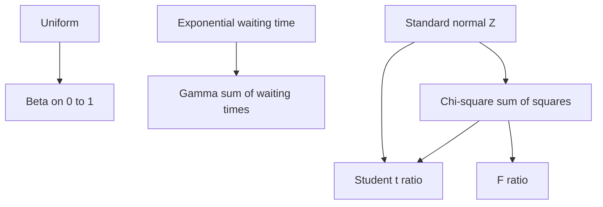

# Common Continuous Distributions

Continuous distributions model measurements that vary on intervals: times, lengths, errors, proportions, variances, and transformed statistics. They replace probability at a point with probability over intervals. For example, the probability that a lifetime is exactly $5.000000$ years is usually zero, but the probability that it lies between $5$ and $6$ years can be positive.

Lane et al.'s statistics text treats the normal distribution in depth and later introduces distributions such as $t$ and chi-square for inference. This probability page gives a theory-focused reference to the main continuous families, while cross-linking to statistics where the inferential use is the main topic.


*Figure: Exponential density functions for several rate parameters. Image: [Wikimedia Commons](https://commons.wikimedia.org/wiki/File:Exponential_pdf.svg), Skbkekas, CC BY 3.0.*

## Definitions

A continuous random variable $X$ has density $f_X$ if

$$
P(a\le X\le b)=\int_a^b f_X(x)\,dx.
$$

The **Uniform** distribution on $[a,b]$ has constant density

$$
f(x)=\frac{1}{b-a},\quad a\le x\le b.
$$

The **Exponential** distribution with rate $\lambda\gt 0$ has density

$$
f(x)=\lambda e^{-\lambda x},\quad x\ge 0.
$$

The **Normal** distribution with mean $\mu$ and variance $\sigma^2$ has density

$$
f(x)=\frac{1}{\sigma\sqrt{2\pi}}
\exp\left(-\frac{(x-\mu)^2}{2\sigma^2}\right).
$$

The **Gamma** distribution with shape $\alpha\gt 0$ and rate $\lambda\gt 0$ has density

$$
f(x)=\frac{\lambda^\alpha}{\Gamma(\alpha)}x^{\alpha-1}e^{-\lambda x},\quad x>0.
$$

The **Beta** distribution with parameters $\alpha,\beta\gt 0$ has density on $(0,1)$:

$$
f(x)=\frac{\Gamma(\alpha+\beta)}{\Gamma(\alpha)\Gamma(\beta)}
x^{\alpha-1}(1-x)^{\beta-1}.
$$

The **Chi-square** distribution with $\nu$ degrees of freedom is a Gamma distribution:

$$
\chi^2_\nu \sim \operatorname{Gamma}\left(\frac{\nu}{2},\frac{1}{2}\right)
$$

when using the rate parameterization.

If $Z\sim N(0,1)$ and $U\sim \chi^2_\nu$ are independent, then the **Student $t$** distribution is

$$
T=\frac{Z}{\sqrt{U/\nu}}.
$$

If $U_1\sim\chi^2_{\nu_1}$ and $U_2\sim\chi^2_{\nu_2}$ are independent, then the **$F$** distribution is

$$
F=\frac{U_1/\nu_1}{U_2/\nu_2}.
$$

## Key results

| Distribution | Support | Mean | Variance | Common role |
|---|---:|---:|---:|---|
| Uniform$(a,b)$ | $[a,b]$ | $(a+b)/2$ | $(b-a)^2/12$ | equally likely interval values |
| Exponential$(\lambda)$ | $[0,\infty)$ | $1/\lambda$ | $1/\lambda^2$ | waiting times with constant hazard |
| Normal$(\mu,\sigma^2)$ | $\mathbb{R}$ | $\mu$ | $\sigma^2$ | errors, sums, approximations |
| Gamma$(\alpha,\lambda)$ | $(0,\infty)$ | $\alpha/\lambda$ | $\alpha/\lambda^2$ | waiting time to repeated events |
| Beta$(\alpha,\beta)$ | $(0,1)$ | $\alpha/(\alpha+\beta)$ | $\frac{\alpha\beta}{(\alpha+\beta)^2(\alpha+\beta+1)}$ | random proportions |
| Chi-square$(\nu)$ | $[0,\infty)$ | $\nu$ | $2\nu$ | sums of squared normals |
| $t_\nu$ | $\mathbb{R}$ | $0$ if $\nu\gt 1$ | $\nu/(\nu-2)$ if $\nu\gt 2$ | standardized mean with estimated variance |
| $F_{\nu_1,\nu_2}$ | $[0,\infty)$ | $\nu_2/(\nu_2-2)$ if $\nu_2\gt 2$ | depends on degrees | variance ratios |

**Memorylessness of exponential.** If $X\sim\operatorname{Exponential}(\lambda)$, then

$$
P(X>s+t\mid X>s)=P(X>t).
$$

The exponential is the continuous analogue of the geometric distribution.

**Normal standardization.** If $X\sim N(\mu,\sigma^2)$, then

$$
Z=\frac{X-\mu}{\sigma}\sim N(0,1).
$$

Thus normal probabilities can be reduced to the standard normal CDF $\Phi$.

**Gamma sums.** If independent exponential waiting times share rate $\lambda$, then their sum has a Gamma distribution. Specifically, the waiting time until the $\alpha$-th event in a Poisson process has Gamma$(\alpha,\lambda)$ distribution when $\alpha$ is a positive integer.

Several continuous families are connected by transformations. If $Z\sim N(0,1)$, then $Z^2\sim\chi^2_1$, and sums of independent squared standard normals produce chi-square distributions with more degrees of freedom. Ratios involving a standard normal and an independent chi-square variable produce $t$ distributions. Ratios of scaled independent chi-square variables produce $F$ distributions. These relationships explain why the same families appear repeatedly in sampling theory.

Location and scale also matter. If $Z$ has a standard distribution, then $X=\mu+\sigma Z$ shifts the center by $\mu$ and stretches the spread by $\sigma$. Normal distributions are closed under this transformation, but many positive distributions are better described by shape and rate or shape and scale. Always record the parameterization. For Gamma and Exponential distributions, "rate" $\lambda$ and "scale" $\theta=1/\lambda$ are reciprocals, and confusing them changes the mean.

For reliability and survival problems, the survival function $S(x)=P(X\gt x)$ is often clearer than the CDF. The exponential survival function $S(x)=e^{-\lambda x}$ makes the constant-hazard assumption visible.

Continuous families are often chosen for shape constraints. Beta distributions can be U-shaped, uniform, left-skewed, right-skewed, or concentrated near the center depending on $\alpha$ and $\beta$. Gamma distributions can be highly right-skewed for small shape and more symmetric for large shape. Normal distributions are symmetric and light-tailed. These shape facts should be checked against context before fitting a model or using a table.

Quantiles are often more stable to communicate than densities. For example, saying that $95\%$ of a normal distribution lies within about two standard deviations of the mean is more interpretable than quoting density heights. For skewed distributions, report asymmetric intervals rather than forcing a mean-plus-minus-standard-deviation summary.

## Visual



| Modeling clue | Candidate distribution | Why |
|---|---|---|
| all values in an interval are equally likely | Uniform | constant density |
| time until next event at constant rate | Exponential | memoryless waiting time |
| sum of many small independent effects | Normal | central limit behavior |
| time until several events | Gamma | sum of exponentials |
| unknown probability or proportion | Beta | support is $0$ to $1$ |
| sum of squared standard normals | Chi-square | quadratic normal variation |

## Worked example 1: exponential reliability

**Problem.** A component lifetime $X$ is exponential with mean $200$ hours. Find the rate $\lambda$, the probability it lasts at least $300$ hours, and the probability it lasts another $100$ hours given that it has already lasted $300$ hours.

**Method.**

1. For an exponential distribution, $E[X]=1/\lambda$. Since the mean is $200$,

$$
\lambda=\frac{1}{200}=0.005.
$$

2. The survival function is

$$
P(X>x)=e^{-\lambda x}.
$$

3. Probability of lasting at least $300$ hours:

$$
P(X\ge 300)=e^{-0.005(300)}=e^{-1.5}\approx 0.2231.
$$

4. Conditional probability of lasting another $100$ hours after $300$:

$$
P(X>400\mid X>300)=\frac{P(X>400)}{P(X>300)}.
$$

5. Substitute survival probabilities:

$$
\begin{aligned}
\frac{e^{-0.005(400)}}{e^{-0.005(300)}}
&=e^{-0.005(100)}\\
&=e^{-0.5}\\
&\approx 0.6065.
\end{aligned}
$$

**Checked answer.** $\lambda=0.005$, $P(X\ge 300)\approx 0.2231$, and the conditional probability is about $0.6065$. The last result illustrates memorylessness.

## Worked example 2: normal probability by standardization

**Problem.** Exam scores are approximately normal with mean $70$ and standard deviation $8$. What proportion of scores lies between $62$ and $84$?

**Method.**

1. Let $X\sim N(70,8^2)$.

2. Standardize the lower endpoint:

$$
z_1=\frac{62-70}{8}=-1.
$$

3. Standardize the upper endpoint:

$$
z_2=\frac{84-70}{8}=1.75.
$$

4. Convert to standard normal probability:

$$
P(62\le X\le 84)=P(-1\le Z\le 1.75).
$$

5. Use the standard normal CDF:

$$
P(-1\le Z\le 1.75)=\Phi(1.75)-\Phi(-1).
$$

6. With $\Phi(1.75)\approx 0.9599$ and $\Phi(-1)\approx 0.1587$,

$$
P(62\le X\le 84)\approx 0.9599-0.1587=0.8012.
$$

**Checked answer.** About $80.1\%$ of scores lie between $62$ and $84$ under the normal model.

## Code

```python
from scipy.stats import expon, norm, gamma, beta, chi2, t, f

# Exponential reliability.
mean_life = 200
rate = 1 / mean_life
survive_300 = expon.sf(300, scale=1 / rate)
survive_another_100 = expon.sf(100, scale=1 / rate)
print(rate, survive_300, survive_another_100)

# Normal interval probability.
mu, sigma = 70, 8
prob = norm.cdf(84, loc=mu, scale=sigma) - norm.cdf(62, loc=mu, scale=sigma)
print(prob)

# A small reference table.
print("Gamma mean:", gamma.mean(a=3, scale=1 / 2))  # rate 2 means scale 1/2
print("Beta mean:", beta.mean(a=2, b=5))
print("Chi-square 95th percentile:", chi2.ppf(0.95, df=10))
print("t 97.5th percentile:", t.ppf(0.975, df=12))
print("F 95th percentile:", f.ppf(0.95, dfn=5, dfd=20))
```

## Common pitfalls

- Confusing rate and scale. SciPy often uses `scale = 1 / rate`, while many textbooks write exponential and gamma distributions with rate $\lambda$.
- Treating density height as probability. For continuous variables, probabilities are areas.
- Assuming all bell-shaped data are normal. Tail behavior and skew matter.
- Applying $t$, chi-square, or $F$ formulas without their normal-sample assumptions when doing inference.
- Forgetting support. A normal model can assign small probability to impossible negative values; sometimes this is acceptable, sometimes not.
- Using the exponential memoryless property for non-exponential lifetimes. Aging components often do not have constant hazard.

## Connections

- [random variables and distributions](/math/probability/random-variables-distributions)
- [expectation, variance, and moments](/math/probability/expectation-variance-moments)
- [limit theorems](/math/probability/limit-theorems)
- [normal, t, chi-square, and F distributions](/math/statistics/normal-t-chi-square-and-f-distributions)
- [sampling distributions and CLT](/math/statistics/sampling-distributions-and-clt)
