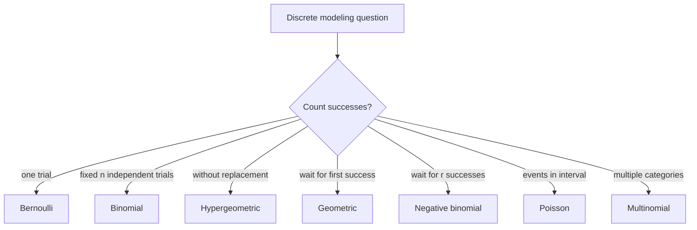

# Common Discrete Distributions

Discrete distributions model counts, categories, and waiting times measured in whole trials. They appear whenever the outcome is a finite choice, a number of successes, a number of failures before success, or a count of rare events in a fixed region. Many examples in introductory statistics, including those in Lane et al.'s probability chapter, use binomial, Poisson, multinomial, and hypergeometric models.

The main skill is not memorizing formulas in isolation. It is matching the story to the assumptions: fixed number of independent trials, sampling with or without replacement, waiting until a success, or counting events that occur at an average rate. A wrong distribution can produce a polished but wrong answer.


*Figure: Binomial probability mass function. Image: [Wikimedia Commons](https://commons.wikimedia.org/wiki/File:Binomial_distribution_pmf.svg), Tayste, public domain.*

## Definitions

A **Bernoulli** random variable records one success/failure trial:

$$
X\sim \operatorname{Bernoulli}(p),\quad P(X=1)=p,\quad P(X=0)=1-p.
$$

A **Binomial** random variable counts successes in $n$ independent Bernoulli trials with common success probability $p$:

$$
X\sim \operatorname{Binomial}(n,p),
$$

$$
P(X=k)=\binom{n}{k}p^k(1-p)^{n-k},\quad k=0,1,\ldots,n.
$$

A **Geometric** random variable counts the trial number of the first success:

$$
X\sim \operatorname{Geometric}(p),
$$

$$
P(X=k)=(1-p)^{k-1}p,\quad k=1,2,\ldots.
$$

Some books define geometric as the number of failures before the first success, with support $0,1,2,\ldots$. Always check the convention.

A **Negative binomial** random variable counts the trial number of the $r$-th success:

$$
P(X=k)=\binom{k-1}{r-1}p^r(1-p)^{k-r},\quad k=r,r+1,\ldots.
$$

A **Poisson** random variable counts events occurring in a fixed interval when events happen independently at average rate $\lambda$:

$$
X\sim \operatorname{Poisson}(\lambda),
$$

$$
P(X=k)=e^{-\lambda}\frac{\lambda^k}{k!},\quad k=0,1,2,\ldots.
$$

A **Hypergeometric** random variable counts successes in $n$ draws without replacement from a population of size $N$ containing $K$ successes:

$$
P(X=k)=\frac{\binom{K}{k}\binom{N-K}{n-k}}{\binom{N}{n}}.
$$

A **Multinomial** random vector counts outcomes in $m$ categories across $n$ independent trials:

$$
P(X_1=x_1,\ldots,X_m=x_m)
=\frac{n!}{x_1!\cdots x_m!}p_1^{x_1}\cdots p_m^{x_m},
$$

where $\sum_i x_i=n$ and $\sum_i p_i=1$.

## Key results

| Distribution | Support | Mean | Variance | Typical use |
|---|---:|---:|---:|---|
| Bernoulli$(p)$ | $0,1$ | $p$ | $p(1-p)$ | one yes/no trial |
| Binomial$(n,p)$ | $0,\ldots,n$ | $np$ | $np(1-p)$ | successes in fixed independent trials |
| Geometric$(p)$ | $1,2,\ldots$ | $1/p$ | $(1-p)/p^2$ | waiting time to first success |
| NegBin$(r,p)$ | $r,r+1,\ldots$ | $r/p$ | $r(1-p)/p^2$ | waiting time to $r$ successes |
| Poisson$(\lambda)$ | $0,1,\ldots$ | $\lambda$ | $\lambda$ | counts at a rate |
| Hypergeometric$(N,K,n)$ | valid counts | $nK/N$ | $n(K/N)(1-K/N)\frac{N-n}{N-1}$ | without-replacement sampling |

**Binomial as a sum.** If $X_1,\ldots,X_n$ are independent Bernoulli$(p)$ variables, then

$$
X=X_1+\cdots+X_n\sim \operatorname{Binomial}(n,p).
$$

**Poisson approximation to binomial.** If $n$ is large, $p$ is small, and $\lambda=np$ is moderate, then

$$
\operatorname{Binomial}(n,p)\approx \operatorname{Poisson}(\lambda).
$$

This is useful for rare-event counts.

**Hypergeometric versus binomial.** The binomial assumes independent trials, which fits sampling with replacement or a very large population. The hypergeometric accounts for dependence created by sampling without replacement.

**Memorylessness of the geometric distribution.** For $X\sim\operatorname{Geometric}(p)$,

$$
P(X>s+t\mid X>s)=P(X>t).
$$

After $s$ failures, the remaining waiting-time distribution is unchanged because independent trials restart the same success probability.

The assumptions behind each distribution are part of the model. A binomial distribution needs a fixed number of trials, two outcome classes, constant success probability, and independence. A Poisson distribution needs a rate interpretation and is most natural when events in disjoint intervals are approximately independent. A hypergeometric distribution deliberately violates independence because the population changes after each draw. Checking these assumptions is usually more important than recognizing the formula.

There are also parameterization traps. Negative binomial distributions may count trials until the $r$-th success or failures before the $r$-th success. Geometric distributions have the same convention issue. Software libraries differ, so read the documentation and verify the support by calculating a simple probability such as the probability of success on the first trial.

Approximation is another modeling decision. A hypergeometric distribution can be approximated by a binomial distribution when the sample is small compared with the population, because removing a few items barely changes the success probability. A binomial distribution can be approximated by a Poisson distribution when successes are rare and $np$ is moderate. These approximations are useful, but the exact distribution should remain clear.

## Visual



| Model cue | Distribution to try | Red flag |
|---|---|---|
| "exactly $k$ successes in $n$ trials" | Binomial | probabilities change across trials |
| "draw $n$ from a finite population" | Hypergeometric | replacement is actually used |
| "first success occurs on trial $k$" | Geometric | trials are not independent |
| "third success occurs on trial $k$" | Negative binomial | $r$ successes not specified |
| "calls per hour" or "defects per meter" | Poisson | events cluster strongly |

## Worked example 1: binomial and Poisson approximation

**Problem.** A manufacturing process produces a defective part with probability $0.01$, independently from part to part. In a batch of $200$ parts, find the probability of exactly $3$ defective parts using the binomial model, then approximate it with a Poisson distribution.

**Method.**

1. Let $X$ be the number of defective parts. A fixed number of independent parts is inspected, each with the same defect probability. Thus

$$
X\sim \operatorname{Binomial}(200,0.01).
$$

2. The exact probability is

$$
P(X=3)=\binom{200}{3}(0.01)^3(0.99)^{197}.
$$

3. Compute the combination:

$$
\binom{200}{3}=\frac{200\cdot199\cdot198}{3\cdot2\cdot1}=1313400.
$$

4. Substitute:

$$
P(X=3)=1313400(0.000001)(0.99)^{197}.
$$

   Since $(0.99)^{197}\approx 0.1380$,

$$
P(X=3)\approx 1313400(0.000001)(0.1380)=0.1812.
$$

5. For the Poisson approximation, use $\lambda=np=200(0.01)=2$:

$$
P(Y=3)=e^{-2}\frac{2^3}{3!}
=e^{-2}\frac{8}{6}
\approx 0.1804.
$$

**Checked answer.** The exact binomial probability is about $0.1812$, and the Poisson approximation is about $0.1804$. The approximation is close because $p$ is small and $n$ is large.

## Worked example 2: hypergeometric sampling

**Problem.** A lot contains $30$ components, of which $6$ are faulty. An inspector samples $5$ components without replacement. What is the probability that exactly $2$ sampled components are faulty?

**Method.**

1. The sample is without replacement from a finite population, so use a hypergeometric model:

$$
N=30,\quad K=6,\quad n=5,\quad k=2.
$$

2. Count favorable samples:

   - choose $2$ faulty components from $6$;
   - choose $3$ good components from $24$.

   The favorable count is

$$
\binom{6}{2}\binom{24}{3}.
$$

3. Count all possible samples:

$$
\binom{30}{5}.
$$

4. Form the probability:

$$
P(X=2)=\frac{\binom{6}{2}\binom{24}{3}}{\binom{30}{5}}.
$$

5. Compute:

$$
\binom{6}{2}=15,\quad \binom{24}{3}=2024,\quad \binom{30}{5}=142506.
$$

   Therefore

$$
P(X=2)=\frac{15\cdot 2024}{142506}
=\frac{30360}{142506}
\approx 0.2130.
$$

6. Check reasonableness. The expected number is

$$
n\frac{K}{N}=5\cdot\frac{6}{30}=1.
$$

   Exactly $2$ faulty components is above the mean but not extreme.

**Checked answer.** The probability is approximately $0.2130$.

## Code

```python
from math import comb, exp, factorial
from scipy.stats import binom, poisson, hypergeom, nbinom, geom

# Example 1: binomial and Poisson approximation.
n, p, k = 200, 0.01, 3
exact = binom.pmf(k, n, p)
approx = poisson.pmf(k, n * p)
print("binomial exact:", exact)
print("poisson approximation:", approx)

# Example 2: hypergeometric.
N, K, draws, observed = 30, 6, 5, 2
manual = comb(K, observed) * comb(N - K, draws - observed) / comb(N, draws)
library = hypergeom.pmf(observed, N, K, draws)
print("hypergeometric manual:", manual)
print("hypergeometric scipy:", library)

# Geometric and negative binomial conventions in scipy:
# geom counts trial number of first success; nbinom counts failures before r successes.
print("P(first success on trial 4):", geom.pmf(4, 0.25))
print("P(2 failures before 3 successes):", nbinom.pmf(2, 3, 0.25))
```

## Common pitfalls

- Using binomial for sampling without replacement from a small population. Use hypergeometric unless replacement or approximate independence is justified.
- Mixing geometric conventions. Some formulas count the trial of first success; others count failures before first success.
- Forgetting that Poisson mean and variance are both $\lambda$. If data are much more variable, a Poisson model may be too restrictive.
- Treating multinomial category counts as independent. The counts sum to $n$, so increasing one count forces others down.
- Using a probability such as $p=0.01$ as if it were a rate $\lambda$. A probability is unitless and bounded by $1$; a rate depends on interval length.
- Rounding early in factorial-heavy calculations. Use exact combinations or software for large counts.

## Connections

- [counting principles](/math/probability/counting-principles)
- [random variables and distributions](/math/probability/random-variables-distributions)
- [expectation, variance, and moments](/math/probability/expectation-variance-moments)
- [limit theorems](/math/probability/limit-theorems)
- [normal, t, chi-square, and F distributions](/math/statistics/normal-t-chi-square-and-f-distributions)
